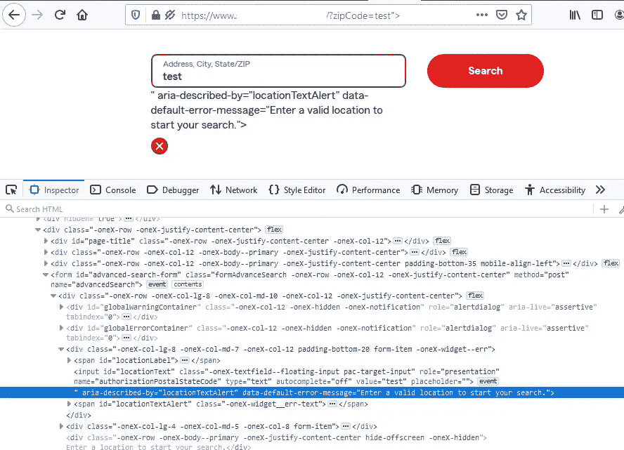
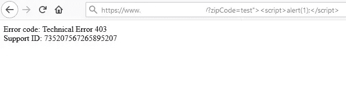
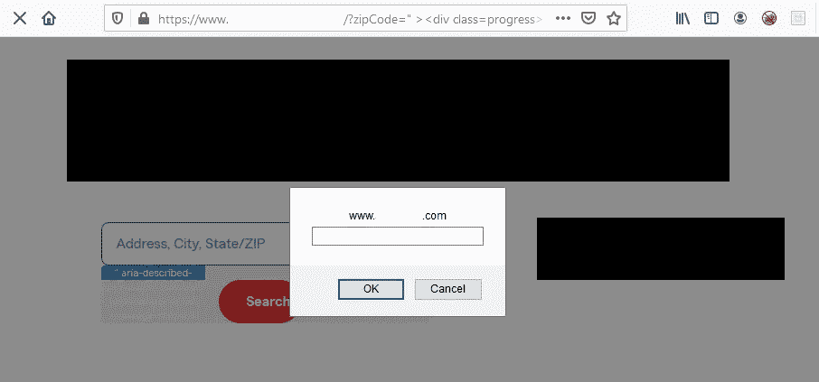

# 利用导入的库绕过 WAF

> 原文：<https://infosecwriteups.com/exploiting-imported-libraries-to-bypass-cloudflare-waf-7aed99186c5a?source=collection_archive---------2----------------------->

## 将 P5 内容注入 P3 反映了 XSS

我之前没有成功的一个私人项目宣布了一个新的范围项目——他们的主登陆页面`[www.redacted.com/*](http://www.redacted.com/service/?zipCode=12345)`。最初的范围只包括他们的移动应用程序，虽然我在移动目标上取得了一些成功，但我的专业知识是在 web 应用程序中发现稍微模糊的逻辑错误。

在进行了我通常的基本侦察后，没有任何感兴趣的东西跃入我的眼帘，因为这是一个基本上静态的网站，提供关于该公司各种业务产品的内容，并重定向到当前范围之外的子域名。我开始搜索一个带有 URL 参数的页面，发现在一个搜索框中输入一个美国邮政编码会重定向到`www.redacted.com/service/?zipCode=12345`，其值反映在<输入框>中。开始测试的时间到了。

# 最初的立足点— HTML 内容注入

我很快发现这个字段缺少**最关键的**净化，这允许攻击者使用“来逃避*值*属性，并进一步允许使用>来关闭标签。在这一点上，我发现了一个漏洞，但内容注入可以理解为 P5，值得一分，没有奖金，因为没有实际的安全影响。



zipCode 参数易受内容注入和可能的进一步利用的攻击。这里显示的是输入标签的几个属性，现在作为文本浮动在输入框的下面。

我宁愿坐在这个注射一个月，试图升级它，而不是提交一个 P5，然后继续前进。我立即开始致命一击，并尝试注射**><脚本>警报(1)；</脚本>** 。在这种情况下，我通常不会有很高的期望，尤其是对于这样规模和地位的公司，但这肯定值得一试。然而，正如我所料，回应是一个区块。



403 块来自可疑云闪晶片响应。

# 侦察时间到了

开发一个允许通过过滤器的 HTML 标签、属性和事件的列表将使我能够尝试创建一个注入字符串，这将导致成功的利用。虽然 **<脚本>** 、 **<样式>** 、 **< img >** 都被屏蔽，但是 **< a >** 、 **< svg >** 、 **<对象>** 、 **< div >** 是允许的。检查每个允许的标签的属性， **< svg src= >** 和 **< object data= >** 会导致阻塞——这绝非易事。我还应该提一下 **alert()** 和 **confirm()** 被阻止，但 **prompt()** 没有被阻止。此外，内联样式也返回 403。转到事件，看起来所有的事件都被屏蔽了，但我偶然注意到一个相当模糊的事件， **onwebkitanimationstart** 成功地通过了！

我发现的每个用这个事件触发 XSS 的例子都涉及到内联样式的使用。下面是一个来自[蛮力逻辑](https://medium.com/u/a90d4c9f2c62?source=post_page-----7aed99186c5a--------------------------------)的例子:

```
<style> 
div{width:100px;height:100px;-webkit-animation-name:n;}@-webkit-keyframes n{}
</style><vulntag attrib=""onwebkitanimationstart=alert(9)><div>

<!-- [@brutelogic](http://twitter.com/brutelogic) -->
```

由于我不能注入样式，我在检查器控制台中搜索 webkit-animation，看看是否有我可以利用的现有类，并发现了[引导进度](https://getbootstrap.com/docs/4.0/components/progress/)栏。具体来说，通过类`class="progress-bar progress-bar-striped progress-bar-animated"`的动画条纹特性将充当触发器。

# 斗牛中的最后一剑

有了计划之后，我开始制作一个新的注入字符串进行测试，使用 Bootstrap 文档创建包装器 div 和组件 div。

```
https://www.redacted.com/service/?zipCode="><div class=progress><div onwebkitanimationstart=prompt(document.domain) class="progress-bar progress-bar-striped progress-bar-animated" role="progressbar" aria-valuenow="75" aria-valuemin="0" aria-valuemax="100">
```

经过几个晚上的渐进工作，确定漏洞，进行侦察以确定什么可以绕过过滤器，并最终利用现有的库来提供必要的触发器，我成功地展示了影响，并将 P5 内容注入升级到 P3 反映的跨站点脚本！您可以在输入框正下方的蓝色进度条中看到 webkit 动画。



使用 Bootstrap 的进度条成功进行 XSS 进样。

# 外卖食品

不立即报告漏洞总是存在固有的风险，因为另一个黑客可能会捷足先登。然而，如前所述，我对识别一个没有明显影响的漏洞所带来的回报(或缺乏回报)不感兴趣，主要原因是:网络安全是关于管理风险的；如果您不能**证明**一个安全影响，您的漏洞将不会被优先修复，从而使漏洞无法被恶意行为者利用。

如果您在尝试绕过 WAF 或其他注入过滤器时遇到困难，请始终浏览源代码，看看目标提供了什么——通常您会发现成功利用漏洞所需的东西已经加载到页面中了！

我在社交媒体上不太活跃，但你可以在 [LinkedIn](https://www.linkedin.com/in/greg-gibson/) 上找到我，或者在各种安全松弛或不和谐的服务器上找到我！