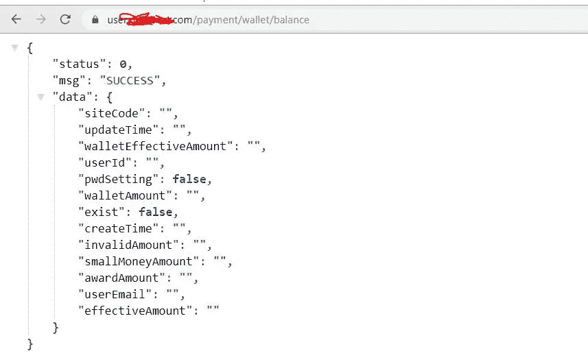
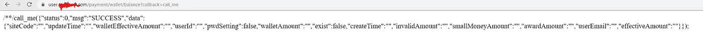

# 利用 JSONP 并绕过 Referer 检查

> 原文：<https://infosecwriteups.com/exploiting-jsonp-and-bypassing-referer-check-2d6e40dfa24?source=collection_archive---------0----------------------->

嗨**伙计们**，希望你们都很好，所以这篇文章是关于利用 JSONP 从 API 端点提取私有数据并绕过服务器的安全检查。

**JSONP** 是 **(** 带填充的 JSON)，JSONP 的创建是为了授予对 JavaScript 的跨起源读访问，它作为 **SOP (** 同源策略 **)** 的例外，允许跨起源的数据访问。可用于绕过 **SOP** 访问跨原点数据。

让我们看看它是如何工作的。

返回数据的 **API** 端点被用在一个带有回调函数的脚本标签中，就像这样。

现在我们需要创建一个回调函数，我们已经在脚本标签**src(**https://redact.com/api/user/profile?callback=**call _ me)**中传递了这个函数，你可以给它起任何名字，我已经给它起了名字 **call_me。**

最后，代码将如下所示。首先，我们将创建回调函数，然后我们将创建**脚本**标签。

该代码将在浏览器**控制台中记录数据。**

现在我们如何验证 **API** 易受这个 **JSONP** 漏洞的攻击。

例如，我们有一个端点，它显示用户钱包数据

**

*现在添加一个这样回调的查询参数，[【https://user.redact.com/payment/wallet/balance?】*回调=call_me*](https://user.redact.com/payment/wallet/balance?callback=call_me)*

*如果端点启用了 **JSONP** ，它将创建一个名为 **call_me** 的对象，所有数据都在该对象中，如下所示。*

**

*这证实了端点支持 **JSONP** 并且可以被利用，现在我们将使用我之前解释过的相同的 JavaScript 代码。*

*现在你也可以创建一个**。html 文件**，它将提取数据并存储在您想要的服务器上。你只需要把 URL 发送给受害者，然后你可以写你自己的 JavaScript 代码把数据发送到你的服务器，就像这样。*