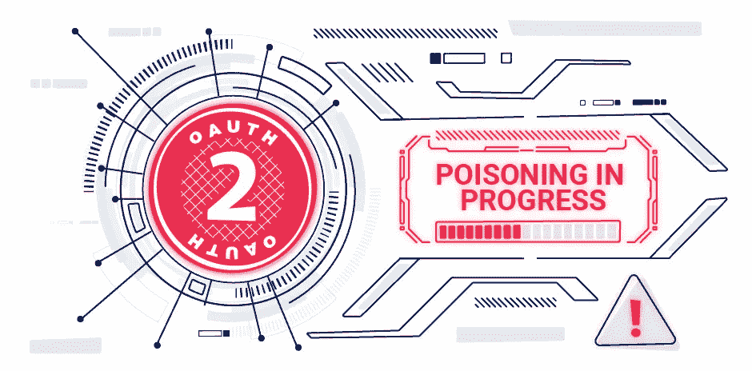
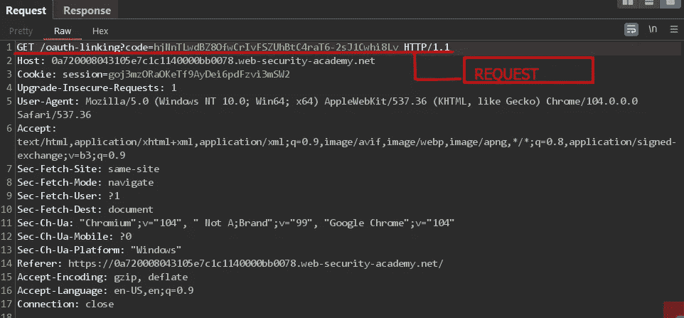
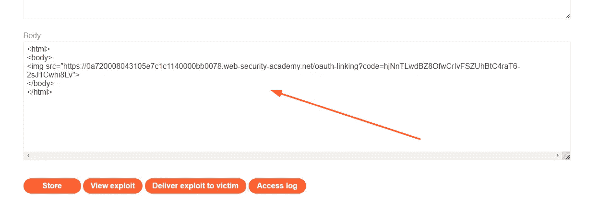
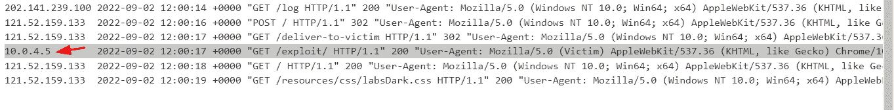
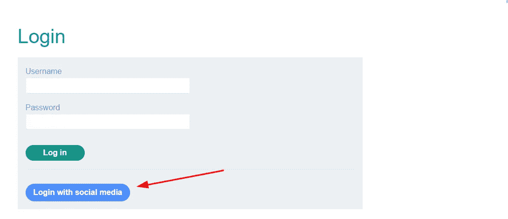
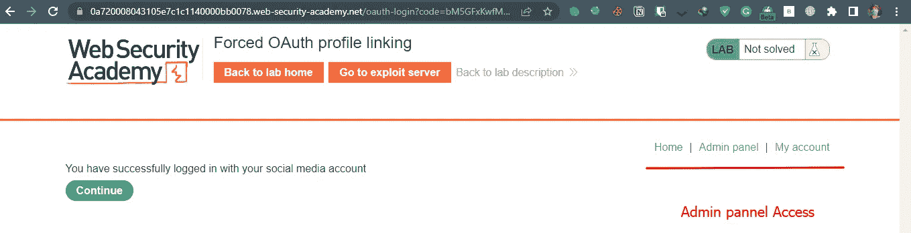
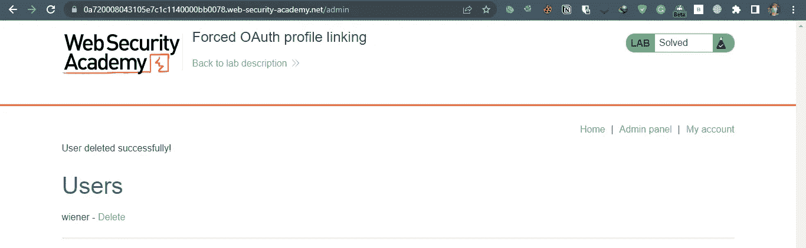

# 利用 OAuth 认证漏洞第二部分

> 原文：<https://infosecwriteups.com/exploiting-oauth-authentication-vulnerabilities-part-ii-6c150f492e62?source=collection_archive---------0----------------------->

今天我将展示一些可以用来利用 OAuth 2.0 的技术，并可能允许攻击者完全接管受害者的帐户。



**攻击 1:有缺陷的 CSRF 验证导致账户被接管:**

每当 OAuth 进程启动时，客户端应用程序都应该生成一个令牌，该令牌与用户的会话相关联，用于授权目的。这个令牌主要由一个名为 state 的参数传递。但是如果授权没有发送状态参数，事情就变得有趣了。这意味着没有任何方法来检查由一个用户启动的授权过程实际上是由他自己完成的。

攻击者可以在他那端启动 OAuth 进程，并欺骗用户在他们那端完成该进程，从而接管他们的帐户。

就像一次基本的 CSRF 袭击。

为了演示这种攻击，我们可以使用 portswiggers 提供的实验室环境。

利用: [**强制 OAuth 配置文件链接**](https://portswigger.net/web-security/oauth/lab-oauth-forced-oauth-profile-linking)

在本实验中，您可以选择将社交媒体档案附加到您的帐户，以便您可以通过 [OAuth](https://portswigger.net/web-security/oauth) 登录，而不是使用普通用户名和密码。由于客户端应用程序对 OAuth 流的实现不安全，攻击者可以操纵此功能来获得对其他用户帐户的访问权限。

要解决这个实验，使用 [CSRF 攻击](https://portswigger.net/web-security/csrf)将你自己的社交媒体资料附加到博客网站上的管理员用户帐户，然后访问管理面板并删除 Carlos。

管理员用户将打开你从漏洞服务器发送的任何东西，他们在博客网站上总是有一个活动的会话。

您可以使用以下凭据登录您自己的帐户:

*   博客网站账号:`wiener:peter`
*   社交媒体简介:`peter.wiener:hotdog`

让我们访问实验室环境，并使用提供的凭据登录


附上你的社交媒体资料，注意流量，你会看到一个请求名`GET /oauth-linking?code={code}`现在记下这个请求。



帐户成功链接后，再次启动链接过程，但这一次拦截所有流量，转发除上述请求之外的所有请求，并复制 URL。您必须确保放弃此请求。

现在我们需要设计一个 csrf 攻击，并欺骗管理员完成 OAuth 舞蹈。

打开漏洞服务器，手工创建一个 HTML 页面。



CSRF

有效载荷

```
<html>
<body>
 ===> change the link...
</body>
</html>
```

现在注销之前的会话。

现在存储漏洞并将其发送给受害者。

打开访问日志，您将看到一个不同的 IP 地址访问表单。



管理员访问表单

现在使用社交档案重新登录。



已登录

现在只需进入管理面板，删除卡洛斯。



我们的实验室解决了。❤

**缓解**:

现在让我们讨论一下如何减轻这种攻击。

如果应用程序使用一个状态参数，并通过它传递一个与用户会话相关的哈希，并经过适当的验证，那么我们将无法让管理员将他们的社交简档链接到我们的帐户，因为状态参数不会被验证和批准。

如果您看到 OAUTH 客户端不使用状态参数来验证当前用户的会话，则该应用程序很可能易受此攻击。

希望你喜欢阅读关于 OAuth 的文章。

如果您想了解更多关于 OAuth 利用和渗透测试的知识，请关注我。

直到下一次！快乐黑客❤

## 来自 Infosec 的报道:Infosec 每天都有很多内容，很难跟上。[加入我们的每周简讯](https://weekly.infosecwriteups.com/)以 5 篇文章、4 个线程、3 个视频、2 个 Github Repos 和工具以及 1 个工作提醒的形式免费获取所有最新的 Infosec 趋势！