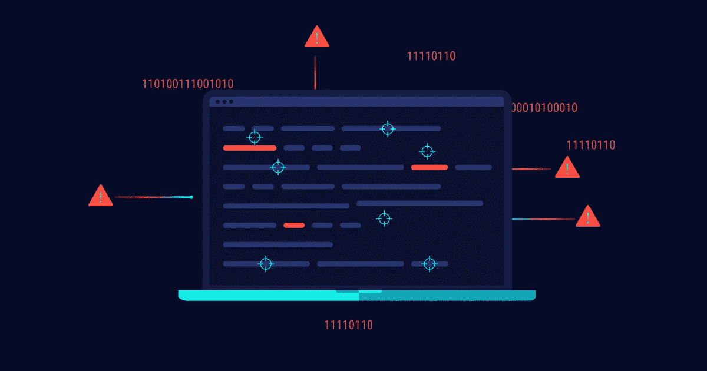
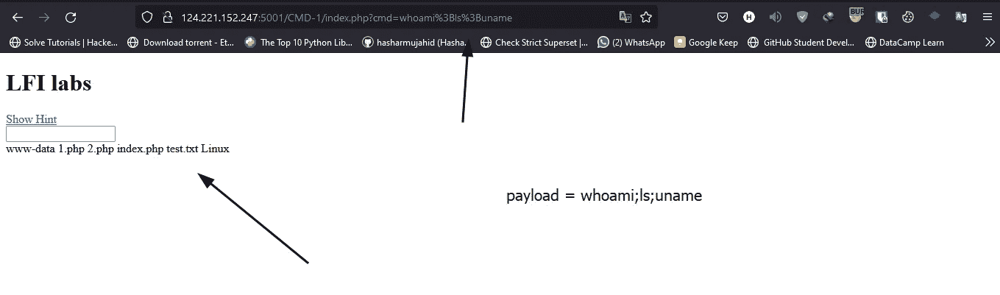
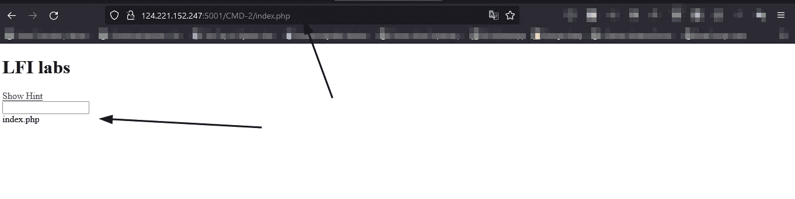
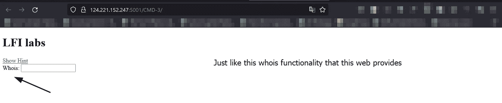
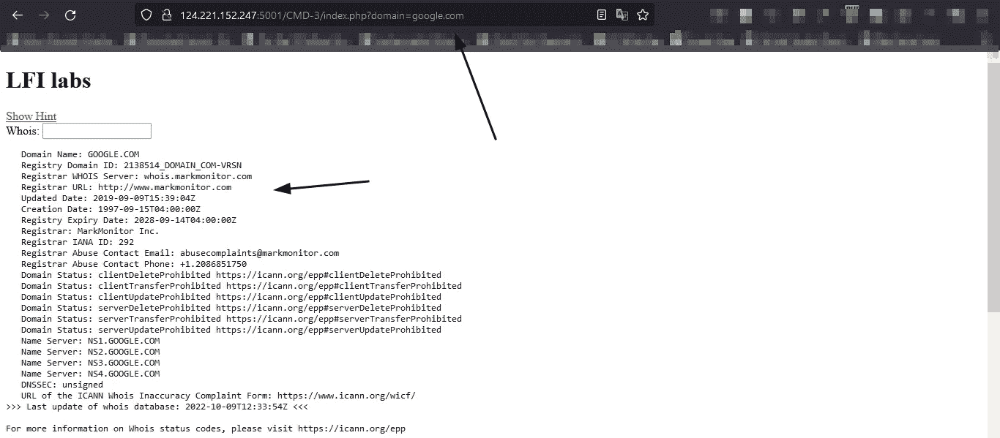
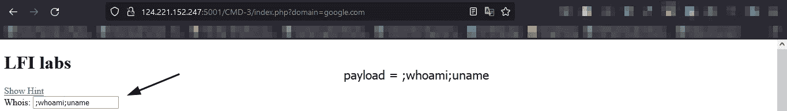
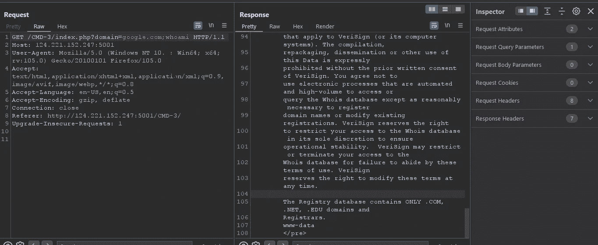
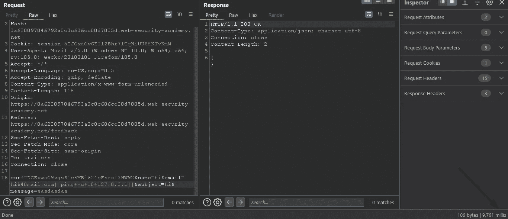

# 利用操作系统命令注入漏洞

> 原文：<https://infosecwriteups.com/exploiting-os-command-injection-vulnerabilities-14195c9a410b?source=collection_archive---------0----------------------->

嗨！我叫哈沙尔·穆贾希德。今天我们将学习什么是**操作系统命令注入**以及我们如何利用它们。



旗帜

## 什么是 OS 命令注入？

操作系统命令注入是一个漏洞，允许攻击者直接在服务器上执行任意命令。如果你还没有意识到，如果攻击者能够在服务器上执行恶意代码，他可以很容易地得到一个反向外壳或后门进入服务器。

因此，在 bug-bounty 和渗透期间发现操作系统命令注入被标记为关键漏洞。

## 示例:

就像在这个简单的实验中，服务器允许用户执行所有命令，而不仅仅是白名单中的命令。



## 使用完整命令:

攻击者可以运行一些命令来获取用户和目标操作系统的相关信息。

> 当前用户的姓名`whoami`
> 
> 操作系统`uname -a`
> 
> 网络配置`ifconfig`
> 
> 网络连接`netstat -an`
> 
> 运行进程`ps -ef`

## Post 请求参数中的 OS 命令注入:

在本实验中，我们可以看到，当我们输入值时，会发出 post 请求。



我们可以确定这一点，因为在 GET 请求中，参数列在 URL 中，而在 POST 请求中，参数没有列在 URL 中。

```
GET[http://124.221.152.247:5001/CMD-1/index.php?cmd=ls](http://124.221.152.247:5001/CMD-1/index.php?cmd=ls)POST[http://124.221.152.247:5001/CMD-1/index.php](http://124.221.152.247:5001/CMD-1/index.php?cmd=ls)
```

现在的问题是

## 如何检测命令注入漏洞:

这个问题没有具体的答案。如果怀疑某些功能正在使用易受攻击的函数，请尝试理解应用程序的逻辑，例如

> eval()
> 
> 系统()
> 
> 通过()

您可以尝试注入命令并测试这些参数。

## 打破现有的命令:

有时，如果代码执行在公开的功能中非常重要，应用程序会设置一个预设的命令路径，并从用户那里获取查询。



Whois



谷歌 Whois

现在要执行命令，我们需要使用一些绕过技术，这样我们就可以执行代码。



我们可以使用`;`符号来结束一个命令的执行并添加我们的命令。



我们可以看到我们的代码被执行。

## 盲目操作系统命令注入漏洞:

OS 命令注入很多情况都是盲漏洞。这表明应用程序不在其 HTTP 响应中包含命令的输出。盲目的漏洞仍然可以被利用，但它采取了不同的方法。

## 检测盲目操作系统注入漏洞:

现在，您应该问自己，我们如何检测盲目的操作系统命令注入漏洞。

简单的答案是注入可能导致一些延迟的命令。

## 例如:

您可以尝试像这样注入睡眠命令

```
vulnerableweb.com/command?cmd=;sleep(5)
```

这将导致服务器在 5 秒钟后响应。

或者你可以尝试注入一个 ping 命令来与公共 IP 进行交互，看看你是否从 web 应用程序中获得了连接。

```
vulnerableweb.com/command?cmd=;& ping -c 10 IP
```



我们可以看到我们的 10 次 pings 导致了服务器上大约 10 秒的延迟。

## 有效载荷:

```
email=test@mail.com||ping+-c+10+127.0.0.1||
```

## 注入操作系统命令的方式:

有时应用程序会阻止“；”符号来防止攻击者注入命令。

我们可以尝试注射。

*   `&`
*   `&&`
*   `|`
*   `||`
*   ``

## 如何防止操作系统命令注入攻击:

尽量不要调用操作系统命令，但是如果不可避免，开发人员可以尝试一些技术。

*   根据允许值的白名单进行验证。
*   验证输入是一个数字。
*   验证输入只包含字母数字字符，没有其他语法或空白。

我将带着利用网络漏洞的新技术回来。

在那之前，快乐的黑客❤.

## 来自 Infosec 的报道:Infosec 每天都有很多内容，很难跟上。[加入我们的每周时事通讯](https://weekly.infosecwriteups.com/)以 5 篇文章、4 个线程、3 个视频、2 个 GitHub Repos 和工具以及 1 个工作提醒的形式免费获取所有最新的 Infosec 趋势！