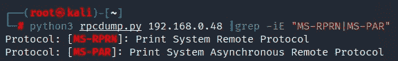

# 利用印刷噩梦(CVE-2021–34527)

> 原文：<https://infosecwriteups.com/exploiting-printnightmare-cve-2021-34527-10c6e0f5b83f?source=collection_archive---------0----------------------->

Sebastiaan Stam 的照片

这篇文章提供了 PrintNightmare 漏洞的高级概述，并演示了针对 Windows 2016 服务器的成功利用。此外，我分享了我对漏洞利用代码的重新创作，它提供了一些在 Linux 主机上利用 PrintNightmare 时有用的更新。

# 弱点

“打印噩梦”([CVE-2021–34527](https://msrc.microsoft.com/update-guide/vulnerability/CVE-2021-34527))是 Windows 打印后台处理程序服务中存在的一个本地权限提升(LPE)和远程代码执行(RCE)漏洞。

PrintNightmare 的工作原理是利用`MS-RPRN`协议的`RpcAddPrinterDriverEx`功能中的一个逻辑缺陷，该功能允许贫困用户定义他们自己的(`.dll`)打印驱动程序。这些驱动程序最终由系统用户加载，让位于权限提升。

在 PrintNightmare 公开发布后不久， [Cube0x0](https://twitter.com/cube0x0/status/1411364227089117185) 就能够通过`MS-PAR`和`RpcAsyncAddPrinterDriver`函数触发漏洞。这与`RpcAddPrinterDriverEx`类似，但是约束要少得多，不局限于域控制器或者非默认设置的 Windows 10 系统。

# 剥削

鉴于这个漏洞已经存在一年多了，并且已经有几十个公开的例子，我认为发布我的漏洞利用版本是安全的——现在可以在 [**GitHub**](https://github.com/m8sec/CVE-2021-34527) 上获得。

我的代码基于由 [Cube0x0](https://github.com/cube0x0/CVE-2021-1675) 创建的 Python 漏洞，需要最新版本的 [Impacket](https://github.com/SecureAuthCorp/impacket) 库。一些额外的好处包括:

*   能够定位多个主机、范围或子网。
*   用于有效负载交付的内置 SMB 服务器，消除了对开放文件共享的需求。按照命令行参数中的定义，仍然可以使用可选的远程共享。
*   漏洞利用包括两种`MS-RPRN` & `MS-PAR`协议的选项。
*   实现了[@ gentili kiwi 的](https://twitter.com/gentilkiwi) [UNC 旁路](https://twitter.com/gentilkiwi/status/1412771368534528001)技术。

## 要求

要成功利用 PrintNightmare 漏洞，必须满足以下要求:

*   启动有效登录会话的用户凭据。
*   主机上启用了打印后台处理程序服务。

## 发现

Impacket 的`rpcdump`可用于测试`MS-PAR`或`MS-RPRN`协议:

或者， [byt3bl33d3r](https://twitter.com/byt3bl33d3r) 发布了一个扫描器[itwasalladdream](https://github.com/byt3bl33d3r/ItWasAllADream)，它提供了一个漏洞利用的“去尖牙”版本来测试服务器的响应。

## 演示

下面演示了如何通过 MS-RPRN 协议在 Windows Server 2016 系统上从 Kali Linux 主机成功利用 PrintNightmare。

# 补救

微软已经发布了几个与 PrintNightmare 相关的补丁，最新的是 2021 年 9 月的补丁星期二。这解决了潜在的漏洞和后来发现的变通办法。更多信息，请访问微软官方[指南](https://msrc.microsoft.com/update-guide/vulnerability/CVE-2021-34527)。

缓解此漏洞的其他[策略](https://msrc.microsoft.com/update-guide/vulnerability/CVE-2021-34527#workarounds)包括:

*   在不重要的系统上禁用后台打印程序服务。
*   通过组策略禁用入站远程打印

感谢阅读！在 [m8sec.dev](https://m8sec.dev) 了解更多关于我的信息，并关注更多攻击性安全内容。

*免责声明:所有内容仅用于教育目的。作者不对信息的使用负责。不要对你不拥有或没有明确许可的系统进行测试。*