# 利用服务器端请求伪造(SSRF)漏洞的初学者指南

> 原文：<https://infosecwriteups.com/exploiting-server-side-request-forgery-ssrf-vulnerability-faeb7ddf5d0e?source=collection_archive---------1----------------------->

S 服务器端请求伪造(SSRF)是一种简单的攻击，在这种攻击中，服务器将为攻击者向本地或远程源发出请求(充当代理),然后返回包含请求产生的数据的响应。

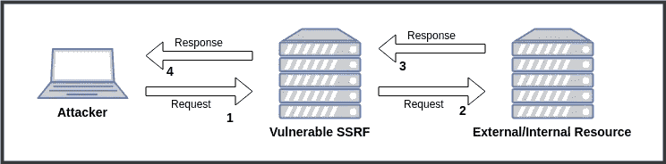

SSRF 插图

我们可以说，SSRF 的概念与使用代理或 VPN 是一样的，用户将向某个资源发出请求，然后代理或 VPN 服务器将向该资源发出请求，然后将结果返回给发出请求的用户。

在 SSRF，可以做各种事情，例如:

*   本地/远程端口扫描
*   本地文件读取(使用 file://)
*   与内部应用/服务/网络互动
*   通过链接内部网络上的服务实现 RCE
*   阅读元数据云(AWS、Azure、谷歌云、数字海洋等)
*   反射 XSS/CSRF

# 实验室设置

对于这篇博文中的实验室的使用，只使用下面的简单脚本(当然可能现实世界中的应用程序没有这么简单)并将部署在数字海洋上。

```
<?php
    $url = $_GET['url'];$curl = curl_init();
    curl_setopt($curl, CURLOPT_URL, $url);
    curl_setopt($curl, CURLOPT_RETURNTRANSFER,1);
    curl_setopt($curl, CURLOPT_TIMEOUT, 5);
    curl_setopt($curl, CURLOPT_CONNECTTIMEOUT, 5);$data = curl_exec ($curl);if(curl_error($curl)){
        echo curl_error($curl);
    }else{
        echo "<pre>" . $data . "</pre>";
    }
    curl_close ($curl);
?>
```

`Curl`被选为这篇博文的请求者，因为`curl`支持各种协议，所以它有利于学习。

> *requestster* 是一个函数或库，我们使用它从输入 URL 获取/请求资源。

# 本地/远程端口扫描

扫描端口的目的只是为了能够映射该端口背后正在运行的应用程序/服务，以便攻击者能够识别该端口上正在运行的应用程序/服务。如果攻击者想要进行交互，然后对内部应用程序/服务执行查询，这就变得非常重要。

端口扫描可以使用 HTTP、HTTPS、GOPHER 或 DICT 协议来完成。

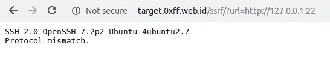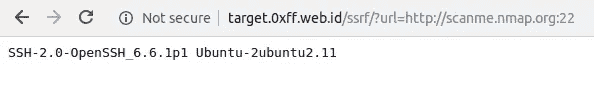

如果有*盲 SSRF* 来了解端口是打开还是关闭，可以关注*内容-长度*、*响应时间*，或者 *HTTP 状态码*。

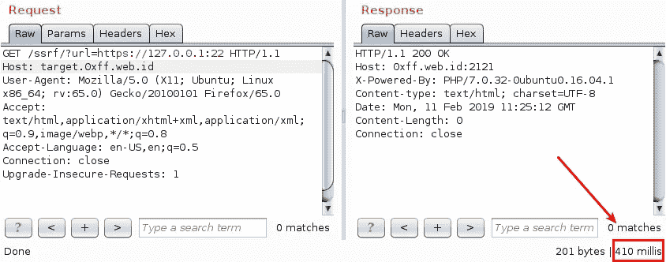

当然，要找出的指标不仅仅是上面提到的三个元素，在端口扫描期间可能会出现“*不寻常的*”元素，因为这取决于 web 应用程序使用的技术和环境。

> HTTPS 协议如果端口是开放的，响应时间将会更长，因为 HTTPS 将进行握手，因此当面对盲目的 SSRF 时，使用 HTTPS 协议可能是端口扫描的合适选择

# 本地文件读取

在 SSRF 环境中，访问/读取本地文件只能使用`file:///`协议，但并非所有请求者都支持`file:///`协议。此外，可能存在不允许使用该协议的硬过滤器/黑名单，但这仍然取决于请求者的行为。

要访问文件本身，您可以使用`file:/PathToFile`、`file:///PathToFile`或`file://hostname/PathToFile`。这三种访问方式都是`file:///`的有效 URIs。

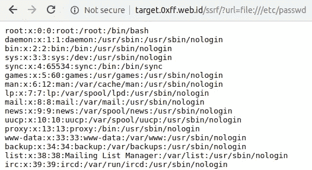

> 如果 web 应用程序部署在 Windows Server 上，要使用 file:///协议访问文件，可以使用 file:///

# Interacting With Internal Service

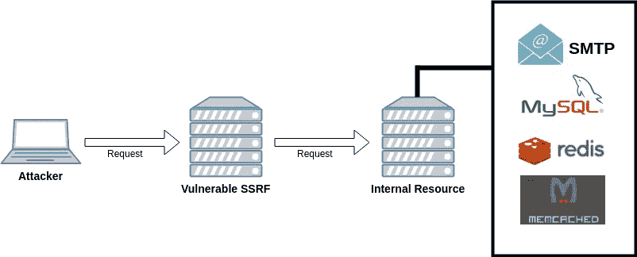

Interactive With Internal Service by SSRF

The real power of SSRF is where the attacker can interact with the internal application/service/network in Local Network, imagine if there is a vulnerable application/service in the internal network where the attacker cannot reach the application/service because it is on a different network, but if there is SSRF vulnerability the Attacker might be able to do that.

If the requester supports the use of the 【 protocol or there may be a 【 vulnerability, it will allow attackers to interact with various internal services such as 【 , 【 , 【 , 【 and so on. Then querying these services to give the desired command, for example, to read local files or even to get RCE.

> Gopher is classified as a universal protocol, through gopher the attacker can do smuggling to other protocols, besides that gopher also supports the use of newline (\r\n) so that even though the requestster is not vulnerable to CRLF Injection, the attacker can still perform CRLF Injection because Gopher does support multiline requests.

A blog post on how to interact with internal services can be read in separate material below:

*   [SSRF 和 SMTP](https://github.com/rhamaa/Web-Application-Attack/blob/master/other-vulnerability/service-side-request-forgery/ssrf-and-smtp.md)
*   SSRF 和 MYSQL(正在进行)
*   [SSRF 和雷迪斯](https://github.com/rhamaa/Web-Application-Attack/blob/master/other-vulnerability/service-side-request-forgery/ssrf-and-redis.md)
*   SSRF 和 Memcached(正在进行)

# 云元数据

有各种各样的供应商提供云计算服务，如 AWS、Azure、Google Cloud、Digital Ocean 等。其中这些厂商使用 REST API 提供元数据访问，但是 REST API 只能通过云网络访问。

如果在这些云服务之一中部署了易受攻击的 SSRF web 应用程序，攻击者就很有可能通过利用 SSRF 漏洞来访问元数据信息。

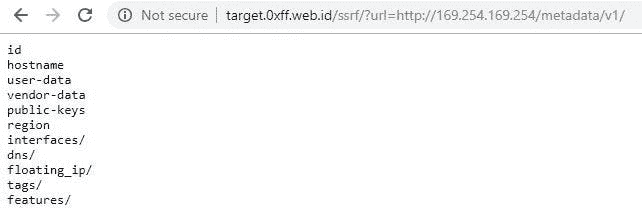

数字海洋实例元数据

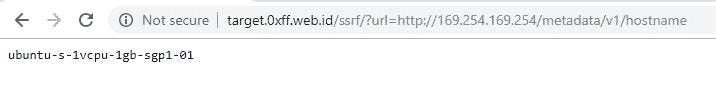

数字海洋实例元数据

对 REST API 端点的引用可以参考所使用的云服务提供商的官方文档，或者可以查看 BuffaloWill 的[云元数据字典对 SSRF 测试](https://gist.github.com/BuffaloWill/fa96693af67e3a3dd3fb)有用。

# 反映了 XSS

如果你没有面对盲目的 SSRF，XSS 反射就会发生。

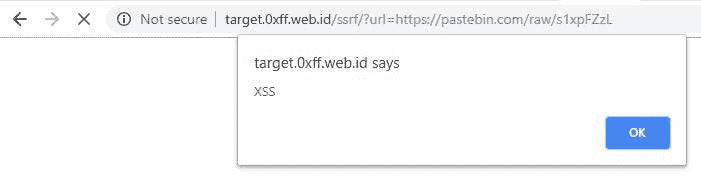

如果请求者支持 javascript，例如像`PhantomJS`和`Selenium`，盲 SSRF 上的 XSS 就会发生，那么攻击者对内部服务/网络进行`DNS Rebinding`攻击以*玩*也不是不可能的。

# URL 模式支持

支持各种协议的请求者列表:

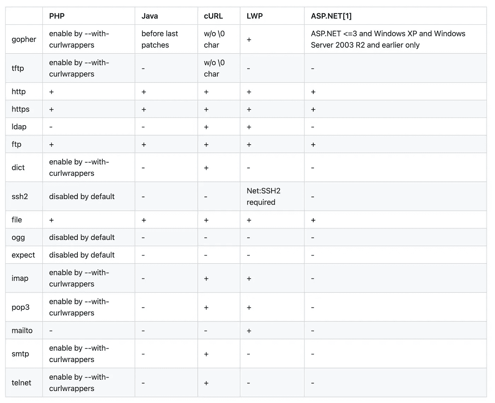

(资料来源:SSRF 圣经。Wallarm 的备忘单)

# SSRF 走私议定书

列出一些支持走私到其他协议的协议:

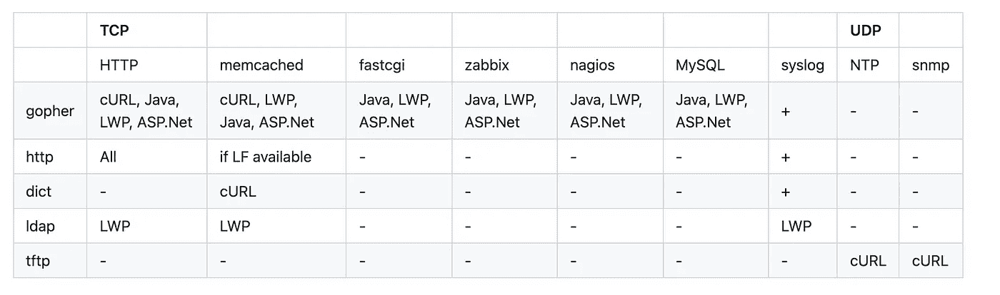

(资料来源:SSRF 圣经。Wallarm 的备忘单)

# SSRF 提示

*   测试请求者是否执行了下面的重定向，这样有效负载的创建会变得更容易，此外，如果有效负载的某些部分被硬过滤/列入黑名单，它也会绕过。
*   经常测试各种协议比如 GOPHER，FTP，SSH 等等。
*   对`CRLF Injection`进行测试，因为如果攻击者想要查询内部服务，这将变得非常重要
*   当面对盲目的 SSRF 时，如读取本地文件和读取元数据，将没有其他方法来找出响应数据，因此显而易见的解决方案是做其他事情，如端口扫描或与内部网络交互，以便您可以获得 RCE。

# 参考

*   SSRF 圣经。Wallarm 的 Cheatsheet
*   [文件 URI 方案](https://en.wikipedia.org/wiki/File_URI_scheme)
*   [云元数据字典对 SSRF 测试有用](https://gist.github.com/BuffaloWill/fa96693af67e3a3dd3fb)
*   [什么是服务器端请求伪造(SSRF)？](https://www.acunetix.com/blog/articles/server-side-request-forgery-vulnerability/)