# 缓冲区溢出

> 原文：<https://infosecwriteups.com/exploiting-stack-buffer-overflows-over-functions-670765bf405a?source=collection_archive---------4----------------------->


当数据的大小超过内存缓冲区的存储容量时，就会发生缓冲区溢出

因此，程序会尝试将数据写入缓冲区，覆盖更近的内存位置指令指针(IP)、基指针(BP)

C 和 C++是两种非常容易受到缓冲区溢出攻击的语言，因为它们没有内置的保护措施来防止覆盖或访问内存中的数据

Mac OSX、Windows 和 Linux 都使用 C 和 C++编写的代码。

# 什么是缓冲区？

缓冲区是在数据从一个位置传输到另一个位置时临时保存数据的内存存储区域

# 原因和缓解措施

缓冲区溢出由用户输入触发

对于缓冲区溢出漏洞，开发人员必须在使用任何可能导致溢出的函数之前检查输入长度

这些攻击是由 C #中易受攻击的函数引起的

以下五种常见的不安全函数会导致缓冲区溢出漏洞:

```
printf, sprintf, strcat, strcpy, and gets.
```

不幸的是，基本 C 语言只提供了一种安全的选择:fgets(用来代替 gets)。各种平台都有其非标准的实现。例如，微软版本的 C 包括 sprintf_s、strcpy_s 和 strcat_s

您还可以通过使用使用“金丝雀”的编译器扩展来防止缓冲区溢出

金丝雀是编译器放在堆栈上缓冲区位置和控制数据位置之间的特殊值

当发生缓冲区溢出时，首先损坏的是金丝雀，这种损坏可以立即检测出来

# 存储配置

堆栈中二进制文件的内存布局可以表示为

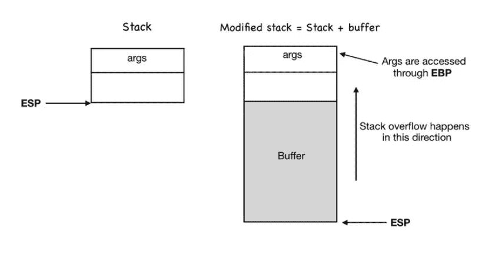

从较低的内存到较高的内存，缓冲区空间向基址指针(BP)和指令指针(IP)增长

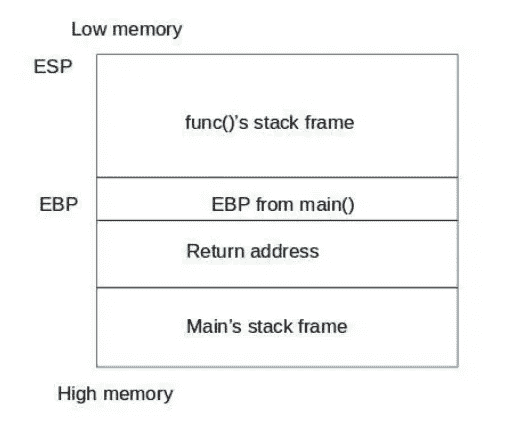

在基址指针(BP)下面将有指令指针(IP)/返回地址

程序的堆栈组件总是存储在基址指针(BP)之上

# 例子

让我们考虑这个简单的程序

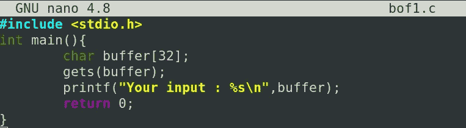

将此编译为二进制

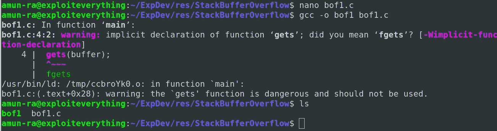

这里，我们为 32 字节的 char 数组变量声明了一个“缓冲”空间

所以从理论上讲，这个变量的缓冲空间应该只能容纳 32 个字节

让我们通过传递随机长度的输入来检查它

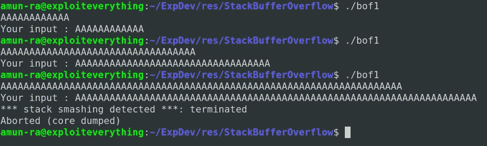

如果我们传递小于 32 字节的输入，它可以完美地运行

但是如果超过了这个大小限制，它将从“缓冲区”的起始空间存储这个输入，并在输入数据结束的内存中结束

在这个大小之前，我们的输入可以覆盖堆栈内存中的缓冲空间

这导致了一个严重的缺陷，攻击者可以通过它来改变程序的轨迹

当我们覆盖一些重要的寄存器，如指令指针(IP)和基指针(BP)时，它指向一个可被利用的地址

如果地址没有意义，它会给出“错误”(分段错误/检测到堆栈崩溃/核心转储)

但是在输入值的帮助下，我们可以正确地重写这些重要的寄存器，以实现我们期望的任务/功能

# 剥削

让我们看看如何使用堆栈中的缓冲区溢出从内存中调用另一个函数

在这个程序中，我们可以看到一个名为“hidden”的函数，它没有在“main()”中被调用

所以实际的程序应该接收输入并将其作为输出打印出来

它不应该显示“hidden()”里面的内容

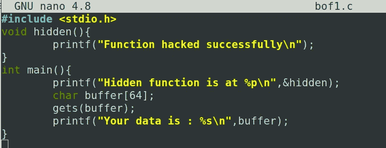

要在 Linux 中测试基于堆栈的缓冲区溢出，您需要编译带有某些标志的源代码，以启用“禁用堆栈保护和堆栈执行”

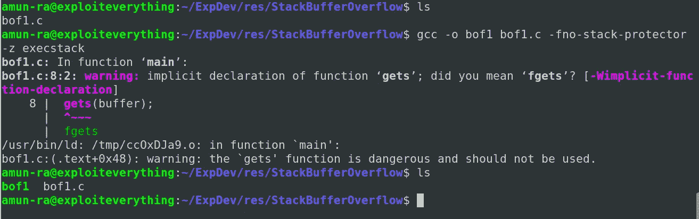

# 第一步:检查 ASLR

这里我们用一个调试行来打印“hidden()”函数的地址

每当需要调用这个函数时，我们的二进制使用 ASM 中的“call address_of_hidden()”来运行“hidden()”

这个程序无论何时被调用都会打印出“hidden()”的随机地址

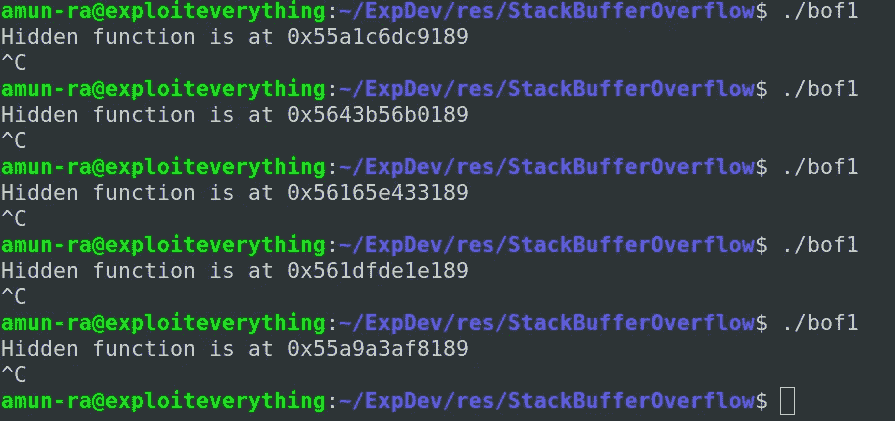

这是因为 ASLR 存在于机器中

## ASLR(地址空间布局随机化)

> `Address space layout randomization (ASLR) is a memory-protection process for operating systems (OSes) that guards against buffer-overflow attacks by randomizing the location where system executables are loaded into memory`

让我们禁用 ASLR 来获取“hidden()”的固定地址，以成功执行缓冲区溢出攻击

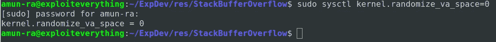

现在 ASLR 被禁用了

让我们检查“hidden()”的地址

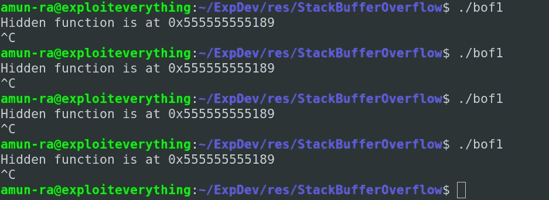

无论我们运行多少次，当我们试图运行程序时，它总是给我们固定的地址“hidden()”，因为 ASLR 是禁用的

# 第二步:使程序崩溃

当所有的保护都被禁用时，尝试用随机大小的输入使程序崩溃

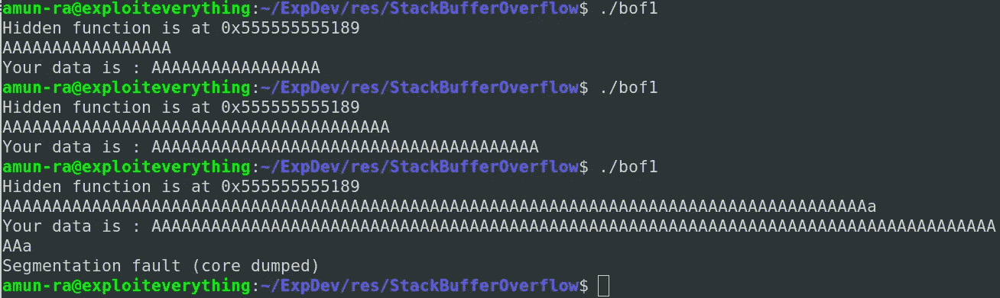

您可以看到，由于传递的输入大于缓冲区的大小，这个程序也崩溃了

我们还可以使用“dmesg”查看带有陷阱的崩溃

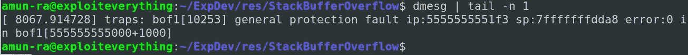

看到这一点，我们可以得出结论，这个程序容易受到缓冲区溢出攻击

# 步骤 3:寻找偏移

让我们传递输入数据来使程序崩溃，并在 GDB 调试器中测试它

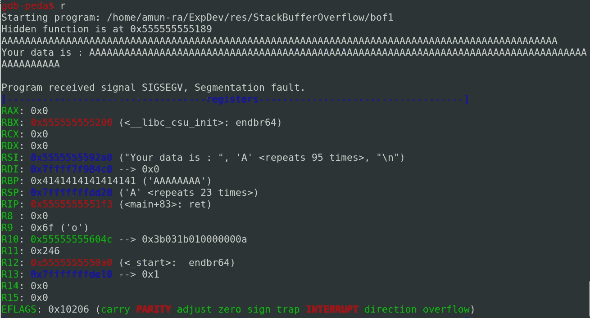

因此，当我们在输入中传递随机垃圾“A”时，会导致错误

并且在崩溃期间，基指针(BP)值被设置为 0x4141414141414141

这里我们可以说我们的垃圾输入覆盖了基址指针(BP)寄存器

我们需要找到基本指针(BP)的偏移量(位置),这样我们就可以精确地设计我们的有效载荷

让我们用“GDB-PEDA”创建一个 100 字节的随机模式，并通过程序传递它

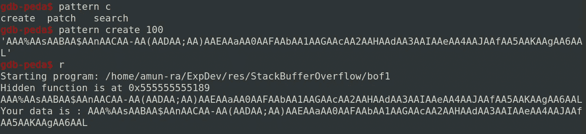

我们的模式溢出了缓冲区空间和基指针(BP ),导致了一个错误

在这里，我们可以看到我们的基本指针(BP)被一个来自我们作为输入传递的模式的随机值填充

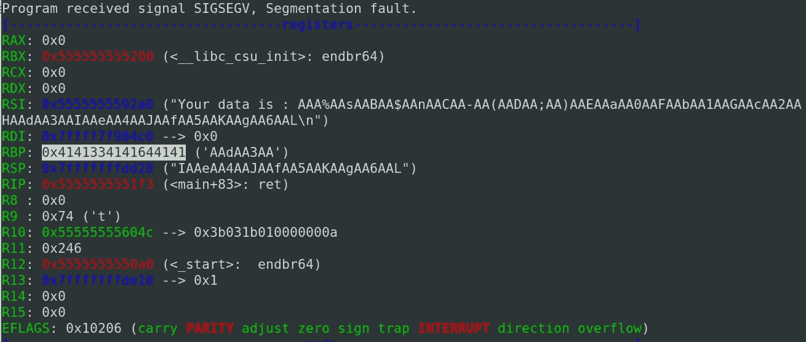

这个值是我们传递的模式的一部分

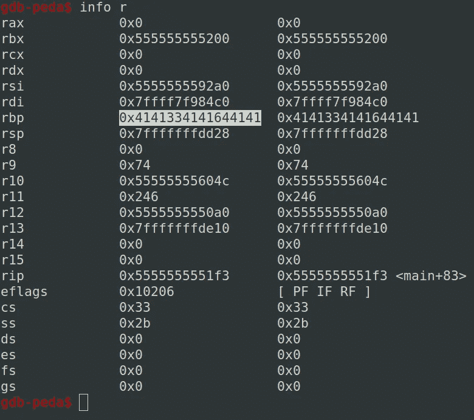

所以这个值可以用来找到我们的基指针(BP)的偏移量

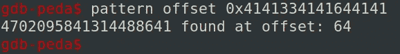

通过计算偏移量，我们的基本指针(BP)内存在 64 字节的“缓冲”内存后开始

# 步骤 4:控制指令指针

我们知道我们的基本指针(BP)从哪里开始

紧挨着基址指针(BP)的是指令指针(IP)

## 指令指针

```
It is a register responsible for storing the address of next instruction which is needed to be executed in stack
```

所有缓冲区溢出攻击的主要目标是覆盖指令指针(IP ),这可以帮助攻击者将程序重定向到他们的目的

```
We know that for x64 architecture,BasePointer (BP)>8 bytesInstructionPointer(IP)>6bytes'A' in hex---> 0x41'B' in hex---> 0x42
```

让我们传递一个在 python 的帮助下精心制作的输入，以检查我们是否可以覆盖 IP

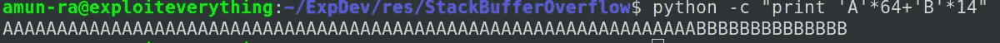

这里我们有 A 要加到 BP

和 8 个 B 来填充 BP

和 6 个 B 来填充 IP

让我们传递这个输入并检查它

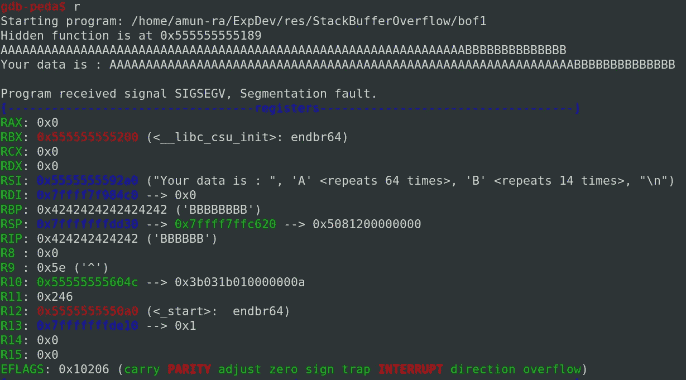

在这里，我们可以看到 BP 和 IP 被成功覆盖

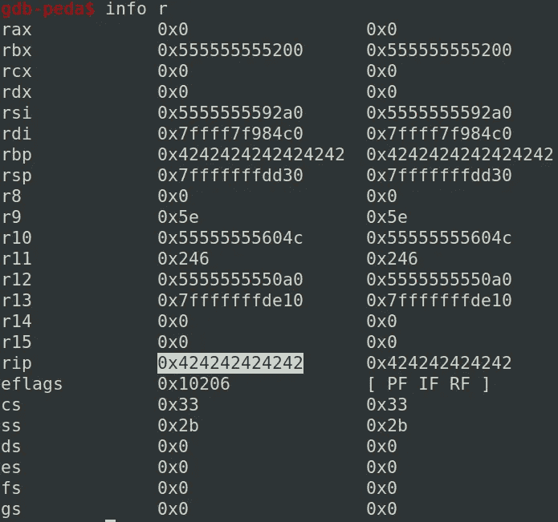

# 步骤 5:利用有效负载

现在，我们已经验证了我们可以成功覆盖 IP

为了生成函数“hidden()”，我们需要使用 IP 来调用它

当 IP 地址指向“hidden()”时，它执行“hidden()”中的内容，并根据堆栈分配寄存器，继续执行

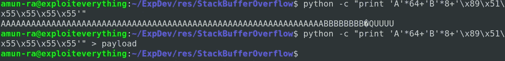

因为我们使用的是“小端字节序”,所以我们的地址应该以相反的顺序表示

让我们测试有效载荷

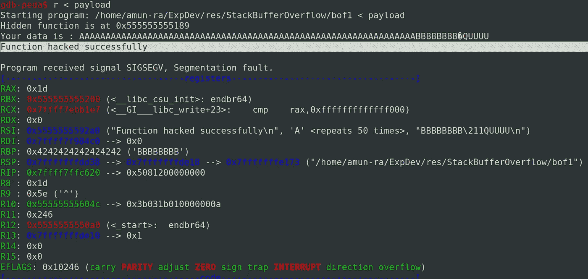

在这里，我们可以看到我们的“hidden()”函数已经成功地通过了 pwn

让我们在调试器中尝试一下

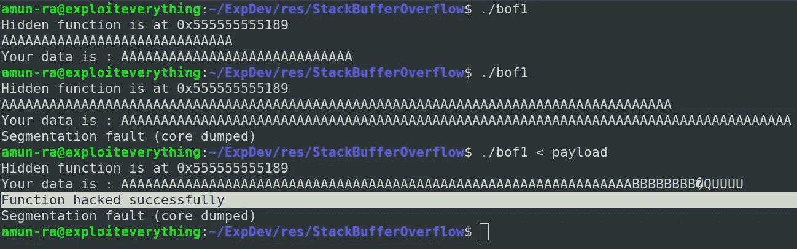

## 剥削结束了

## 执行堆栈缓冲区溢出

## GitHub Repo 中提供了漏洞利用示例

## [aiden peace 369](https://github.com/AidenPearce369/ExploitDev)