# 利用 Sudo 权利| HTB 追溯

> 原文：<https://infosecwriteups.com/exploiting-sudo-rights-htb-traceback-user-d26c427391a9?source=collection_archive---------2----------------------->

## 从网站管理员到系统管理员的横向权限提升|错误配置问题

**总结**

在这台机器中，网站被黑了，用户名和他的信息显示在网站的主页上。在 google 上快速搜索它的名字和评论，我找到了这个用户和他在网站上提到的后门 webshell。使用这个后门 web shell，我得到了“web admin”shell。

此外，我通过利用其工具获得了“系统管理员”帐户的横向权限提升，该工具允许网站管理员执行系统管理员级别权限的命令。

**使用的工具&技术:**

*   用于端口扫描的 Nmap
*   `/bin/bash -i`获得交互式外壳
*   在谷歌上追踪用户名
*   PHP 反向外壳脚本
*   `-e os.execute(‘/bin/bash’)`利用可由 webadmin 执行的特权工具来执行 sysadmin shell。
*   `sudo -l` -显示调用用户允许和禁止的命令列表
*   `pspy32`过程监控/cronjob 检测程序
*   `sudo -l` 为调用用户显示允许和禁止命令列表的命令。
*   `ssh -i <host-priv-key> sysadmin@10.10.10.181` 以 ssh 方式进入 sysadmin 帐户

**CVE(有):**无

**Nmap 扫描输出 TCP/UDP**

## ******端口 80 HTTP * * * * * * * * * * * * * * * * * * * * * * * * * * * * * * * * * * * * * * * * * *

运行了 dirb、gobuster、nikto 工具后，除了少数几个，没有发现什么有趣的东西。

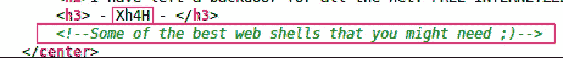

我运行 OSINT 检查从站点主页的源代码中找到的名称及其注释。我在谷歌搜索上看到了同样的信息。

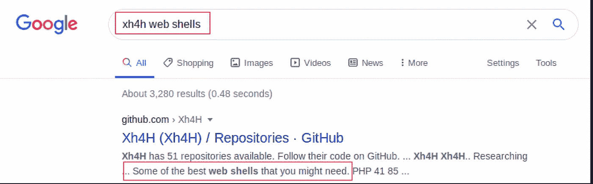

在目标 URL 中发现了“*smevk.php*”web shell:*http://10 . 10 . 10 . 181/smevk . PHP*

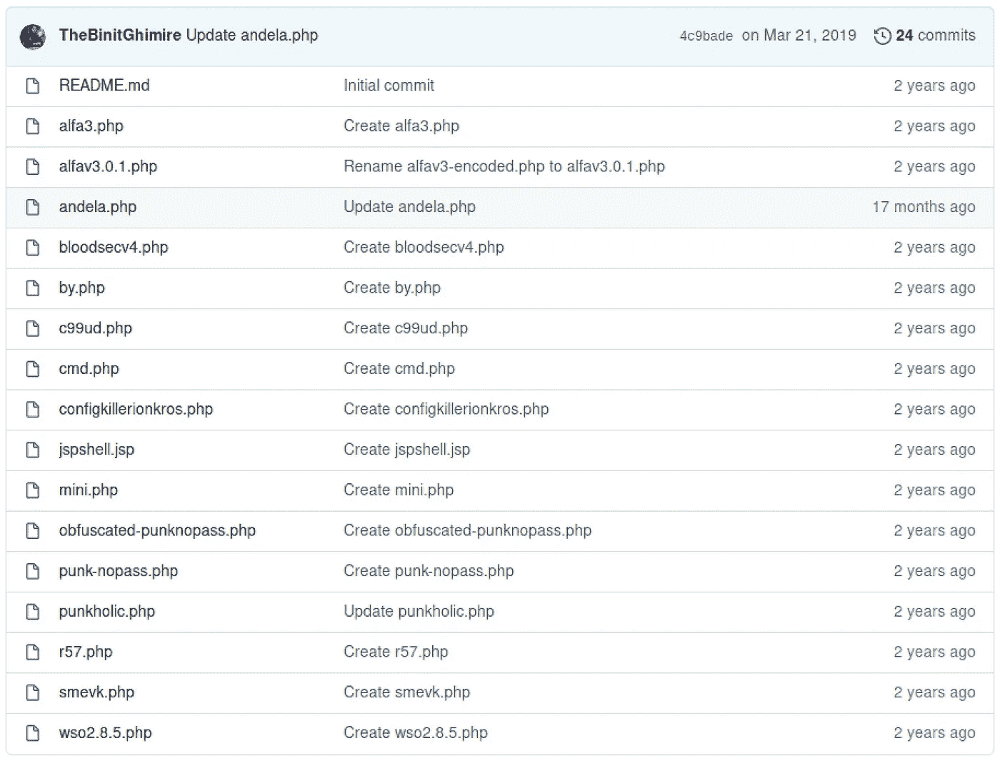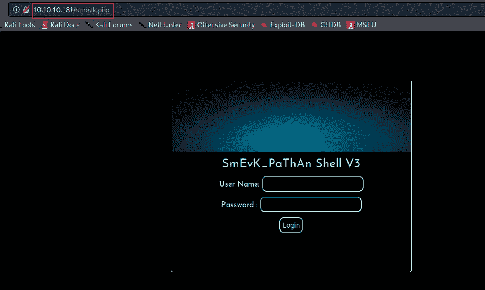

github 中的*smevk.php*代码提供了登录的凭证: *admin:admin*

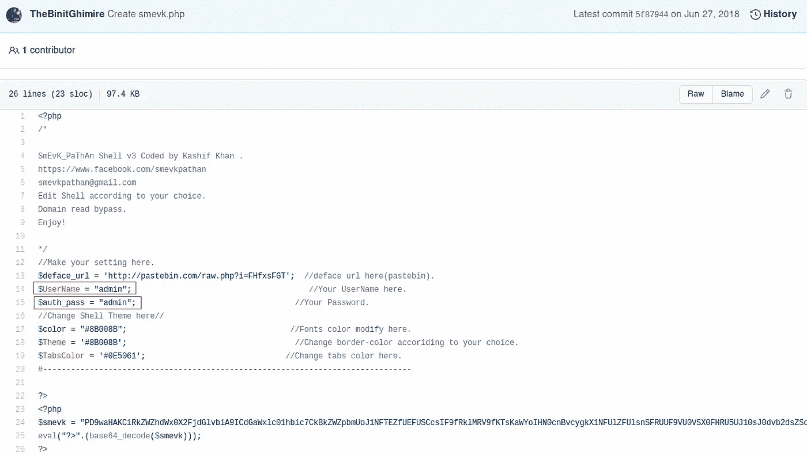

利用这个 web shell，我下载、修改、上传了 [php 反向 shell](http://pentestmonkey.net/cheat-sheet/shells/reverse-shell-cheat-sheet) ，并在我的主机上执行。

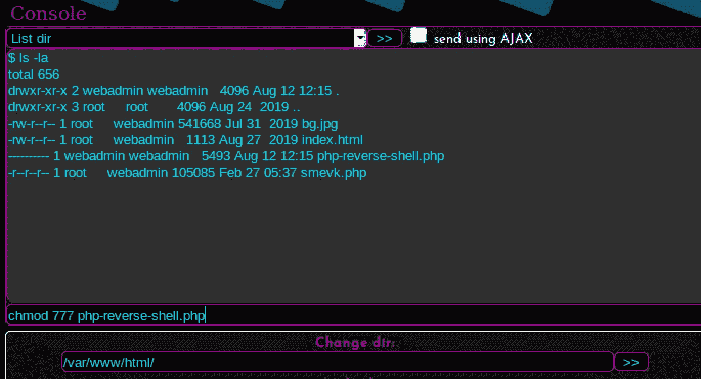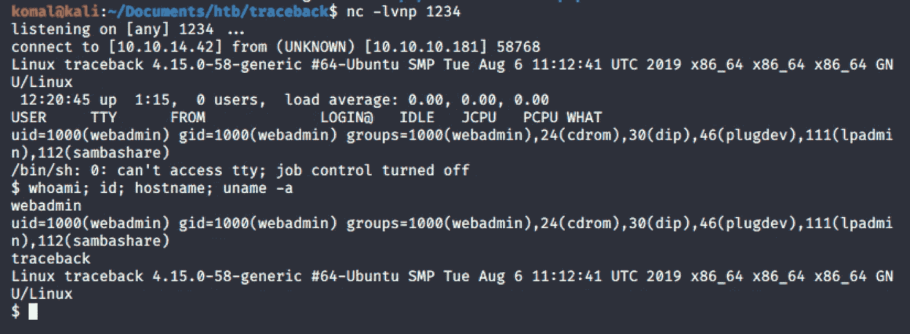

现在我们有了**‘web admin’**shell，我意识到使用 python 生成 shell 在这里不起作用:-(

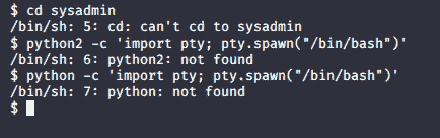

…但是一个简单的命令在这里奏效了！

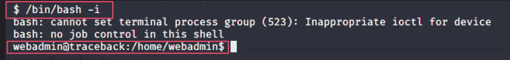

在执行 **sudo -l 后，**我们发现‘web admin’可以在这台机器上运行下面的 **sysadmin** **命令** (/home/sysadmin/luvit):

`sudo -u sysadmin /home/sysadmin/luvit`

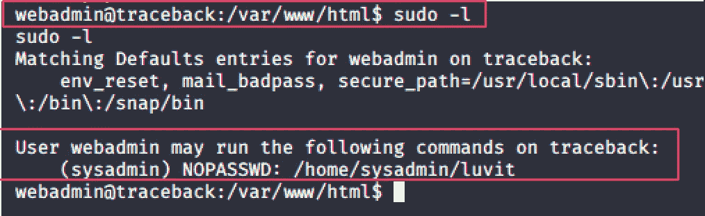

在手动检查时，我还注意到一条 **note.txt** ，内容如下:

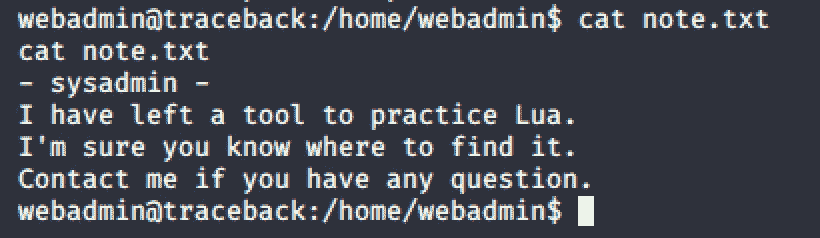

note.txt

貌似 sysadmin 说的工具是**‘luvit’。**

系统管理员希望网站管理员使用这个工具，所以他的帐户被配置为允许网站管理员执行这个工具。

我们还知道他提到了练习 Lua——这是一种编程语言。

因此，如果我们创建一个 lua 脚本文件来使用‘luvit’工具执行反向 shell，我们应该能够获得 sysadmin shell。

使用 GTFObins 站点查找 Lua 的反向 shell 执行命令，我创建了以下内容:

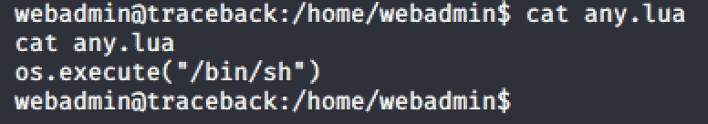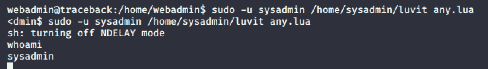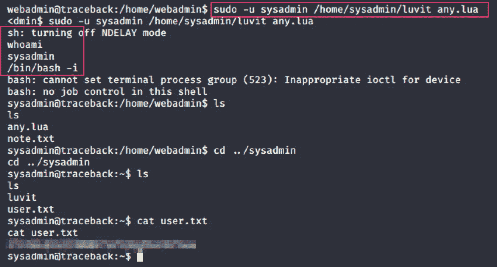

**成功了！！！**

## **追溯根**

## 摘要

系统管理员有配置错误的问题。脚本文件**/etc/update-motd . d/00-header**以完全访问权限每 30 秒执行一次。该文件由 root 所有，属于 sysadmin 组。我修改了脚本文件以提取根级别的信息。然后，我只需通过 ssh 进入 sysadmin 帐户，就可以显示 root.txt 文件的内容。

下载`pspy32`来监控 cronjob 活动。发现`update-motd.d`目录下的文件每 30 秒就频繁更新一次。

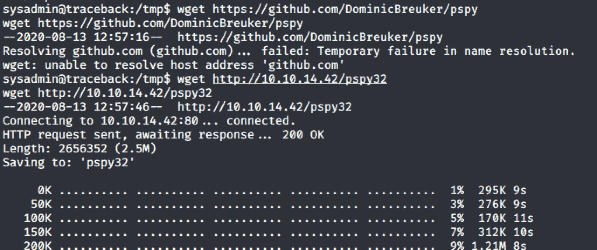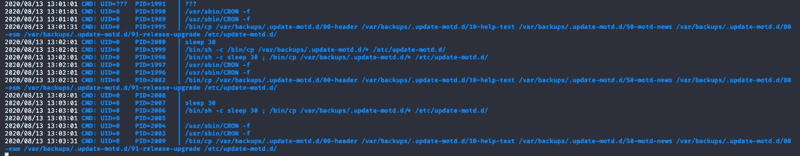

看到 **/etc/update-motd.d** 下的文件有完全文件权限。这些文件由 root 和 sysadmin 作为一个组拥有

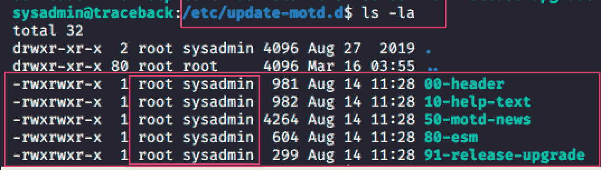

从这里开始，还要注意当您通过 ssh 进入 sysadmin 时，会执行文件 **00-header** 中的命令。

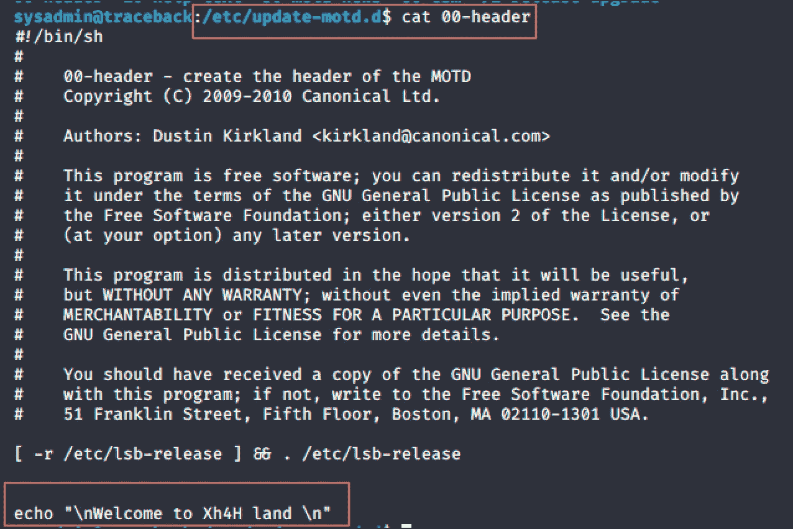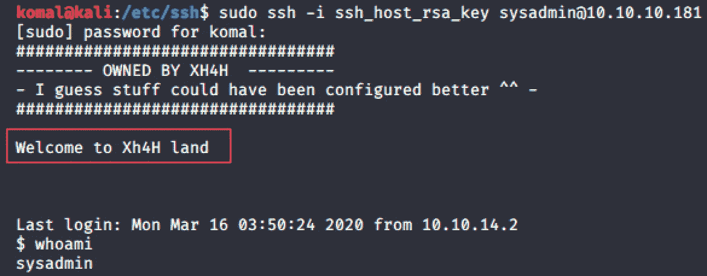

**要 SSH 进入系统管理员，请确保您的主机公钥已添加到系统管理员的 authorised _ keys 中，如下所示。**

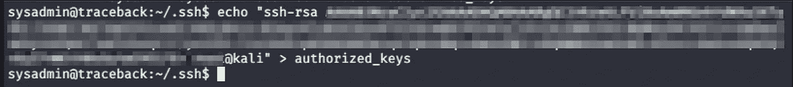

我们还知道文件每 30 秒自动更新一次。因此，需要快速执行该命令，提取 root.txt 内容，并通过登录到 webadmin 或 sysadmin 的 ssh 来读取它。

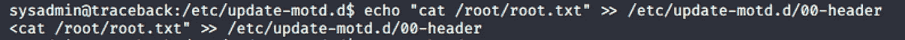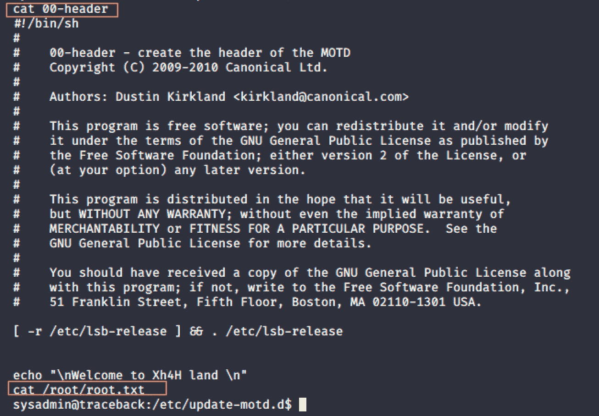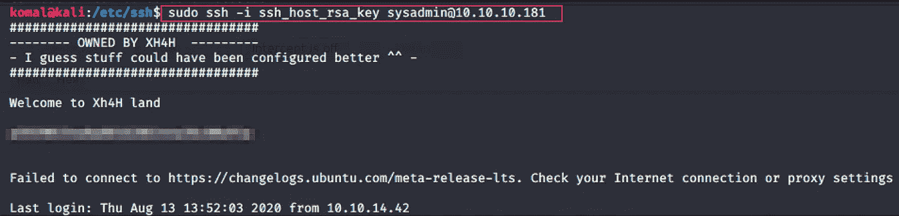