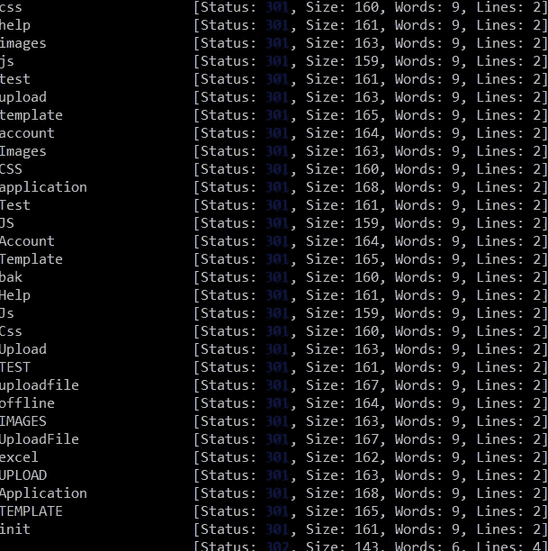

# 利用无限制的文件上传在 bug bounty 程序上实现远程代码执行

> 原文：<https://infosecwriteups.com/exploiting-unrestricted-file-upload-to-achieve-remote-code-execution-on-a-bug-bounty-program-85661516712?source=collection_archive---------3----------------------->


卢卡·布拉沃在 [Unsplash](https://unsplash.com?utm_source=medium&utm_medium=referral) 上的照片

我的故事从一个典型的项目范围评估开始。幸运的是，所有作用域内的子域都列在了程序的页面上，这样就不需要枚举子域了。浏览了所有可用的子域后，我选定了一个引起我兴趣的子域。出于明显的原因，我将把它称为 https://asdfasdf.redacted.com。我已经知道这个程序严重依赖于[微软 IIS](https://www.iis.net/) ，使用 [wappalyzer](https://chrome.google.com/webstore/detail/wappalyzer/gppongmhjkpfnbhagpmjfkannfbllamg?hl=en) chrome 扩展对网站技术进行了指纹识别。

访问 https://asdfasdf.redacted.com 显示了一个带有用户 id 和密码字段的登录表单。用户需要提供这些值，以便向 web 应用程序验证自己的身份。没有提供凭证的注册表单，所以我将注意力转移到寻找可以在未经认证的情况下测试的 bug 上。我不得不在子域上寻找其他可能感兴趣的端点。我决定执行内容发现，这将有望揭示一些隐藏的路径。为此，我利用了来自 Github repo 的 [SecLists](https://github.com/danielmiessler/SecLists) 的 [ffuf](https://github.com/ffuf/ffuf) 和单词表。没过多久，工具就返回了一些有趣的结果；



对 https://asdfasf.redacted.com 运行 ffuf 的输出

起初，我怀疑自己是否真的可以访问 301 HTTP 响应代码的后续目录，以及对这种文件夹的访问通常被适当地限制在我在 bug 搜索过程中遇到的目标上。令我惊讶的是，访问我通过目录暴力发现的每个端点允许我直接访问这些目录下的所有可用内容。下面的文件特别有趣，因为它们包含了从上传文件、备份文件到 web 应用程序源文件的所有内容。

```
/upload
/UploadFile
/Application
/Bak
/init
/offline
```

在浏览各种目录时，我遇到了一个 [aspx](https://fileinfo.com/extension/aspx#:~:text=An%20ASPX%20file%20is%20an,the%20Microsoft%20ASP.NET%20framework.&text=ASPX%20files%20are%20often%20written,ASPX%20pages%20are%20also%20called%20%22.) 端点，它可以用来将包含销售订单数据的 excel 表上传到 web 应用程序。我很快发现我可以上传不同扩展名的文件。上传的文件可以在我之前发现的/upload 文件夹中访问。我测试了上传功能，在记事本中创建了一个文件，添加了一些文本，并以 txt 扩展名保存。然后，我将文件上传到 web 应用程序，并能够在上传文件夹中访问它。


Txt 文件已成功上传，可在上传文件夹中访问

在发现易受无限制文件上传攻击的端点之前，鉴于在这些目录中发现的内容的敏感性，我向程序报告了目录列表漏洞。下一步是将一个 ashx 文件上传到 web 应用程序，同样，这也成功上传到了相关的文件夹。最后，我可以使用来自[这个](https://github.com/tennc/webshell)回购的 web shells 在易受攻击的服务器上执行代码。确认这一点后，我向项目提交了一份 RCE 的单独报告。

希望这篇文章提供了一些在运行 Microsoft IIS 的程序上测试 bug 时需要注意的方面。

如往常一样，如果你有任何问题，可以通过[推特](https://twitter.com/mase289)联系我。下次再见，祝你黑客愉快！