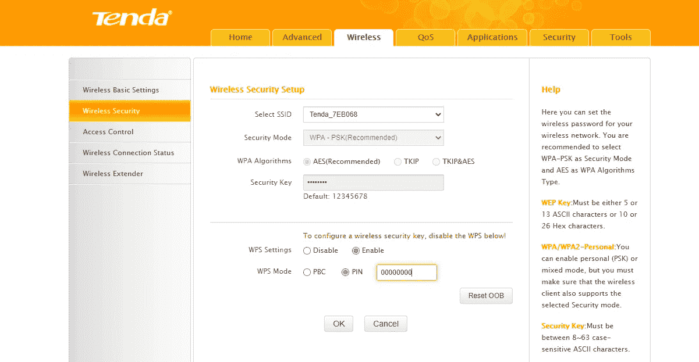

# 开发 WPS 使用掠夺者和假身份验证攻击支持 WPS 的 WIFI

> 原文：<https://infosecwriteups.com/exploiting-wps-hack-a-wps-enabled-wifi-using-reaver-and-fake-authentication-7071b222a33b?source=collection_archive---------0----------------------->

来源:谷歌

嘿，伙计们，每当一个新手黑客试图开始学习黑客。第一件事就是尝试黑掉邻居的 WIFI 密码。话虽如此，让我们开始学习什么是 WPS？它是如何工作的？如何通过利用 WPS 获取 WIFI 密码？

> 警告:这篇文章的唯一目的是让读者了解黑客和安全概念。作者或出版者不会鼓励任何人将这里分享的知识用于不道德的目的。

在这篇博客中，我们将学习如何利用现代路由器中的一个特性，即 WPS (WIFI 保护设置)

来源:谷歌

# **什么是 WPS？**

WPS 代表 **WIFI 保护设置。**这是与 WPA & WPA2 (WIFI 保护访问& WIFI 保护访问 II)一起使用的功能。

这是一种无线安全标准，旨在使使用 WPA/WPA2 加密与无线接入点建立连接的过程更快、更容易。

> **注意:WPS 仅适用于使用 WPA/WPA2 加密来加密密码的无线接入点。**

# **WPS 如何运作？**

WPS 是一种无线安全标准，有助于在不使用实际密码的情况下连接到接入点。

它有两种操作模式

1.  个人识别码
2.  PBC(按钮配置)

当接入点设置为使用基于 pin 的认证时，用户需要设置将用于认证的 pin。想要连接到网络的用户现在可以使用此 WPS pin 连接到网络，而无需使用实际密码。

然而，当使用 PBC 模式时，用户必须按下客户端和接入点上的按钮，该按钮可以是虚拟的，也可以是物理的。按下该按钮后，接入点将切换到发现模式，并对尝试连接的设备进行身份验证。在大多数设备上，一旦新设备连接或设备制造商设定的时间限制(通常为 2 分钟或更短)后，发现模式就会关闭。

# **利用 WPS**

现在是时候跳到有趣的东西了，那就是如何利用 WPS 并在没有密码的情况下访问无线网络。但是在我们开始之前，这里有一个给你的提示

> **注意:只有在接入点上启用了 WPS 并配置为不使用 PCB 时，此方法才有效，这意味着应使用 WPS pin 进行身份验证。**

> **要求:一台 KALI LINUX 机器，一个支持监控模式的无线网卡。**

WPS pin 是一个八位数字，并不是一个很大的数字。使用现代计算机，我们可以在短时间内尝试 WPS 的所有可能，这使得它容易受到统计攻击。一旦我们得到正确的 WPS 个人识别码，它就可以用来计算实际的密码。

为此，我们需要遵循一系列步骤:

步骤 1:在无线适配器上切换到监控模式

要切换到监控模式，请在 linux 终端中启动以下命令

> ifconfig[网络接口名称]关闭
> iwconfig[网络接口名称]模式监视器
> ifconfig[网络接口名称]打开

步骤 2:查找启用 WPS 的接入点

要找到启用了 WPS 的接入点，请在 linux 终端中启动以下命令。

> wash 接口[网络接口的名称]

步骤 3:使用假冒身份验证攻击与目标网络建立关联

要在 linux 终端中启动一个假身份验证，请执行以下命令

> air play-ng-fake auth 30-a[目标设备的 MAC]-h[网络接口的 MAC][网络接口的名称]

“30 after fakeauth 表示此攻击将在每 30 秒后发起。让这种攻击在单独的终端中运行”

第四步:使用掠夺者暴力破解 WPS pins

在新的 linux 终端上使用 fakeauth 在另一个终端上运行时，要强力使用 WPS pins 触发以下命令。

> reaver-bssid[目标设备的 MAC]-channel[目标设备的通道]-interface[网络接口的名称] -vvv - no-associate

"-vvv 表示详细；- no-associate 告诉掠夺者不要与目标网络关联"
最好不要使用掠夺者与目标网络关联，因为这样做通常会失败，因为我们已经使用假身份验证与目标网络关联。成功完成攻击后，掠夺者将返回正确的 **WPS pin 和实际密码**

> **注意:如果金甲虫不工作并返回一个错误，尝试使用它的旧版本，因为当前版本包含一些未修复的错误。**

> 如果你有兴趣了解更多关于网络安全的知识，请关注 Instagram 上的 [i.m.pratikdabhi](https://www.instagram.com/i.m.pratikdabhi/)