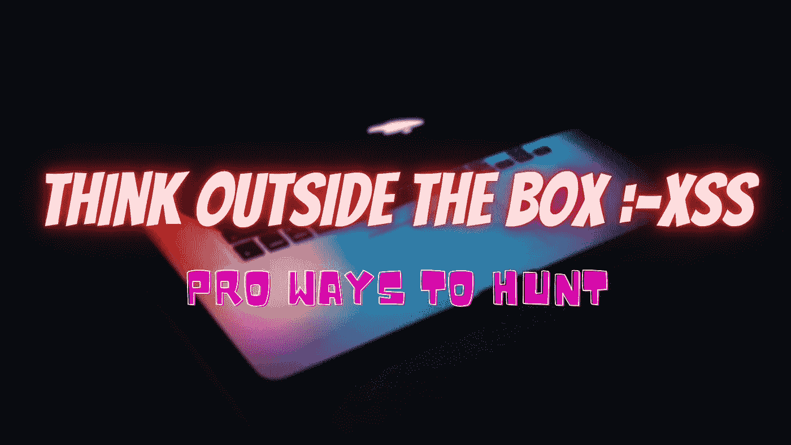
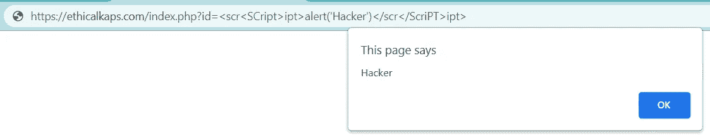
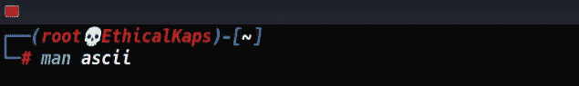
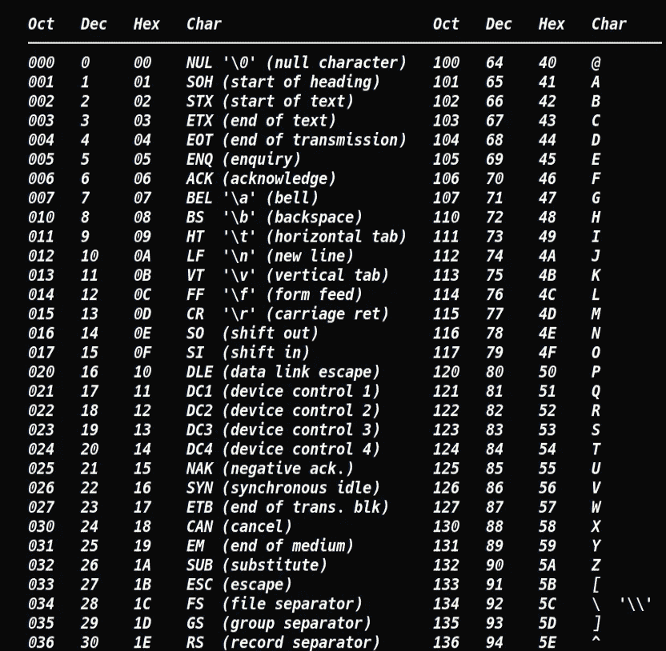
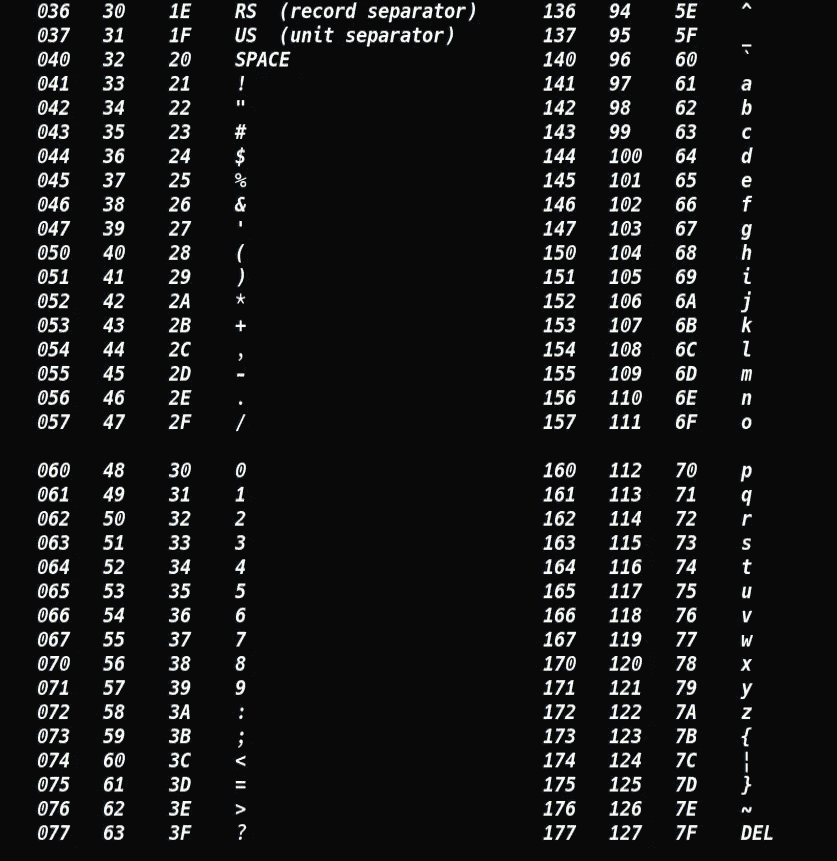
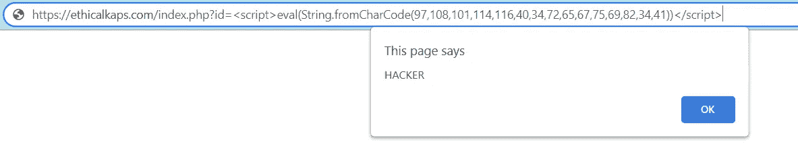
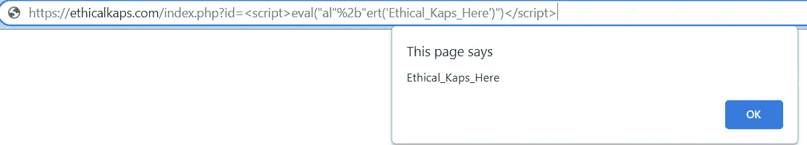
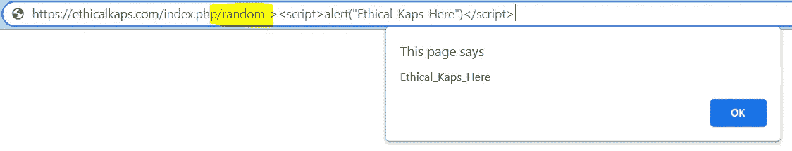

# 用很酷的技巧开发 XSS

> 原文：<https://infosecwriteups.com/exploiting-xss-with-cool-tricks-75a605a0115b?source=collection_archive---------1----------------------->

嘿**赛博朋克**，**道德 kap**在这里，我又带着另一篇强有力的文章回来了。我希望你们都生活得很好。如果你在这里，并且正在阅读这篇文章，那么要么你是新手，要么你肯定想学习一些新的**方法来利用 XSS** 。保持连接，直到最后，我向你保证，你会知道许多有趣的方法来寻找这个漏洞。

> 注:我会尽量让题目**简单**，尽量用**外行人的语言**解释。这样你就能抓住漏洞的根源，并在你的目标中找到这些漏洞，使它们更加安全并获得奖励。
> 
> 我将使用**跨站脚本**的缩写作为 **XSS** 。

> 如果你是一个完全的初学者，对这个漏洞没有任何概念。我会推荐你去阅读 XSS 的基础知识。我已经在我的一篇文章中提到过了。你可以在这里阅读**。**

**现在，让我们直入主题，看看一些实用的东西。**

****

# **开发 XSS 的酷方法**

## ****1。在脚本中嵌入脚本:****

**有时当你运行一个简单的脚本，就像下面提到的。什么都没发生。**

****

****简单的破解**就是:-**

****

## ****2。不指定 alert() :****

**有时候开发者会过滤掉 **alert 这样的词。**为了绕过您可以使用利用 JavaScript 的 **eval** 和 **String.fromCharCode.** 您将能够在不指定 **alert** 的情况下获得弹出**。****

**你只需要**看一下 **ascii 表**中的**进行编码。为此，只需在终端中键入以下命令。注意:-这里我将使用十进制值进行字符编码。**

************

**所以，让我们根据表中给定的值开始编码。例如 **a=97，l=108，e=101** 等等…..**

**所以我编码的东西写在下面:-
**<脚本>eval(string . from charcode(alert(" HACKER "))</脚本>****

****

**所以无论你在哪里注意到 **eval** 。认为那是**邪恶**。😂**

## **3.通过串联:**

**在这里，我们只是跳出框框，应用我们的逻辑，这总是最好的选择。请看下面:**

****

## **4.利用信任:**

**有时开发人员会犯一个常见的错误，那就是信任用户提供的路径&它可以用来触发 XSS。看看下面，它会变得像水晶般透明。**

****

**我刚刚添加了**随机路径**到我的**有效载荷**提供的 URL &中。& **BOOOOMMM！！！！**😍**

**这里要注意的有趣的事情是(page **404** 和 **500** 很可能容易受到这种攻击。)**

**第四点的寓意:永远不要忽视任何事情。**

**和**其他技术，如 XSS 通过文件上传，编码字符绕过过滤器**是简单明了的。我希望你已经知道所有的事情。如果你有任何疑问，你可以在下面评论。**

**那么，这就是这篇文章的内容**希望你喜欢。我会带着另一篇**有用的文章**回来给你。在那之前，小心点，继续寻找。不断挖掘和学习新的东西。****

**如果你喜欢这些内容，你可以在这里支持我:-**@**[**buymeacoffee.com/ethicalkaps**](http://buymeacoffee.com/ethicalkaps)**

**下一篇文章再见。在那之前珍惜你的生命。和平！**

> ***你可以在*[***Twitter***](https://twitter.com/EthicalKaps)*上关注我，在*[***Spotify***](https://open.spotify.com/show/49AHAyFgIy7E2NDjuGRaMm?si=lVPL_DBGRkGIC8DzfTXNbw)**上收听我的评论(😁)以及在*[***insta gram***](https://www.instagram.com/iam_kapilchoudhary/)*上。****

***如果你喜欢这个故事，请点击👏想按多少次就按多少次，并分享来帮助其他人找到它！欢迎在下方留言评论。***