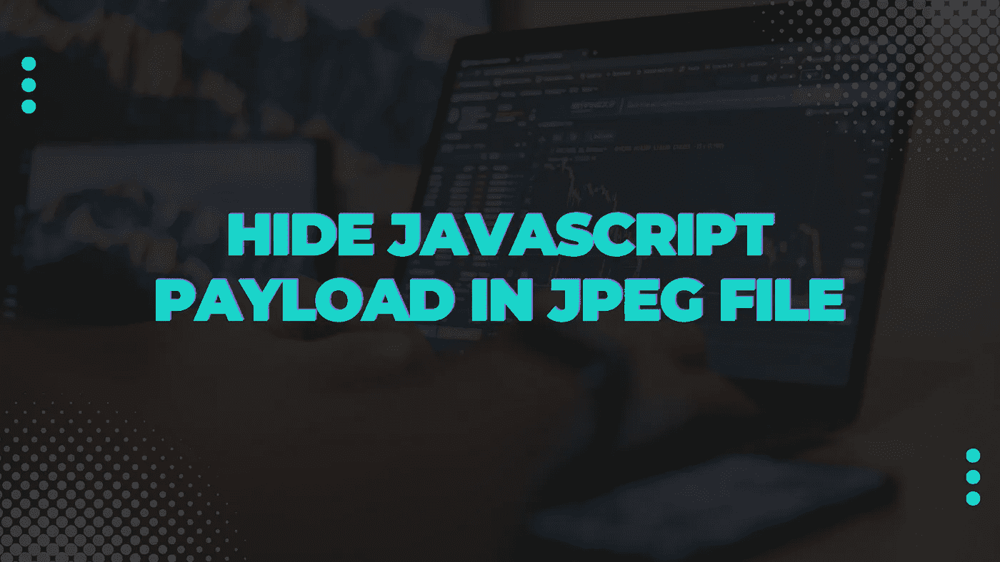
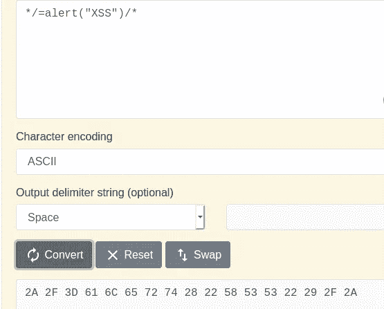
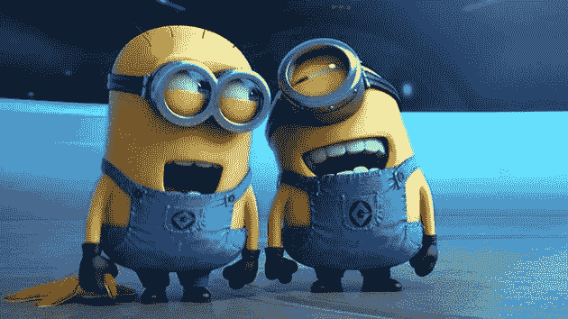
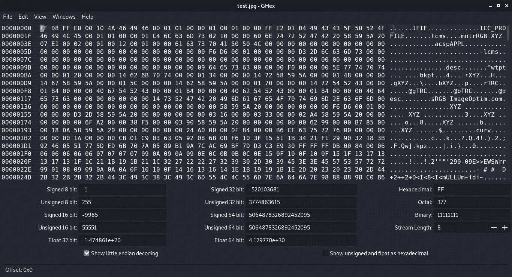
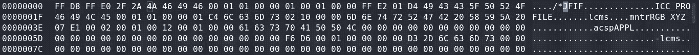
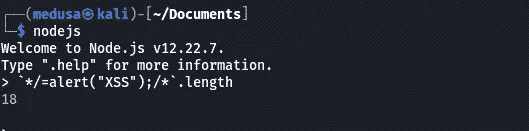
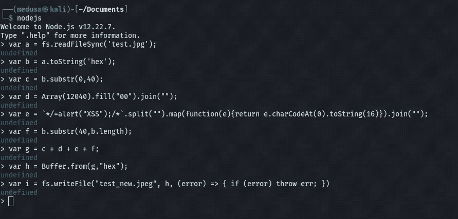
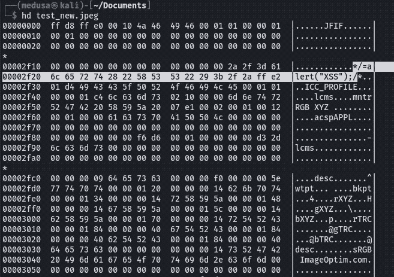
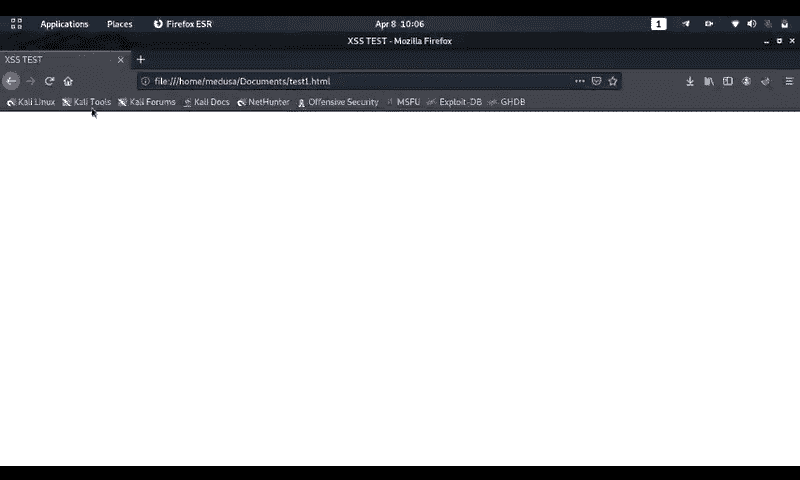

# 用 Javascript/JPEG 语言开发 XSS

> 原文：<https://infosecwriteups.com/exploiting-xss-with-javascript-jpeg-polyglot-4cff06f8201a?source=collection_archive---------0----------------------->



## 什么是多语者？

正如 PNG、JPEG 和 DOC 是有效的文件类型一样，多语言是两种不同文件类型的组合。比如 Phar + JPEG (PHP 存档和 JPEG 文件)，GIFAR (Gif 和 Rar 文件)Javascript + JPEG 等。

应用程序只允许某些文件类型的功能，如文件上传，不允许其他文件类型，如。php 或者。js 文件，因为这些文件可让攻击者在应用程序上上传恶意文件。应用程序执行扩展过滤检查，如双扩展(. jpg.php)或在扩展中使用空字节(。php%00.jpg)、文件名(。htaccess，。配置等..)，以及上传文件的签名是否也与其内容类型匹配。

不同的应用使用不同的方法，可以使用多语种来绕过这些验证检查。

## JPEG 结构

JPEG 图像表示为一系列片段，其中每个片段都以标题开始。每个报头都以某个字节开始。报头后面的有效载荷根据报头类型而不同。常见的 JPEG 标记类型如下所示:

```
0xffd8: “Start of Image”,0xffe0: “Application Default Header”,0xffdb: “Quantization Table”,0xffc0: “Start of Frame”,0xffc4: “Define Huffman Table”,0xffda: “Start of Scan”,0xffd9: “End of Image”
```

每个二进制文件都包含几个头文件。它们对文件非常重要，因为它们定义了文件的特定信息。大多数报头后面都有长度信息。这告诉我们这个特定的片段有多长。

图像头的开始包含 FF D8。如果我们没有看到它，我们可以假设这是一些其他文件。另一个重要的标志是 FF D9，它表示图像的结束。

为了使有效载荷看起来像一个合法的 JPEG 文件，我们将添加头的长度、注释头、要填充的空字节，然后是我们的 javascript 攻击向量。

假设攻击向量是`*/=alert(“XSS”)/*`转换成十六进制会是这个样子。



十六进制的有效载荷:-

```
2A 2F 3D 61 6C 65 72 74 28 22 58 53 53 2E 22 29
```

我们可以使用十六进制编辑器在图像元数据中注入 javascript。这是因为浏览器在将图像呈现为 HTML 时会解释代码。



test.jpg(目标图像文件)

我有一张 test.jpg 的图片，下面是 test.jpg 的垃圾站。在 **ghex 编辑器**的帮助下，我们将替换一些十六进制字符并保存它们。



我们知道第一个`FF D8`是图像的开始，接下来的两个字节代表即将到来的两个字节，`00 10` 代表 JPEG 头的长度，在十进制中相当于 16 个字节。

# 注射时间

我们将在`FF E0`和`FF DB`之间注入有效载荷。让我们从十六进制表示/*的`2F 2A`开始



> *如果你注意到我们刚刚用* `*2F 2A*` *替换了之前的* `*00 10*` *，十六进制* `*2F 2A*` *的十进制等效值是 12074 字节。所以现在图像头从 16 字节改为 12074 字节。*



从上面的截图中，我们可以看到我们的有效载荷的大小是 18 字节，所以我们必须用空值填充剩余的字节，即 12074–16–18 = 12040 字节。



上面的命令将读取 test.jpg，在中间插入我们的有效负载`2F 2A FF DB`将十六进制转换为缓冲区，添加 12040 个空字节并将其写入文件 test_new.jpg。现在在 ghex 编辑器中关闭`FF D9`前的注释标签



test_new.jpeg 的 hexdump(已修改)

```
Code to execute image as javascript:-<script charset="ISO-8859-1" src="test_new.jpeg">
```

在 Firefox 上，当文档使用 UTF-8 字符集时，当作为脚本包含时会破坏多语言环境！因此，为了让脚本工作，我们需要在脚本标签上指定 ISO-8859–1 字符集，它可以很好地执行。

让我们在浏览器中测试一下。



我们的 **javascript/jpeg 多语言**有效！

> *更新:Mozilla* [*在 Firefox 51*](https://bugzilla.mozilla.org/show_bug.cgi?id=1288361) *及以后版本中修复了这个问题。*

如果你觉得有趣，就和你的朋友分享。

感谢您的阅读。

## 来自 Infosec 的报道:Infosec 每天都有很多内容，很难跟上。[加入我们的每周简讯](https://weekly.infosecwriteups.com/)以 5 篇文章、4 个线程、3 个视频、2 个 GitHub Repos 和工具以及 1 个工作提醒的形式免费获取所有最新的 Infosec 趋势！