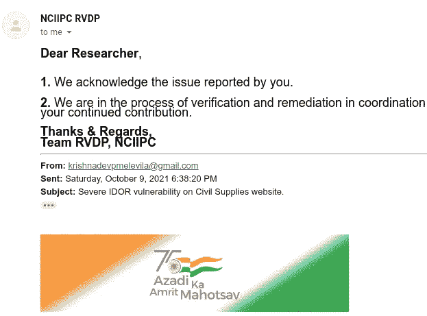
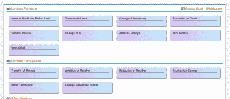
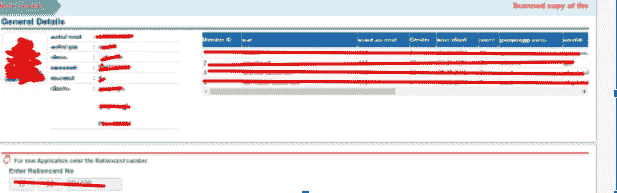

# 在喀拉拉邦民用物资网站上曝光数百万关键数据！

> 原文：<https://infosecwriteups.com/exposing-millions-of-critical-data-on-kerala-civil-supplies-website-cc3a4bed5d07?source=collection_archive---------1----------------------->

大家好，我叫 Krishnadev P Melevila，我是一名自学成才的网络安全研究员和 web 应用程序渗透测试员。

我开始测试一些随机的网站，然后我的想法是这样的

***“为什么只有私企？拥有数百万敏感数据的政府网站安全吗？”***

所以我想到的第一个网站是 http://ecitizen.civilsupplieskerala.gov.in/的[](http://ecitizen.civilsupplieskerala.gov.in/)**，我也不知道为什么会想到这个网站。**

****

> **什么是喀拉拉邦民用物资？**
> 
> **这是一个处理国家配额的政府部门。每个家庭都有一张卡，叫做配给卡，所有家庭的配给都登记在这张卡上。有一项补贴计划，根据这项计划，政府按个人购买口粮时所付金额的一定百分比返还。**
> 
> **此外，民用物资部门有一个由印度国家信息中心开发和维护的网站(我在上面提到过),该网站处理非常敏感的数据，如个人的个人详细信息、家庭详细信息、收入详细信息、银行详细信息(所有补贴金额都在银行转账)、配额卡所有权的变更、电话号码电子邮件的变更等**

**所以让我们开始吧，**

**在攻击者视点中重现的步骤:**

**1.只需使用攻击者的 aadhar(印度唯一的身份证)和配给卡详细信息在[https://ecitizen.civilsupplieskerala.gov.in/](https://ecitizen.civilsupplieskerala.gov.in/)注册为公民，然后点击电子服务，我们就会看到这样的窗口。**

****

**2.打开一个类似 burpsuite 的网页拦截工具。**

**3.单击服务部分的任何选项(比如一般详细信息)并拦截其请求。然后你会得到一个如下的请求。**

```
POST /index.php/c_card_family_details/view_card_details HTTP/1.1 Host: ecitizen.civilsupplieskerala.gov.inCookie: csrf_cookie_name=d69c461e86fdd31525ff79598906748a; marakkaruth=jvqvladjefe1i08552cq8emt6m0v8bs4Content-Length: 94Sec-Ch-Ua: “Chromium”;v=”94", “Google Chrome”;v=”94", “;Not A Brand”;v=”99" Accept: application/json, text/javascript, */*; q=0.01Content-Type: application/x-www-form-urlencoded; charset=UTF-8 X-Requested-With: XMLHttpRequestSec-Ch-Ua-Mobile: ?0User-Agent: Mozilla/5.0 (X11; Linux x86_64) AppleWebKit/537.36 (KHTML, like Gecko) Chrome/94.0.4606.81 Safari/537.36Sec-Ch-Ua-Platform: “Linux”Origin: [https://ecitizen.civilsupplieskerala.gov.in](https://ecitizen.civilsupplieskerala.gov.in)Sec-Fetch-Site: same-originSec-Fetch-Mode: corsSec-Fetch-Dest: emptyReferer:[https://ecitizen.civilsupplieskerala.gov.in/index.php/c_generaldetails_chan](https://ecitizen.civilsupplieskerala.gov.in/index.php/c_generaldetails_chan) geAccept-Encoding: gzip, deflateAccept-Language: en-US,en;q=0.9,ml;q=0.8,hi;q=0.7Connection: closefun_type=19&rationcardno=64419&csrf_test_name=d69c461e86fdd31525ff795989067 48a&appl_frontdesk=
```

**4.在这里我们可以看到配给卡的号码是 64419。那个参数很脆弱。因此，如果我们将 rationcardno 参数更改为任何其他类似的值(比如 64420)，我们将获得配给卡号为 64420 的其他用户的详细信息，而无需任何身份验证。**

********

**5.同样，通过使用服务菜单上的更改银行选项，攻击者可以将补贴成员的所有银行帐户详细信息更改为攻击者的银行详细信息。**

**6.为了使这一过程更容易，攻击者还可以使用自动化工具，如 burp intruder，并在几秒钟内获得用户的数十万条数据。**

**风险因素:**

****1。攻击者可以查看/编辑/修改用户详细信息****

****2。攻击者可以改变其他用户的银行账户信息，窃取补贴 7。攻击者能够更改地址/配给存储/添加或删除新的家庭成员等…****

****3。攻击者可以改变牌的所有权。****

**就这样结束了。于是我向 Cert-In、NCIIPC、NIC 报告，结果现在已经打了补丁！**

**期待你的掌声，别忘了在媒体和其他社交媒体上关注我。**

**【我的 Instagram 手柄:[*https://instagram.com/krishnadev_p_melevila*](https://instagram.com/krishnadev_p_melevila)**

***我的推特句柄:*[*https://twitter.com/Krishnadev_P_M*](https://twitter.com/Krishnadev_P_M)**

***我的 LinkedIn 句柄:*[*https://www.linkedin.com/in/krishnadevpmelevila/*](https://www.linkedin.com/in/krishnadevpmelevila/)**

***我的网络安全课程售卖网站:*[*https://learn.nodeista.com/*](https://learn.nodeista.com/)**

***我的人事网站:*[*http://krishnadevpmelevila.com/*](http://krishnadevpmelevila.com/)**

**推特—[https://twitter.com/InfoSecComm](https://twitter.com/InfoSecComm)**

**中型-[https://infosecwriteups.com/](https://infosecwriteups.com/)**