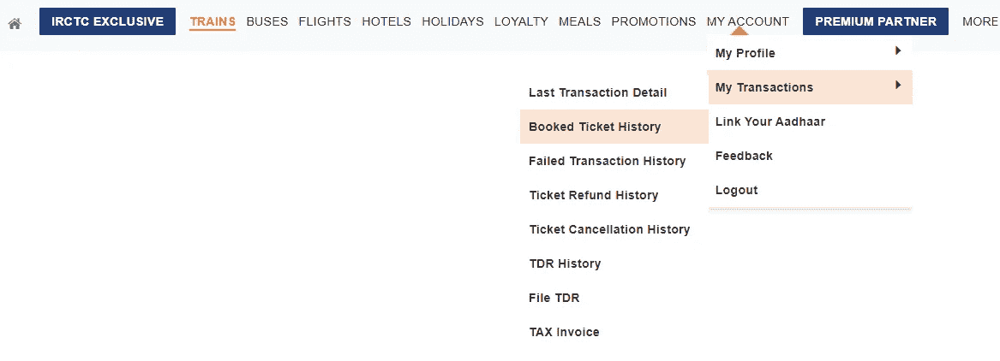
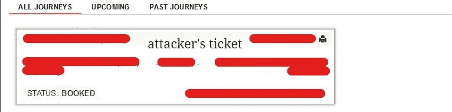
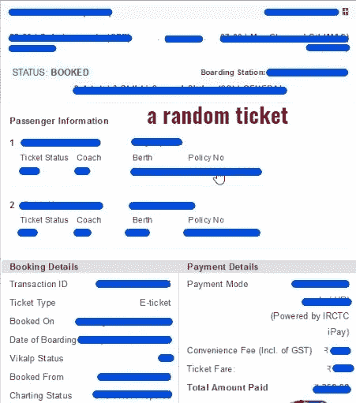
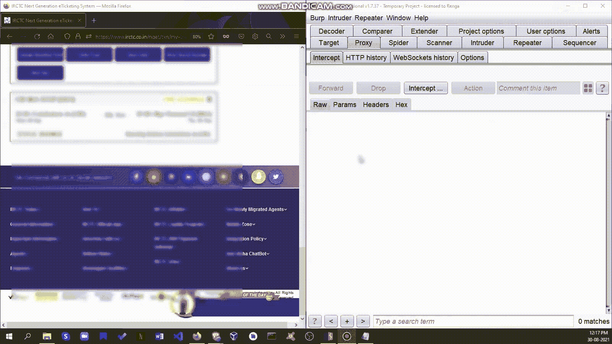
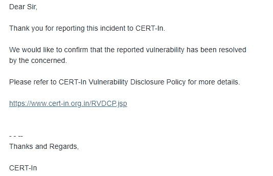

# 暴露了数百万 IRCTC 乘客的车票信息。

> 原文：<https://infosecwriteups.com/exposing-millions-of-irctc-passengers-ticket-details-53338280fb9e?source=collection_archive---------0----------------------->

*你好，*

*这里是 Renganathan，我是一名职业黑客&安全研究员。*

*我因报告了 LinkedIn、United Nations、BYJU's、Nike、Lenovo、Upstox 网站应用程序中的安全漏洞而得到了他们的认可。*

**什么是 IRCTC？**

***印度最大的在线票务运营网站 IRCTC 运营着最大的电子商务网站之一，拥有约 3000 万注册用户，每天约有 55 万至 60 万次预订，使其成为世界第二大繁忙的旅游门户网站，每年创收 2000 万美元(来源:Wiki)***

当我以普通人的身份订票时，我突然有了一个测试漏洞的想法。


黑客模式！

所以我想到的第一个漏洞就是 [**IDOR**](https://portswigger.net/web-security/access-control/idor) 。以下是重现的步骤。

1.  登录您的 [IRCTC](https://www.irctc.co.in/nget/train-search) 账户
2.  进入我的帐户>我的交易>预订机票历史记录。



3.所以有下面的票，点击后会展开



我用了 burp suite，打开拦截，看到了一个 below-get 请求。

```
GET /eticketing/protected/mapps1/historySearchByTxnId/XXXXXXXXXX48?currentStatus=N HTTP/1.1
Host: [www.irctc.co.in](http://www.irctc.co.in)
User-Agent: Mozilla/5.0 (Windows NT 10.0; Win64; x64; rv:91.0) Gecko/20100101 Firefox/91.0
Accept: application/json, text/plain, */*
Accept-Language: en-US,en;q=0.5
Accept-Encoding: gzip, deflate
Referer: [https://www.irctc.co.in/nget/txn/my-transactions?page=Booked%20Ticket%20History&eWallet=false](https://www.irctc.co.in/nget/txn/my-transactions?page=Booked%20Ticket%20History&eWallet=false)
```

我尝试使用 IDOR 并减少事务 ID 的数量，然后转发数据包。

是的。我获得了一个随机用户的交易和车票信息，如车次、出发时间、旅程持续时间、PNR 号、车票状态、上车站、乘客信息，如姓名、座位信息、性别和年龄。



因为后端代码是相同的，所以它也容易被取消机票、更改登机点、订购食物、预订酒店、旅游套餐，甚至预订巴士。


我立即记录了一个 POC，并将其报告给了 incident@cert-in.org.in

概念验证:



时间线:

2021 年 8 月 30 日中午 12 点 45 分:已报告

2021 年 8 月 30 日下午 1:30:分配了一张票。

2021 年 9 月 4 日:问题已解决(重新测试)

2021 年 9 月 11 日:IRCTC 确认。



来自 IRCTC 的确认

感谢阅读:)
注意安全。

[https://www.instagram.com/renganathanofficial](https://www.instagram.com/renganathanofficial/)

【https://twitter.com/IamRenganathan】