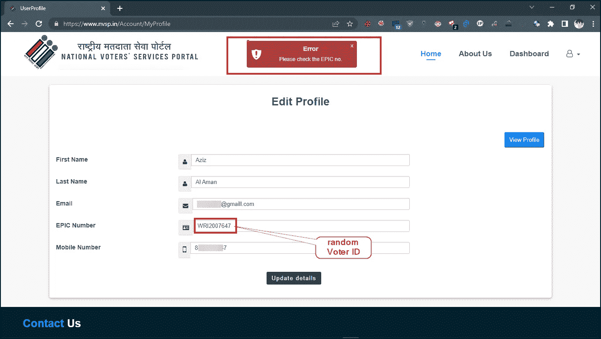
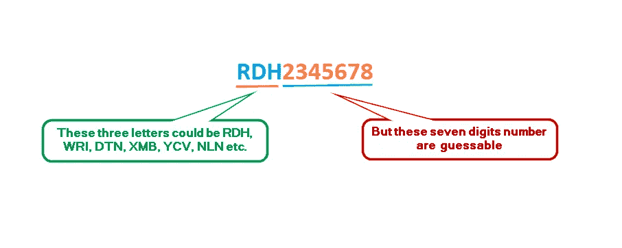
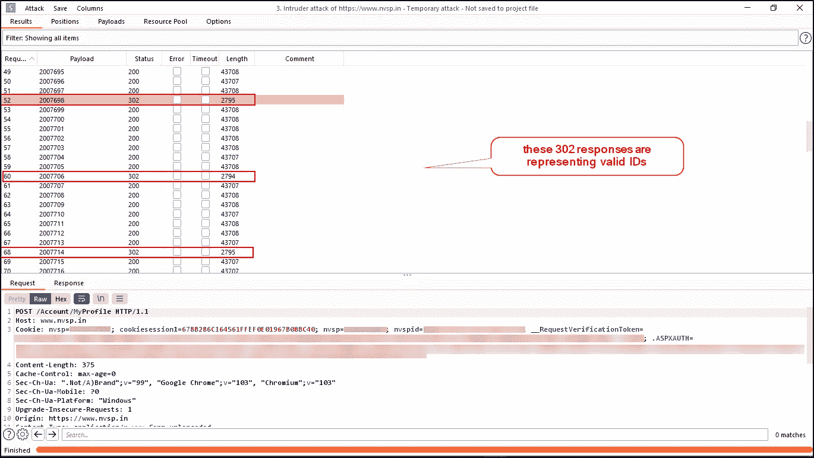
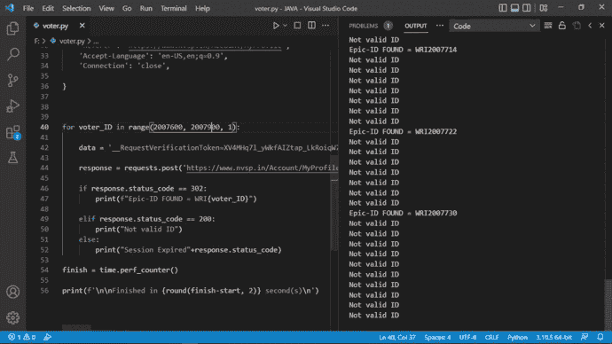
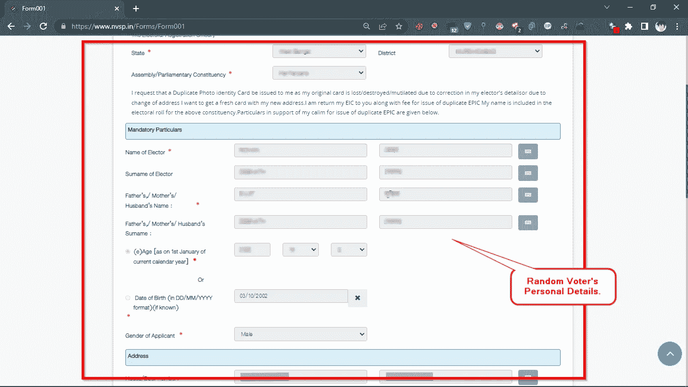
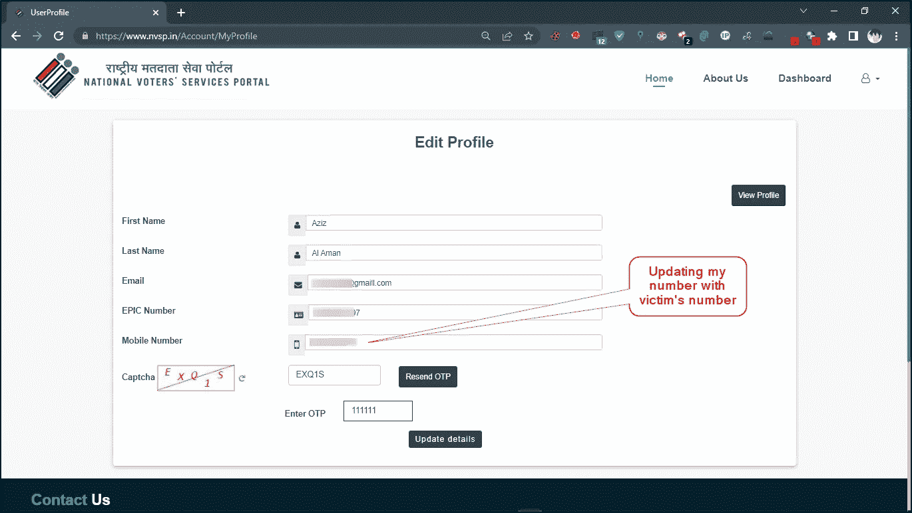
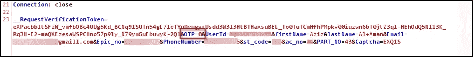
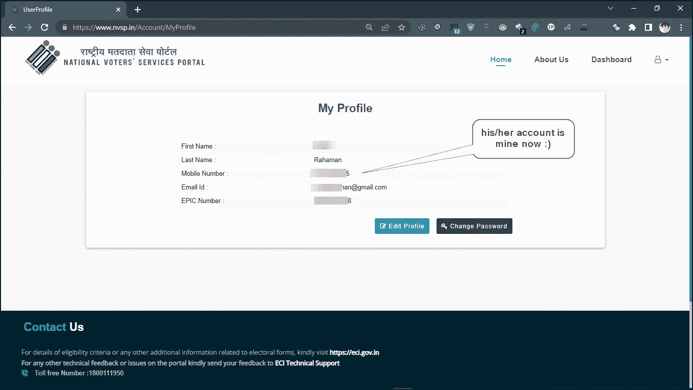
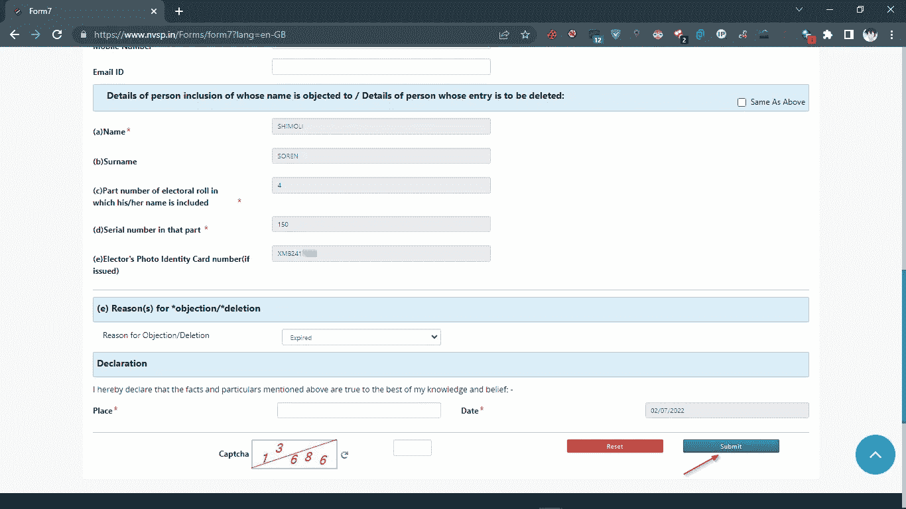

# 暴露了数百万选民身份证用户的详细信息。

> 原文：<https://infosecwriteups.com/exposing-millions-of-voter-id-card-users-details-8a993c9a5d35?source=collection_archive---------0----------------------->

大家好。希望你一切都好。我是 [*阿齐兹*](https://twitter.com/nxtexploit) *。通过这篇文章，我将分享我在官方选民身份证维护平台*[*http://nvsp . in*](https://nvsp.in)*上发现的一些安全问题。我在为我妈妈的卡填写更正表格，我对在 gov 网站上寻找 bug 不太感兴趣:`)那时*[*burp suite*](https://portswigger.net/burp/documentation/desktop/penetration-testing)*正在后台运行，我想让我们试一试。花了半个小时后，我发现了一些关键问题，我将与大家分享。政府已经解决了所有这些问题。*

在印度， [**选民证**](https://www.google.com/search?q=what+is+voter+ID+%28india%29) 是由印度选举委员会颁发给年满 18 岁的印度户籍成年人的身份证件，主要作为印度公民在该国市政、邦和国家选举中投票时的身份证明。目前有超过 7 . 8 亿个选民 id 处于活跃状态。

# 第一个 bug:伪造有效的选民 id 并提取细节(IDOR / BOLA)

注册新帐户时，它显示两个选项“我有 EPIC 号码”和“我没有 EPIC 号码”。EPIC 代表选民照片识别卡，EPIC 号只是选民 ID 号。如果我们选择没有选民 ID 号，那么他们会在您在门户网站上注册后为您提供添加选项。注册后，我试图添加任何随机史诗编号与我的帐户，但它显示这是无效的。所以我发送了 HTTP 请求给打嗝的入侵者进行暴力攻击。

发送对无效 id 的 HTTP 请求

选民编号也称为 EPIC number，是一个字母数字编号，由三个字母和七个数字组成，即 **WRI** 2345678、 **RDH** 2345678、 **DTN** 2345678、 **YCV** 2345678、 **NLN** 2345678、 **XMB** 234567 这三个字母不是随机的字母，你可以找到开头三个字母相似的 id，但是剩下的七个数字是不同的。

我在“Epic_no=”参数上添加了这些七位数的有效载荷位置，即“Epic_no=WRI$2345678$”(正如你在下面的截图中看到的。)

添加有效负载位置

令人惊讶的是，在后端没有实现任何限制，我能够发送**个无限制的请求**而不会被防火墙阻止。结果，后端服务器对每个有效的投票人 id 响应 302 重定向。(如下图截图所示)

对每个有效的投票人 id 进行响应 302

然后，我写了一个 [python 脚本](https://github.com/nxtexploit/Voter-ID-bruteforcer/blob/main/Voter-ID-bruteforcer.py)，它将暴力破解这些值，并为我输出所有有效的 voter _ IDs。

现在我有了随机人的有效选民 id，我把这些 id 和我的个人资料一起添加到“[/账户/我的个人资料](https://www.nvsp.in/Account/MyProfile)”下。然后在“/ [forms](https://www.nvsp.in/Forms) /”部分下有一个选项是 **form001** ，这个表单已经填写了**姓名、父亲姓名、地址、出生日期等。**根据添加到我的个人资料中的有效 EPIC ID。

**提取随机人物的详细信息**

# **第二个错误:账户接管(OTP 旁路)**

在个人资料详细信息更新部分，我试图添加另一个用户的号码。所以我为它创建了另一个帐户。但是那里植入了一个 OTP，我尝试过暴力破解但是没有成功:(我记得去年看过一篇[文章](/how-i-hacked-into-indias-top-matrimonial-website-and-earned-amazon-gift-card-worth-10k-inr-2a0b376219fa)，你可以在这里 看 [**它，这里作者只是截取了请求后加了 0。我在这里对 OTP 参数做了同样的事情，它工作了:)**](/how-i-hacked-into-indias-top-matrimonial-website-and-earned-amazon-gift-card-worth-10k-inr-2a0b376219fa)

在 OTP 验证时拦截流量

[将 OTP 值更改为零](/how-i-hacked-into-indias-top-matrimonial-website-and-earned-amazon-gift-card-worth-10k-inr-2a0b376219fa)

绕过后，我以为它只是可以注册受害者的号码，然后我会重置密码，但令人惊讶的是，在取代受害者的号码，我的个人资料数据自动改变与受害者的细节，我可以拥有他的帐户。

# 第三个错误:永久删除/移除任何随机用户的选民身份证(逻辑缺陷)

从第一个错误，我们可以获得并添加任何随机用户的选民 ID 到我们的帐户，从主页上有一个“删除注册”的选项。攻击者在他的个人资料部分添加任何随机的投票人 ID 后，什么都不需要。然后，他可以轻松地永久删除任何随机用户的选民 ID。

攻击者可以永久删除任何随机用户的卡

我向 vdisclose@cert-in.org.in 汇报了这三个问题，他们解决了这些问题。

我希望你喜欢这篇文章，如果你有任何问题，那么你可以在推特上给我发消息:【https://twitter.com/nxtexploit

感谢阅读，