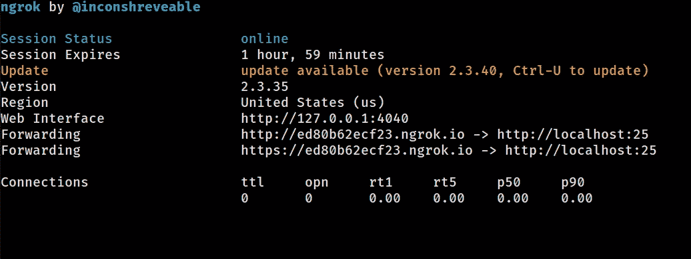
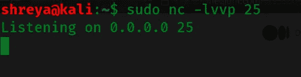
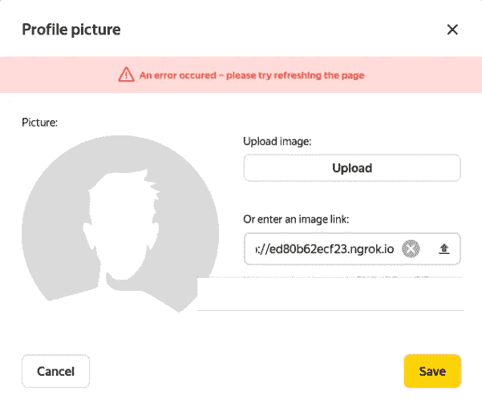
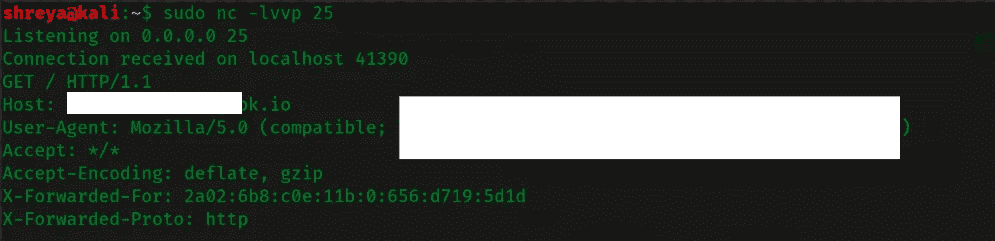

# 外部 SSRF 检测到⚠️

> 原文：<https://infosecwriteups.com/external-ssrf-detected-%EF%B8%8F-a36ade59f7fd?source=collection_archive---------0----------------------->

## **holaaaaaa 黑客！！希望你们都过得好。欢迎再次光临……**👋

# **这是什么漏洞？**🤔

**服务器端请求伪造(也称为 SSRF)** 是一个 web 安全漏洞，允许攻击者诱导服务器端应用程序向攻击者选择的任意域发出 HTTP 请求。

在典型的 SSRF 攻击中，攻击者可能会使服务器连接到组织基础架构中仅供内部使用的服务。在其他情况下，他们可能会强制服务器连接到任意外部系统，从而可能泄露敏感数据，如授权凭据。

# SSRF 袭击的影响是什么？

成功的 SSRF 攻击通常会导致组织内未经授权的操作或对数据的访问，无论是在易受攻击的应用程序本身，还是在该应用程序可以与之通信的其他后端系统上。在某些情况下，SSRF 漏洞可能允许攻击者执行任意命令。

导致连接到外部第三方系统的 SSRF 漏洞可能会导致恶意的后续攻击，这些攻击似乎来自托管易受攻击的应用程序的组织。

**来源👆:**[**https://portswigger.net/web-security/ssrf**](https://portswigger.net/web-security/ssrf)

**使用的工具:**

ngrok(要下载 ngrok 点击这里:[**https://ngrok.com/download**](https://ngrok.com/download))

**我是怎么得到这个 BUG 的？**

首先，我用下面的命令在终端中执行 **ngrok** (你可以用你选择的任何端口运行 **ngrok** ):

执行后，我们将获得如下两个端口转发 url:

复制其中一个转发链接

现在，下一步是在终端的另一个选项卡中使用相同的端口运行 netcat:

**l** —断线后监听

**v** —开启详细模式

**p** —端口

现在，你可以试着在任何地方加载这个链接，比如用户名、名或姓、照片网址、文档网址等等。

在我的例子中，我试图执行 URL，其中需要上传个人资料图片链接。

然后，嘣💥💥….它被执行了！！😱

我在机场得到的回应是:

感谢阅读…希望你喜欢它！！如果你有任何问题，请随时联系我🙂

跟我来👇

**领英:**[**https://www.linkedin.com/in/shreya-talukdar-infosec/**](https://www.linkedin.com/in/shreya-talukdar-infosec/)

**中等**:[shreyatalukdar.medium.com](https://shreyatalukdar.medium.com/)

**推特:**[**https://twitter.com/ShreyaTalukdar9**](https://twitter.com/ShreyaTalukdar9)