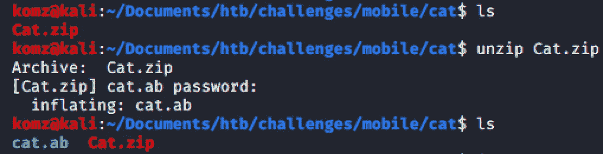
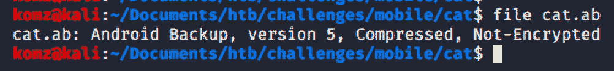
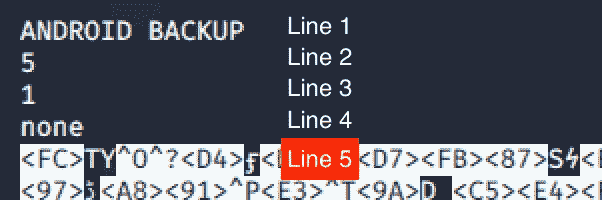
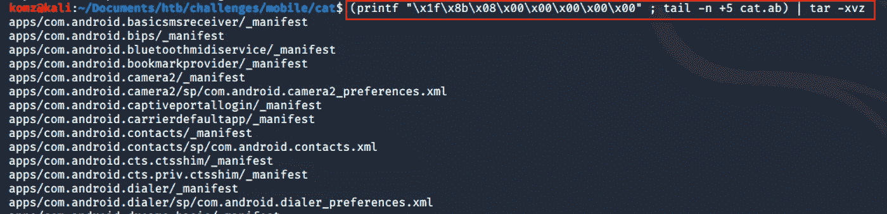

# 提取一个 Android 备份文件

> 原文：<https://infosecwriteups.com/extract-an-android-backup-file-96172efd4d86?source=collection_archive---------1----------------------->

## 移动应用程序数字取证分析

*这不是一个真实世界的演练，而是以一个名为“Cat”的 HTB Android 挑战赛为例，进行一个简单的 Android 备份文件审查。本文不是关于如何解决这一挑战的指南，而是要了解取证分析的移动端。*

[https://101android.com/full-phone-backup-adb/](https://101android.com/full-phone-backup-adb/)

# 。ab 文件

解压缩从 HTB 下载的 cat.zip 文件会显示 cat.ab 文件。这里，**。ab** 扩展名表示这是一个 Android 备份文件。这必须是使用 adb(Android 调试桥)命令行或 Android SDK 软件创建的。

## adb(Android 调试桥)命令行工具

允许您与 android 驱动的设备或仿真器实例进行通信。

## Android SDK 软件

允许您[开发 android 应用程序](https://code.tutsplus.com/tutorials/the-android-sdk-tutorial--cms-34623)。

现在运行`file`命令，轻松找出文件类型和版本。

要提取这个备份文件的内容，只需运行下面的[命令-lin](https://loganakamatsu.com/2016/extracting-adb-backups/) e。

`(printf “\x1f\x8b\x08\x00\x00\x00\x00\x00” ; tail -n +5 cat.ab) | tar -xvz`

**该命令:**

*   添加 gzip 头:`printf “\x1f\x8b\x08\x00\x00\x00\x00\x00”`
*   `tail -n +5 cat.ab` -该命令从第 5 行开始读取文件，直到文件结束。如果你运行`cat cat.ab | less`你会发现前四行是不必要的数据。

*   `tar -xvz` -解压缩 gzip 文件。

**最终输出结果**

cat.ab 备份文件，使用上面的命令已经成功提取了两个文件夹。现在，您可以进一步研究这些文件夹以实现您的目标。

