# 通过遍历 Windows 堆来提取未保存的内存内容，但是怎么做呢？

> 原文：<https://infosecwriteups.com/extracting-an-unsaved-memory-content-by-walking-through-windows-heaps-but-how-6992589d872e?source=collection_archive---------1----------------------->

> **注意事项** :
> 问候各位读者！在你阅读这篇内容之前，我想提醒你，这是基于我的研究和发现，所以如果你遇到或碰巧看到一个**误导性信息**，我很想听听你的意见，我对任何应该正确陈述的信息都非常开放。
> 
> 首先，我想对我的同事和来自 FMIPA Padjajaran 大学的 IFEST CTF 委员会表示感谢，感谢他们组织了如此精彩的 CTF 活动，并给了我和我的团队 [PETIR](https://petircysec.com/) 一个机会来主持并成为 CTF 问题解决者的一员。这篇文章是基于我做的一个记忆法医挑战。

你有没有想过我们如何从计算机内存中提取有价值的内容，尤其是在一个已经运行的进程中？内存取证允许你这样做。一些著名的调查记忆的取证工具包括:

*   [波动率 2](https://github.com/volatilityfoundation/volatility) / [波动率 3](https://github.com/volatilityfoundation/volatility3)
*   [散装提取器](https://github.com/simsong/bulk_extractor)(雕刻器)
*   还有更多！

如果你不熟悉记忆取证，我会推荐你从 [**stuxnet**](https://stuxnet999.github.io/volatility/2020/08/18/Basics-of-Memory-Forensics.html) 博客和一本很棒的书`[The Art of Memory Forensics](https://www.amazon.com/Art-Memory-Forensics-Detecting-Malware/dp/1118825098)` [](https://www.amazon.com/Art-Memory-Forensics-Detecting-Malware/dp/1118825098)中阅读它的基本内容。

我们通常会遇到这样一种情况，一个挑战被赋予了一个带有通用扩展的内存转储，比如**。vmem** 或**。raw，**并识别操作系统崩溃转储或内存转储，一个名为`imageinfo`或`kdbgscan`的易失性插件将负责做到这一点。有很多博客讨论每个`volatility`插件的功能，我想从安德里亚·福尔图娜的博客中推荐它(一部分接一部分)。

**A .案例场景**

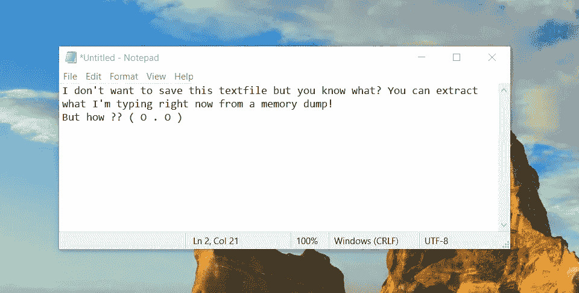

假设一个 DFIR 的研究人员有一个假设，我们能够解析和提取我们在一个应用程序中输入的内容，而不需要首先检索它的转储文件，所以它应该由我们自己精确定位。为了更简单，研究人员同意定义一个将被使用的范围是一个**笔记应用**。

**为了测试假设，研究人员创建了一个任意的** `**passwords**` **，由四个换行符(\n)** 分隔，由**个随机的字母数字字符和符号**组成。同样**不可读**但是 ASCII 约束仍然保持在 32 和 126 之间。

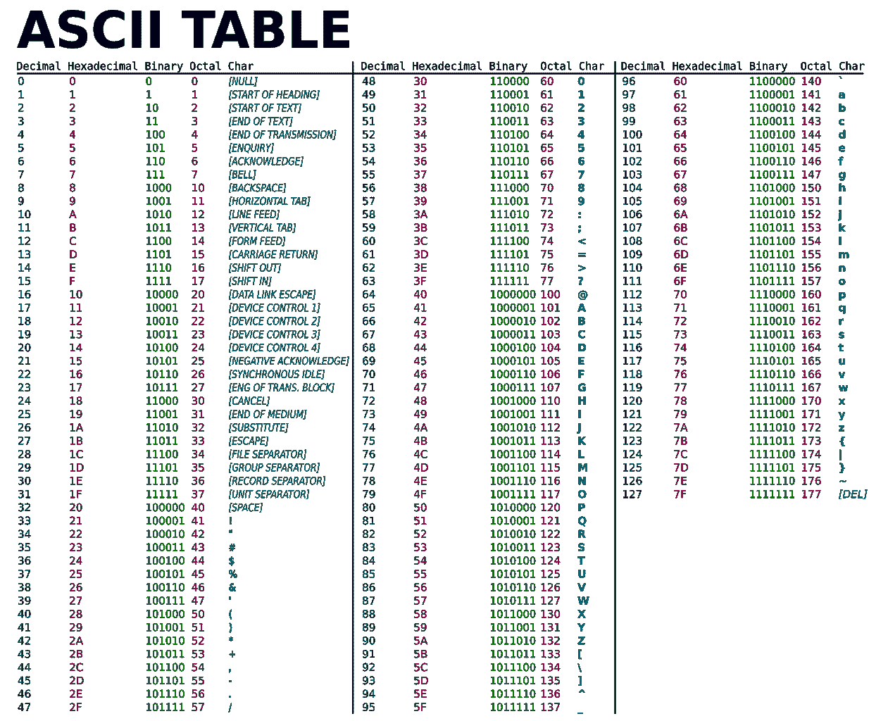

参考:[https://id.wikipedia.org/wiki/Berkas:ASCII-Table.svg](https://id.wikipedia.org/wiki/Berkas:ASCII-Table.svg)

在 [CTF](https://thehackersmeetup.medium.com/beginners-guide-to-capture-the-flag-ctf-71a1cbd9d27c) 中，我们通常使用 CTF 事件名称的可识别前缀作为起始标志的出现，如`COMPFEST{`、`HackToday{`、`CSCCTF{`，然后是哈希值或**可读的**字母数字字符组合，如`CSCCTF{y3Y_i_am_r3ad1ng_th!s_mediUm}`。但在这种情况下，它将更 ASCII **不可读。**例如，**未保存的**文件可能包含如下格式:

```
s)(&^a
r#@fdJk
at4$sg
^%$j4r
t%$r3e
```

挑战被设计成更难从 [**字符串**](https://www.howtogeek.com/427805/how-to-use-the-strings-command-on-linux/) 命令中被猜到。现在你可能会认为这是非常猜测性的，只有通过使用 [**grep/findstr**](https://www.cyberciti.biz/faq/howto-use-grep-command-in-linux-unix/) 命令和 [**正则表达式**](https://en.wikipedia.org/wiki/Regular_expression) 找到密码才能提取出来，但这些很可能是无意的解决方案。我们将更加关注技术方法，准确定位**在内存**中需要提取内容的位置。如果您已经熟悉`volatility`的基本功能，您可以跳到下一部分。

**B .背景**

在我们使用上面提到的工具深入研究之前，如果我们有一个关于这些内容如何在内存中分配的理论基础，就能知道如何提取这些内容，那会更好。

我们开始使用`volatility`插件`kdbgscan`确定内存转储的操作系统配置文件。

```
python vol.py -f /home/kali/Desktop/memory_gone.vmem kdbgscan Volatility Foundation Volatility Framework 2.6.1**************************************************
Instantiating KDBG using: /home/kali/Desktop/memory_gone.vmem WinXPSP2x86 (5.1.0 32bit)
Offset (P)                    : 0x29f2120
KDBG owner tag check          : True
Profile suggestion (KDBGHeader): Win7SP1x64
PsActiveProcessHead           : 0x2a2b940
PsLoadedModuleList            : 0x2a49c90
KernelBase                    : 0xfffff8000280f000**************************************************
Instantiating KDBG using: /home/kali/Desktop/memory_gone.vmem WinXPSP2x86 (5.1.0 32bit)
Offset (P)                    : 0x29f2120
KDBG owner tag check          : True
Profile suggestion (KDBGHeader): Win2008R2SP0x64
PsActiveProcessHead           : 0x2a2b940
PsLoadedModuleList            : 0x2a49c90
KernelBase                    : 0xfffff8000280f000[SNIP]**************************************************
Instantiating KDBG using: /home/kali/Desktop/Windows 7 x64-b77cc556.vmem WinXPSP2x86 (5.1.0 32bit)
Offset (P)                    : 0x29f2120
KDBG owner tag check          : True
Profile suggestion (KDBGHeader): Win2008R2SP1x64_24000
PsActiveProcessHead           : 0x2a2b940
PsLoadedModuleList            : 0x2a49c90
KernelBase                    : 0xfffff8000280f000
```

您将从`volatility`工具中看到许多配置文件建议，这是由于来自 KDBG 头启发值的误报结果，这是由于`kdbgsearch`的基于偏移量的遍历搜索的行为。在我的 Github 文章中，我还附上了来自一个不同的 Windows 操作系统的" **magic"** headers 值。难怪 Win7 和 Win2008 会出现在操作系统配置文件建议中。我们将使用第一个配置文件建议， **Win7SP1x64。**

接下来，我们将列出在当前状态下已经在操作系统内部运行的实时进程。您可以使用以下插件:

1.  `plist`
2.  `pstree`
3.  `psscan`
4.  `psxview`

同样，进一步的解释将在[和](https://andreafortuna.org/2017/07/03/volatility-my-own-cheatsheet-part-2-processes-and-dlls/)中讨论。由于我们不处理任何**隐藏的**过程，我们将关注场景中提到的内置笔记应用程序。

```
python vol.py -f /home/kali/Desktop/memory_gone.vmem --profile=Win7SP1x64 pslist
Volatility Foundation Volatility Framework 2.6.1
Offset(V)          Name                    PID   PPID   Thds     Hnds   Sess  Wow64 Start                          Exit                          
------------------ -------------------- ------ ------ ------ -------- ------ ------ ------------------------------ ------------------------------
0xfffffa8018da5040 System                    4      0     80      567 ------      0 2022-06-26 05:28:51 UTC+0000                                 
0xfffffa8019d1b540 smss.exe                228      4      2       29 ------      0 2022-06-26 05:28:51 UTC+0000                                 
0xfffffa801ab4e060 csrss.exe               308    296      9      503      0      0 2022-06-26 05:29:12 UTC+0000                                 
0xfffffa801ac631c0 csrss.exe               348    340      8      209      1      0 2022-06-26 05:29:13 UTC+0000                                 
0xfffffa801ac4c310 wininit.exe             356    296      3       76      0      0 2022-06-26 05:29:14 UTC+0000                                 
0xfffffa801aca5060 winlogon.exe            384    340      5      134      1      0 2022-06-26 05:29:14 UTC+0000                                 
0xfffffa801abdf060 services.exe            444    356      9      213      0      0 2022-06-26 05:29:16 UTC+0000                                 
0xfffffa801abee060 lsass.exe               460    356      7      754      0      0 2022-06-26 05:29:17 UTC+0000                                 
0xfffffa801ac8a330 lsm.exe                 468    356     10      137      0      0 2022-06-26 05:29:17 UTC+0000                                 
0xfffffa801b00db00 svchost.exe             560    444     10      355      0      0 2022-06-26 05:29:21 UTC+0000                                 
0xfffffa801b056470 svchost.exe             632    444      8      270      0      0 2022-06-26 05:29:22 UTC+0000                                 
0xfffffa801b0ba5a0 sppsvc.exe              788    444      5      151      0      0 2022-06-26 05:29:25 UTC+0000                                 
0xfffffa801a3894a0 svchost.exe             828    444     29      631      0      0 2022-06-26 05:29:27 UTC+0000                                 
0xfffffa801b0cf720 svchost.exe             852    444     55     1312      0      0 2022-06-26 05:29:27 UTC+0000                                 
0xfffffa801b0ecb00 svchost.exe             900    444     22      634      0      0 2022-06-26 05:29:27 UTC+0000                                 
0xfffffa801b119060 audiodg.exe             932    900      5      120      0      0 2022-06-26 05:29:29 UTC+0000                                 
0xfffffa801b172b00 svchost.exe             304    444     34      580      0      0 2022-06-26 05:30:41 UTC+0000                                 
0xfffffa801b17b830 svchost.exe             552    444     25      537      0      0 2022-06-26 05:30:41 UTC+0000                                 
0xfffffa801b2751a0 spoolsv.exe            1152    444     15      285      0      0 2022-06-26 05:30:47 UTC+0000                                 
0xfffffa801b2818b0 svchost.exe            1180    444     19      339      0      0 2022-06-26 05:30:47 UTC+0000                                 
0xfffffa8019a99b00 svchost.exe            1272    444     10      149      0      0 2022-06-26 05:30:48 UTC+0000                                 
0xfffffa801b0f7b00 svchost.exe            1568    444      6       96      0      0 2022-06-26 05:30:53 UTC+0000                                 
0xfffffa801a540060 svchost.exe            1940    444     25      271      0      0 2022-06-26 05:31:49 UTC+0000                                 
0xfffffa8018ef2b00 svchost.exe            1668    444     11      363      0      0 2022-06-26 05:32:02 UTC+0000                                 
0xfffffa8018fd8060 SearchIndexer.          952    444     14      773      0      0 2022-06-26 05:32:20 UTC+0000                                 
0xfffffa801903eb00 taskhost.exe           2412    444     10      260      1      0 2022-06-26 05:32:46 UTC+0000                                 
0xfffffa80190a1b00 dwm.exe                2496    828      3       73      1      0 2022-06-26 05:32:46 UTC+0000                                 
0xfffffa8018fe1240 explorer.exe           2548   2472     24      813      1      0 2022-06-26 05:32:47 UTC+0000                                 
0xfffffa8019115b00 regsvr32.exe           2668   2548      0 --------      1      0 2022-06-26 05:32:50 UTC+0000   2022-06-26 05:32:52 UTC+0000  
0xfffffa801913bb00 mscorsvw.exe           2836    444      5       82      0      1 2022-06-26 05:32:59 UTC+0000                                 
0xfffffa80191bab00 mscorsvw.exe           2872    444      5       75      0      0 2022-06-26 05:33:01 UTC+0000                                 
0xfffffa80191816e0 svchost.exe            2900    444     12      344      0      0 2022-06-26 05:33:02 UTC+0000                                 
0xfffffa801929f060 wmpnetwk.exe           2636    444     10      211      0      0 2022-06-26 05:33:29 UTC+0000                                 
0xfffffa80195989b0 StikyNot.exe           2776   2548     10      173      1      0 2022-06-26 05:34:26 UTC+0000                                 
0xfffffa80192ad060 WmiPrvSE.exe           2108    560      7      120      0      0 2022-06-26 05:34:52 UTC+0000                                 
0xfffffa80191ed060 notepad.exe             588   2548      1       58      1      0 2022-06-26 05:35:06 UTC+0000                                 
0xfffffa80195138e0 CompatTelRunne         1848    444      2       51      0      0 2022-06-26 05:35:45 UTC+0000                                 
0xfffffa8019549b00 conhost.exe             764    308      2       33      0      0 2022-06-26 05:35:45 UTC+0000                                 
0xfffffa8019559600 CompatTelRunne         2600   1848     12      420      0      0 2022-06-26 05:35:45 UTC+0000
```

我们可以看到只使用了 2 个内置笔记应用程序，一个**记事本**和一个**便笺**，因此我们的探索范围限制字段仅在那里。我们应该注意的另一个基本发现是一个`screenshot`插件，以查看是否有任何迹象表明，由于操作系统保存了一个基于 GDI 的伪 SS，某个应用程序在可视窗口桌面中弹出。为什么这很重要？这对我们以后找到原始图像转储的**偏移**可能会很方便。

```
python vol.py -f /home/kali/Desktop/memory_gone.vmem --profile=Win7SP1x64 screenshot -D /home/kali/Desktop/ssVolatility Foundation Volatility Framework 2.6.1
Wrote /home/kali/Desktop/ss/session_0.Service-0x0-3e4$.Default.png
Wrote /home/kali/Desktop/ss/session_0.Service-0x0-3e5$.Default.png
Wrote /home/kali/Desktop/ss/session_0.msswindowstation.mssrestricteddesk.png
Wrote /home/kali/Desktop/ss/session_0.WinSta0.Default.png
Wrote /home/kali/Desktop/ss/session_0.WinSta0.Disconnect.png
Wrote /home/kali/Desktop/ss/session_0.WinSta0.Winlogon.png
Wrote /home/kali/Desktop/ss/session_0.Service-0x0-3e7$.Default.png
Wrote /home/kali/Desktop/ss/session_1.WinSta0.Default.png
Wrote /home/kali/Desktop/ss/session_1.WinSta0.Disconnect.png
Wrote /home/kali/Desktop/ss/session_1.WinSta0.Winlogon.png
```

如果我们检查一下 WinSta0.Default.png，我们会注意到一点提示。

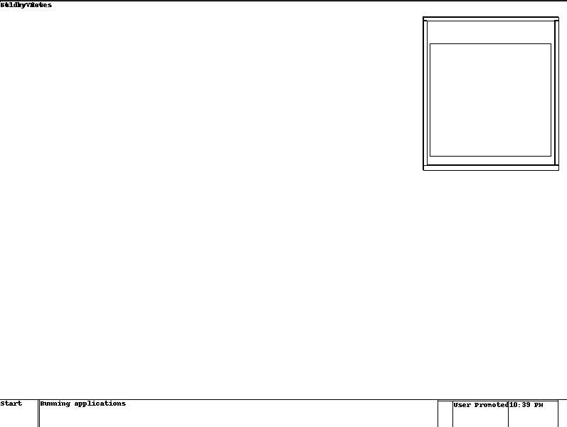

上面的一个“飞行”盒子看起来像一张**便利贴**，我们可以通过一个叫做 [**GIMP**](https://www.gimp.org/) 的工具解析或看到它的颜色。虽然 GIMP 被称为图像操作工具，但是它的功能也允许它读取和**渲染**某个偏移量的原始数据。这种技术已经在一些 CTF 中大量使用，比如这里的[和](https://developpaper.com/ctf-realizing-windows-memory-forensics-with-volatility-and-gimp/)，你可以自己尝试一下。你能阅读便利贴的内容吗？我会把它作为奖励挑战留给你！

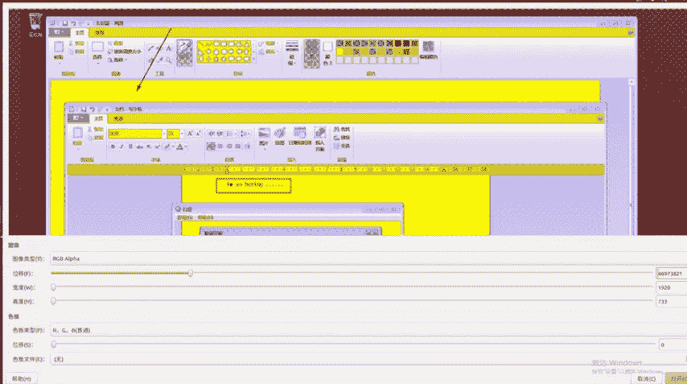

参考:[https://develop paper . com/CTF-realizing-windows-memory-forensics-with-volatile-and-gimp/](https://developpaper.com/ctf-realizing-windows-memory-forensics-with-volatility-and-gimp/)

**C .潜入回忆**

我们现在将关注第二个应用程序，**记事本。为了实现我们的目标，我们应该知道用户输入是如何在记事本本身的进程中工作的。你知道吗，每当我们在键盘上键入一些东西时，那些**数据**都存储在我们操作系统中的**分配内存**中，由于数据不是静态的，这意味着即使我写了这个中等的故事，这个故事的长度也是**而不是最初声明的**，所以它发生在“运行时”**。我们可以把它想象成一个字符数组(某种数据缓冲)。那么如何处理动态分配的缓冲区呢？**[**垛**](https://www.geeksforgeeks.org/heap-data-structure/) 带头。应用程序也会发生这种情况，它们可能会在堆**上分配一个内存区域**。******

那么这个应用程序在这样一个进程中是如何工作的呢？应用程序本身是一个**可执行程序**，它位于某个内存区域内。一个进程拥有**自己的** [**虚拟内存空间**](https://docs.microsoft.com/en-us/windows/win32/memory/virtual-address-space) 。这就像一个移动应用程序，也是孤立的。在 Windows 操作系统中，有许多[Windows API](https://docs.microsoft.com/en-us/windows/win32/apiindex/windows-api-list)将通过枚举它们来跟踪每一个进程。

如果我们看看下面的图表，

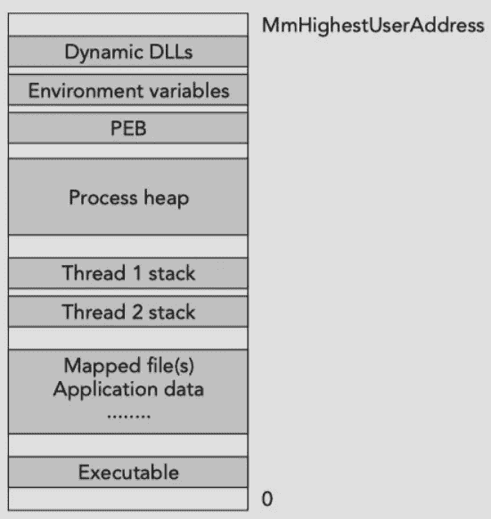

参考资料:[https://icegrave0391.github.io/2020/03/09/memfor-7/](https://icegrave0391.github.io/2020/03/09/memfor-7/)

这就是**进程内存**架构的样子。它有一个动态的[dll](https://docs.microsoft.com/en-us/troubleshoot/windows-client/deployment/dynamic-link-library)非常明显，特别是在 Windows 中，有一些默认的 dll，比如**kernel32.dll**等等。每个进程也有一个环境变量像一个**可执行路径**，一些缺省的目录位置和更多的像 or 环境变量组成的缺省路径。还有 PEB (Process Environment Block)，它是 Windows 中的一种数据结构，包含内存中的位置映射列表。一个**进程堆**是我们要进一步研究的组件，因为它包含了应用程序接收的输入。另一层称为线程堆栈，包含一个函数调用位置。

我们现在的目标是**定位**已经在某个进程的**堆**中键入的输入，在本例中，是**记事本**。虽然有一些来自`volatility`的叫做**记事本**和**堆**的有用插件，但它仍然不支持我们的 OS Profile 的版本(仅在 WinXP 和 2003 中支持)。

```
#notepad.py [SNIP]

class _HEAP(obj.CType):
    """ A Heap on XP and 2003 """

    def is_valid(self):
        return obj.CType.is_valid(self) and self.Signature == 0xeeffeeff

    def segments(self):
        """ A list of the _HEAP_SEGMENTs. 

        This is an array of pointers so we have to deref
        before returning or the caller will be calling 
        is_valid on the pointer and not the object. 
        """
        return [seg.dereference() for seg in self.Segments if seg != 0]

class _HEAP_SEGMENT(obj.CType):
    """ A Heap Segment on XP and 2003 """    

    def is_valid(self):
        return obj.CType.is_valid(self) and self.Signature == 0xffeeffee

    def heap_entries(self):
        """Enumerate the heaps in this segment. 

        ##FIXME: 
        * Raise ValueError if corruptions are detected. 
        * Should we start at FirstEntry or Entry?
        """

        next = self.Entry #FirstEntry.dereference()
        last = self.LastValidEntry.dereference()

        chunk_size = self.obj_vm.profile.get_obj_size("_HEAP_ENTRY")

        while (next and 
                    next.obj_offset < last.obj_offset):

            yield next

            next = obj.Object("_HEAP_ENTRY", 
                    offset = next.obj_offset + next.Size * chunk_size, 
                    vm = next.obj_vm)[SNIP]
```

因此，我们将尝试手动列出记事本本身的`heaps`内存区域。我们可以通过使用 volatility 中的`VAD`插件来实现，比如`vadtree`、`vadwalk`、`vaddump`、`vadinfo`(参见本[页](https://resources.infosecinstitute.com/topic/finding-enumerating-processes-within-memory-part-2/)了解 VAD 信息)。幸运的是，volatility 支持像`dot`、`png`、`xlsx`这样的模块输出，我们将使用其中一个模块来演示 WinAPI 如何分配内存区域，以及如何定位堆位置及其范围。我将使用`vadtree`插件和**记事本** (588)的特定 PID。

```
python vol.py -f /home/kali/Desktop/memory_gone.vmem --profile=Win7SP1x64 vadtree -p 588 --output-file=/home/kali/Desktop/vadtree.dot --output=dot
Volatility Foundation Volatility Framework 2.6.1
Outputting to: /home/kali/Desktop/vadtree.dot#-- convert dot format to PNG
dot vadtree.dot -Tpng > vadtree.png
```

输出将是这样的，

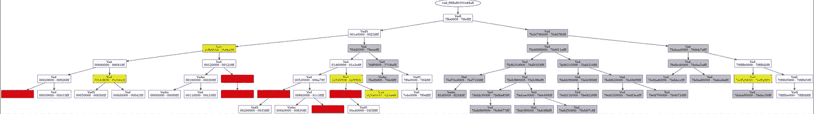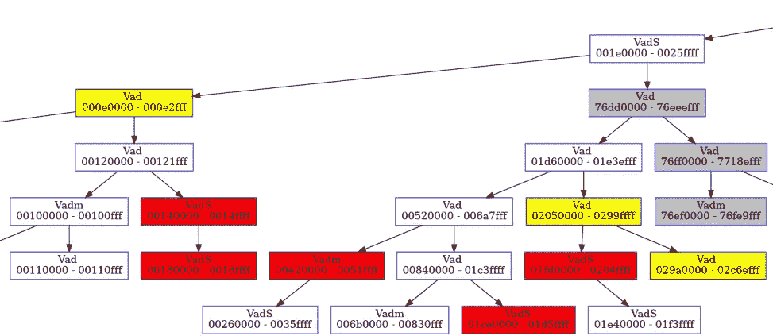

注意有一些颜色像**黄色、白色、灰色和红色**。这非常有趣，因为 volatility 已经识别了每个存储区域的特征，准确地说是颜色代码**，尽管还有一些其他颜色没有显示出来。在它的[文档](https://github.com/volatilityfoundation/volatility/wiki/Command-Reference#vadtree)中也有解释。**

****A)黄色** - >包含一个映射文件**

****B)绿色->-**包含一个线程堆栈**

****C)红色- >** 包含了**进程堆****

****D)灰色** - >包含 dll**

**我们可以得出结论，有 6 个内存(节点)包含进程堆，我们将进一步研究它们。替代方法是使用 volatility 的一个 **volshell** 插件。**

```
python vol.py -f /home/kali/Desktop/memory_gone.vmem --profile=Win7SP1x64 volshell -p 588
Volatility Foundation Volatility Framework 2.6.1
Current context: notepad.exe @ 0xfffffa80191ed060, pid=588, ppid=2548 DTB=0x2bf7f000Welcome to volshell! Current memory image is:
file:///home/kali/Desktop/memory_gone.vmem
To get help, type 'hh()'
>>> list_of_process_heaps_address = proc().Peb.ProcessHeaps.dereference() 
>>> list_of_process_heaps_address
<Array 4325376,65536,1310720,1572864,30277632,33357824>
>>> for i in [4325376,65536,1310720,1572864,30277632,33357824]:
...     print(hex(i))
... 
0x420000
0x10000
0x140000
0x180000
0x1ce0000
0x1fd0000
```

**这些是进程堆的起始地址，与之前我们尝试使用`vadtree`列出它们时 VAD 的起始节点相同。现在，对于最后一步，我们将在可能位于这些进程堆地址之一的特定地址中定位**的确切内容**。**

**为了找到位于进程堆中的用户输入，我们将处理一个**堆块状态(从 _HEAP_ENTRY flags chunk 得出)。**目前已知一些标志状态(空闲、忙碌、额外)，但如果有更多，请让我们都知道！**

**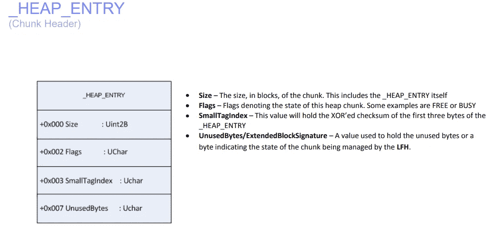**

**参考:[https://illmatics.com/Understanding_the_LFH_Slides.pdf](https://illmatics.com/Understanding_the_LFH_Slides.pdf)**

**我们需要知道的值得注意的结构变量是:如果 **_HEAP_ENTRY- >标志**中的**HEAP _ ENTRY _ EXTRA _ PRESENT**被设置(标志被设置，值为 0x02 ),并且状态名为 **extra** ,则**用户输入存在于应用程序**中。**

**我们将使用 [WinDBG](http://www.windbg.org/) 来进一步分析堆内存区域。为了让调试器解析内存转储，我们需要首先创建一个有效的[操作系统崩溃转储](https://docs.microsoft.com/en-us/windows/client-management/generate-kernel-or-complete-crash-dump)，幸运的是，`volatility`已经有了名为`raw2dmp`的插件。我们还使用 **volshell** 来支持通过偏移地址转储数据。**

```
python vol.py -f /home/kali/Desktop/memory_gone.vmem --profile=Win7SP1x64 raw2dmp -O /home/kali/Desktop/memdump_ctf/windump.dmp
Volatility Foundation Volatility Framework 2.6.1
Writing data (5.00 MB chunks): |...........................................................................................................................................................................................................................................................................................................................................................................................................................|
```

**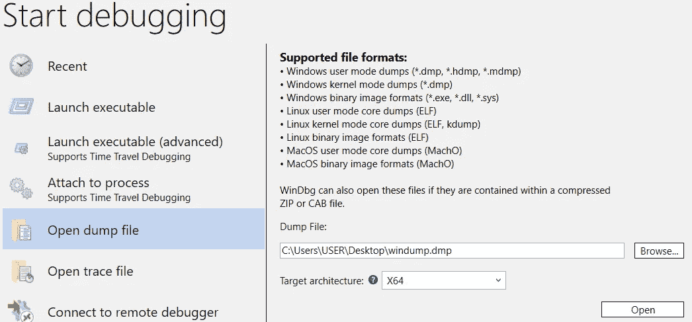**

**我们将把 DMP 文件传递给 WinDBG，并注意它将首先检测作为 16 位进程架构的崩溃转储。这是一个已知的问题，你可以在这里阅读[。为了将其声明为 64 位，我们将使用**。effmach** 。](https://social.msdn.microsoft.com/Forums/vstudio/en-US/4b306267-1fd2-431a-96c5-83a4f1c6b323/dx-command-of-windbg-is-strange-when-a-dmp-of-windbg-from-volatility-raw2dmp-is-analyzed?forum=wdk)**

**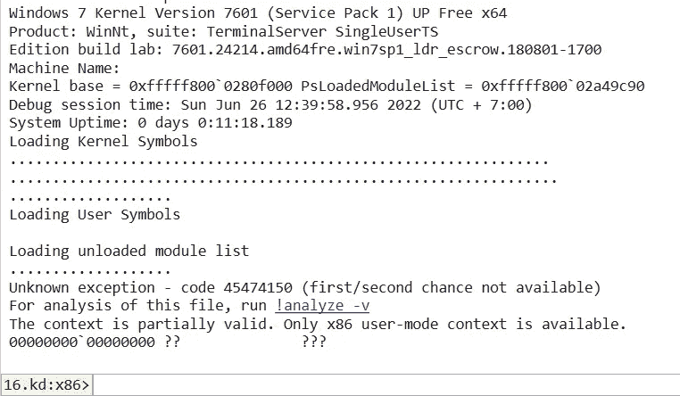****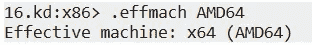**

**然后，我们需要将**当前上下文**切换到我们的进程**记事本**。为了找到上下文地址，我们可以使用这个命令或者使用 PID 指定的 **volshell** ，这是之前找到的(0xfffffa80191ed060)。**

**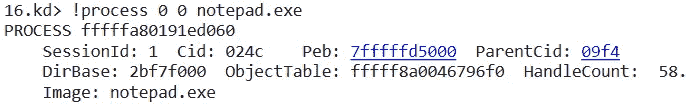****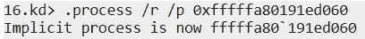**

**现在，我们必须确保之前来自 VAD 节点的堆内存区域与我们在 WinDBG 中发送`!heap`命令后提示的输出相同。**

****

**我们需要一个一个地检查它们，以便检索我们的内容，正如我们之前已经记下的，**堆块状态**需要包含一个额外的**。****

**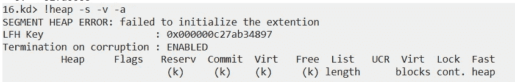**

**我将附上包含`extra`状态的截取输出，**

```
[SNIP]000000000044fc90  000000000044fca0  0000000000420000  0000000000420000       250       c30        10  busy 
000000000044fee0  000000000044fef0  0000000000420000  0000000000420000        60       250        20  busy extra user_flag 
000000000044ff40  000000000044ff50  0000000000420000  0000000000420000       180        60        10  busy 
00000000004500c0  00000000004500d0  0000000000420000  0000000000420000       110       180        10  busy[SNIP]0000000000454a50  0000000000454a60  0000000000420000  0000000000420000        60       3e0        10  busy 
0000000000454ab0  0000000000454ac0  0000000000420000  0000000000420000       1b0        60        20  busy extra user_flag 
0000000000454c60  0000000000454c70  0000000000420000  0000000000420000        90       1b0        2c  busy extra user_flag 
0000000000454cf0  0000000000454d00  0000000000420000  0000000000420000        b0        90        20  busy extra user_flag 
0000000000454da0  0000000000454db0  0000000000420000  0000000000420000        40        b0        24  busy extra user_flag 
0000000000454de0  0000000000454df0  0000000000420000  0000000000420000        30        40        2c  busy extra user_flag 
0000000000454e10  0000000000454e20  0000000000420000  0000000000420000        30        30        2c  busy extra user_flag 
0000000000454e40  0000000000454e50  0000000000420000  0000000000420000        30        30        20  busy extra user_flag 
0000000000454e70  0000000000454e80  0000000000420000  0000000000420000       570        30         8  busy 
00000000004553e0  00000000004553f0  0000000000420000  0000000000420000        b0       570         8  busy
```

**我们已经获得了地址，现在我们将从指定的地址转储内容。我将首先演示具有`extra`的第一个地址，它是从 0x44fee0 到 0x44fef0 派生的。请注意，这意味着起点是从 0x44fef0 到(第一个进程堆地址内的新堆区域—堆区域的前一个起点)，这意味着分配的大小是 0x 44 ff 40–0x 44 fef 0 = 80。**

**使用 **volshell** ，我们可以像这样转储它，**

**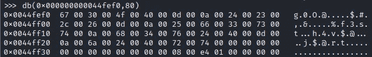**

**有一些独特的特征，内存有一个**空字节分隔符**，所以所有这些空字节都可以被忽略，换行符变成了**标准行尾** (\r\n)的格式，所以它被转换为 **%0d%0a** ，但是如果在内存中，它就是 **0d 00 0a 00** 。然而，有时它没有那个“\r”，所以它只是 **0a 00** 。**

**支持线端理论的一些发现依赖于此:**

**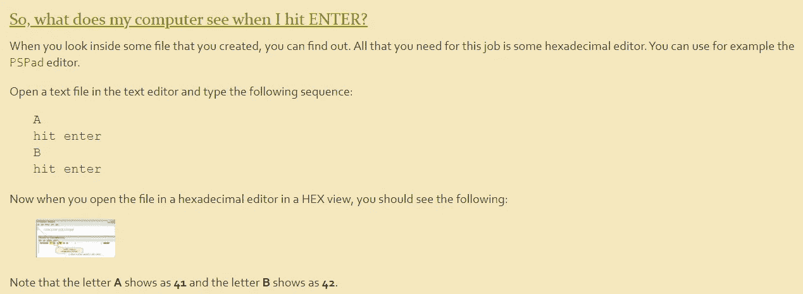****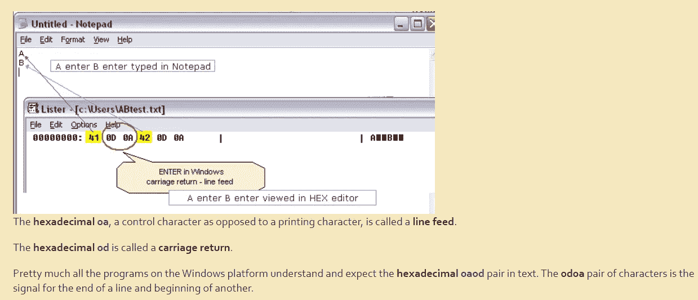**

**图片片段摘自[http://www . maxi-pedia . com/line+termination+line+feed+versus+carriage+return+0d0a](http://www.maxi-pedia.com/line+termination+line+feed+versus+carriage+return+0d0a)**

**你现在可以从之前捕捉到的图像中找到答案，那就是记事本的内容！该场景说，这些内容由四个换行符分隔，所以是五个不同的单词。**

```
g0O@
$#,&
%f3st
h4v$@
j$@rt
```

**最后一步只是将这些单词连接成一个字符串( **g0O@$#，& %f3sth4v$@j$@rt** )并计算其 MD5 哈希，结果是 856 e 37 da E6 a 6 f 35 deb 2 ee 34912 FD 2476。**

**决赛旗~ >**ifest 22 { 856 e 37 da E6 a 6 f 35 deb 2 ee 34912 FD 2476 }****

**您可以随意试验具有`extra`状态的其他堆区域，但是您需要知道内容应该至少具有 4 个 **0d 00 0a 00** 或者具有 **0a 00** 的组合。你可以自己尝试制作一个具体的场景，但这次要有可读的内容！**

**感谢我为这篇文章引用的所有参考资料！**

 **[## 进程内存内部| Icegrave

### 本章分析了用于分配不同数据的各种应用程序编程接口(API)

icegrave0391.github.io](https://icegrave0391.github.io/2020/03/09/memfor-7/)** **[](https://docs.microsoft.com/en-us/troubleshoot/windows-client/deployment/dynamic-link-library) [## 动态链接库(DLL) - Windows 客户端

### 本文介绍什么是动态链接库(DLL ),以及使用 DLL 时可能出现的各种问题。它…

docs.microsoft.com](https://docs.microsoft.com/en-us/troubleshoot/windows-client/deployment/dynamic-link-library) [](https://stackoverflow.com/questions/28483473/windows-heap-chunk-header-parsing-and-size-calculation) [## Windows 堆块头解析和大小计算

### 摘要:堆条目现在已经编码了，关键在堆本身。假设我有一个堆在 0x00d60000: 0:000>…

stackoverflow.com](https://stackoverflow.com/questions/28483473/windows-heap-chunk-header-parsing-and-size-calculation) [](https://docs.microsoft.com/en-us/windows-hardware/drivers/debugger/-heap) [## 堆(WinDbg) - Windows 驱动程序

### 的！堆扩展显示堆使用信息，控制堆管理器中的断点，检测泄漏的堆…

docs.microsoft.com](https://docs.microsoft.com/en-us/windows-hardware/drivers/debugger/-heap)  [## heapdbg.c

### 转到该文件的文档。

systemroot.gitee.io](https://systemroot.gitee.io/pages/apiexplorer/d5/d8/heapdbg_8c-source.html#l00444) 

随时欢迎支持我！

[](https://www.buymeacoffee.com/aseng)

[https://trakteer.id/felix-alexander-swfnt/tip?open=true](https://trakteer.id/felix-alexander-swfnt/tip?open=true)**