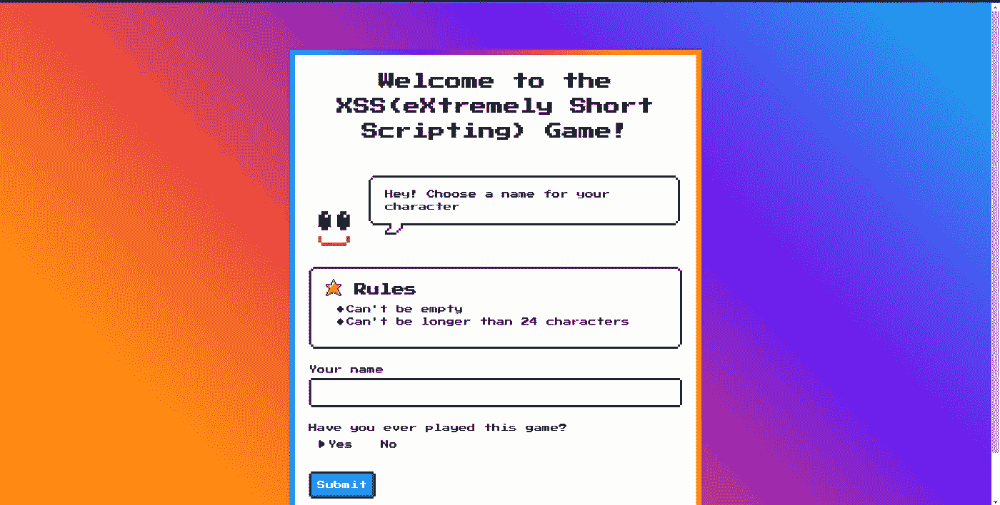
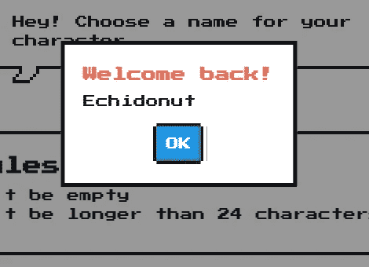
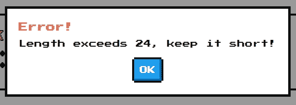
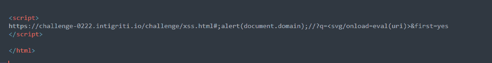
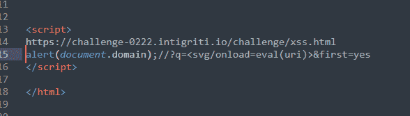
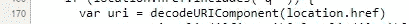
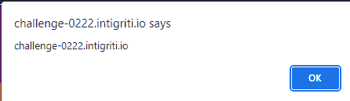
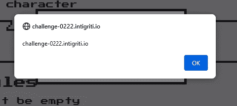

# Intigriti 的二月 XSS 挑战赛演练

> 原文：<https://infosecwriteups.com/extreme-short-scripting-game-intigritis-february-xss-challenge-c19938fecc74?source=collection_archive---------1----------------------->

今天，我将在 [Intigriti 的](https://twitter.com/intigriti/status/1490667161307783178)二月 XSS 挑战赛 0222 上分享我的解决方案。

它叫做 ***XSS(极短脚本)游戏。*** 它暗示可能会有一些曲折，需要我们使用尽可能少的字符来解决挑战。

该解决方案需要满足以下标准才能被接受:

*   应该在最新版本的 Chrome **和** FireFox 上工作。
*   应该执行`alert(document.domain)`。
*   应该利用同一域中的跨站点脚本漏洞。
*   不应该是自我 XSS 或与 MiTM 攻击有关。
*   应该不需要用户交互。

# 最初印象

在挑战开始时，迎接我们的是一个需要两个输入的表单。一个问我们的名字，另一个问我们以前是否玩过这个游戏。



提交后，会出现一个弹出窗口问候我们*欢迎回来！使用**DOM**innerHTML 属性加载我们的输入*



提交后，我们得到以下网址。我们的名字反映在`q`参数中

```
[https://challenge-0222.intigriti.io/challenge/xss.html?q=Echidonut&first=yes](https://challenge-0222.intigriti.io/challenge/xss.html?q=Echidonut&first=yes)
```

玩 XSS 挑战赛的第一件事显然是给页面一个有效载荷来执行 JavaScript。`<svg/onload=alert(1)>`


名称字段未经净化，易受多姆 XSS 攻击。

# 真的那么容易吗？

当然不是。挑战要求我们`alert(document.domain)`。

关于 **DOM innerHTML 属性**我们应该知道的一件事是，它不允许通过`<script>`标签执行 JavaScript。我们唯一的选择是使用**事件处理程序**来实现 JavaScript 执行。

我试图给它一个像`<svg/onload=alert(document.domain)>`一样的有效载荷，但意想不到的事情发生了。



在检查源代码时，它明确地将输入限制为最多 24 个字符。

我们的输入存储在`qs`变量中。

# 制作≤ 24 个字符的有效负载

如果我们的输入`qs`仅限于 24 个字符，我们应该跳出框框思考。换句话说，在变量之外思考**。**

引起我注意的一件事是`uri`

```
var uri = decodeURIComponent(location.href)
```

变量`uri`只是我们的 URL，*经过了“一些”修改。*我们可以在 URL 中注入有效载荷，稍后在 eval()中使用。

我发现一个短的 XSS 有效载荷是这样的方法。在这里找到了[。](https://github.com/terjanq/Tiny-XSS-Payloads)

```
<svg/onload=eval(`'`+uri)>
```

该有效载荷的长度为 **26** 个字符。只比限制多了两个字符。如果我们能把这个去掉两个字符，我们就能解决这个挑战。我看不到其他拯救角色的方法。从这里唯一可能的是

```
<svg/onload=eval(uri)>
```

我们现在可以在 URL 中注入我们的有效负载

```
https://challenge-0222.intigriti.io/challenge/xss.html?q=<svg/onload=eval(uri)>&first=yes#;alert(document.domain);//
```

但是我们有一个错误。`Uncaught SyntaxError: Unexpected end of input`

我花了太多时间来思考这部分。我差一点就能得到 XSS，但是现在我得到了一个错误。我决定在我的 IDE 中复制这个错误，使事情更有条理



## 我意识到来自 URL 的双斜杠导致有效载荷是单行注释！

与多行注释/**/不同，单行注释//不能以另一个注释结束。避免单行注释的唯一方法是另起一行。



我们只控制网址。怎样才能给`uri`变量再加一行呢？嗯，是变量声明中的漏洞。它不小心用了`decodeURIComponent()`。我们可以通过 URL 编码 CRLF `%0d%0a`来添加新的一行



第 170 行中的错误导致的漏洞

CRLF 是 XSS 挑战中缺失的一块拼图。我们唯一需要做的就是添加它，应该会有一个`document.domain`的弹出窗口

```
https://challenge-0222.intigriti.io/challenge/xss.html?q=<svg/onload=eval(uri)>&first=yes#%0d%0aalert(document.domain);//
```



*挑战现已解决，至少我是这么认为的……..*

我的解决方案在最新版本的 Firefox 上无法运行。按照规则，解决方案必须能在 Chrome 和 Firefox 上运行

# **解决方案**

我对这个问题做了更多的调查。不仅仅是我对 Chrome 中的`svg load`处理程序感到惊讶，其他人都没有。为了解决这个挑战，我使用了`<style onload=eval(uri)>` **正好 24 个字符**，而不是`<svg>`

```
https://challenge-0222.intigriti.io/challenge/xss.html?q=<style onload=eval(uri)>&first=yes#%0d%0aalert(document.domain);//
```

我在火狐浏览器上看到了甜蜜的弹出窗口



我要感谢 [Intigriti](http://intigriti.com) 主办这次挑战。我了解了很多关于 DOM XSS 的知识，以及 Firefox 在使用`innerHTML`插入事件处理程序时对待`svg`事件处理程序的不同寻常的方式

如果你想知道 Firefox 中这种不寻常现象的原因，我在他们的网站上做了一个错误报告。

 [## 1754727 -如果使用 innerHTML 加载，SVG onload 事件不起作用

### Core - DOM: Core & HTML 中未确认的(nobody)。最后更新 2022-02-10。

bugzilla.mozilla.org](https://bugzilla.mozilla.org/show_bug.cgi?id=1754727) 

据称这是由以前的一个错误引起的(CVE-2020–15676)。我目前只知道这些。感谢阅读，并保持安全

# 🔈 🔈Infosec Writeups 正在组织其首次虚拟会议和网络活动。如果你对信息安全感兴趣，这是最酷的地方，有 16 个令人难以置信的演讲者和 10 多个小时充满力量的讨论会议。[查看更多详情并在此注册。](https://iwcon.live/)

[](https://iwcon.live/) [## IWCon2022 - Infosec 书面报告虚拟会议

### 与世界上最优秀的信息安全专家建立联系。了解网络安全专家如何取得成功。将新技能添加到您的…

iwcon.live](https://iwcon.live/)