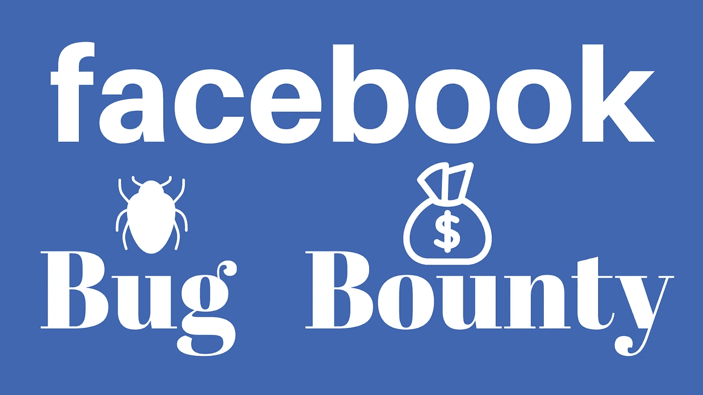
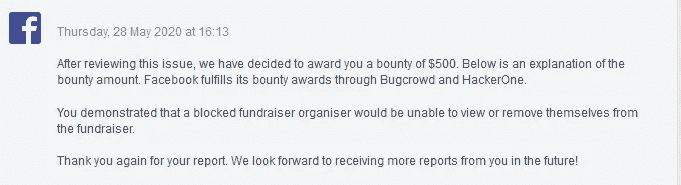

# 脸书虫赏金(500 美元) :被阻止的筹款活动组织者将无法查看或退出筹款活动。

> 原文：<https://infosecwriteups.com/facebook-bug-bounty-500-usd-a-blocked-fundraiser-organizer-would-be-unable-to-view-or-remove-5da9f86d2fa0?source=collection_archive---------1----------------------->

大家好，

这是一个简单的逻辑问题，我发现在脸书筹款功能。脸书的封锁特征导致了许多逻辑问题。这是其中之一。

我们可以为脸书的非营利组织和个人事业筹集资金。我们可以在我们创建的募捐者中添加我们的朋友作为组织者。他们需要批准我们成为组织者的邀请。一旦他们批准了邀请，攻击者就能够阻止受害者，因此受害者无法访问募捐者，并将自己作为组织者从募捐者中删除。攻击者可以利用这一点为自己谋利。

**步骤:**

1)攻击者创建一个募捐者并邀请受害者作为组织者

2)一旦受害者接受邀请，攻击者就会阻止受害者..

3)受害者现在不能访问募捐者，但是其他人仍然可以将受害者视为募捐者的组织者

脸书为此奖励了我 500 美元。

**时间线:**

2020 年 4 月 23 日:报道
2020 年 5 月 6 日:审判
2020 年 5 月 26 日:修正
2020 年 5 月 28 日:悬赏