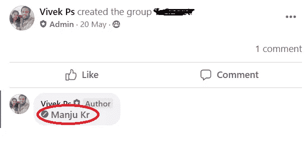
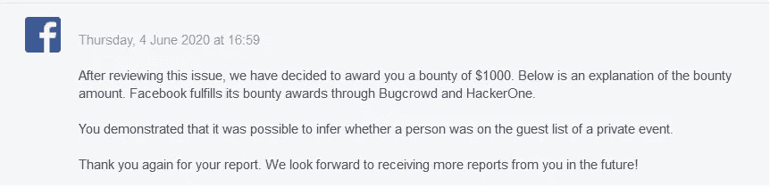

# 脸书虫赏金-寻找私人事件的隐藏成员。

> 原文：<https://infosecwriteups.com/facebook-bug-bounty-finding-the-hidden-members-of-the-private-events-977dc1784ff9?source=collection_archive---------0----------------------->

大家好，

我是维维克。这是我在脸书私人活动中发现的一个漏洞。我在今年 1 月和 2 月报告了近 7 期，但所有的报告都以信息丰富或重复而被关闭。因此，在阅读了一些报道后，我决定检查脸书事件，幸运的是，我能够在这一领域找到一些逻辑问题。

脸书事件有一个隐藏成员列表的选项，以保护用户隐私。我尝试了不同的情况，并监控了许多 web 请求，以检查是否有端点泄露了成员信息。逻辑错误都是关于观察和跳出框框思考的。我记得当一个成员不在脸书群组中时，如果我们在该群组中分享他们的个人资料 URL 作为评论或帖子，脸书会显示一个名为“WeakReference”的 CSS 类的链接，以通知成员特定用户不是该群组的成员。

我在私人活动中也做了同样的尝试，发现了类似的行为。因此，即使成员列表是隐藏的，攻击者也能够通过在任何评论中或作为新帖子共享受害者的个人资料来发现某人是否是该事件的成员。我立即向安全小组报告了此事。

脸书因为我发现了这个逻辑问题而奖励了我。

