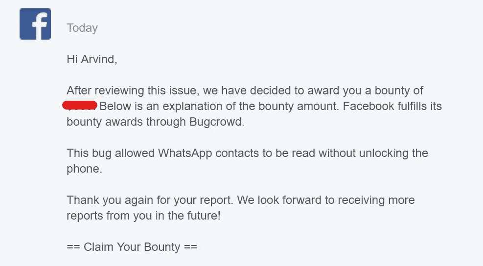

# WhatsApp Bug Bounty:无需解锁设备即可阅读联系人列表

> 原文：<https://infosecwriteups.com/facebook-bug-bounty-reading-whatsapp-contacts-list-without-unlocking-the-device-a40e9c660a42?source=collection_archive---------0----------------------->

*注:根据负责任的披露政策，这是在脸书的许可下出版的。该漏洞现已修复。*

一个漏洞允许任何拥有受害者手机的人在不打开安全锁的情况下读取设备中存储的所有联系人。

在 WhatsApp 语音/视频通话中，可以使用“添加参与者”选项将更多参与者添加到通话中(群组通话)。

我开始了一对一的语音/视频通话，并点击右上角的“添加参与者”按钮，现在它会显示所有联系人，而不会在设备锁定时提示安全锁定。

此漏洞仅在一些基于 android 的普通设备上可被利用。

## 测试设备

1.  谷歌像素(安卓 8.1)
2.  Moto g4 plus(安卓 7.0)

## 时间表

2019 年 6 月 13 日:提交报告。

2019 年 7 月 10 日:报告 Triaged。

2019 年 8 月 16 日:问题已修补，奖金已发放。

*关注* [*Infosec 报道*](https://medium.com/bugbountywriteup) *获取更多此类精彩报道。*

 [## 信息安全报道

### 收集了世界上最好的黑客的文章，主题从 bug 奖金和 CTF 到 vulnhub…

medium.com](https://medium.com/bugbountywriteup)