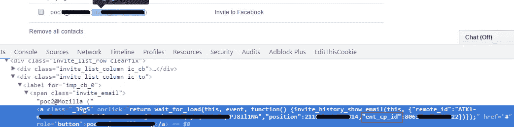
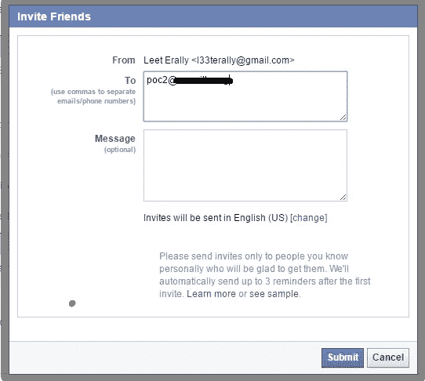

# 脸书受邀者电子邮件地址披露

> 原文：<https://infosecwriteups.com/facebook-invitees-email-address-disclosure-25059ae93725?source=collection_archive---------2----------------------->

*注:以下文章发表于 2016 年 03 月 04 日 https://FogMarks.com*

**

*[威利·斯托尔](https://de.wikipedia.org/wiki/Willy_St%C3%B6wer)画的沉船*

*当脸书还是一个只有几个成员的小公司时，它需要一种方法来吸引更多的成员。*

*今天，如果你想让更多的人访问你的网站，你可以在脸书上做广告，因为每个人都在那里。*

*当时，主要的广告选择是在热门网站上手动发布广告(比如使用谷歌)，或者让你的会员用他们的电子邮件账户邀请他们的朋友。*

# *脸书过去的邀请制度*

*当用户在早期加入脸书时，实际上没什么可看的。因此，脸书要求他们的成员使用注册用户创建的电子邮件邀请邀请他们的朋友。*

*用户提供了他朋友的电子邮件地址，他们收到了一封来自脸书的邮件，邮件中写道“X 先生现在在脸书，你也应该加入！”。*

# *有趣的部分*

*当我发现脸书的这个特点时，我立即开始分析它。*

*我觉得试着愚弄一下用户 Y 邀请他们加入会很不错，尽管做这件事的人是用户 x。*

*当我一次又一次地邀请人们时，我注意到了一些有趣的事情:每个特定电子邮件地址的邀请都包含一个邀请 ID: ent_cp_id。*

**

*当点击邀请到脸书时，弹出一个小窗口，显示被邀请者的完整电子邮件地址。*

**

*我写下了某个我想邀请的邮件的 ent_cp_id，邀请了他一次。*

*此时我想:“好吧，我已经邀请了这个用户，他的 ent_cp_id 应该不能再访问了”。但我错了。它的 ent_cp_id 仍然在那里。事实上，通过简单地重新发送 HTTP 请求，我可以再次邀请同一个用户。*

*但是这个漏洞最有趣的部分是，任何用户都可以看到 ent_cp_id 后面的电子邮件地址。*

*这意味着任何通过电子邮件被邀请到脸书的人都容易受到电子邮件地址泄露的影响，因为该邀请从未被删除过**并且任何用户都可以访问到它。攻击者接下来要做的就是随机猜测 ent_cp_ids。我说过，旧的 ent _ cp _ ids 不删除，所以成功率很高。***

# *结论*

*当你处理像电子邮件地址这样的敏感信息时，你应该总是限制一个动作被执行的次数。此外，建议删除任何可能与敏感信息相关联的 id，或者至少对其进行哈希保护。*

*脸书很快解决了这个问题，并给了一笔丰厚的奖金。*