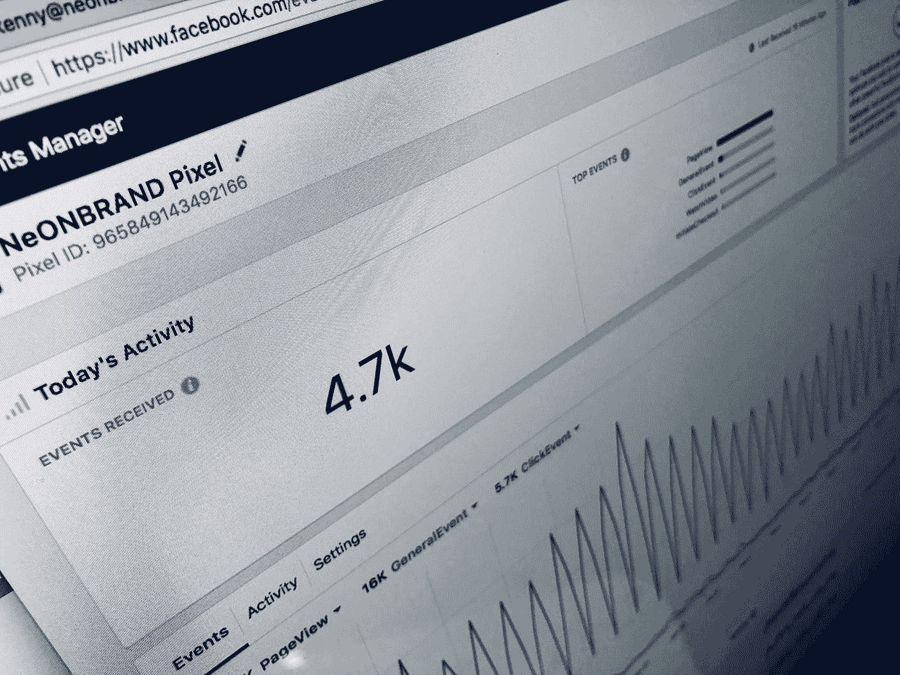
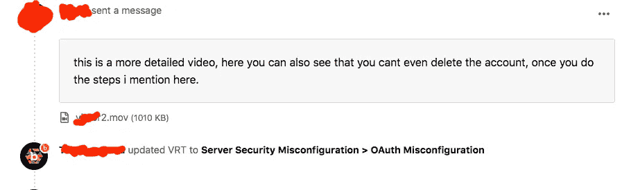
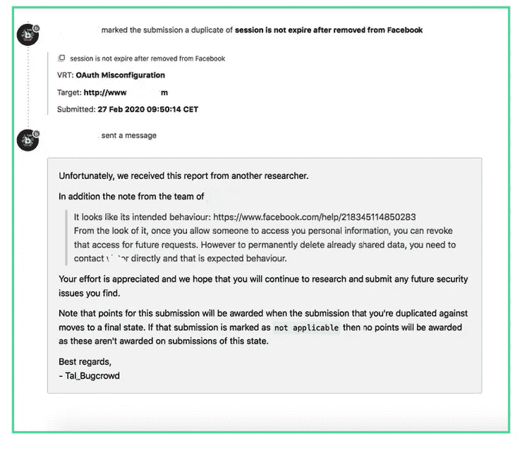

# 脸书 OAuth 2.0 错误配置

> 原文：<https://infosecwriteups.com/facebook-oauth-2-0-misconfiguration-c41574272d90?source=collection_archive---------1----------------------->

## 测试 vuln.com 的授权流时，我找到了一个

在 [Unsplash](https://unsplash.com?utm_source=medium&utm_medium=referral) 上 [NeONBRAND](https://unsplash.com/@neonbrand?utm_source=medium&utm_medium=referral) 拍摄的照片

## 介绍

如果你一直在关注我的网络安全文章，你就会知道我不喜欢在脸书上搜寻，但他们的错误时不时地会妨碍我。尤其是这一个，是其中的一个漏洞。

## OAuth 是什么？

OAuth 是一个常用的授权框架，它允许网站和 web 应用程序请求对另一个应用程序(在本例中是脸书)上的用户帐户进行有限的访问。在不向请求应用程序公开登录凭据的情况下授予访问权限。用户可以决定共享的数据量，而不是将他们的帐户完全交给第三方应用程序控制。应用程序可能会使用 *OAuth* 来请求访问你的电子邮件联系人列表，并使用它来推荐联系人。但是，这种相同的机制可用于提供第三方应用程序认证服务，允许用户使用他们在不同网站拥有的帐户登录。

> 注意:
> 
> OAuth 2.0 是当前的标准，一些网站仍然使用遗留版本 1。OAuth 2.0 是从零开始写的，而不是从 OAuth v1 开始写的。因此，他们是非常不同的。

## **OAuth 错误配置**

浏览网页时，您几乎肯定会遇到允许您使用脸书帐户登录的网站。大多数时候，这个特性是使用 OAuth 2.0 框架构建的。这个框架让 *Bug 猎人*非常感兴趣，因为它天生容易出现实现错误。这可能导致几个漏洞，使得猎人能够获得敏感的用户数据或绕过身份验证。

## Vuln.com

在测试了这个网站上的几乎所有东西后，我在*vuln.com*上发现了一个 OAuth 错误配置，下面是如何重现它。

**步骤:**
**1 .**使用您的脸书个人帐户选项登录*Vuln.com*。

**2。在脸书控制应用程序面板中**打开你的脸书账户>进入设置>删除并撤销对*Vuln.com*的任何权限。

**3。**此时，您的版块应该会立即从您的*Vuln.com*账户中注销(但对于*Vuln.com*来说，情况并非如此)
从您的脸书账户中删除该应用程序后，您仍然可以使用*Vuln.com*，甚至可以修改该个人资料中的任何信息

## 报告漏洞 1.0

在我提交了报告的第一部分后，我也在下面找到了这一部分。

## 报告漏洞 2.0

几个星期过去了，我等待着回应，但令我惊讶的是，这就是结果和我的运气，我收藏的许多作品中的一个**复制品**。

## 结论

我想指出的是，我发现这个 bug 只是出于运气。在测试应用程序的任何漏洞，并放弃测试一个新的。我不想让它呆在那里，只是访问我的脸书账户数据。撤销该应用后，我注意到该应用仍然可以访问我的脸书账户，这就是我提交报告的原因。从步骤可以看出，这是一个非常容易的发现。试试吧，你永远不知道。