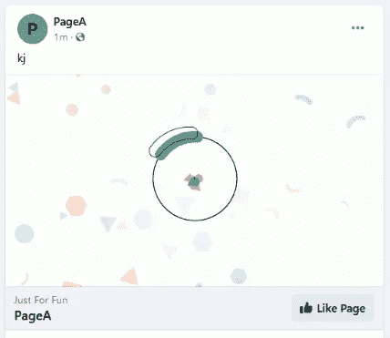
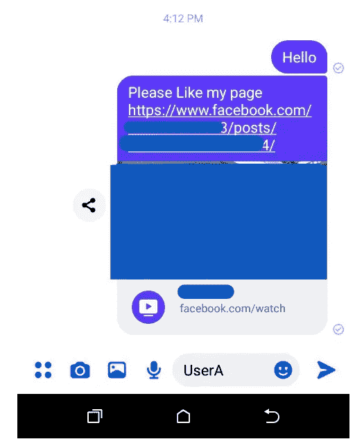
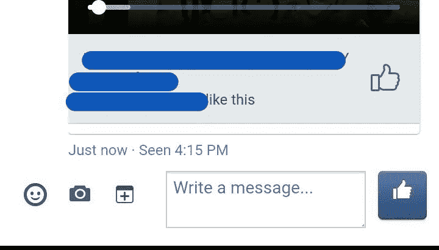
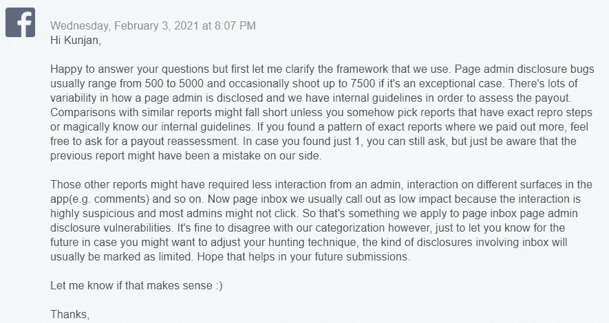
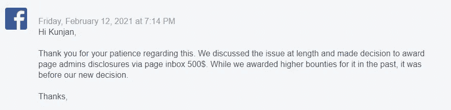

# 脸书页面管理披露

> 原文：<https://infosecwriteups.com/facebook-page-admin-disclosure-7d8893a4a674?source=collection_archive---------2----------------------->

大家好 *大家好，我是来自尼泊尔的 kunjan Nayak，这篇文章是关于在脸书发现的一个安全漏洞，当我使用 FB4A* ***(安卓系统的脸书)*** *的页面收件箱喜欢一个 FB 页面时，操作总是以页面管理员的个人 id 进行，暴露了页面管理员的身份，而不是页面管理员的*。问题已经*解决，并根据负责任的披露政策发布。*

# 方案

一个页面帖子，是使用“提升你的页面”功能通过视频创建的，与这个 [***帖子***](https://www.facebook.com/119405895873/posts/10158670033715874/) ***完全相似。*** 滥用此类帖子，恶意用户可以利用这一点，创建此类帖子，并通过包含“喜欢”按钮的私人消息将帖子共享到受害者页面，以便从受害者管理员那里获得页面喜欢，从而暴露他们的身份。

当帖子链接被发送到受害者页面收件箱，并且附件用 FB4A 应用程序打开时，可以选择通过页面收件箱内链接预览中出现的页面“ **like** ”按钮来喜欢攻击者页面，这导致了一个安全漏洞，当点击 Like 按钮时，操作是以页面管理员个人语音而不是页面的形式完成的，因此该页面是从暴露管理员身份的管理员个人配置文件中喜欢的。尽管管理员在默认情况下在页面收件箱中作为页面进行交互。

**什么是链接预览？**

链接预览比普通的 URL 更吸引眼球，更容易点击——通过为链接提供图像、标题、描述等，为人们提供特定的信息，让他们想点击。

# 影响

页面收件箱中的嵌入式 like 按钮在点击时使用页面管理员的个人语音，向发送者透露他们的身份。

设置
===
页面 a 的用户管理员

PageB 的 UserB 管理员使用 FB4A 应用程序管理页面消息。

**再现步骤:**

用户 a 通过私人消息共享一个包含类似按钮页面的帖子链接到 PageB。

2.用户 b 在他的页面收件箱中收到链接，通过使用 FB4A 应用程序或 FB android/iOS 移动版的页面收件箱打开附件，他可以在链接预览中看到一个“喜欢”按钮。

3.PageB 决定喜欢该页面，并单击页面“喜欢”按钮，但无意中该操作是作为管理员个人 ID 而不是页面 ID 完成的，这会泄露管理员身份。

4.一个管理员打开他的页面收件箱来喜欢这个页面，但是这个页面是使用管理员的个人 ID 来喜欢的，暴露了页面管理员的身份。

# 时间表

2021 年 2 月 1 日:报告已发送。

2021 年 2 月 11 日:预审。

2021 年 2 月 11 日:分庭。

2021 年 3 月 4 日:修复。

2021 年 3 月 9 日:赏金奖励$xxx。

我使用相同的概念多次绕过这个问题，并获得了额外的奖金，即两次绕过获得$xxx +$xxx，总共四位数的 **$xxxx** 奖励。

此外，在第三次绕过之后，我仍然可以绕过补丁，因为我已经确定了三个新的绕过来重现这个问题，但其中一个在 FB 内部工作中重复了，因为团队试图将此作为部分整体修复来修复。

最后，我无法报告其余的绕过，因为在多次绕过之后，团队应用了一个**长期修复**，链接预览功能从 FB4A 页面收件箱中被永久禁用，因为链接预览是这个问题的主要原因，现在每当帖子或链接被共享到页面收件箱时，链接预览就不会出现在 FB4A 或 FB(m.facebook.com)页面收件箱的移动版本中。

然而，这是非常令人失望的，我当时很倒霉，因为这份报告与这份" [**报告"**](https://servicenger.com/blog/mobile/facebook-page-admin-disclosure/) 完全相似，具有相同的概念。过去获得了更高的奖金，但是 FB 在这种问题上改变了他们的支付决定，其中包括一个管理员披露的页面收件箱，这就是为什么我获得了更低的支付。

要求对此做出合理的**解释**。

要求通过参考过去报告的完全相似的报告来重新评估支出。

但是根据 FB 政策"*我们寻求为类似的问题支付类似的金额，但是奖金金额和资格问题可能会随着时间而变化。过去的回报并不一定保证将来会有类似的结果。*

**类似的报告**

[https://service nger . com/blog/mobile/Facebook-page-admin-disclosure/](https://servicenger.com/blog/mobile/facebook-page-admin-disclosure/)

FB 回答说:“*关于另一个链接的报道(*过去的报道*)，那个是很久以前的，所以不会适用，因为我们在*之间已经改变了立场”。在这之后，我离开了这份报告，继续前进！！！。

一会儿见；)在下一篇文章中，我在脸书的第一个有效错误仍然没有被修复。

可以联系我****[t**维特**](https://twitter.com/kunjannayak5) **:)******