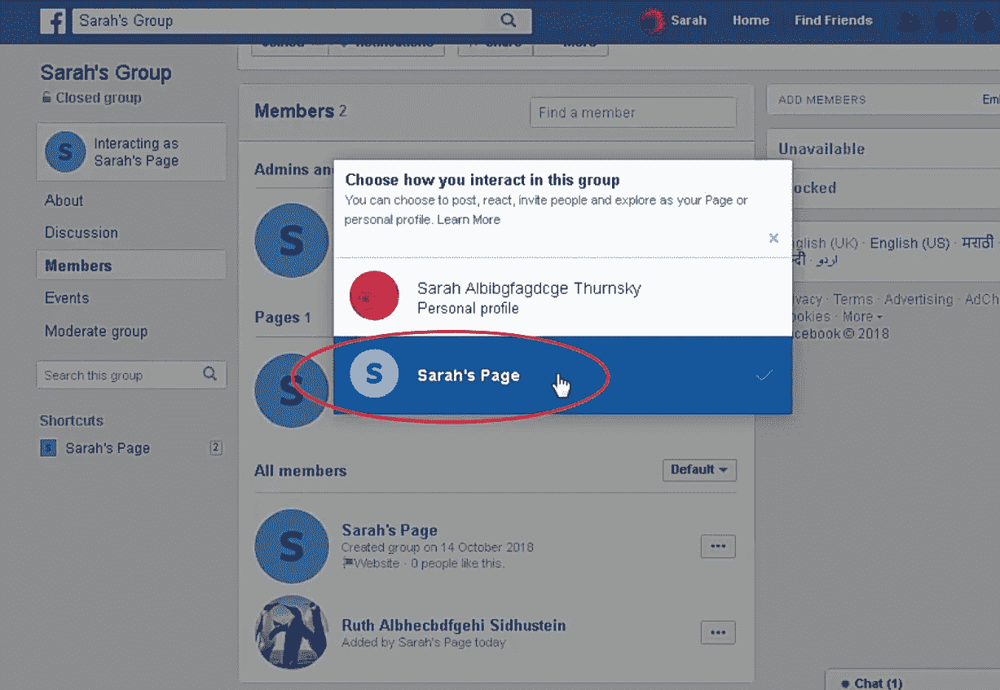
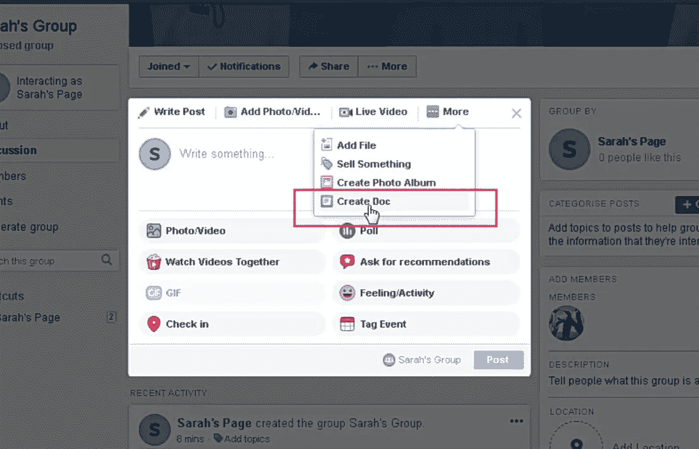
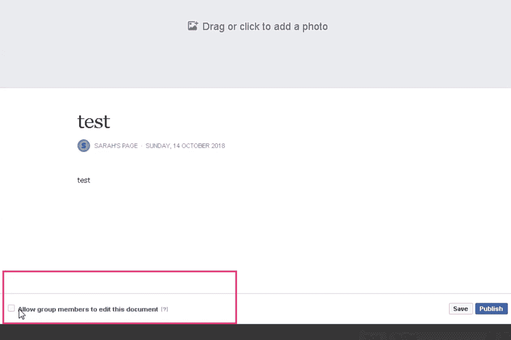
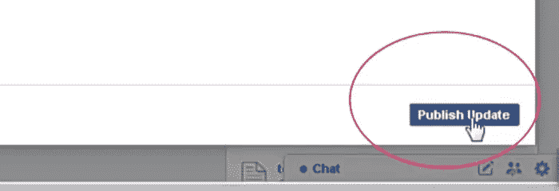
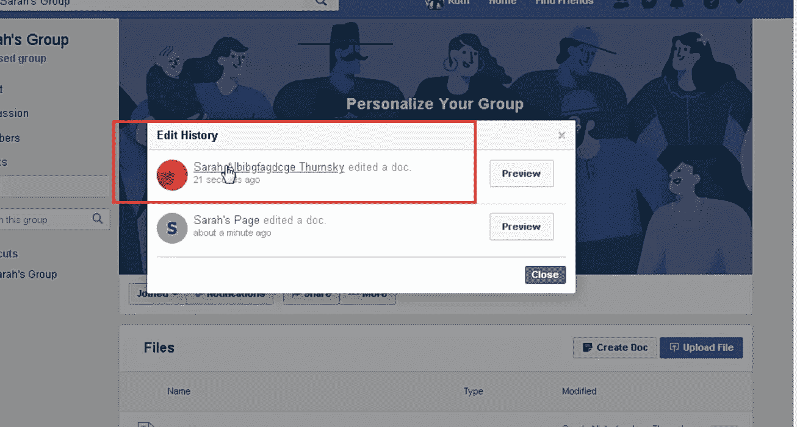
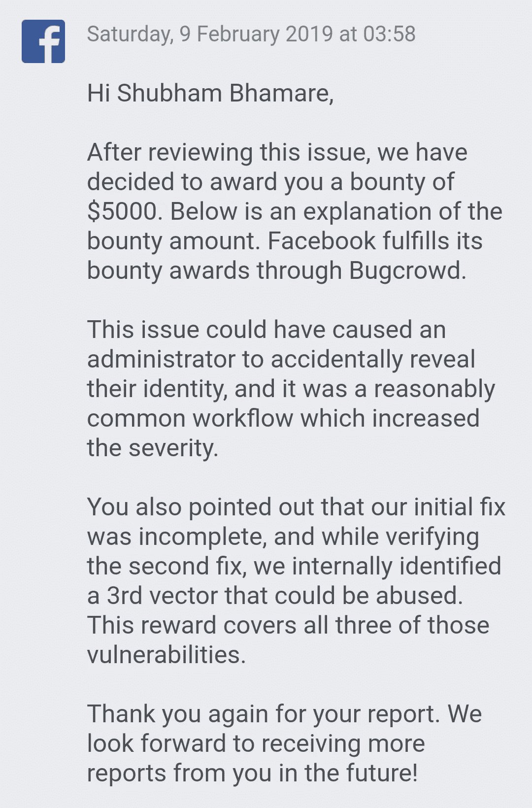

# [写]脸书页面管理披露“创建文件”按钮(奖金:5000 美元)

> 原文：<https://infosecwriteups.com/facebook-page-admin-disclosure-by-create-doc-button-bounty-5000-usd-2fd1ff615bf8?source=collection_archive---------0----------------------->

嗨，伙计们，又是舒巴姆·巴玛雷。在这篇文章中，我将告诉你我在脸书发现的第二个有效的 bug。这个问题可能是通过“创建文档”按钮意外泄露了脸书页面管理员的身份。这对我来说是一个非常特别的发现，因为我因为这篇报道获得的奖金超出了我的预期。😃

所以不浪费时间，让我们开始吧！👉

===

**设置和场景:**

1)脸书用户 Sarah 是 Sarah 页面的管理员。

2) Sarah 的页面链接到 Sarah 的组。

3) Sarah 没有让自己成为该组的管理员，因为她不想公开自己的身份。

4)现在很明显，Sarah 的组只有一个管理员，即 Sarah 的页面。莎拉只是那群人中的一员，总是充当听差。

===

**复制步骤:**

1)使用脸书网站，充当莎拉的页面，使用“创建文档”按钮在莎拉的组中创建文档。

2)在发布该文档之前，取消选中“允许组成员编辑该文档”选项。以便只有文档所有者或管理员能够编辑该文档。

3)现在充当 Sarah 的页面，编辑并保存该文档。

4)现在，如果我们看到该文档的版本历史，将会有 Sarah 的名字。

===

**背后的逻辑:**

其他组成员很容易确定谁是该页面的管理员，因为只有文档所有者或管理员能够编辑该文档。尽管编辑历史中无意中出现了莎拉的名字。

===

**修复和绕过:**

当团队为文章编辑器中的“创建文档”按钮修复这个问题时，我发现在“文件”页面上有另一个类似的按钮也容易受到攻击。

当团队验证第二个修正时，他们在内部发现了第三个也可能被滥用的向量。

===

**赏金:**

5000 美元(该奖励涵盖所有这三个漏洞。这就是为什么我最喜欢脸书虫赏金。💙)

===

**时间线:**

> 2018 年 10 月 13 日:发送报告
> 2018 年 10 月 17 日:预审
> 2018 年 10 月 17 日:预审
> 2018 年 10 月 17 日:发送关于另一个易受攻击的“创建文档”按钮的附加信息
> 2019 年 2 月 9 日:完全修复
> 2019 年 2 月 9 日:奖励 5000 美元

===

**外卖:**

1)不要透露你的发现，直到你完全相信它不会有任何旁路。😉检查其他端点/功能是否存在类似问题。

2)有时候你只需要逻辑思维，而不需要什么高级的工具或者知识。因为逻辑==魔术。😊

3)同样，如果你是第一次接触脸书 bug bounty，试着最大限度地找到逻辑错误。

===

谢谢你的阅读！请继续关注我的下一篇文章，不要忘记关注我在 [**【脸书】**](http://facebook.com/theshubh77) 、 [**Twitter**](http://twitter.com/theshubh77) 、[、 **Instagram** 、](http://instagram.com/theshubh77)和[**media**、](http://theshubh77.medium.com)。😊

===

## 来自信息安全写道:每天信息安全中都会出现很多难以跟上的事情。[加入我们的每周时事通讯](https://weekly.infosecwriteups.com/)吧，通过 5 篇文章、4 个帖子、3 个视频、2 个 GitHub Repos 和工具以及 1 个免费工作提醒，了解所有最新的信息安全趋势！