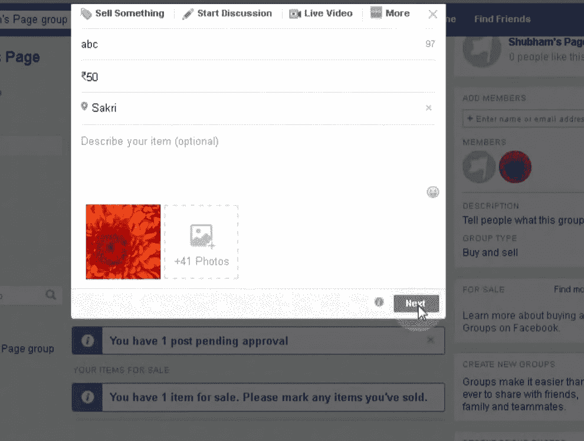
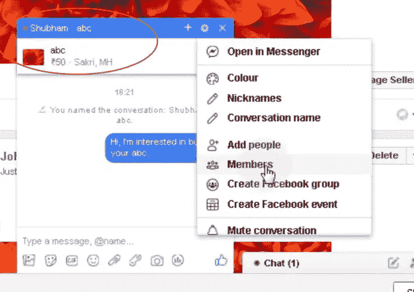
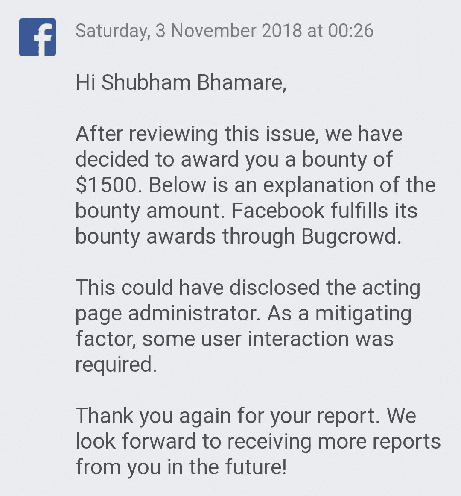

# 脸书页面管理披露“消息卖方”按钮(赏金:1500 美元)

> 原文：<https://infosecwriteups.com/facebook-page-admin-disclosure-by-message-seller-button-bounty-1500-usd-caaa2eac4121?source=collection_archive---------1----------------------->

大家好，我是来自印度马哈拉施特拉邦的舒巴姆·巴马雷。正如我在以前的文章中承诺的，这是我的第一篇关于脸书虫赏金的文章。终于！😂

我知道现在发表这篇文章已经太晚了，因为这个错误在 2018 年被发现并得到了奖励。对此我非常抱歉。无论如何，在接下来的几天里，我也将发表我所有的其他发现。

所以不浪费时间，让我们开始吧！👉

===

**描述:**

在某些情况下，此问题可能会意外泄露脸书页面管理员的身份。

在脸书，页面管理员的角色是保密的。泄露页面管理员的身份可能会导致严重的隐私问题。在这种情况下，在某些情况下可能会泄露页面管理员的身份。

===

**设置:**

2 名脸书用户，即 Shubham 和 John

1 脸书页面，即舒巴姆页面

1 脸书集团，即舒巴姆的页面组

平台:[脸书网](https://www.facebook.com)

===

**场景:**

如上所述，有两个脸书用户，即 Shubham 和 John。

Shubham 是 Shubham 页面的管理员。

Shubham 的页面链接到 Shubham 的页面组，这是一个购物组。此群组的张贴核准已开启。

约翰是该组织的成员。

Shubham 没有让自己成为一个组的管理员，因为他不想公开自己的身份。

因此，现在该组只有一个管理员，即 Shubham 的页面。

Shubham 只是那个群体中的一员，一直充当着听差的角色。

===

**复制步骤:**

1)根据 John 的帐户，在小组中创建一个销售帖子。

2)帖子将被发送给管理员进行审批。

3)现在从 Shubham 的账号(充当页面)，点击上面未批准帖子底部的“消息卖家”按钮，发送消息。

4)消息将从 Shubham 的个人资料而不是页面发送，这是无意的。

===

**背后的逻辑:**

John 很容易确定谁是这个页面的管理员，因为只有一个组管理员(Shubham 的页面)可以看到这个未经批准的帖子。

===

**修复:**

该团队通过移除充当页面时的“消息销售者”按钮修复了此问题。

===

**旁路:**

我发现修复是不完整的，因为这个问题仍然在旧的未批准的职位上工作。

===

**赏金:**

1500 美元

===

**时间线:**

> 2018 年 9 月 09 日:发送报告
> 2018 年 9 月 11 日:预审
> 2018 年 9 月 12 日:预审
> 2018 年 10 月 13 日:修复
> 2018 年 10 月 13 日:修复绕过
> 2018 年 10 月 23 日:完全修复
> 2018 年 11 月 03 日:奖励 1500 美元

===

**外卖:**

1)如果你是第一次接触脸书 bug bounty，试着找到最符合逻辑的 bug。

2)总是想办法找个旁路。

===

感谢您的阅读！我的下一篇文章将是关于我在脸书的第二只虫子(奖金:5000 美元)。所以敬请关注，别忘了关注我的 [**【脸书】**](http://facebook.com/theshubh77)[**Twitter**](http://twitter.com/theshubh77)[**insta gram**](http://instagram.com/theshubh77)[**Medium**](http://theshubh77.medium.com)。😊

===

## 来自 Infosec 的报道:Infosec 每天都有很多内容，很难跟上。[加入我们的每周简讯](https://weekly.infosecwriteups.com/)以 5 篇文章、4 个线程、3 个视频、2 个 GitHub Repos 和工具以及 1 个工作提醒的形式免费获取所有最新的 Infosec 趋势！