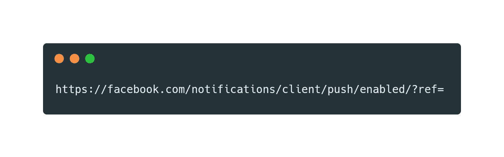
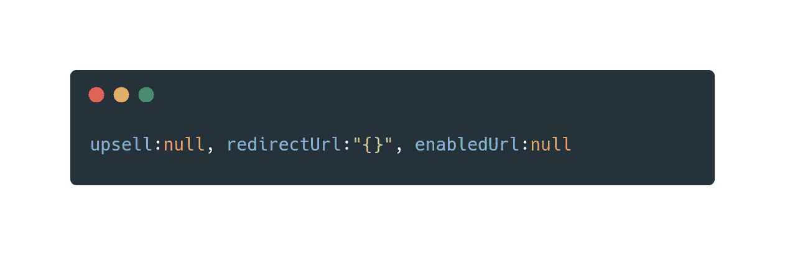
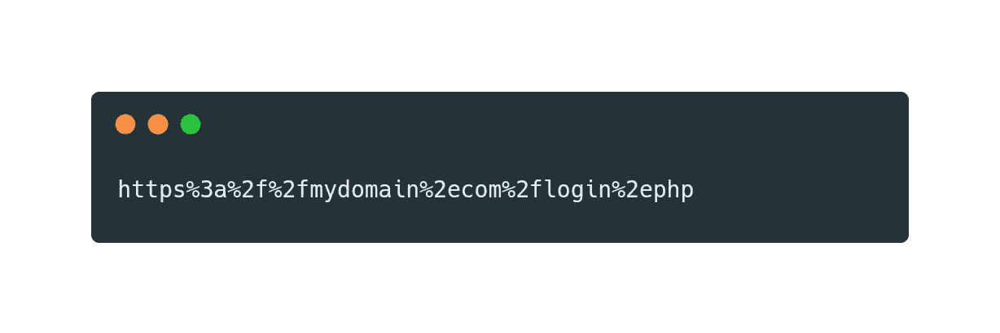
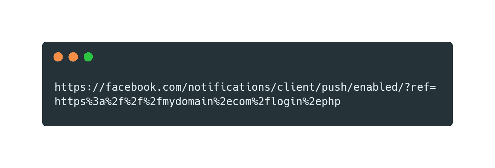
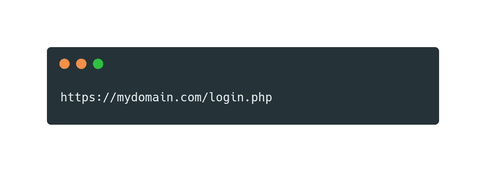
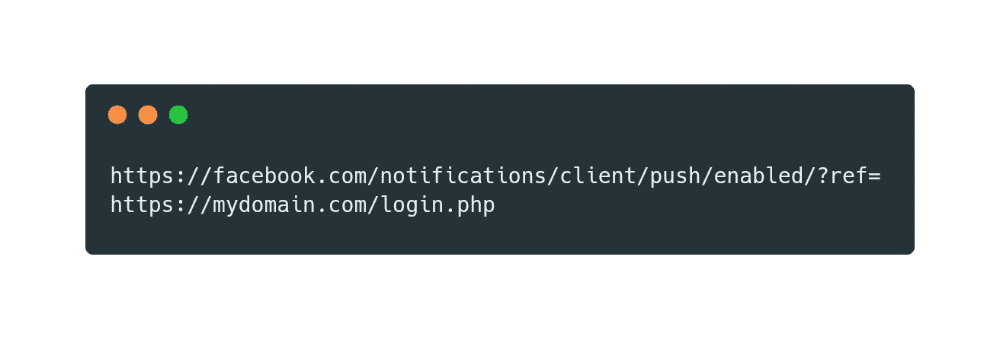
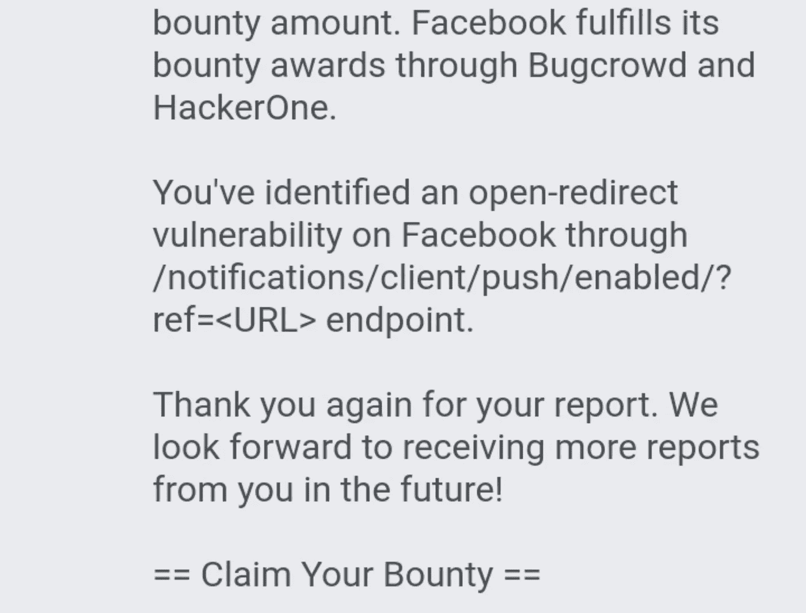

# 脸书推送通知链接绕过

> 原文：<https://infosecwriteups.com/facebook-push-notification-linkshim-bypassed-385fe471516?source=collection_archive---------0----------------------->

在浏览和查找 facebook 漏洞时，我意外发现了这个 facebook 推送通知链接

当我访问 facebook 链接时，奇怪的是整个 facebook 页面都是空白的，这里什么也没有，嗯，所以我查看源代码并阅读它进行分析

【JavaScript 代码片段

通过在端点参数中添加链接，redirectUrl 容易受到 open redirect 的攻击，因此我快速检查 Url 是否有端点参数和 yes。

我在端点参数上加我的网站**？但是什么也没发生，嗯，所以我试着用 url 编码绕过它**

但是仍然没有反应，然后我在网址上添加了更多的%2f

然后 Boomm 的 facebook 页面重定向到我的网站

虽然我试图执行 xss，但它已经被十六进制编码过滤，我的知识不足以绕过十六进制过滤器。

# 什么是 Linkshim

每次点击网站上的链接时，该链接都会检查针对脸书的 URL 是否有自己的内部恶意链接列表，以及众多外部合作伙伴的列表，包括 McAfee、Google、Web of Trust 和 Websense。如果脸书检测到一个 URL 是恶意的，脸书会在浏览器真正请求可疑页面之前显示一个间隙页面。

点击此链接阅读完整解释:[www.facebook.com](https://www.facebook.com/10150492832835766)

**设置**

*   用户 UserOne

**再现步骤**

*   从任何 web 浏览器以用户身份登录，然后转到

*   现在在参数端点上插入网站，结果如下所示

*   添加更多斜杠/然后将网站 url 编码为 url 编码并插入到端点参数中

*   点击进入它将重定向到 www.mydomain.com/login.php linkshim 最后绕过。

# 披露时间表

*   2020 年 9 月 22 日——我在 facebook whitehat 页面报告了这个漏洞问题。
*   2020 年 9 月 23 日–脸书团队重现并调查了该漏洞问题。
*   2020 年 9 月 28 日–我提供了关于此漏洞问题的更多详细信息。
*   2020 年 10 月 8 日–漏洞问题已得到修补。
*   2020 年 10 月 21 日——悬赏奖金。

感谢阅读这篇文章，我希望你们今天能学到一些新东西。请分享这篇文章来传播知识。

别忘了通过 [LinkedIn](https://linkedin.com/in/nmochea) 和 [Twitter](https://twitter.com/nmochea) 关注和联系我。