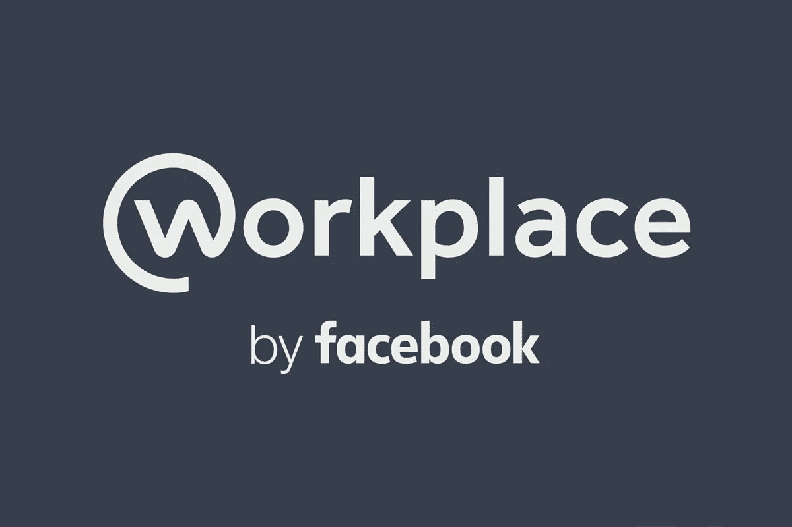

# 将帖子隐私更改为公开的脸书工作场所权限提升漏洞

> 原文：<https://infosecwriteups.com/facebook-workplace-privilege-escalation-vulnerability-to-change-the-post-privacy-as-public-634f1c995780?source=collection_archive---------1----------------------->

嗨，大家好，我是古汉·拉贾

这篇博客是关于我如何在**脸书工作场所**发现一个**权限提升漏洞**

我测试了**脸书**域名很长时间，得到了一些肉肉的 bug。我向他们的安全小组报告了这一切。有些 bug 被标记为重复的，有些是信息性的。我感到沮丧，并决定尝试他们的子域。我搬到了**脸书的工作场所**

在浏览了脸书的工作场所后，我知道我不能公开发表任何东西。**脸书**与**职场**相似，所以我复制了我在脸书的帖子的编辑隐私 URL，将 **"m.facebook.com"** 替换为**" Workplace . m . Facebook . com "****"故事 id "****"个人资料 id"** 参数值替换为**职场** **帖子** **"故事 id"** 点击公开，然后我检查了工作场所的职位

呜…帖子的隐私被公开了

向脸书安全团队报告了这个问题，我获得了 500 美元的奖励

**概念验证视频:**

举报-2018 年 5 月 26 日
审判-2018 年 7 月 16 日
奖励-2019 年 7 月 31 日
固定-2019 年 8 月 6 日

*关注* [*Infosec 报道*](https://medium.com/bugbountywriteup) *获取更多此类精彩报道。*

 [## 信息安全报道

### 收集了世界上最好的黑客的文章，主题从 bug 奖金和 CTF 到 vulnhub…

medium.com](https://medium.com/bugbountywriteup)