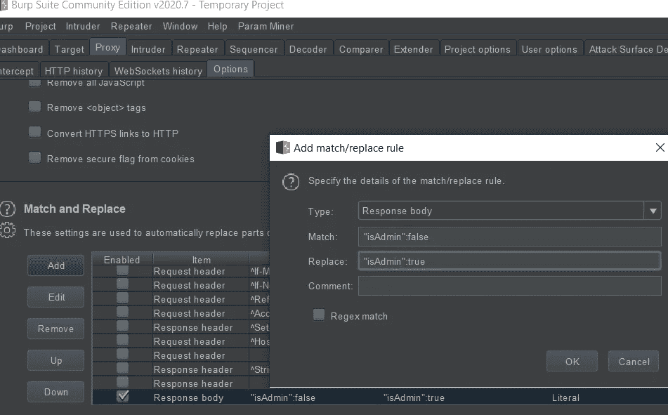

# 错误 2 真实、匹配和替换捕虫——一个警示故事

> 原文：<https://infosecwriteups.com/false2true-match-and-replace-bug-hunting-a-cautionary-tale-fbe7020f02ad?source=collection_archive---------1----------------------->

假阳性是所有事情的祸根。科学家必须处理它，圣灵降临者和昆虫赏金猎人也是如此。不同之处在于，作为一个虫子赏金猎人，如果某个东西是假阳性的，而你已经花了几个小时在它上面，你只是被烧伤了。不过，你已经积累了一些经验。那一定有意义。

无论哪种方式，如果你真的很重视 bug 搜索，或者一般意义上的黑客，你必须了解最新的攻击、新技巧和技巧等。但是，由于这些攻击对您来说是新的，这意味着您可能没有意识到这些攻击中的潜在陷阱。

**假 2 真:**

当我第一次听说这件事的时候，我真是大吃一惊。这是让我开始走上这条路的[链接](https://www.jonbottarini.com/2019/06/17/using-burp-suite-match-and-replace-settings-to-escalate-your-user-privileges-and-find-hidden-features)。

基本思想是留意请求的响应位(我更喜欢 POST 请求的响应，而不是 GET)，并注意显示“is admin”:false，“staff”:false，“user level”:basic 等的位置。你明白了。基本上是实验。

攻击是在 burp 中使用 Match & Replace(您也不需要 pro 版本)并添加如下规则:

然后刷新页面，看看你是否会看到一些额外的选项，文本，按钮，任何之前没有的东西。你可以在没有通过 burp 代理的浏览器中打开同一个页面，以相同的用户身份登录，并与通过 burp 代理的浏览器进行比较。然后玩:发现区别:)

起初，我没有太多的运气找到它。没什么。但是后来…

**管理员访问旁路:**

有那么一会儿，这真是一场激动人心的过山车。然后——崩溃。

该网站有一个对/index.html 的请求，当我跟踪 burp 历史时，在加载 javascript 文件之前，又有一个对/userinfo.json 的请求。

Userinfo.json 看起来像这样:

{"canEditUsername":true，" canUploadFiles":true，" isStaff":false，" isAdmin":false，" I user ":true }

我想你能明白我的意思。如果在响应中将“is admin”:false 更改为“is admin”:true 会怎么样？管理员访问已启用。

显然，当我能够访问显示网站页面列表的页面，并且添加/编辑/删除存在时，我立即写了一份报告并提交了它，期待荣耀:)

**有管理员权限，但没有管理员权限？**

我很快得到了回应，这是只读访问。它缺乏任何真正严重的影响，因此我得到了非常有限的奖金。

**仰角？可能，但仅在某些情况下:**

故事本可以早一段结束，但我认为这是一件需要指出的重要事情——总是试图提升所发现的 bug 的影响。即使一开始看起来不怎么样，你得到了你的赏金，案子结了，是时候继续前进了。停下来想一想。

现在，因为你报告了错误，压力消失了，你得到了奖金，不管奖金有多小，带着放松的心态再看一眼。也许你因为最初的兴奋错过了一些东西。但是，你现在很冷静。

考虑到这一点，我决定再看一看。我就是摆脱不了这种感觉，那就是一定有更多的东西，但在过山车的过程中，我太盲目了，没有注意到这一点。

事实证明，在注册过程中，任何用户都可以指定现有公司的名称。但是，作为一个用户，当你从你的指示板进入这个特定公司的页面时，你只能得到非常有限的信息(我为这样一个模糊的解释道歉，但是我尊重 bbp 的披露政策。)

因此，当我实现了管理访问时，我没有去那些页面，我专注于管理仪表板按钮，编辑页面，这些明显敏感的东西。我冷静下来，将 Match & Replace 设置为“isAdmin”:再次为真，我想让我们看看还有什么。

幸运的是，我并不担心受影响的公司需要多长时间来修复它，因为之前有过与他们打交道的经历。我知道我会有更多的时间来玩它。而且，令我惊讶的是，我注意到用“is admin”:true 访问该公司的页面会透露一些看似有趣的信息。

我将这一点添加到我的原始报告中，很快我就获得了一笔可观的奖金，因为他们一致认为，所讨论的有趣信息不是他们希望其他人可以访问的东西(顺便说一句，它不像用户名/密码等任何东西。，这更像是商业方面的事情)。

亚伯——永远保持高昂的情绪:)好的。它听起来不像 ABC 那么酷，但也差不多了。