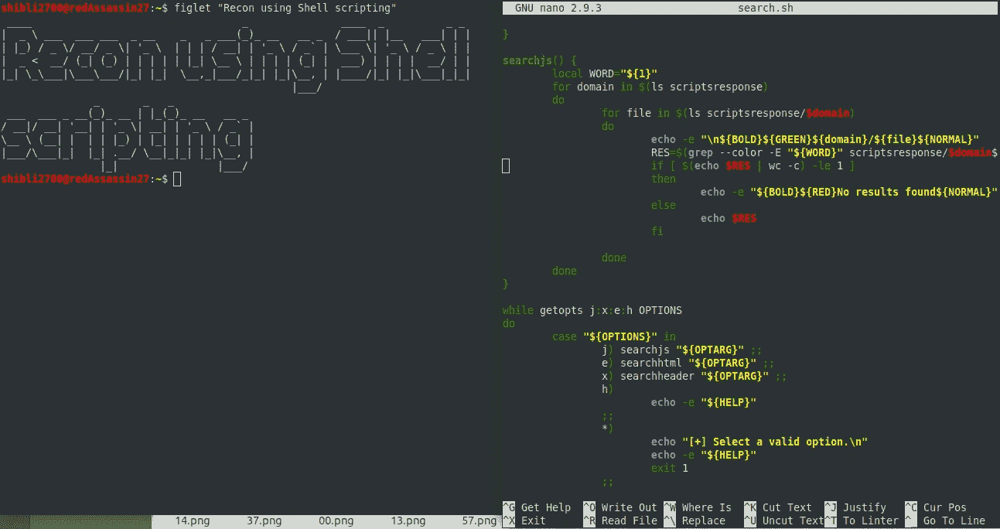
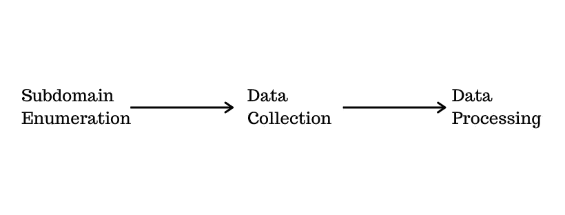
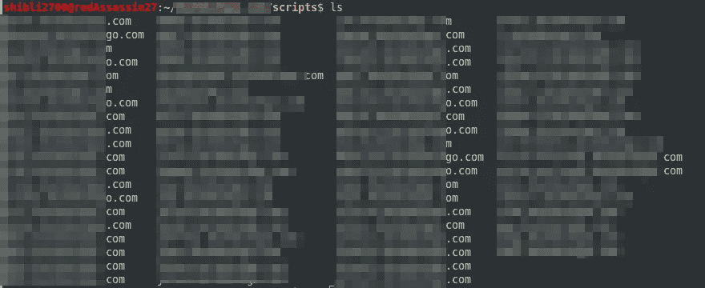
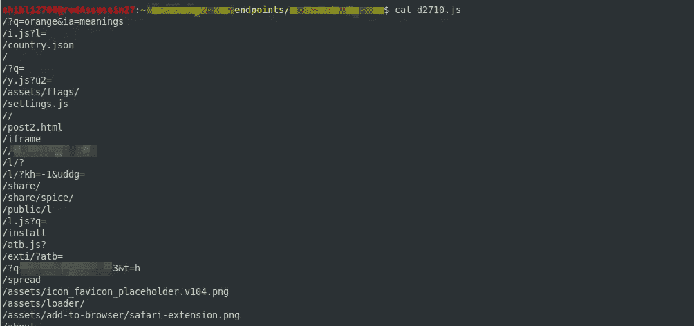

# 使用 Shell 脚本加速您的侦察过程

> 原文：<https://infosecwriteups.com/fasten-your-recon-process-using-shell-scripting-359800905d2a?source=collection_archive---------0----------------------->

> 许多新黑客没有利用自动化的力量，但一旦你习惯了，就没有回头路了。



使用 shell 脚本进行侦察

当你入侵一个系统时，侦察是很重要的一部分，因为它让你了解这个系统，以及当你入侵时你能覆盖多少区域，有时你仅仅通过侦察就能发现很多很酷的漏洞，例如

*   敏感信息泄露。
*   打开 S3 桶。
*   子域接管。
*   错误应用程序的使用。

所以做侦察不仅能给你提供一堆重要的数据，还能帮助你找到 T2 的快速漏洞。在本文中，我们将介绍一些我在侦察时使用的自动化技术，它不仅节省时间，还能让我清楚地了解系统的所有部分。

## 入门指南

在我们开始之前，我建议您了解以下主题的基本知识:

*   了解[基本 Linux 命令](https://maker.pro/linux/tutorial/basic-linux-commands-for-beginners)和 [Shell 脚本](https://www.guru99.com/introduction-to-shell-scripting.html)。
*   基本网络知识和对[客户端-服务器架构](https://www.techopedia.com/definition/438/clientserver-architecture)的理解。
*   了解不同的协议 http，ftp，ssh 等。

## 方法

我们将按照下面的方法进行侦察。



侦察接近

*   子域枚举——我们将看到如何自动化我们的子域枚举过程，并能收集尽可能多的域。
*   数据收集—此阶段将重点收集关于主机的不同类型的数据，例如开放端口、JS 文件、技术、标头响应等。
*   数据处理——在这个阶段，我们将尝试从收集的数据中抓取不同的资产，并将看到一些快速查找 bug 的技术。

# 子域枚举

有很多工具可用于子域枚举，下面列出了我使用的一个

*   子列表 3r—[https://github.com/aboul3la/Sublist3r](https://github.com/aboul3la/Sublist3r)
*   由[汤姆诺姆](https://medium.com/u/6dadd1681332?source=post_page-----359800905d2a--------------------------------)https://github.com/tomnomnom/assetfinder[找到的资产](https://github.com/tomnomnom/assetfinder)
*   谷歌呆子——玩谷歌呆子的时候，最好是手动操作。
*   GitHub——有时 GitHub 也会公开一些组织内部使用的子域。
*   [crt.sh](https://crt.sh) —它允许你使用通配符，这个工具将帮助你识别一个组织的域结构。

单独使用上述所有工具将花费大量时间，并且收集的数据需要正确格式化以便进一步处理。因此，让我们消除所有的麻烦，并尝试自动化我们的子域枚举过程。

在我们开始编写脚本之前，确保您已经在您的机器上下载并安装了 [**子列表 3r**](https://github.com/aboul3la/Sublist3r) 、 [**Assetfinder**](https://github.com/tomnomnom/assetfinder) 和[**http probe**](https://github.com/tomnomnom/httprobe)。

```
##!/bin/bash#starting sublist3rsublist3r -d $1 -v -o domains.txt#running assetfinder~/go/bin/assetfinder --subs-only $1 | tee -a domains.txt#removing duplicate entriessort -u domains.txt -o domains.txt#checking for alive domainsecho "\n\n[+] Checking for alive domains..\n"
cat domains.txt | ~/go/bin/httprobe | tee -a alive.txt#formatting the data to jsoncat alive.txt | python -c "import sys; import json; print (json.dumps({'domains':list(sys.stdin)}))" > alive.jsoncat domains.txt | python -c "import sys; import json; print (json.dumps({'domains':list(sys.stdin)}))" > domains.json
```

在上面的脚本中，我们使用了 [**Sublist3r**](https://github.com/aboul3la/Sublist3r) 和 [**Assetfinder**](https://github.com/tomnomnom/assetfinder) 进行子域枚举，然后使用 **sort** 删除重复的条目。我们在上面的脚本中增加了一个步骤来检查实际上有多少个域是活动的，为此我们使用了一个名为[**http probe**](https://github.com/tomnomnom/httprobe)by[TomNomNom](https://medium.com/u/6dadd1681332?source=post_page-----359800905d2a--------------------------------)的工具，并将活动的域保存在另一个名为 **alive.txt** 的文件中。

要运行该脚本，请使用以下命令

```
$ sudo chmod 755 enum.sh #setting file permissions
$ ./enum.sh example.com
```

一旦您将运行该脚本，您将获得以下四个文件 domains.txt、domains.json、alive.txt 和 alive.json，其中包含文本和 json 格式的所有子域。

```
├── alive.json
├── alive.txt
├── domains.json
├── domains.txt
└── enum.sh0 directories, 5 files
```

这是我们完成第一步的地方，如果你愿意，你可以修改脚本并添加更多的工具和修改，或者你可以使用 **Google dorks** 和 **GitHub** 手动添加更多的域(更多的域意味着更多的数据，这意味着更多的 bug)，但如果你想照原样使用它，这完全没问题。

# 数据收集

## **存储子域标题和响应正文**

我们得到了一堆子域，现在让我们开始处理它们，在这一步，我们将捕获存储在 **alive.txt** 中的子域的所有响应头和响应体，我们将使用 **cURL** 作为我们的主要工具。

```
#!/bin/bashmkdir headers
mkdir responsebodyCURRENT_PATH=$(pwd)for x in $(cat $1)
do
        NAME=$(echo $x | awk -F/ '{print $3}')
        curl -X GET -H "X-Forwarded-For: evil.com" $x -I > "$CURRENT_PATH/headers/$NAME"
        curl -s -X GET -H "X-Forwarded-For: evil.com" -L $x > "$CURRENT_PATH/responsebody/$NAME"
done
```

在上面的脚本中，我们遍历存储在 **alive.txt** 中的所有域，并发送 cURL 请求来获取头和响应体，然后将它们存储在`headers`和`responsebody`目录中。

使用以下命令运行脚本

```
$ sudo chmod 755 response.sh
$ ./response.sh alive.txt
```

## 收集 JavaScript 文件和隐藏端点

从 JavaScript 文件中收集数据是 Recon 过程中最重要的步骤之一。在这一步中，我们将从上一步中收集的**响应正文文本**中收集所有的 **JavaScript 文件**。

```
#!/bin/bashmkdir scripts
mkdir scriptsresponseRED='\033[0;31m'
NC='\033[0m'
CUR_PATH=$(pwd)for x in $(ls "$CUR_PATH/responsebody")
do
        printf "\n\n${RED}$x${NC}\n\n"
        END_POINTS=$(cat "$CUR_PATH/responsebody/$x" | grep -Eoi "src=\"[^>]+></script>" | cut -d '"' -f 2)
        for end_point in $END_POINTS
        do
                len=$(echo $end_point | grep "http" | wc -c)
                mkdir "scriptsresponse/$x/"
                URL=$end_point
                if [ $len == 0 ]
                then
                        URL="[https://$x$end_point](/$x$end_point)"
                fi
                file=$(basename $end_point)
                curl -X GET $URL -L > "scriptsresponse/$x/$file"
                echo $URL >> "scripts/$x"
        done
done
```

将文件保存为 **jsfiles.sh** 并运行以下命令。

```
$ chmod 755 jsfiles.sh
$ ./jsfiles.sh
```

上面的脚本将从响应体中抓取所有绝对和相对的 JavaScript 文件路径，并将根据`scripts`目录中的子域隔离所有路径。因此，如果您想查看所有与 abc.example.com 相关的 JavaScript 文件，您可以从文件`scripts/abc.example.com`中获得。



JavaScript URLs 将根据脚本目录下的域名进行分离。

该脚本还会将 JavaScript 文件内容存储在`scriptresponse/{domainname}`目录下，例如所有来自 abc.example.com 的 JavaScript 文件内容都将存储在`scriptresponse/abc.example.com/`目录下。

我们有了 JavaScript URLs 和它们各自的内容，下一步是从这些文件中收集数据，我们将尝试收集的第一件事是一些隐藏的端点，为此我们将使用一个名为 [relative-url-extractor](https://github.com/jobertabma/relative-url-extractor) 的工具，作者是 [Jobert Abma，](https://medium.com/u/95552f4b0e3c?source=post_page-----359800905d2a--------------------------------)该工具将收集 JavaScript 文件中存在的所有相对路径，我们这样做的原因是因为我们最终可以获得一些有趣的端点和配置。

> 确保在您的主目录中克隆相对 url 提取工具

```
#!/bin/bash#looping through the scriptsresponse directorymkdir endpointsCUR_DIR=$(pwd)for domain in $(ls scriptsresponse)
do
        #looping through files in each domain
        mkdir endpoints/$domain
        for file in $(ls scriptsresponse/$domain)
        do
                ruby ~/relative-url-extractor/extract.rb scriptsresponse/$domain/$file >> endpoints/$domain/$file 
        done
done
```

将脚本保存为 **endpoints.sh** 并运行以下命令。

```
$ chmod 755 endpoints.sh
$ ./endpoints.sh
```

上面的脚本将遍历所有收集的 JavaScript 文件，并将其传递给我们的 relative-url-extractor 工具。一旦运行上述脚本，您将拥有包含所有端点相关数据的`endpoints`目录。例如，如果你想从域`abc.example.com` 中知道文件`abc.js` 中存在的端点，那么它将存在于`endpoints/abc.example.com/abc.js`文件中。



JavaScript 文件中存在的端点。

到目前为止，我们已经收集了足够多的数据，但我们还可以收集一些其他的东西，那就是主机上打开的端口和运行的服务的数量。为此，我们将使用[**【nmap】**](https://nmap.org/)，我们将在迄今为止收集的所有子域上运行 **nmap** ，并将结果存储在`nmapscans`目录中。

```
#!/bin/bash
mkdir nmapscansfor domain in $(cat $1)
do
        nmap -sC -sV $domain | tee nmapscans/$domain
done
```

将脚本保存为 **nmap.sh** 并使用以下命令运行它。

```
$ chmod 755 nmap.sh
$ ./nmap.sh domains.txt
```

上面的脚本很简单，它将把所有出现在 **domains.txt** 中的域传递到 **nmap** 中，并将结果存储在`nmapscans`目录中，但是执行起来会花费相当多的时间(只有当你有一堆要扫描的域时)，所以暂时离开这个过程，喝杯咖啡。

现在我们几乎已经完成了我们的数据收集阶段，剩下的最后一件事是**截屏，**我们有大量的文本数据，我们还需要一些我们目标的良好视觉效果，截屏有时会导致快速的错误和发现。

我们将使用 [aquatone](https://github.com/michenriksen/aquatone) 获取网页截图，为此我们不需要实际的脚本，我们只需要将我们的 **alive.txt** 域传递给 aquatone，它将为我们生成**截图**。

```
$ cat alive.txt | aquatone -out ~/example.com/screenshots/
```

我们的数据收集阶段到此结束。到目前为止，我们已经收集了以下数据:

*   子域——更多的域意味着更多的数据要查看。
*   响应标头和响应文本—可用于指纹识别，并对文本运行正则表达式以查找不同类型的数据，例如 s3 存储桶、秘密令牌等。
*   JavaScript 文件—查找隐藏的端点、敏感数据泄露、JavaScript 劫持和手动代码测试。
*   Nmap 扫描—打开主机上运行的端口和技术。
*   网络截图——用于快速检查和快速发现错误。

**数据收集**阶段并不局限于上面提到的技术，您可以添加更多的技术，但是为了这篇文章，我们将结束**数据收集**阶段，以使事情变得简单一些。

# 数据处理

这个旅程几乎已经结束了(不完全是，recon 实际上是一个永无止境的过程)，我们已经收集了一堆数据，现在下一步是处理数据，找出漏洞和其他有用的信息。

最后，我们将编写一个脚本来查找我们收集的数据中的特定字符串，这不仅可以帮助我们一次识别多个资产，还可以帮助我们获得一些敏感数据。

> 有趣的事实:- 在写这篇文章的时候，我用上面的方法发现了两个信息泄露的错误。

```
#!/bin/bashBOLD="\e[1m"
NORMAL="\e[0m"
GREEN="\e[32m"
RED="\e[30m"HELP="
${BOLD}[+]USAGE:${NORMAL} ./search.sh  (OPTIONS)-j (string) - search in javascript files
-x (string) - search in header files
-e (string) - search in  html files
-n (string) - search nmap scans
-h - help
"#writing code to check for expressions in html
searchhtml() {
 local WORD="${1}"
 for domain in $(ls responsebody)
 do
  echo -e "\n${BOLD}${GREEN}${domain}${NORMAL}"
  RES=$(cat responsebody/$domain | grep -E "${WORD}")
  if [ $(echo $RES | wc -c) -le 1 ]
  then
   echo -e "${BOLD}${RED}No results found${NORMAL}"
  else
   echo $RES
  fi
 done
}searchheader() {
 local WORD="${1}"
        for domain in $(ls headers)
        do
  echo -e "\n${BOLD}${GREEN}${domain}${NORMAL}"
                RES=$(cat headers/$domain | grep -E "${WORD}")
  if [ $(echo $RES | wc -c) -le 1 ]
                then
                        echo -e "${BOLD}${RED}No results found${NORMAL}"
                else
                        echo $RES
                fidone
}searchjs() {
 local WORD="${1}"
        for domain in $(ls scriptsresponse)
        do
  for file in $(ls scriptsresponse/$domain)
  do
   echo -e "\n${BOLD}${GREEN}${domain}/${file}${NORMAL}"
                 RES=$(grep --color -E "${WORD}" scriptsresponse/$domain/$file)
                 if [ $(echo $RES | wc -c) -le 1 ]
                 then
                         echo -e "${BOLD}${RED}No results found${NORMAL}"
                 else
                         echo $RES
                 fidone
 done
}
searchnmap() {
 local WORD="${1}"
        for domain in $(ls nmapscans)
        do
                echo -e "\n${BOLD}${GREEN}${domain}${NORMAL}"
                RES=$(cat nmapscans/$domain | grep -E "${WORD}")
                if [ $(echo $RES | wc -c) -le 1 ]
                then
                        echo -e "${BOLD}${RED}No results found${NORMAL}"
                else
                        echo $RES
                fidone}while getopts j:x:e:n:h OPTIONS
do
 case "${OPTIONS}" in
  j) searchjs "${OPTARG}" ;;
  e) searchhtml "${OPTARG}" ;;
  x) searchheader "${OPTARG}" ;;
  n) searchnmap "${OPTARG}" ;;
  h) echo -e "${HELP}" ;;
  *)
   echo "[+] Select a valid option.\n"
   echo -e "${HELP}"
   exit 1
  ;;
 esac
done
```

上面的脚本使用命令行选项在 HTML、JavaScript、Nmap 扫描和头文件中搜索指定的输入。该脚本简单地遍历所有收集的数据，并使用`grep`来查找匹配的关键字。

```
root@ubuntu:~/example.com$ ./search.sh -h[+]USAGE: ./search.sh  (OPTIONS)-j (string) - search in javascript files
-x (string) - search in header files
-e (string) - search in  html files
-n (string) - search nmap scans
-h - help
```

下面显示了使用上述脚本的一些示例:

```
$ ./search.sh -j "admin"
$ ./search.sh -x "nginx"
$ ./search.sh -e "s3.amazonaws"
$ ./search.sh -n "ssh" #searching nmap scans for the string ssh
```

在第一个例子中，将在所有的 **JavaScript 文件**中搜索字符串 **"admin"** 。在第二个示例中，将在我们在数据收集阶段收集的所有**标题响应**中搜索字符串 **"nginx"** ，第三个示例将在**响应主体**中查找字符串 **"s3.amazonaws"** 。

**自己试试:**如果你愿意，你可以创建一个定制的**单词列表**，并可以编写一个简单的 shell 脚本，将单词列表中的单词传递给 **search.sh** 脚本，以便快速发现资产。

这是我们的**数据处理**阶段的结束，例如，您可以向此阶段添加更多内容；**使用 CNAME** 检查 s3 存储桶，**针对所有收集的主机**测试 [**PUT 方法**](https://hackerone.com/reports/369581) **，自动执行任务**检查打开的存储桶**等。**

# 结束注释:-

> 我相信侦查是一个永无止境的过程，你收集的数据越多，它就越少。

从上面的方法中，我们了解了 shell 脚本如何能够加速这个过程，并且能够在几分钟内收集大量的数据，您将为自动化编写的脚本将在每次您使用它们并且在寻找 bug 时遇到新的场景时得到增强。

你可以自由地调整上面的脚本和我使用的方法，你可以在上面的 recon 过程中添加更多的阶段和更多的工具以获得更多的增强，你可以在下面的 **Github 仓库中找到所有上面的脚本，**请随意投稿:)。

[](https://github.com/shibli2700/Rekon) [## shibli 2700/雷康

### 该项目包含多个 shell 脚本，用于自动执行大多数

github.com](https://github.com/shibli2700/Rekon) 

*关注* [*Infosec 报道*](https://medium.com/bugbountywriteup) *获取更多此类精彩报道。*

[](https://medium.com/bugbountywriteup) [## 信息安全报道

### 收集了世界上最好的黑客的文章，主题从 bug 奖金和 CTF 到 vulnhub…

medium.com](https://medium.com/bugbountywriteup)