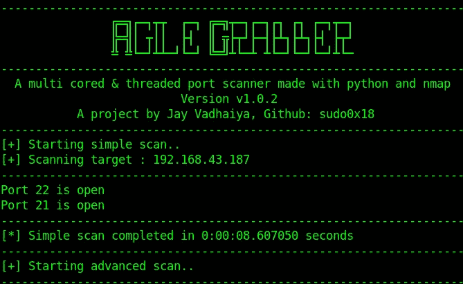
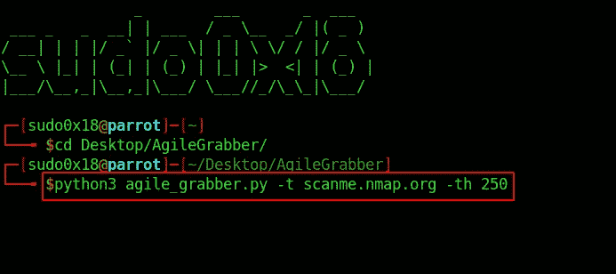
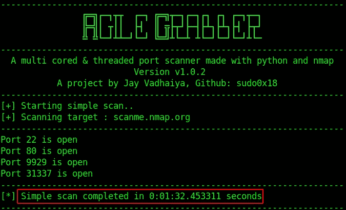
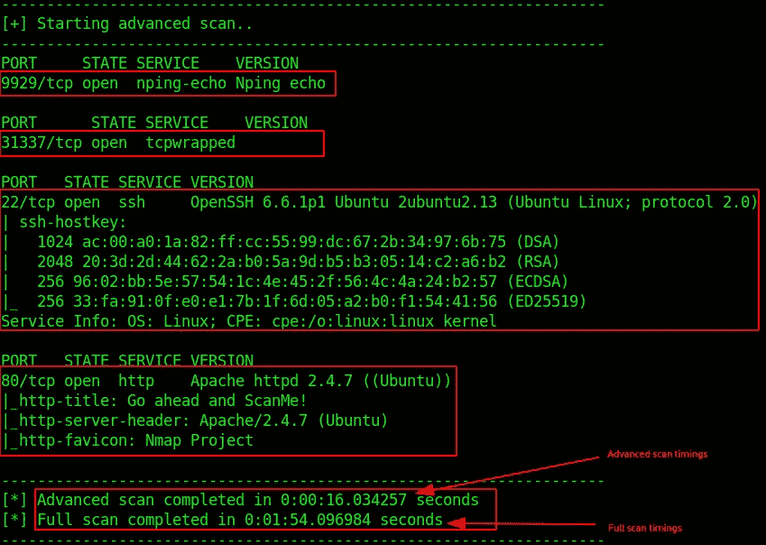
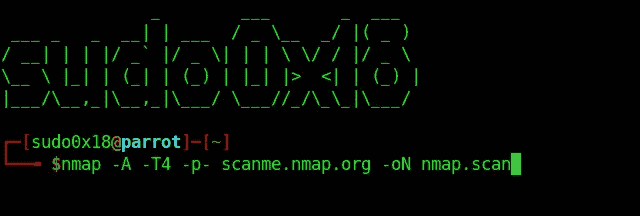
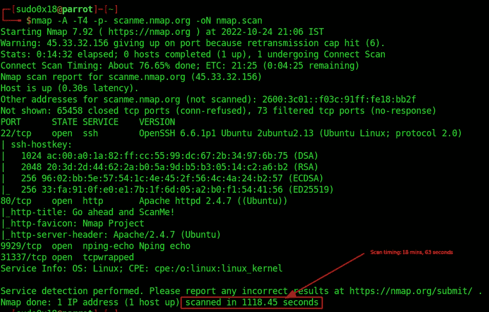

# 使用“敏捷抓取器”加快 NMAP 扫描

> 原文：<https://infosecwriteups.com/faster-your-nmap-scan-with-agile-grabber-2786c236c3dc?source=collection_archive---------0----------------------->

## 在 CTFs 中加快扫描速度以节省扫描时间。

每个人的一天回顾。在今天的文章中，我们将介绍我的一个叫做“敏捷抓取”的工具。敏捷抓取器是用 python 和 nmap 制作的多核多线程工具，可以加快扫描结果。您可以从下面的链接获得该工具，以浏览文章中的工具。

[](https://github.com/sudo0x18/AgileGrabber) [## GitHub-sudo 0x 18/AgileGrabber:AgileGrabber 是一款多核多线程端口扫描器，由……

### AgileGrabber 是一个多核多线程端口扫描器，使用 python 和 nmap 开发，可以加快扫描速度。…

github.com](https://github.com/sudo0x18/AgileGrabber) 

在你开始之前，**你可以加入我们的 discord 服务器，与志同道合的人交流，分享你能与人分享的一切，帮助他们，让他们回答你的问题。**

[](https://discord.gg/VKJSmqDN5P) [## 加入赛博空间不和谐服务器！

### 查看 Discord 上的 CyberVerse 社区——与 106 名其他成员一起玩，享受免费语音和文本聊天。

不和谐. gg](https://discord.gg/VKJSmqDN5P) 

时机是 CTF 挑战的一个非常重要的方面。你节省的时间越多，你就能向前探索得越多。当你瞄准一台机器时，你应该有这样的东西，它能节省你的时间，并能更快地给你结果，以加快进程。为此，我开发了一个叫做“敏捷抓取器”的工具来满足需求。您可以从给定的存储库中克隆或下载该工具。

“敏捷抓取器”是用 python 制作的，它利用了 python 的多重处理和多线程能力，使扫描速度比平时更快。我们将使用此工具和 nmap 来比较相同的目标，以查看结果。

## 装置

```
git clone https://github.com/sudo0x18/AgileGrabber.git
cd AgileGrabber
```

## 需求安装

```
pip3 install -r requirements.txt
```

## 使用

```
python3 agile_grabber.py -t TARGET -th THREADS
```

# 演示

****注意* *:在您的主机上使用 AgileGrabber，而不是虚拟机，以最佳方式优化 CPU 的速度。该工具支持 Windows 和 Mac 操作系统。**

## 敏捷抓取扫描

出于演示目的，我们将扫描[http://scanme.nmap.org](http://scanme.nmap.org)。



在这里，我们将带有标志-t 的目标设为 scanme.nmap.org，将带有标志-th 的线程数设为 250。你还可以付出更多。线程的数量取决于您的 CPU 能力。默认情况下，它扫描 65，535 个端口。



如您所见，它仅用 1 分 32 秒完成了对所有 65，535 个端口的扫描。难以置信的快。现在，它将获取所有打开的端口，并开始对所有端口进行 nmap 扫描，以获得更多结果和清晰度。现在，这一次它将创建多个进程来加快扫描结果。



正如你所看到的，它完成高级扫描只用了 16 秒，完成全面扫描只用了 1 分 54 秒。非常快，对吗？这就是 python、多重处理和多线程的威力。现在让我们看一下 nmap 的相同示例，它具有相同数量的端口和相同类型的选项。

## NMAP 扫描



放 nmap scan 上面的命令扫描目标，等待结果。



正如你所看到的，它花了 18 分钟和 63 秒做同样的扫描如上。但是两次扫描的时间都远离彼此的扫描时间。仅此而已。

如果你喜欢这个工具，就给它打个星，然后和你的朋友分享。如果你想测试我的另一个工具，请阅读下面这篇关于我的另一个工具的文章。

[](/osint-information-gathering-with-informer-28176a704cf6) [## 用告密者收集信息

### 众所周知，信息收集在网络安全和道德黑客是非常重要的。你知道的越多…

infosecwriteups.com](/osint-information-gathering-with-informer-28176a704cf6) 

这就是今天的文章。如果你觉得它有趣且有启发性，那就和你的朋友分享吧。谢谢你读到这里。让我知道你的问题或者你想在回复部分阅读的文章的主题。关注我并订阅，直接在您的电子邮件中获得有趣的文章。

你可以在这里关注社交媒体: [LinkedIn](https://www.linkedin.com/in/jay-vadhaiya-3b74531b1/) ， [Instagram](https://www.instagram.com/mr.jv_2407/) ， [Twitter](https://twitter.com/sudo0x18)

## 来自 Infosec 的报道:Infosec 每天都有很多内容，很难跟上。[加入我们的每周简讯](https://weekly.infosecwriteups.com/)以 5 篇文章、4 个线程、3 个视频、2 个 GitHub Repos 和工具以及 1 个工作提醒的形式免费获取所有最新的 Infosec 趋势！