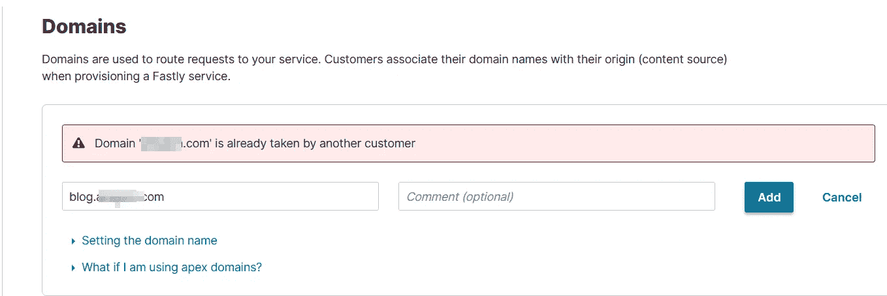
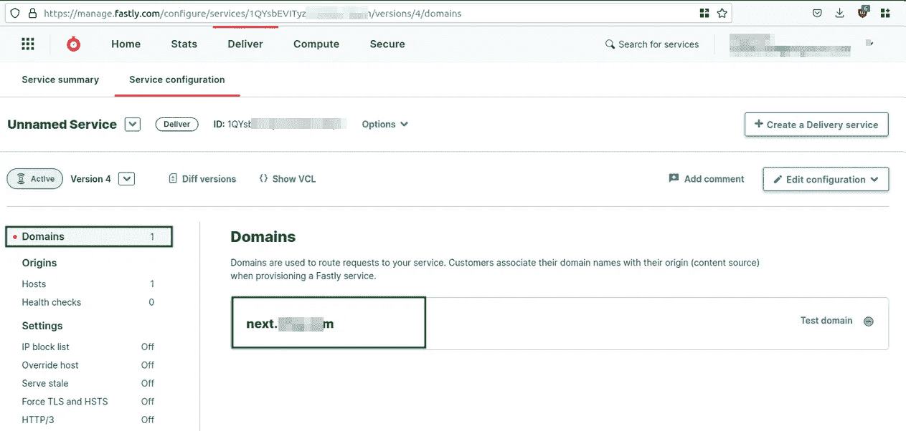
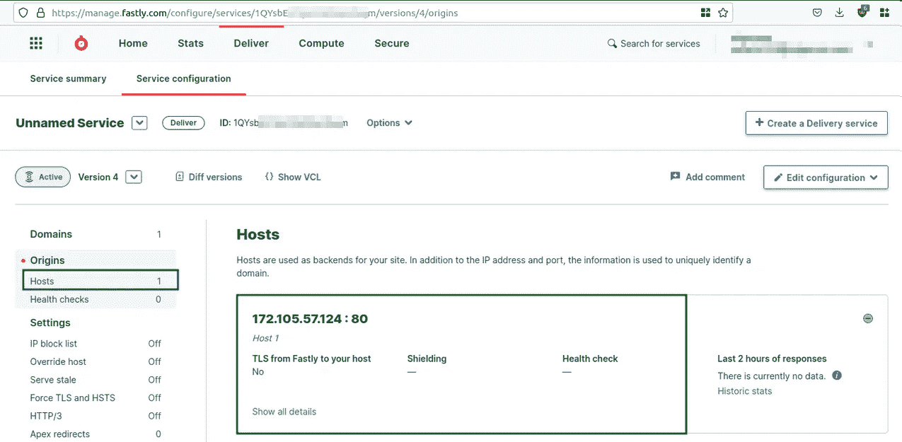
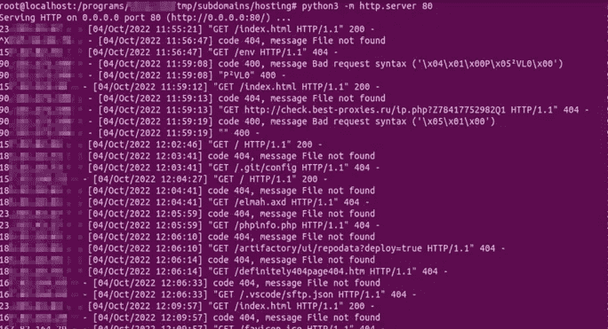
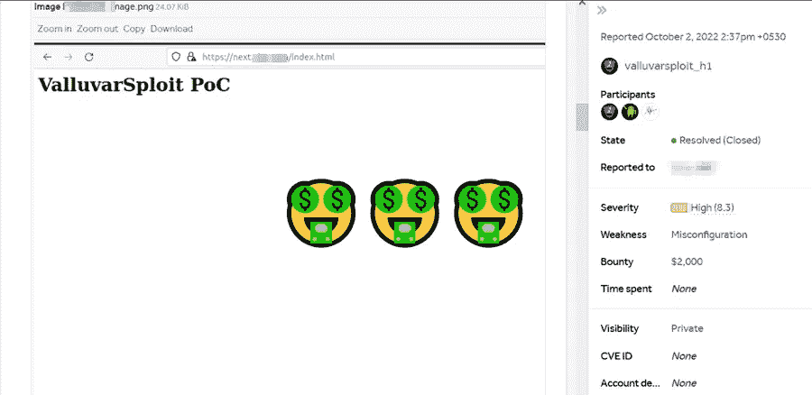

# 快速子域接管 2000 美元

> 原文：<https://infosecwriteups.com/fastly-subdomain-takeover-2000-217bb180730f?source=collection_archive---------0----------------------->

## 虫子赏金——从零到英雄

## 显示本用户信息

我的名字是 Alexandar Thangavel，又名 ValluvarSploit，是一名全职的 bug 猎人和培训师。我喜欢侦察。我是 ValluvarSploit 安全公司的创始人兼首席执行官。在 ValluvarSploit Security，我们提供一对一的在线培训。更多信息，请查看我们的 LinkedIn 页面。

## 目标

今天，我要分享我如何发现快速子域接管漏洞，并赢得我的第一个四位数奖金。让我们开始吧。

## **背景故事**

这是从 2022 年 10 月 2 日周日开始的。这一天像往常一样开始。我早上 6 点醒来，完成日常工作，检查我的移动数据余额(剩余 1.3 GB)，启用我的移动热点，连接我的笔记本电脑，并继续在一个私人程序上狩猎。我在目标应用程序上花了几个小时，但什么也没发现，所以休息了一会儿。我曾经至少半年重温一次我以前的私人项目。因此，我查看了我的私人邀请，选择了一个旧程序，并开始执行子域枚举(让我们称我们的目标为 redacted.com)。

## **子域接管**

当攻击者控制一个域的子域时，就会发生子域接管。发生这种情况是因为 DNS 配置错误/失误。

## 子域枚举

我用 Google Dorking、[OWASP mass](https://github.com/OWASP/Amass)和 [Gobuster](https://github.com/OJ/gobuster) 工具开始了子域枚举。

```
# Passive Subdomain Enumeration using Google Dorking
site:*.redacted.com -www -www1 -blog
site:*.*.redacted.com -product

# Passive Subdomain Enumeration using OWASP Amass
amass enum -passive -d redacted.com -config config.ini -o amass_passive_subs.txt

# Subdomain Brute force using Gobuster
gobuster dns -d redacted.com -w wordlist.txt - show-cname - no-color -o gobuster_subs.txt
```

枚举子域后，删除重复条目，并使用[新](https://github.com/tomnomnom/anew)工具将它们合并成一个文件(subdomains.txt)。

```
# Merging subdomains into one file
cat google_subs.txt amass_passive_subs.txt gobuster_subs.txt | anew subdomains.txt
```

然后将 subdomains.txt 文件传递给我的 cname.sh shell 脚本，枚举 cname 记录并存储在 cnames.txt 中

```
# Enumerate CNAME records
./cname.sh -l subdomains.txt -o cnames.txt

# We can use HTTPX tool as well
httpx -l subdomains.txt -cname cnames.txt
```

然后将 subdomains.txt 文件传递给 [HTTPX](https://github.com/projectdiscovery/httpx) 工具。探测了实时网站并存储在 servers_details.txt 中。

```
# Probe for live HTTP/HTTPS servers
httpx -l subdomains.txt -p 80,443,8080,3000 -status-code -title -o servers_details.txt
```

## 分析

我开始分析 cnames.txt 文件，发现一个子域指向两个不同的 CNAME 记录。我在子域上运行 dig 命令，得到如下结果:

```
dig next.redacted.com CNAME
```


CNAME 记录的 DNS 查询

这个子域有两个 CNAME 记录。第一个 CNAME 记录指向 webflow.io 域，第二个 CNAME 记录指向 fastly.net(快速服务)域。每当我们有多个 CNAME 记录时，第一个 CNAME 记录会将我们重定向到下一个 CNAME 记录，以此类推。重定向将继续，直到我们到达最后一个 CNAME 记录。

我开始分析 servers_details.txt 文件，寻找有趣的东西，发现了这一行。注意状态代码和网站标题。

```
https://next.redacted.com [500] [246] [Fastly error: unknown domain next.redacted.com]
```

状态码是“500”，标题是“快速错误:未知域名 next . redated . com”。通过查看 CNAME 记录(“redated . fastly . net”)和网站指纹“Fastly 错误:未知域”，我们可以确认这是 Fastly 子域接管。如果一个网站有这个指纹，那么它可能是易受攻击的。然而，我以前多次遇到过这种快速指纹，它并不脆弱。只有在满足某些条件时，它才是脆弱的，所以这是一种边缘情况。

在大多数情况下，我们不能接管快速服务。例如以下情况，



但是，如果该域名尚未被其他客户占用，那么我们可以要求该域名并完全接管该子域。

## 确认漏洞

我去了快手官网，执行了以下步骤，
1。我用临时邮件在 fastly.com T2 创建了一个账户。
2。登录到我的快速仪表板，点击“创建一个交付服务”按钮。
3。输入目标子域名(next . redated . com)并点击添加按钮。

我期望出现错误消息(“域名已被另一个客户占用”)，但是没有出现错误消息。我被重定向到下一页“主机页面”。我很惊讶。



快速申请域名

## POC 创建步骤

漏洞被确认后，我登录到我的 VPS 服务器，创建了一个名为“hosting”的目录。然后在“hosting”目录下创建一个简单的 HTML 文件，名为“index.html”。

```
mkdir hosting

cd hosting

nano index.html
```

“index.html”文件包含以下代码，

```
<!DOCTYPE html>

<html>
    <head><title>STO PoC</title></head>
    <body>
        <h1>ValluvarSploit PoC</h1>
    </body>
</html>
```

之后，我在当前工作目录下的端口 80 上启动了一个简单的 Python web 服务器，

```
python3 -m http.server 80
```

然后，我转到 Fastly 仪表板，在 Hosts 页面中添加了我的 VPS 服务器的公共 IP 地址。



VPS 配置

几秒钟后，我打开了一个新的浏览器窗口，访问了“[http://next.redacted.com/index.html](http://next.redacted.com/index.html`)”页面。我的 PoC 文件已成功呈现。我已经写了一份详细的报告，并在 HackerOne 上提交了。


概念证明

## 通过监控服务器日志进行学习

我让我的 Fastly 服务运行了 3 天，并监控服务器日志中的敏感信息。观看其他 bug 猎人的方法很有趣。



有趣地监控服务器日志

## 报酬

我的报告被归类为高严重性漏洞，并在 10 天内奖励了 2000 美元。



报酬

## 关键要点

1.至少每 6 个月重温一次你的老目标。
2。子域枚举是关键。尽可能多地枚举子域。
3。不要放弃。

感谢您花时间阅读我的文章。

跟我来:

[推特](https://twitter.com/ValluvarSploit)

[领英](https://www.linkedin.com/in/alexandar-t-345230220)

## 来自 Infosec 的报道:Infosec 每天都有很多内容，很难跟上。[加入我们的每周简讯](https://weekly.infosecwriteups.com/)以 5 篇文章、4 条线索、3 个视频、2 个 GitHub Repos 和工具以及 1 个工作提醒的形式免费获取所有最新的 Infosec 趋势！