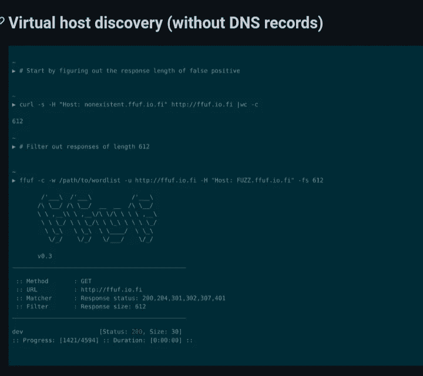

# 该死的侦察

> 原文：<https://infosecwriteups.com/ffuf-ing-recon-1ee4e79b3256?source=collection_archive---------1----------------------->

## 或者如何从稍微不同的侦察点到达 P3 P1

当谈到侦察，特别是寻找子域时，自从黑客开始以来，已经有了大量的工具和文章。但是，不知何故，讨论最少的方法是可以产生最惊人结果的方法(虽然不总是如此)，在 ffuf 存在之前，我只找到了一种处理它的工具，但是我放弃了它(可能是我做错了，但是无论如何(:)。我说的是使用 ffuf 的 vhost 发现，它也可以用于常规的子域发现，并且更容易针对误报进行配置。

**FFUF 超过 dir 暴力**

使用 ffuf 实现 vhosts 扫描有一个看似简单的好方法:

截图来自 GitHub[https://GitHub . com/ffuf/ffuf # virtual-host-discovery-without DNS-records](https://github.com/ffuf/ffuf#virtual-host-discovery-without-dns-records)

我的意思是，这在逻辑上是合理的…在某种程度上。它没有说明的是，有时有 403、404、400 的子域/vhost 仍然值得深入挖掘。使用 ffuf 的文件/文件夹暴力和 gau/wayback 机器可能会发现一些模糊但有趣的端点。

另一件事是弄清楚响应的大小是否意味着误报或重定向到相同的目的地，等等。这就是为什么你还必须留意输出，如果你注意到多个子域的大小是相同的，以及子域的名称，那么你必须 Ctrl+c 或进入 ffuf 交互式 shell，并重新调整-fs 标志，或者甚至-fw 和-fl 标志。

例如，可能 host:junkword.target.com 的大小为 123，而您添加了-fs 123，但是您会注意到 host:service.target.com 和 host:services.target.com 以及 host:service1.target.com 具有完全相同的大小、字、行和响应代码 403，因此很明显您希望将其过滤掉，因为它很可能是有关目标的黑名单。

**猎杀内部子域**

我将直接进入最有趣的部分，最有可能立即导致 P1-P3 错误——追捕一些，假设只有内部访问，往往包含敏感数据的子域，由于通过模糊方法或错误配置的安全性。

以下是我在另存为 csv 的 ffuf 输出中使用的脚本(清理版本(:)。显然，你可以根据自己的需要随意调整或者合并它们，等等。

#!/bin/bash
echo "用法:。/有趣的结果-from-ffvhost domain . com "
read-p "准备好了就按任意键"
cut -d '，'-f1 $1 | sed s/$/。$ 2/| sort-u>for live 2。1 美元
。/alive 2 for live 2。$1

生活 2:

#!/bin/bash
nmap -iL $1 -sn

输出将显示哪些子域可以解析为 ip，哪些不能。不能的都是有意思的，特别是 200 还行，但就算 404 也能出成绩。

**搜寻外部子域**

根据所讨论的 bbp 是否是 widescope 以及服务器是如何配置的，你可以使用 ffuf 作为一个子查找器类型的工具，只是更快更容易过滤掉误报。

**绕行**

好的。前两部分对我来说非常有用，我在这方面取得了成功。但是，在其中一次侦察中，我发现了一些有趣的命名子域，尽管它解析为一个常规 ip，我还是想看看它有什么。但是，令我惊讶的是，尽管 ffuf 得到了 200 个 OK 响应代码，curl 和 Firefox/Chrome 却得到了 403 个。

然后我做了以下的事情来证实它是很了不起的:

卷发 https://domain.com-H 主持人:interesting-sub.domain.com

还得了 200 OK 和 P2 bug。

所以，希望你能从这篇文章中看到 ffuf 更像是一把追踪 bug 的瑞士军刀，很像 ncat，但是有着不同的侧重点:

这很适合我的文章，因为它可以在 android 或 iPhone 上完成:

https://medium . com/@ vuk . ivanovic 9000/but-hunting-from-a-car-on-a-cheap-most-d 052397 fc9b 2

如果你想支持我更频繁地写关于寻找虫子的文章，这意味着我会更快地搬到一个租金更便宜的国家，请随时提供你能提供的任何提示，谢谢。https://ko-fi.com/bushi1947