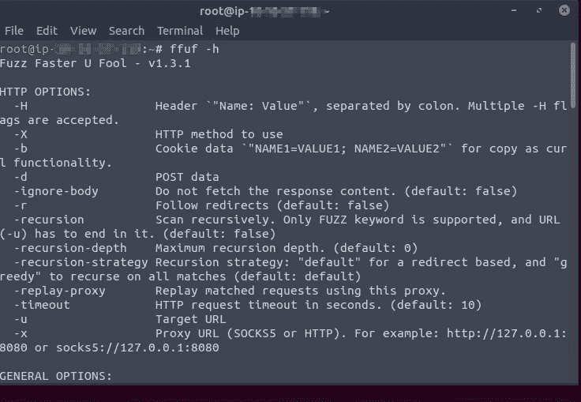
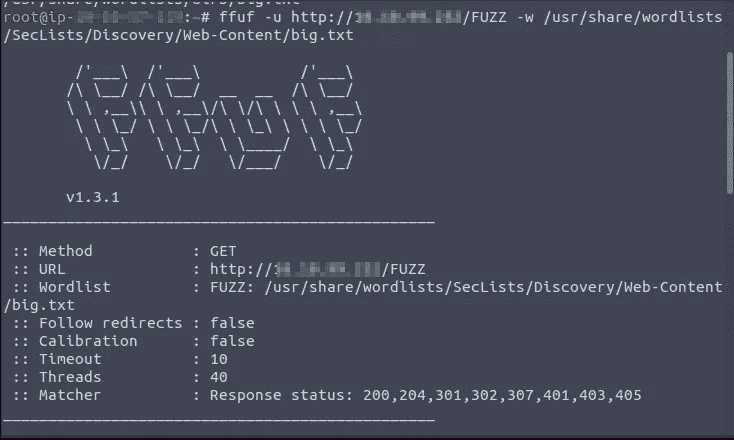
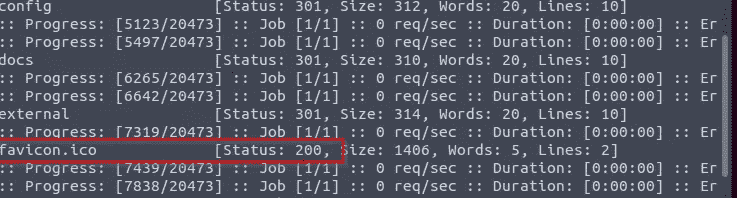
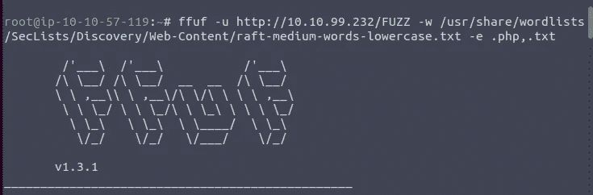
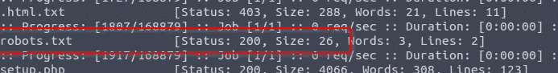

# Ffuf TryHackMe 第 1 部分

> 原文：<https://infosecwriteups.com/ffuf-tryhackme-par-da01b3380a35?source=collection_archive---------0----------------------->

## 模糊艺术

欢迎回来，神奇的黑客们，在这个博客中，我们将带您了解什么是 F*以及如何使用它。 ***Ffuf*** 代表***Fuzz fast U Fool***而这个 ***就是*** 的意思，用于 web 枚举、fuzzing 和目录暴力破解。*

**

*要了解更多关于 ***Ffuf*** 在终端中使用 ***Ffuf -h*** 。*

> *- **u** 用于指定 URL，而- **w** 用于单词列表。*

*默认关键字 **FUZZ** 意味着在单词列表条目上注入。*

**

*然后一些 ***Ffuf*** 命令我们得到了一个 200 状态码文件。*

****

> ***您找到的第一个状态代码为 200 的文件是什么？***

**favicon.ico**

*通过使用 ***Ffuf*** 我们将得到文件和目录的一般列表。*

> ****ffuf*-u**[**http://IP/FUZZ**](http://10.10.99.232/FUZZ)**-w/usr/share/sec lists/Discovery/we B- Content/raft-medium-files-lower case . txt***

*用于枚举网站上的文件列表。*

*然后，为了枚举网站上的扩展列表，我们可以使用:*

> ***ffuf-u**[**http://IP/index fuzz**](http://10.10.99.232/indexFUZZ)**-w/usr/share/sec lists/Discovery/we B- Content/we B- extensions . txt***

*为了枚举我们可以使用的特定扩展*

**

> *你找到了什么文本文件？*

**robots.txt**

**

*ffuf part-2:[https://mukibas 37 . medium . com/ffuf-tryhackme-part-2-df 819 e 663d 02](https://mukibas37.medium.com/ffuf-tryhackme-part-2-df819e663d02)*