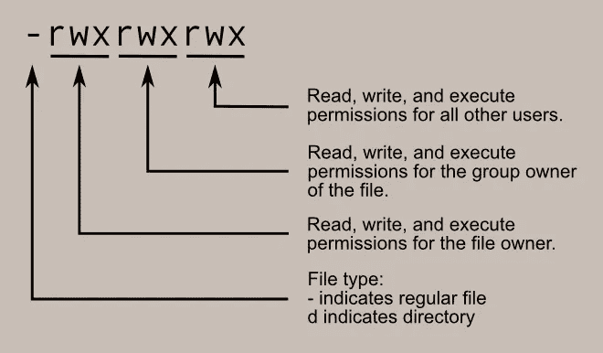
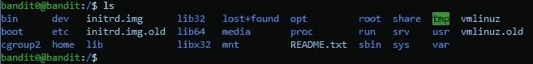
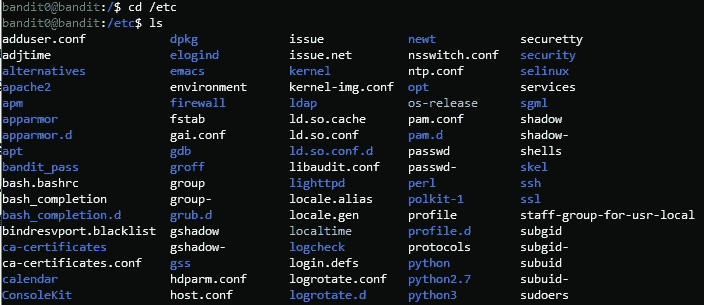
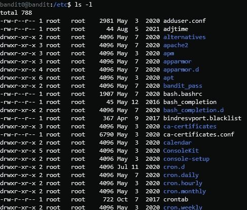

# Linux 中的文件权限

> 原文：<https://infosecwriteups.com/file-permissions-in-linux-8d35ed810a23?source=collection_archive---------1----------------------->

## 控制用户对文件和目录的访问

Linux 操作系统最重要的方面之一是文件权限:它们决定了系统上的用户如何与系统上可用的各种文件进行交互，这是任何操作系统的基本功能。

在我们与强盗机器的斗争中(查看我的系列文章简介！)，我们经常遇到文件权限的概念—从更改文件的访问限制以使其他程序能够使用它，到根据指定的权限找到正确的文件。

然而，特别是对于初学者来说，这个概念不太容易理解，也不太笼统和详细，不能作为任何帖子的旁注，所以这是对这个问题的回答:本文将深入解释这个重要的主题。

简而言之，Linux 文件权限

## 为什么权限甚至是必要的？

起初，我们可能会考虑完全废除权限的想法。为什么要把事情复杂化？让我们让每个人都可以访问所有东西，并向系统的用户解释他们的限制，并提供使用指南。听起来很简单，对吧？

但是这种态度容易出现很多问题。首先，我们人类容易犯错误。很多。这是很自然的，但是潜在的问题对我们来说太危险了，以至于我们不能仅仅处理它们——也许我们破坏了一个程序的配置文件或者破坏了一个重要的文件。我们不能只抱最好的希望——我们需要积极保护自己，避免此类问题。

然而，最大的问题存在于信息安全领域。攻击者获得对系统的访问权本身就是一个大问题，如果他可以对任何文件为所欲为，那就更糟了——我们应该记住，企业机器包含许多敏感数据，出现重大危险问题的可能性是巨大的。这些是否构成了我们利用管理访问权限的系统的足够理由？

我希望你能相信这种系统的必要性。Linux 操作系统的开发人员当然是，所以让我们深入探讨这个主题。

## 了解文件权限

当我们打开终端时，我们会看到一个 shell 并位于一个特定的目录中。通过执行 *ls* 命令，我们可以查看上述目录中的文件。

匪机上 **/** (根)目录下的 **ls**

出于演示目的，让我们导航到 **/etc** 目录，其中有文件和目录。

列出 **/etc** 目录的内容

使用不带参数的 *ls* 命令只是显示可用的文件和文件夹(白色是文件，蓝色是目录，浅蓝色是一个不同的概念，我们稍后将简要介绍，称为**链接**)。为了让我们看到各个条目的权限，以及许多其他相关细节，我们需要添加 *-l* 参数:

**ls -l** 在 **/etc** 目录内

第一组字母是本文的核心，我们将重点关注它们。它们后面的数字是**链接**到文件/目录的数量，它后面的名字是拥有者用户，后面是拥有者用户的组(Linux 中的用户被分成称为组的逻辑结构。用户可以是多个组的一部分)。接下来，这个数字表示文件的大小(以字节为单位),之后是最后一次修改的时间，后面是文件/文件夹的名称。

正如我所说的，我们将看看左边的那组字母。第一个不是“-”、“d”就是“l”。“-”提到一个文件，“d”是一个目录，“l”是一个链接。到目前为止，一切顺利。现在事情变得更有趣了。

其余的字母实际上由 3 组 3 个字母组成:“r”、“w”、“x”。第一组描述拥有该文件的用户的权限，第二组描述所有者组的权限，第三组描述系统上任何其他用户的权限。值得一提的是， **root** 用户拥有对任何文件的完全访问权限，可以做任何他想做的事情。

现在，我们将了解权限是如何由提到的 3 个字母指定的——对于用户、组和其他用户来说，概念是相同的。每个字母代表一个权限:“r”代表读取文件,“w”代表写入文件,“x”代表执行文件，将其作为程序运行。序列“rwx”给出了完整的权限，而如果某个特定的权限被拒绝，相关的字母将由破折号“-”代替。例如，“r-x”允许读取和执行，而“- -x”只允许执行。

比如我们来看一下序列“ **-rwxr-xr- -** ”。因为它以“-”开头，这意味着它是一个文件。下一组字母是“rwx”，为拥有的用户提供完全权限。与他/她相反，同一组的用户不能写，只能读和执行(“r-x”)。其他用户只能读取该文件(“r- -”)。

## 相当于目录

目录的权限与文件的权限略有不同。如果一个给定的字母序列与一个目录有关，但与一个文件无关，那么 **read** 权限允许检查目录的内容，看看里面有什么文件——基本上就是执行 *ls* 。**写**权限可以创建、重命名或删除相关目录中的文件，以及更改目录的属性。**执行**权限决定了是否可以进入文件夹，基本上是 *cd* 进入。

## 更改权限

只有 **root** 用户或文件的所有者可以更改文件的访问权限。

为了更新任何给定文件或目录的权限，我们使用了 *chmod* 命令。有两种方法可以做到这一点:数字和字母表达式。让我们从数值方法开始。在这个方法中，每个权限被分配给一个数字: **read = 4，write = 2，execute = 1** 。这些数字不是随机的，而是二进制表示中前三位的值。请注意，不能有两个权限组合(更不用说更多)的总和相同。这样，我们可以指定权限:

`chmod 644 file`

第一个数字设置用户的权限，第二个数字与组相关，最后一个数字用于其他用户。该语句表明用户拥有读+写(4 + 2 = 6)权限，而其他任何用户，无论他/她属于哪个组，都只有写权限。要允许任何用户完全访问，我们可以键入:

`chmod 777 file`

因为读+写+执行= 7 (4 + 2 + 1 = 7)。

现在让我们仔细检查字母表达式。在这种态度下，我们键入的不是数字，而是:{who}{+或-}{what permission}。例如:

`chmod u+x file`

**u** 表示用户，我们**给他/她添加**执行权限。另一个例子:

`chmod g-w file`

**g** 表示该组，我们**从其中删除**写权限。“其他用户”由字母 **o** 描述，读取权限与字母 **r** 绑定。

## 一点债务——链接是什么

我们之前看到，除了文件和目录(文件夹)，我们还有链接。基本上，链接指向另一个文件，提供了一种从不同的地方访问它的方法。还有**硬链接**——它们是代表自己的文件，指向硬盘上与它们所链接的文件相同的位置。与它们相反，我们有**软链接**，它们不是代表自己的文件，而是指向链接文件在文件系统中的位置。这是一个非常有趣的主题，我建议你自己深入研究一下。

## 文件权限提供保护的真实示例

想象你是一个组织中的简单用户，不计后果，无忧无虑。一个心怀不轨的人成功地拿到了你的凭证，并用它们登录了系统。

这本身就是一个严重的违规，但是由于文件权限，损害相对减轻了。例如，作为一个简单用户，您不能访问敏感数据，也不能读取密码文件。从这一点出发，攻击者就不能这样做，他/她所能造成的伤害也是有限的。

此外，即使攻击者计划通过编辑特定文件或执行危险的脚本来破坏系统，明智的权限设置也会阻止这种攻击手段。

这样，在发现并处理违规行为之前，不会导致任何重大问题。感谢上帝和 Linux 文件权限。

## 结论

在本文中，我们学习了 Linux 操作系统中文件权限的最重要的概念和方面(然而，这还不是需要了解的全部)，例如:文件和目录的各种访问权限及其含义，它们为什么重要，如何更改它们，如何检查它们，拥有用户、他的组和系统上其他用户之间的分离，等等。

对于任何 Linux 用户来说，理解文件权限并知道如何使用它们是至关重要的。它们在很多领域都有应用，尤其是在信息安全领域。

我希望你学到了新的东西，并喜欢阅读这篇文章。请跟我来，为这个帖子鼓掌，并评论你想看到的更多内容，或任何其他评论。谢谢大家！