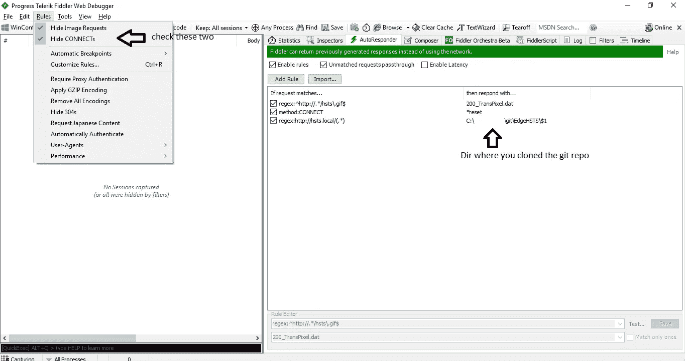
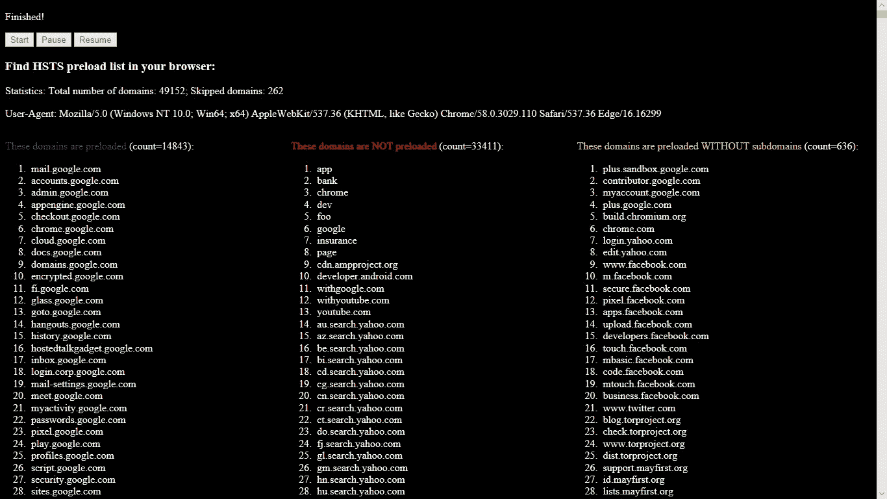
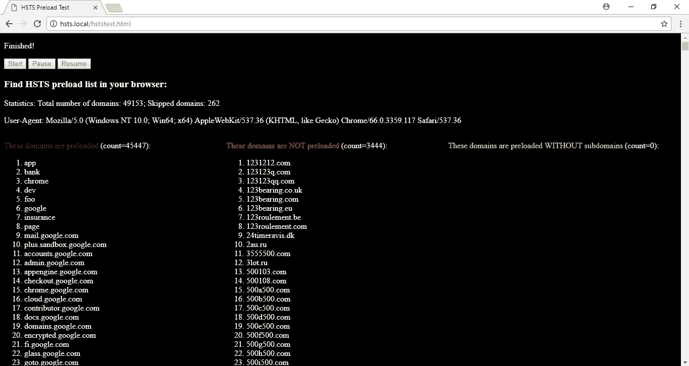
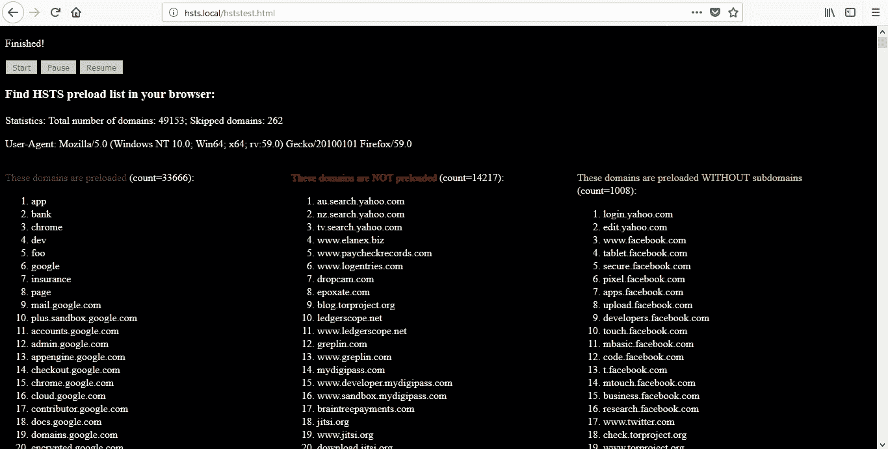
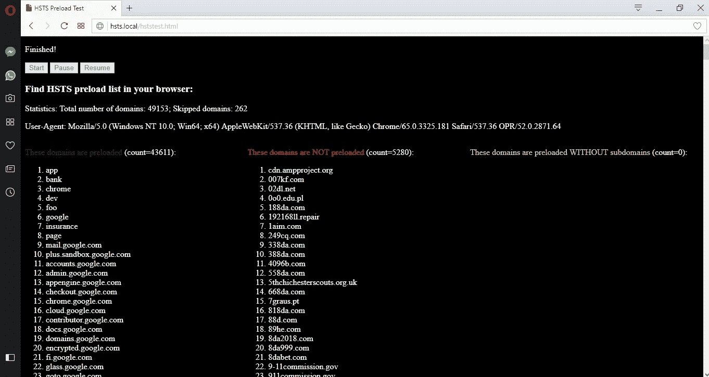

# 查找 Edge 的 HSTS 预加载列表(第一部分)

> 原文：<https://infosecwriteups.com/find-edges-hsts-preload-list-part-i-2ee5ce6bc5aa?source=collection_archive---------0----------------------->

在这篇文章中，我将讨论我是如何找到 Edge 浏览器的 HSTS 预加载列表的。这不是 Edge 的漏洞。我希望你仍然喜欢阅读它。本文分为两部分:第一部分，我将讨论如何在 Fiddler 的帮助下，通过在浏览器中运行 JavaScript，让 Edge 自己生成列表。如果我有时间，我会写第二部分，其中我将展示如何通过逆向工程找到列表。

**背景**
HTTP 严格传输安全(HSTS)旨在通过在用户访问您的网站时强制浏览器使用 HTTPS 连接来减轻中间人攻击。HSTS 策略可以动态设置，也可以预先加载到浏览器中。要动态设置 HSTS，发送一个 HTTP 响应头“`Strict-Transport-Security: max-age=31536000; [includeSubDomains]`”，意味着在接下来的 31536000 秒(1 年)内，浏览器在连接到该域时必须使用 HTTPS。如果可选指令`includeSubDomains`被设置，它的所有子域也将被强制使用 HTTPS。

动态 HSTS 策略的问题在于，与服务器的初始连接不受保护。为了解决这个问题，谷歌维护了一个 **HSTS 预加载列表**。开发者可以在 hstspreload.org[向预加载列表提交他们的域名。这个列表被硬编码在所有主流浏览器的二进制文件中。](https://hstspreload.org)

虽然所有浏览器的列表都是基于 Chrome 的，但由于不同的发布周期和额外的要求，不同浏览器的最新稳定版本有不同的硬编码预加载列表。Firefox 和 Chrome 都是开源的，所以我们很容易从源代码中知道它们的预加载列表。最新的 Firefox 预加载列表可从 [mozilla#gecko-dev](https://github.com/mozilla/gecko-dev/blob/master/security/manager/ssl/nsSTSPreloadList.inc) 获得，Chrome 预加载列表可从 [chromium#chromium](https://github.com/chromium/chromium/blob/master/net/http/transport_security_state_static.json) 获得。Edge 不是开源的，到目前为止我没有发现有人在网上发布 Edge 的列表，所以，出于好奇，我决定自己去了解一下。

**方法**我们的想法是遍历 Chrome 列表中的每个域。对于它们中的每一个，我们都将其加载到 Edge 中。如果 Edge 自动将 HTTP 重写为 HTTPS，则该域也会预加载到 Edge 中。我们可以这样检测它:例如，为了检查`example.com`，我们用`src=http://example.com/hsts.gif`构造一个`img`元素。如果是预加载的，发送给服务器的请求是 HTTPS；否则，请求是 HTTP。为了在 JavaScript 中检测到这两种情况，我使用 Fiddler 代理在本地伪造响应。如果 Fiddler 看到请求的 URL 是 http://example.com/hsts.gif,，它会用一个示例 gif 文件来响应。当 Edge 得到响应时，调用`onload`处理程序。如果 Fiddler 看到一个连接请求，这意味着 URL 已经被重写为 HTTPS。在这种情况下，Fiddler 重置连接请求，让 Edge 触发`onerror`处理程序。然后我们只需要在 JavaScript 中处理`onload`和`onerror`事件，并相应地记录日志。如果`onload`被击发，则不预装；如果`onerror`被发射，它被预加载。

我已经在 GitHub 上发布了我使用的完整代码。https://github.com/xiaoyinl/EdgeHSTS 有售。如果你想在你的浏览器中尝试一下，确保设置一个代理，规则在前面的段落中有详细说明，并删除浏览历史，以消除动态 HSTS 条目。如果您使用 Fiddler，只需在自动回复器中添加以下三条规则:

然后在你想测试的浏览器中打开[http://hsts.local/hststest.html](http://hsts.local/hststest.html)。测试需要一段时间才能完成。

**结果**
提交时我使用的引用列表是[transport _ security _ state _ static . JSON dee 803 ed](https://raw.githubusercontent.com/chromium/chromium/dee803ed55ad30b90e1a96622e2b4b5ca7ab5788/net/http/transport_security_state_static.json)。

结果如下:

*   `transport_security_state_static.json` : **48891** 中 HSTS 条目总数
*   Windows 10 上的 edge Build 16299.371 带补丁截至 2018 年 4 月: **14843** ( **+636** 不带子域)
*   火狐 59.0:**33666**(**+1008**不带子域)
*   chrome 66 . 0 . 3359 . 117:**45447**(+0 无子域)
*   Opera 52.0: **43611** (+0 无子域)

如果一个域的`include_subdomains`属性在`transport_security_state_static.json`中被设置为`true`，则该域属于“无子域”类别，但是浏览器不会预加载它的子域。

请注意，我们只计算当前参考列表中的域。有许多域已经从主列表中删除，但尚未从这些浏览器中删除。所以每个浏览器的实际预载域名数应该比上面的结果略高。

边缘:

铬合金:

火狐浏览器:

歌剧:

我认为 Firefox 的列表比 Chrome 短的原因是 Mozilla 会定期检查域是否仍然符合包含策略。不再发送`Strict-Transport-Security`或`max-age`少于 18 周的自动删除。Mozilla 在 [SecurityEngineering/HTTP 严格传输安全(HSTS)预加载列表](https://wiki.mozilla.org/SecurityEngineering/HTTP_Strict_Transport_Security_%28HSTS%29_Preload_List)中记录了该策略。

我发现 Edge 的 HSTS 预加载列表比其他浏览器短得多，这很令人惊讶。 [Edge 文档](https://docs.microsoft.com/en-us/microsoft-edge/dev-guide/security/hsts)确实说“像其他已经实现这个功能的浏览器一样，微软 Edge 预加载列表是基于 Chromium HSTS 预加载列表的”。但是微软没有提到多久更新一次或者微软是否有额外的要求。希望微软将来会用更多的细节来记录他们的 HSTS 政策。

**结论**
在本文中，我展示了如何使用 JavaScript 和 Fiddler 在 Edge 中构建 HSTS 预加载列表。在第二部分，我将讨论如何通过逆向工程找到准确的预加载列表。