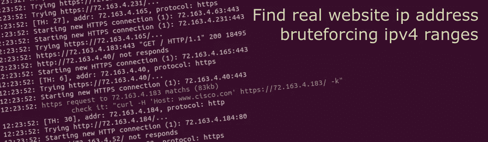
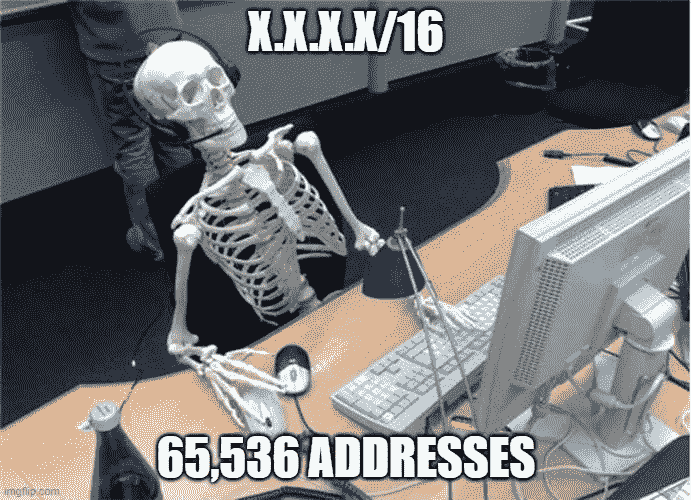
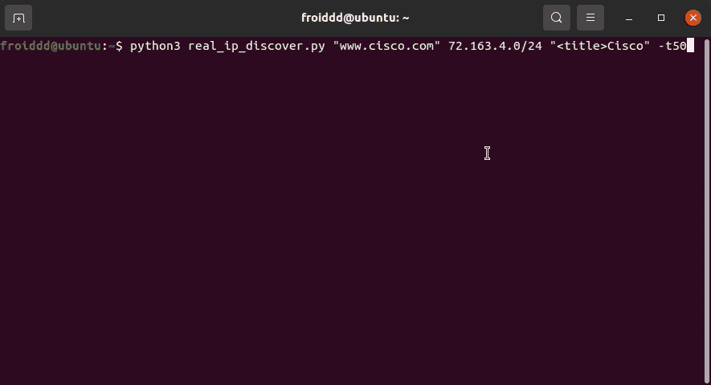

# 发现真正的网站 ip 暴力

> 原文：<https://infosecwriteups.com/find-real-website-ip-bruteforcing-ipv4-ranges-c1e9ab2941e7?source=collection_archive---------1----------------------->

如今，许多 web 应用程序都受到 Cloudfare、Akamai 等服务的保护，隐藏了它们的真实 ip 地址，这在我们执行 pentest 或试图利用漏洞时可能会成为障碍。

在这篇文章中，我想分享一个技巧，它将在很多情况下帮助我们找到真正的 ip 地址。

这个过程有两个部分:

1.  *确定可以托管服务器的 ipv4 范围。*
2.  *使用 http 请求强制范围。*

## 第 1 部分:确定与组织相关的 ipv4 范围

让我们开始假设我们想要找到下一个网站真实 ip:

> https://examplecorp.com

任何一个 web 应用都是在一个发布到互联网的服务器上，有一个 ip 地址，这个 IP 地址属于一个 IP 范围，这个范围归一个组织所有。我们要做的第一件事是去一个**在线 ipv4 数据库**，如 [Ipv4info](http://ipv4info.com) 或 [WhoisXMLAPI](https://ip-netblocks.whoisxmlapi.com/lookup) 并寻找“Example Corp”，这样我们将找到属于要攻击的组织的一个或多个 IP 地址范围。

另一种方法是在其他服务中查找 ip 地址，如子域、邮件服务器等。假设您找到一个子域，如下所示:

> webmail.examplecorp.com

这个子域解析一个 ip 地址，这个 ip 地址可以托管在 AWS、Azure 等服务中。好的，我们可以假设部分目标基础设施可以托管在这个提供者中，我们可以在 [Ipv4info](http://ipv4info.com) 或 [WhoisXMLAPI](https://ip-netblocks.whoisxmlapi.com/lookup) 中找到子域 ip 的提供者 IP 范围。

正如你所看到的，这部分只是正确地思考如何找到网站服务器可能位于的可能的 ipv4 范围。

## 第 2 部分:用 http 请求强制 ipv4 范围

在这一点上，有一些 ipv4 范围，我们怀疑可以托管网站服务器，我们基本上需要发送 http 请求与网站主机名，并检查是否有任何范围的 ipv4 地址响应网站。

考虑到一个 0.0.0.0/24 范围有 256 个 ip 地址，或者一个 0.0.0.0/16 范围有 65，536 个 IP 地址，你可以一个接一个地尝试。

为了有所帮助，我开发了一个 python 工具来自动化这一部分:

[**https://github.com/elefr3n/real_ip_discover**](https://github.com/elefr3n/real_ip_discover)

我们需要为脚本设置接下来的三个位置参数:
-主机名(例如:examplecorp.com)
-目标列表范围或 IP 列表(例如:0.0.0.0/24，1.1.1.1/16，2 . 2 . 2 . 2)
-匹配(例如:<标题>欢迎来到 examplecorp.com</标题>)

我们也可以设置可选参数，如超时，线程，uri 等…

该工具向我们给定的范围和 ip 中的每个 ip 地址发送 http 和 https 请求，标题中包含网站主机名，检查是否有任何 ip 地址响应我们设置的匹配。

现在，我想展示一个工具的使用示例，出于法律原因，显然是一个没有任何服务来隐藏 ip 地址的网站。

假设网站 cisco.com 位于 Cloudflare 之后，并怀疑它可能位于 72.163.4.0/24 范围内，我们运行该工具，如下图所示:

该工具检测到，当 ip 72.163.4.183 收到一个带有[www.cisco.com](http://www.cisco.com)主机名、**的 http 请求时，它会用我们设置的匹配项“ <title>Cisco”进行响应，这时我们就有了真正的网站 IP。</title>**

写完这篇文章，我想说保护我们的网络服务器真的很简单，就像在你的防火墙、iptables 或任何其他可用的安全配置中设置一些规则一样简单，你应该只允许从我们使用的服务 ip 范围接收连接。例如，如果您使用的是 Cloudflare，他们会提供一个链接，您可以通过该链接获得他们的所有 ipv4 范围:

*   [https://www.cloudflare.com/ips-v4](https://www.cloudflare.com/ips-v4)

仅此而已，真心希望这篇帖子能对大家有用；)

我的推特:[https://twitter.com/elefr3n](https://twitter.com/elefr3n)